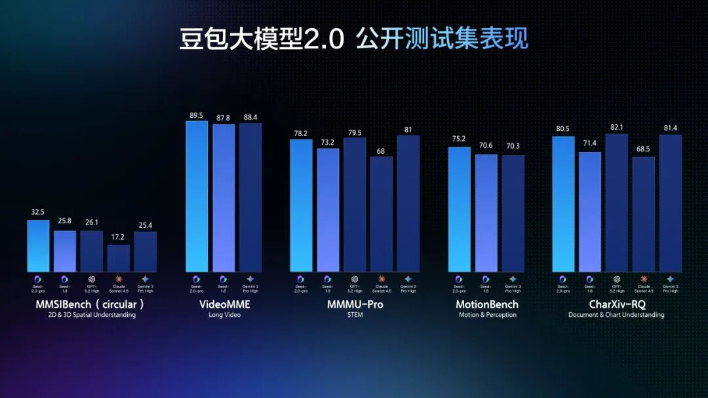
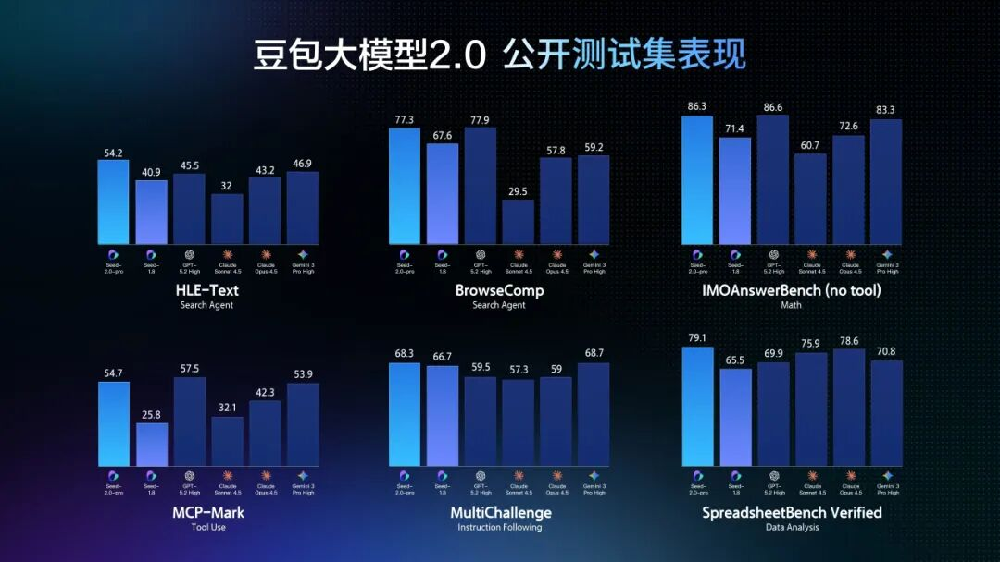

# 豆包大模型2.0发布

> 来源：字节跳动公众号  
> 日期：2026-02-14  
> 原文链接：https://mp.weixin.qq.com/s/1dlAeBOu1FPkCabQ_UIMEA

---

今天，豆包大模型正式进入2.0阶段。

随着Agent时代到来，大模型将在现实世界发挥更大作用。**豆包2.0（Doubao-Seed-2.0）** 围绕大规模生产环境下的使用需求做了系统性优化，依托高效推理、多模态理解与复杂指令执行能力，更好地完成真实世界复杂任务。

豆包2.0系列包含Pro、Lite、Mini三款通用Agent模型和Code模型，灵活适配各类业务场景：

- **豆包2.0 Pro** 面向深度推理与长链路任务执行场景，全面对标GPT 5.2与Gemini 3 Pro；
- **2.0 Lite** 兼顾性能与成本，综合能力超越上一代主力模型豆包1.8；
- **2.0 Mini** 面向低时延、高并发与成本敏感场景；
- **Code版（Doubao-Seed-2.0-Code）** 专为编程场景打造，与TRAE结合使用效果更佳。

目前，豆包2.0 Pro已在豆包App、电脑端和网页版上线，用户选择「专家」模式即可对话体验；豆包2.0 Code接入了AI编程产品TRAE；面向企业和开发者，火山引擎也已上线豆包2.0系列模型API服务。

项目主页：https://seed.bytedance.com/zh/seed2

---

## 多模态理解能力全面升级，多数基准达SOTA水平

豆包2.0全面升级了多模态能力，在各类视觉理解任务上均达到世界顶尖水平，视觉推理、感知能力、空间推理与长上下文理解能力表现尤为突出，豆包2.0 Pro 在大多数相关基准测试中取得最高分。

面对动态场景，豆包2.0强化了对时间序列与运动感知的理解能力，在TVBench等关键测评中处于领先位置，且在EgoTempo基准上超过了人类分数，表明它对"变化、动作、节奏"这类信息的捕捉更为稳定，在工程侧可用性更高。

长视频场景中，豆包2.0在大多评测上超越了其他顶尖模型，且在多个流式实时问答视频基准测试中表现优异，能作为AI助手完成实时视频流分析、环境感知、主动纠错与情感陪伴，实现从被动问答到主动指导的交互升级，可应用于健身、穿搭等陪伴场景。

---

## LLM与Agent表现大幅强化，长程任务执行能力提升

提升长程任务执行能力，需要丰富的真实世界知识。通过加强长尾领域知识，豆包2.0 Pro在SuperGPQA上分数超过GPT 5.2，并在HealthBench上拿到第一名，在科学领域的整体成绩与Gemini 3 Pro和GPT 5.2相当。

在推理和Agent能力评测中，豆包2.0 Pro在IMO、CMO数学奥赛和ICPC编程竞赛中获得金牌成绩，也超越了Gemini 3 Pro在Putnam Bench上的表现，展现了强劲的数学和推理能力。在HLE-text（人类的最后考试）上，豆包2.0 Pro取得最高分54.2分，在工具调用和指令遵循测试中也有出色表现。

豆包2.0还进一步降低了推理成本。其模型效果与业界顶尖大模型相当，但token定价降低了约一个数量级。在现实世界的复杂任务中，由于大规模推理与长链路生成将消耗大量token，这一成本优势将变得更为关键。

---

## Code模型提升开发效率，快速搭建复杂应用

豆包2.0 Code是基于2.0基座模型，针对编程场景进行优化的版本。其强化了代码库解读能力，还提升了应用生成能力。此外，豆包2.0 Code还增强了模型在Agent工作流中的纠错能力。

该模型已上线TRAE中国版作为内置模型，支持图片理解和推理。

以开发一个「TRAE春节小镇 · 马年庙会」互动项目为例。这是一个比较复杂的场景，但是通过TRAE+豆包2.0 Code，只需要1轮提示词，就能构建出基本的架构和场景，再经过几次调试，总共5轮提示词，就可完成这个作品。

11位性格各异的NPC，由大语言模型驱动，会根据人设自然聊天、招呼顾客、现场砍价；AI游客们像真实逛庙会一样，自己决定去哪家摊位、买什么、说什么。烟花升空时的祝福语、孔明灯上的四字题词，也都由 AI 即时生成——每一次进入小镇，看到的互动都可能不同。

相关提示词与素材已开源：https://github.com/Trae-AI/TRAELand

---

豆包大模型2.0系列的更新，是面向现实世界复杂任务的新起点。未来，我们将继续面向真实场景迭代模型，不断探索智能上限。
