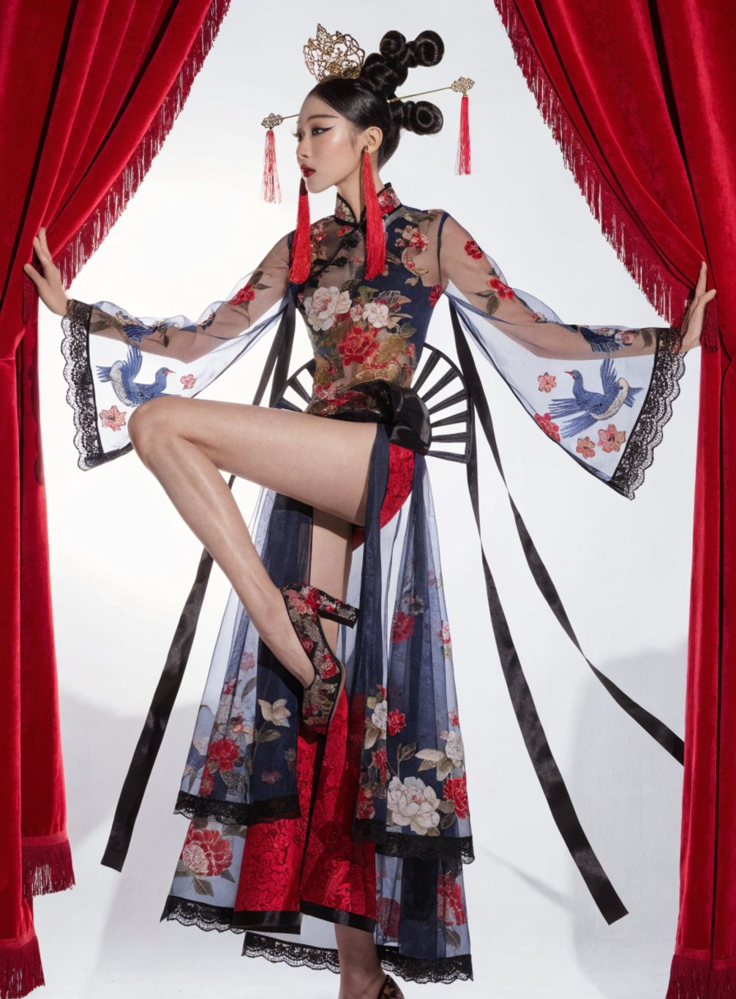
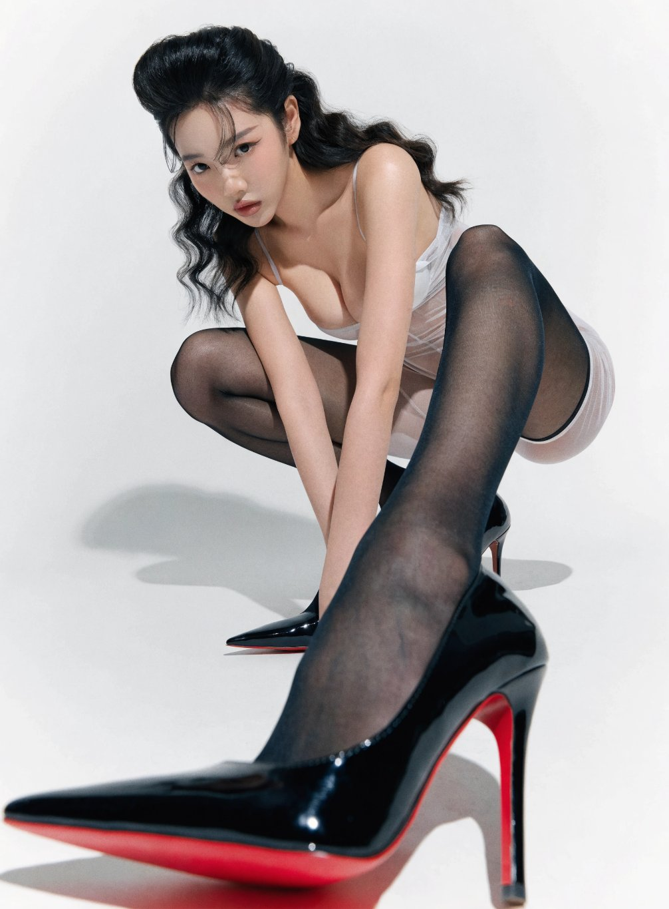

# Recraft V4: AI Image Generation with Actual Design Taste

**February 2026**

---

## TL;DR

Recraft V4 is a new-generation AI image model released February 2026, built around "design taste" — balanced composition, cohesive color, refined detail. Outputs look like designer work, not AI stock images. Supports both raster and vector (SVG) modes.

---

## Sample Outputs

The following images were generated by Recraft V4:

*Chinese qipao fashion photography — exquisite fabric textures, floral bird embroidery details, red curtain framing. The level of aesthetic refinement is remarkable.*

*Fashion portrait photography — Louboutin red-sole heels close-up, stocking textures, rich light and shadow layering.*

---

## Four Versions

| Version | Output | Target Use | Speed | Price |
|---------|--------|-----------|-------|-------|
| **Recraft V4** | Raster | Standard | ~10s | $0.04/img |
| **Recraft V4 SVG** | Vector (SVG) | Standard vector | ~15s | $0.08/img |
| **Recraft V4 Pro** | Raster | High-end design/production | ~20s | $0.15/img |
| **Recraft V4 Pro SVG** | Vector (SVG) | Premium vector | ~30s | $0.30/img |

---

## What Sets It Apart

### 1. Design Taste — Not Just Accuracy

This is Recraft V4's core differentiator. It's not just about understanding prompts — it's about producing images with **genuine design sensibility**:
- Balanced composition, not random element placement
- Cohesive color palettes with intentional tone
- Refined detail without over-processing
- Results that feel "designed" rather than "generated"

### 2. Chinese Prompt Support

While it can't render Chinese text within images, it **fully supports Chinese-language prompts**. Describe your vision in Chinese and the model understands accurately.

### 3. Relaxed Content Moderation

Compared to competitors that aggressively filter (often blocking legitimate creative content), Recraft V4's moderation is more reasonable, giving creators more freedom.

### 4. Excellent Chinese Aesthetic Performance

Particularly strong with traditional Chinese visual themes — shadow puppet portraits, qipao fashion, ink wash styles. Outperforms competitors like Banana Pro on these subjects.

### 5. Vector Output

Supports both raster and SVG vector output. Vector versions can be used directly for logos, icons, and illustrations without post-processing conversion.

---

## Comparison (February 2026)

| Model | Aesthetics | Chinese Prompts | Vector | Moderation | Price |
|-------|-----------|----------------|--------|-----------|-------|
| **Recraft V4** | ⭐⭐⭐⭐⭐ | ✅ | ✅ | Relaxed | $0.04-0.30 |
| **Flux 2** | ⭐⭐⭐⭐ | ✅ | ❌ | Moderate | — |
| **GPT Image** | ⭐⭐⭐⭐ | ✅ | ❌ | Strict | — |
| **Banana Pro** | ⭐⭐⭐ | ✅ | ❌ | Relaxed | — |

---

## How to Use

- **Website**: recraft.ai
- **API**: Available on Replicate, WaveSpeed, and other platforms
- **Replicate**: `recraft-ai/recraft-v4`

---

## Why This Matters

Recraft V4 represents a shift from "accurate" to "beautiful" in AI image generation. Previous models focused on understanding prompts and generating correct content. Recraft V4 focuses on **producing work with design taste**.

For designers, brands, and content creators, this means AI-generated images can finally be **used in production without heavy editing**.

---

*Article compiled from Recraft documentation, Replicate blog, and hands-on experience.*
