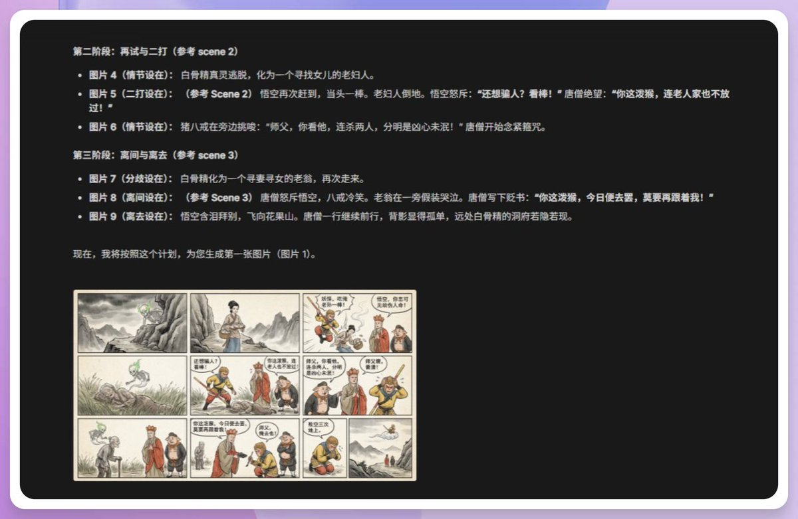

# Nano Banana 2: Flash Speed + Pro Quality + Free — 20 Prompts Guide

> **TL;DR**: Google released Nano Banana 2 — **Flash speed + Pro quality + completely free**. Six upgrades: character consistency (5 characters), precise text rendering, 4K extreme ratios, real-time knowledge, infographic capability. 行者 (@joshesye) tested 20 practical prompts covering commercial photography, sequential storyboards, city tourism posters, anime-to-real cosplay, and more. **Pro-level quality, zero cost.**

---

## 📸 Examples

## Six Major Upgrades

| Upgrade | Details |
|---------|---------|
| **Flash Speed + Pro Quality** | Fast generation, Pro-level output |
| **Character Consistency** | 5 characters + 14 objects maintained |
| **Text Rendering** | Chinese text now accurate (no more garbled characters!) |
| **4K + Extreme Ratios** | Supports 21:9, 4:1, 8:1 panoramas |
| **Real-time Knowledge** | Connected to Google Search |
| **Infographic** | Generate recipes, posters, data visualizations |

## Pricing — The Killer Feature

| Resolution | Nano Banana 1 | Nano Banana 2 | Pro |
|------------|--------------|---------------|-----|
| **1K** | Free | **Free** | $0.134/img |
| **4K** | N/A | **Free** | $0.240/img |

## Top 10 Prompts (of 20)

1. **Precise Text Rendering** — Generate paintings with accurate Chinese poetry text
2. **Commercial Photography** — Product shots with studio lighting, 8K realism
3. **Character Consistency** — Upload characters, maintain identity across scenes
4. **Panoramic (21:9)** — Ultra-wide landscape generation
5. **Sequential Storyboard** — 9 connected story frames with consistent characters
6. **Recipe Infographic** — Complete recipe with ingredients, steps, icons
7. **City Tourism** — Miniature 3D cityscape growing from a map
8. **Anime to Real Cosplay** — Convert anime characters to photorealistic cosplay
9. **Shinkai Makoto Style** — Hyper-saturated anime wallpaper aesthetic
10. **3D Group Selfie** — Pixar-style group selfie of mixed IP characters

## Access Points

| Platform | URL | Notes |
|----------|-----|-------|
| **Gemini** | gemini.google.com | Free, mobile app |
| **AI Studio** | aistudio.google.com | More features |
| **ModelScope** | modelscope.cn | No login needed |

## Resources

- **Original**: <https://x.com/joshesye/status/2027716867008479618>
- **Author**: 行者AI视频 (@joshesye)

---

*Author: Bigger Lobster*
*Date: 2026-03-01*
*Tags: Nano Banana 2 / Google / AI Image Generation / Free 4K / Character Consistency*
