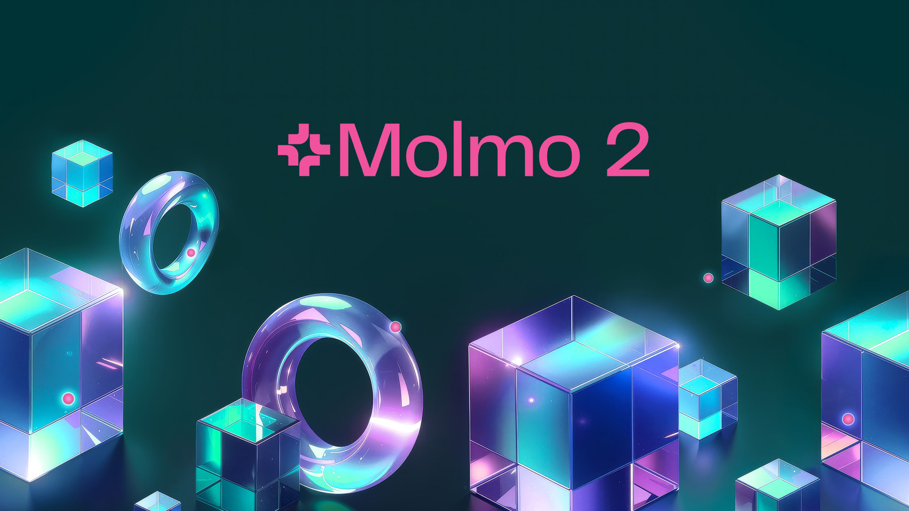
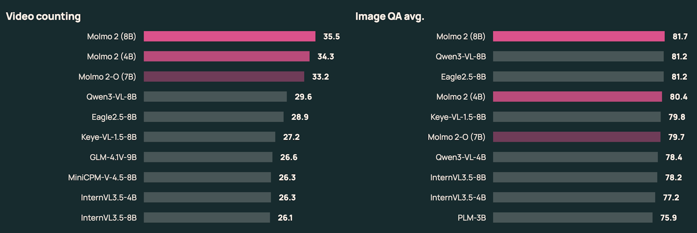
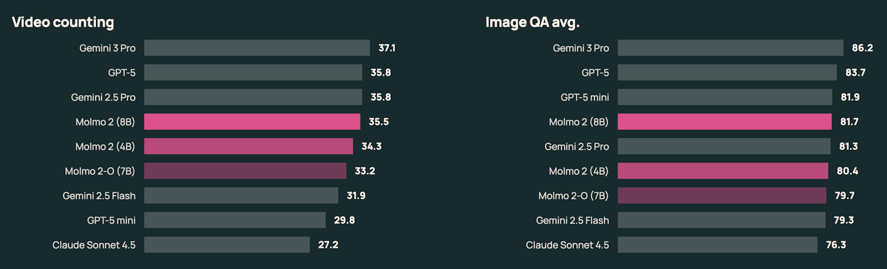
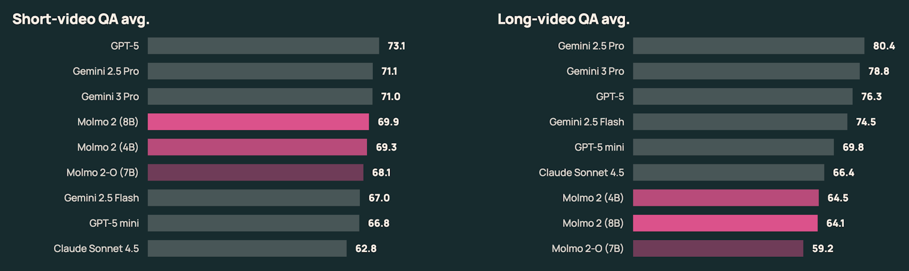
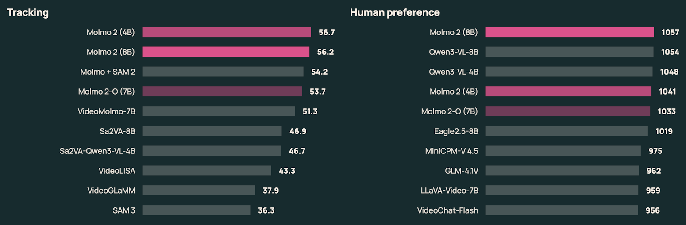
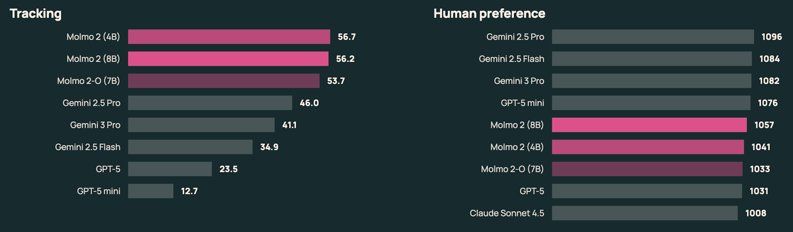

# Molmo 2：Allen AI 发布最强开源视频理解模型，超越 GPT-5 和 Gemini

> Allen Institute for AI (Ai2) 发布 Molmo 2，将开源视觉-语言模型从图像理解推进到视频理解的新高度。8B 参数的小模型击败了去年的 72B 大模型，仅用 Meta 八分之一的训练数据就达到了 SOTA 水平。

**发布日期：** 2025 年 12 月 11 日  
**作者：** Allen Institute for AI (Ai2)  
**许可证：** Apache 2.0



---

## 一、Molmo 2 是什么？

Molmo 2 是 Allen Institute for AI（Ai2）推出的新一代开源视觉-语言模型（VLM）家族。如果说 2024 年发布的初代 Molmo 重新定义了图像理解的开源标准，那么 Molmo 2 则将这一能力全面扩展到了**视频理解、多图像推理、视频追踪和时空定位**。

Molmo 2 提供三个变体，覆盖不同使用场景：

| 模型 | 参数量 | 基座 LLM | 视觉编码器 | 定位 |
|------|--------|----------|-----------|------|
| **Molmo 2 (8B)** | 80亿 | Qwen 3-8B | SigLIP 2 | 最佳综合性能 |
| **Molmo 2 (4B)** | 40亿 | Qwen 3-4B | SigLIP 2 | 效率优先 |
| **Molmo 2-O (7B)** | 70亿 | OLMo | SigLIP 2 | 全开源端到端 |

其中 Molmo 2-O (7B) 尤其值得关注——它基于 Ai2 自研的 OLMo 语言模型，从视觉编码器到连接器再到语言模型，整个技术栈完全开源，为需要完全掌控模型每一层的研究者提供了最大的灵活性。

---

## 二、从 Molmo 1 到 Molmo 2：关键突破

### 2.1 从图像到视频的跨越

初代 Molmo 在 2024 年发布时，以图像指向（Image Pointing）能力一举成名，被下载超过 300 万次。Molmo 2 在此基础上实现了质的飞跃：

- **视频原生支持**：原生处理单图、多图和不同长度的视频片段
- **时空定位（Spatio-temporal Grounding）**：不只是描述画面，而是精确指出事件发生的位置和时间
- **多目标追踪**：跨遮挡和重新出现维持持久的目标 ID
- **密集视频字幕**：生成高度描述性和可搜索的视频叙述

### 2.2 小模型大能力

这是 Molmo 2 最令人震撼的进步之一。Ai2 计算机视觉研究负责人 Ranjay Krishna 表示：

> "也许最令人兴奋的是，我们的 7B 模型现在超越了去年 72B 模型的表现。参数量大幅缩减，但能力更强了。"

Molmo 2 (8B) 在关键的图像指向和定位基准测试上超越了原始的 Molmo (72B)，以远更高效的架构实现了更强的定位和推理能力。

### 2.3 数据效率的胜利

Molmo 2 在视频追踪上超越了 Gemini 3 Pro 等专有系统，而训练数据仅为 **9.19M 视频**——相比之下，Meta 的 PerceptionLM 使用了 **72.5M 视频**。仅用八分之一的数据达到更好的效果，这证明了精心策划的数据集和以定位为中心的训练目标的力量。

---

## 三、基准测试结果

### 3.1 与闭源模型对比



Molmo 2 在多个维度上与大型专有模型展开了有力竞争：

- **图像推理**：在 11 个基准测试的平均分上，Molmo 2 (8B) 领先所有开源模型，紧随 GPT-5 和 GPT-5 mini 之后，**领先 Gemini 2.5 Pro**
- **人类偏好**：Molmo 2 (8B) **超越了 GPT-5 和 Claude Sonnet 4.5**
- **短视频 QA**：在 NextQA、PerceptionTest、MVBench 等 7 个基准测试上取得最佳开源得分
- **视频追踪**：大幅超越 Gemini 3 Pro 和所有开源替代方案

### 3.2 与开源模型对比



在开源阵营中，Molmo 2 全面领先：

- **视频计数**：以显著优势领先所有测试的开源模型
- **视频追踪**：击败专门的追踪模型如 Sa2VA 和 Molmo + SAM 2 基线
- **短视频 QA**：4B 变体几乎与 8B 变体持平，为追求速度的用户提供了极佳的效率选择

### 3.3 与前代 Molmo 对比



Molmo 2 (8B) 在大多数核心基准测试上持续优于 Molmo (7B) 和 Molmo (72B)，尤其在 Point-Bench、PixMo-Count 和 CountBenchQA 等定位和计数任务上有最大提升。唯一的例外是 InfoQA，Molmo (72B) 仍然领先——不过 Molmo 2 在该基准上也大幅超越了 Molmo (7B)。

---

## 四、架构细节



### 4.1 总体架构

Molmo 2 的架构由三个核心组件组成：

1. **视觉编码器（SigLIP 2）**：将图像或视频帧转换为视觉 token
2. **轻量连接器**：将视觉 token 与时间戳、图像索引和文本交叉排列
3. **语言模型骨干（Qwen 3 或 OLMo）**：联合处理视觉和文本 token 进行推理

关键设计：视觉 token——即使来自不同帧或图像——可以**相互注意（attend to each other）**，这显著提升了多图像和视频的性能。

### 4.2 两阶段训练

**第一阶段：预训练对齐与定位**
- 60% 字幕数据 + 30% 指向数据 + 10% 自然语言数据
- 自然语言监督包括来自 Tulu 的 SFT 数据，以保持强大的语言能力

**第二阶段：多模态 SFT**
- 整合图像、多图像集、视频和纯文本
- 类别包括：字幕、图像 QA、视频 QA、指向、追踪和 NLP
- 25,000 步训练，batch size 128，最大序列长度 16,384 tokens

### 4.3 视频处理策略

- 每个视频片段采样最多 **128 帧**，帧率 ≤ 2fps
- 使用 ViT 编码帧，patches 池化为 3×3 窗口
- 支持 **SlowFast 策略**：关键帧高分辨率 + 其他帧低分辨率，在保持精度的同时显著减少视觉 token

### 4.4 训练优化技巧

- **Token 加权方案**：在微调期间平衡不同任务的学习
- **序列打包和消息树调度**：提高吞吐量
- **视觉 token 双向注意力**：在定位和追踪上获得进一步提升

---

## 五、数据集：9个全新数据集



Molmo 2 构建了一个包含超过 **900 万样本** 的开源视频中心多模态语料库。核心数据集包括：

| 数据集 | 描述 | 规模 |
|--------|------|------|
| Molmo2-Cap | 密集视频字幕 | 104K 视频 + 431K 片段 |
| Molmo2-AskModelAnything | 人工编写的视频 QA | 140K QA 对 |
| Molmo2-CapQA | 合成视频 QA | 1M QA 对 (200K 视频) |
| Molmo2-SubtitleQA | 字幕推理 QA | 300K QA 对 (100K 视频) |
| Molmo2-VideoPoint | 视频指向 | 300K+ 查询 (160K 视频) |
| Molmo2-VideoTrack | 点跟踪 | 3.6K 片段; 15K 查询 |
| Molmo2-MultiImageQA | 多图像 QA | 45K 集; 72K QA |
| Molmo2-MultiImagePoint | 多图像指向 | 470K+ 样本 |
| Molmo2-SynMultiImageQA | 合成多图像 QA | 188K 样本 |

其中最核心的创新是**长格式字幕流水线**：人工标注者用语音对视频片段进行丰富的叙述描述，转录后再用 Molmo 自身补充帧级细节。最终生成的字幕每个视频平均数百字，远超典型大规模视频字幕数据集的密度。

---

## 六、开源生态

### 完全开放

Molmo 2 的开源承诺是全方位的：

- ✅ **模型权重**：三个核心变体 + 专门的指向和追踪版本
- ✅ **训练数据**：所有新引入的 Molmo 2 数据集 + 详细数据配方
- ✅ **视频字幕**：100,000+ 唯一视频的字幕 + 431,000 片段级字幕
- ✅ **评估基准**：定位视频评估的基准和工具
- ✅ **训练代码**：即将以开源许可证发布
- ✅ **许可证**：Apache 2.0

### GitHub 与 HuggingFace

| 平台 | 链接 | 状态 |
|------|------|------|
| GitHub (Molmo 1) | [allenai/molmo](https://github.com/allenai/molmo) | ⭐ 874 stars, 92 forks |
| GitHub (Molmo 2) | [allenai/molmo2](https://github.com/allenai/molmo2) | ⭐ 171 stars, 4 forks |
| HuggingFace 模型 | [allenai/Molmo2-8B](https://huggingface.co/allenai/Molmo2-8B) | 155 likes |
| HuggingFace 集合 | [allenai/molmo2](https://huggingface.co/collections/allenai/molmo2) | 模型 + 数据 |
| 在线试用 | [Ai2 Playground](https://playground.allenai.org/?model=molmo2-8b) | 支持视频上传 |

---

## 七、Molmo 2 的实际能力

Molmo 2 从"描述画面"跨越到了"精确定位事件"。以下是一些实际能力示例：

### 计数与定位
> **问：** "机器人抓取红色方块几次？"  
> **答：** 返回每次抓取事件的坐标和时间戳

### 事件检测
> **问：** "杯子是什么时候掉落的？"  
> **答：** 返回掉落的时间戳和位置

### 多目标追踪
> **问：** "指出穿条纹衬衫的人每次弯曲肌肉的瞬间"  
> **答：** 分析整个视频，发出每个事件的坐标和时间戳，并为该人维持稳定的 ID

### 引用表达式解析
> **问：** "找到厨房水槽上方的窗户" / "识别穿黄色衣服的女士手持的录音设备"  
> **答：** 解析引用表达式，定位相关区域，返回近似位置和时间

### 其他高级能力
- **异常检测**：标记罕见或意外事件
- **生成视频瑕疵检测**：指出 AI 生成视频中的光照不一致或物体几何破碎
- **字幕感知 QA**：结合视觉证据和视频内字幕

---

## 八、行业影响与分析

### 8.1 Molmo 的影响力已经被证明


初代 Molmo 的图像指向能力已经影响了整个行业。Ai2 的 Ranjay Krishna 指出：

> "当我们发布模型时，我们的模型能够在像素本身中进行指向和定位推理。这种能力已经被所有专有模型采用。GPT、Gemini，这些模型现在都能在像素中指向和引用事物了。所以我们不仅推动了开放科学的边界，也推动了闭源科学的能力。"

### 8.2 对 VLM 社区的意义

**1. 视频定位成为新标准**  
就像 Molmo 使图像指向成为开源社区的标准一样，Molmo 2 将视频指向、追踪和密集字幕带到了同等的可访问水平。

**2. 数据质量 > 数据数量**  
Molmo 2 用 9.19M 视频训练出了比 Meta 用 72.5M 视频训练的 PerceptionLM 更好的追踪效果，有力证明了精心策划的高质量数据比海量噪声数据更有效。

**3. 小模型的崛起**  
8B 参数击败 72B 参数，这不只是工程优化——它标志着 VLM 领域正在从"堆参数"向"精细化训练"过渡。对于实际部署，这意味着企业和研究者可以在消费级 GPU 上运行 SOTA 级别的视频理解模型。

**4. 开源与闭源的差距正在缩小**  
Molmo 2 在人类偏好评估中超越 GPT-5 和 Claude Sonnet 4.5，在视频追踪上大幅领先 Gemini 3 Pro。开源模型不再只是"接近"专有模型——在特定任务上它们已经超越了。

**5. 全栈开源的价值**  
Molmo 2-O (7B) 基于 OLMo，从底层 LLM 到视觉编码器全部开源。这对于学术研究和需要完全可复现性的场景至关重要。

### 8.3 竞争格局定位

在当前的 VLM 竞争格局中，Molmo 2 的定位可以这样概括：

- **vs GPT-5 / Claude**：在人类偏好和视频追踪上有竞争力甚至超越，但长视频理解仍有差距
- **vs Gemini 2.5 Pro / 3 Pro**：图像推理领先 Gemini 2.5 Pro，视频追踪大幅领先 Gemini 3 Pro
- **vs Qwen3-VL**：在人类偏好上微弱领先 Qwen3-VL-8B，两者在开源阵营中旗鼓相当
- **vs Meta PerceptionLM**：以八分之一的数据达到可比性能，数据效率遥遥领先
- **vs Eagle2.5-8B**：长视频 QA 上 Eagle2.5-8B 略有优势

---

## 九、快速上手

### 安装

```bash
conda create --name transformers4571 python=3.11
conda activate transformers4571
pip install transformers==4.57.1
pip install torch pillow einops torchvision accelerate decord2 molmo_utils
```

### 视频 QA 示例

```python
from transformers import AutoProcessor, AutoModelForImageTextToText
import torch

model_id = "allenai/Molmo2-8B"
processor = AutoProcessor.from_pretrained(model_id, trust_remote_code=True, dtype="auto", device_map="auto")
model = AutoModelForImageTextToText.from_pretrained(model_id, trust_remote_code=True, dtype="auto", device_map="auto")

messages = [
    {
        "role": "user",
        "content": [
            dict(type="text", text="这个视频中发生了什么？"),
            dict(type="video", video="your_video.mp4"),
        ],
    }
]

inputs = processor.apply_chat_template(messages, tokenize=True, add_generation_prompt=True, return_tensors="pt", return_dict=True)
inputs = {k: v.to(model.device) for k, v in inputs.items()}

with torch.inference_mode():
    output = model.generate(**inputs, max_new_tokens=2048)

generated_text = processor.tokenizer.decode(output[0, inputs['input_ids'].size(1):], skip_special_tokens=True)
print(generated_text)
```

---

## 十、总结

Molmo 2 不只是一个模型更新——它是开源视觉-语言模型从图像理解迈向视频理解的里程碑。通过精心策划的数据集、创新的时空定位能力和高效的架构设计，Ai2 证明了开源模型不仅能与专有系统竞争，还能在关键维度上引领方向。

对于 VLM 社区来说，Molmo 2 的意义在于：视频理解不再是闭源大厂的专属领地。任何拥有消费级 GPU 的研究者和开发者，现在都可以运行、微调和扩展一个 SOTA 级别的视频定位模型——而且是完全开放的。

---

### 相关链接

- 📝 [博客文章](https://allenai.org/blog/molmo2)
- 📃 [技术报告](https://allenai.org/papers/molmo2)
- 🎮 [在线试用](https://playground.allenai.org/?model=molmo2-8b)
- 🤗 [HuggingFace 模型](https://huggingface.co/collections/allenai/molmo2)
- 🤗 [HuggingFace 数据](https://huggingface.co/collections/allenai/molmo2-data)
- 💻 [GitHub (Molmo 2)](https://github.com/allenai/molmo2)
- 💻 [GitHub (Molmo 1)](https://github.com/allenai/molmo)
