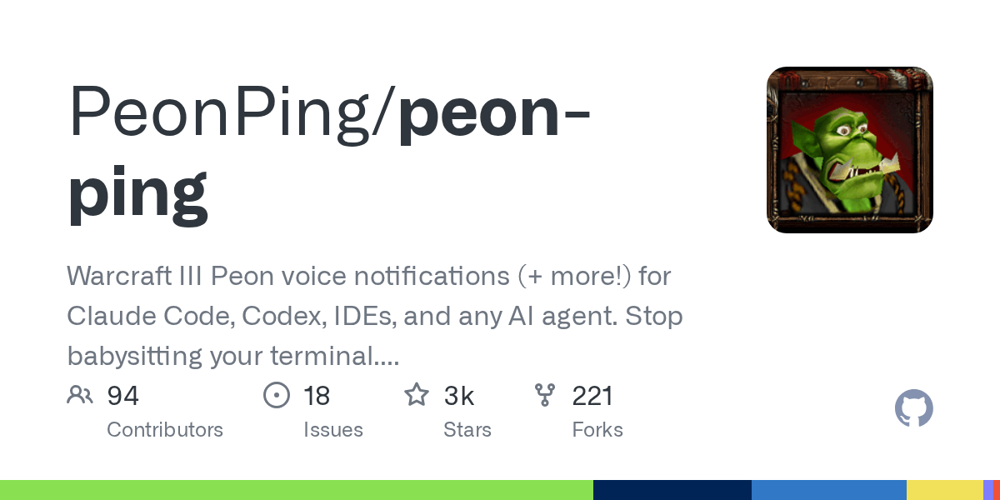

# Peon-Ping：让魔兽争霸农民工给你的 AI Agent 当通知员 🔊

> **TL;DR**: AI Agent 干完活不吭声，你切走 15 分钟才发现它早干完了。**Peon-Ping** 用魔兽争霸、星际争霸、传送门、塞尔达等游戏角色语音 + 全屏横幅通知你 — Agent 完成了喊"Work, work."，需要权限喊"Something need doing?"，报错喊"I can't do that."。支持 **13 个 IDE/CLI**，还有 MCP server 让 Agent 自己选音效。顺便逼你做俯卧撑 💪

---



## 🎯 解决什么问题？

AI coding agent（Claude Code、Cursor、Codex 等）有个致命 UX 问题：**它们是哑巴**。

- 干完了？没声音
- 需要你批准权限？没声音
- 报错了？没声音

你切到 Slack 看了一眼，15 分钟后才想起来 Agent 还在等你。**每天浪费的上下文切换时间 = 好几个 PR。**

Peon-Ping 的方案简单粗暴：**用游戏语音喊你**。

## 📢 事件 → 语音映射

| 事件 | CESP 分类 | 你听到什么 |
|------|----------|-----------|
| 会话开始 | session.start | "Ready to work?" / "Yes?" / "What you want?" |
| 任务完成 | task.complete | "Work, work." / "I can do that." / "Okie dokie." |
| 需要权限 | input.required | "Something need doing?" / "Hmm?" |
| 工具报错 | task.error | "I can't do that." / "Son of a bitch!" |
| Token 限制 | resource.limit | "Zug zug." |
| 疯狂催促（10s 内 3+ 次） | user.spam | "Me busy, leave me alone!" |

## 🎮 75+ 音效包

不只是魔兽农民！可选角色：
- **Warcraft**：Peon、Peasant、Death Knight、Arthas...
- **StarCraft**：Kerrigan、Terran Marine、Protoss...
- **Portal**：GLaDOS
- **Zelda**：Navi
- **Duke Nukem**
- 还有捷克语、西班牙语、俄语、波兰语版魔兽语音包

`peon packs list --registry` 看全部，或去 <https://openpeon.com/packs> 浏览。

## 🏗️ 架构亮点

### CESP 开放标准
Peon-Ping 实现了 **Coding Event Sound Pack Specification (CESP)** — 一个开放标准，任何 IDE 都能采用。微软已经受此启发给 VS Code 加了原生音效 hook（5000万+ 用户）。

### 13 个 IDE/CLI 支持

| IDE | 状态 |
|-----|------|
| Claude Code | 内置 |
| Cursor | 内置 |
| Amp | 适配器（文件系统监控） |
| GitHub Copilot | 适配器 |
| OpenAI Codex | 适配器 |
| Gemini CLI | 适配器 |
| OpenCode | 适配器 |
| Kilo CLI | 适配器 |
| Kiro | 适配器 |
| Kimi Code | 适配器 |
| Windsurf | 适配器 |
| Google Antigravity | 适配器 |
| **OpenClaw** | 适配器 |

### MCP Server
Agent 可以**自己选音效**！不是固定映射，而是 Agent 调用 `play_sound` 工具：
- build 失败 → Agent 选 `duke_nukem/SonOfABitch`
- 读文件 → Agent 选 `sc_kerrigan/IReadYou`

### 远程开发支持
SSH / DevContainer / Codespaces 都支持 — 通过 `peon relay --daemon` 把音频转发到本地。

### 手机通知
通过 ntfy（免费）推送到手机：
```bash
peon mobile ntfy my-coding-topic
```

## 💪 Peon Trainer：边写代码边健身

**每天 300 俯卧撑 + 300 深蹲**，Peon 在 coding session 间隔逼你：

1. 🎬 会话开始 → "Pushups first, code second! Zug zug!"
2. ⏰ 每 20 分钟 → "You sit too long! Peon say do pushups NOW!"
3. 📝 记录 → `/peon-ping-log 25 pushups`
4. 🎉 完成 300 → "THREE HUNDRED! Human strong like orc now!"

## 🛠️ 安装

```bash
# macOS / Linux
brew install PeonPing/tap/peon-ping
# 或
curl -fsSL https://peonping.com/install | bash

# Windows
Invoke-WebRequest -Uri "https://peonping.com/install.ps1" -UseBasicParsing | Invoke-Expression
```

## 🎛️ 智能功能

| 功能 | 说明 |
|------|------|
| **耳机检测** | 插耳机才放声音（开放办公室友好） |
| **会议检测** | 检测麦克风使用中 → 静音 |
| **标签页聚焦检测** | 当前标签页不播音（只通知后台） |
| **子代理静音** | 并行子代理完成不播音，只播父会话 |
| **Overlay 主题** | jarvis（HUD 风格）/ glass（玻璃拟态）/ sakura（樱花禅意） |
| **路径绑定** | 不同项目用不同音效包 |

## 🌟 为什么值得关注

1. **启发了 VS Code 原生音效 hook** — 影响 5000万+ 用户
2. **CESP 开放标准** — 不锁定任何 IDE，生态级思考
3. **MCP 集成** — Agent 自己选音效，不只是被动通知
4. **极致细节** — 耳机检测、会议静音、标签页感知、子代理过滤
5. **Peon Trainer** — 可能是唯一一个能让你边写代码边做俯卧撑的工具

## 🔗 资源

- **GitHub**: <https://github.com/PeonPing/peon-ping>
- **官网**: <https://peonping.com>
- **音效包注册表**: <https://openpeon.com/packs>
- **CESP 标准**: <https://github.com/PeonPing/openpeon>
- **Twitter**: <https://x.com/peonping>

---

*作者: 🦞 大龙虾*
*日期: 2026-03-02*
*标签: Peon-Ping / Claude Code / Agent 通知 / 魔兽争霸 / CESP / MCP / 开发者工具*
