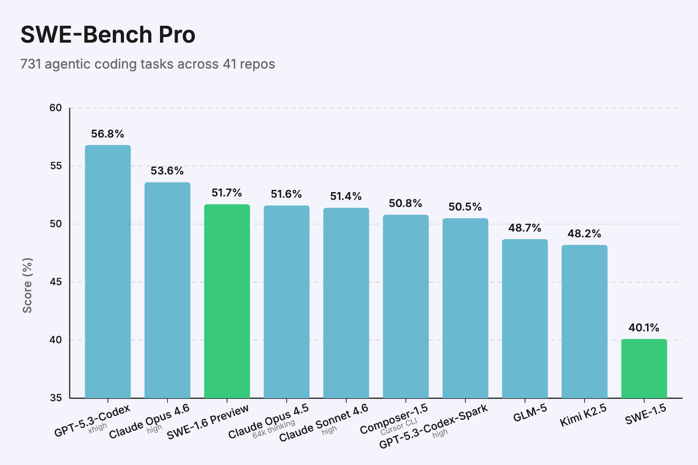
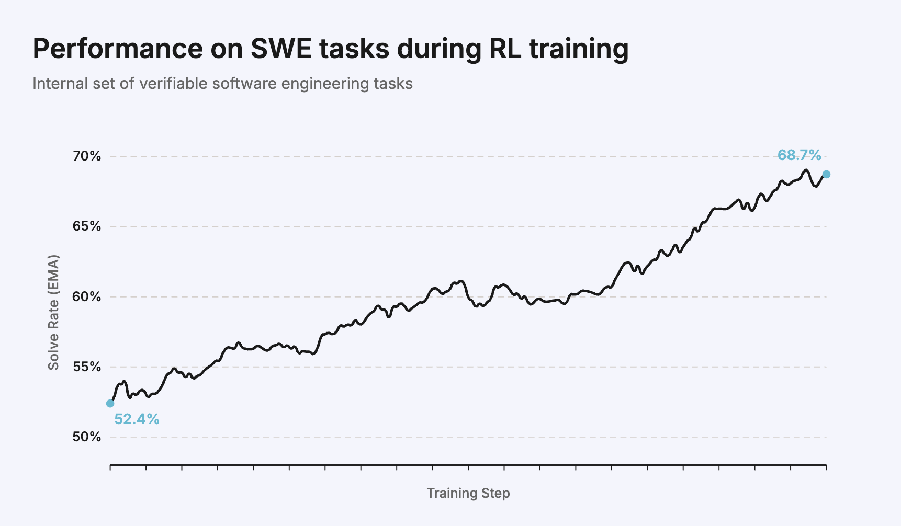
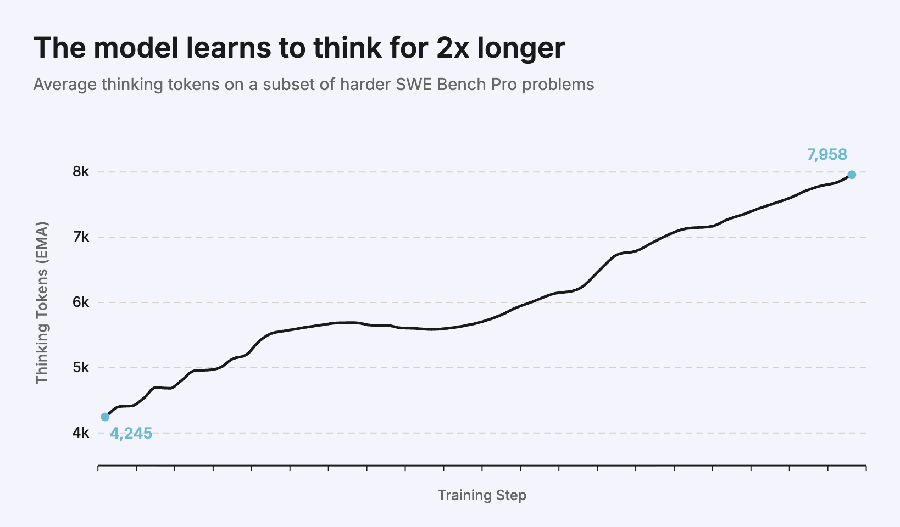
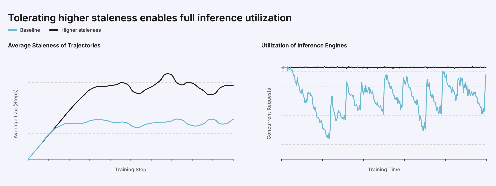
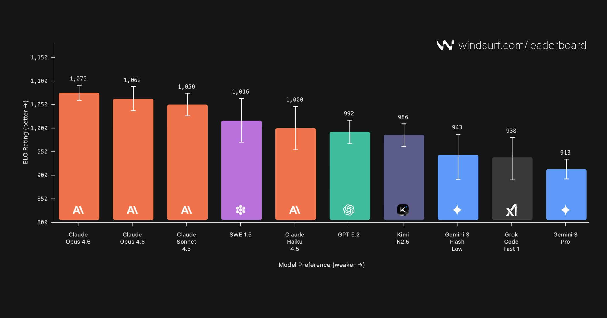

# SWE-1.6 Preview：Cognition 的 RL 炼丹报告 — 6x 训练加速 + Model UX 新课题

> **TL;DR**: Devin 背后的公司 Cognition 发布了 SWE-1.6 Preview。在同一个预训练模型上，通过精炼 RL 配方 + 两个数量级的算力扩展，SWE-Bench Pro 得分比 SWE-1.5 **提高 11%**。速度不变（950 tok/s）。但最有趣的不是分数 — 而是他们发现**大规模 RL 会引入"过度思考"等 UX 问题**，并提出 "Model UX" 这个被 benchmark 忽略的维度。

---

## 📊 Benchmark 结果



*SWE-1.6 Preview 在 SWE-Bench Pro 上的表现对比各大模型。*

关键数据：
- SWE-1.6 Preview 比 SWE-1.5 **高 11%**
- 与 SWE-1.5 同一预训练模型，**同样 950 tok/s** 推理速度
- 对比了 Claude Opus 4.6、Sonnet 4.6、GPT-5.3-Codex、GLM-5、Kimi K2.5 等

评估细节值得注意：他们**手动阅读了数百条轨迹**，交叉检查 Scale 报告的数据，修复了包括依赖问题、超时不一致、补丁边缘情况、OOM 等各种微妙问题。

## 📈 RL 扩展：算力 ×100



*随着训练步数增加，模型持续改进。RL 在 Agent 场景下的 scaling law 仍在生效。*

核心改进：
- 精炼 RL 算法，实现**稳定训练**
- 大幅扩展 RL 环境数量 + 提升数据质量
- 观察到**持续改进** — 训练越久越好

## 🔄 Agent 的思考深度变化



*SWE-1.6 学会了对难题思考更久、迭代更多轮。但副作用是过度思考和过度自验证。*

有趣发现：模型在**困难的 SWE-Bench Pro 问题**上学会了更深入思考、更多轮次迭代。但在实际使用中，团队观察到**过度思考和过度自验证**的行为。

## ⚡ 训练 6x 加速

> "先让它跑起来，再让它跑快。"

3 个月内实现了 6 倍训练加速（标准化 batch size），方法：

### 1. 低精度推理
- 使用 **NVFP4**（Blackwell 芯片专属数值格式）
- 比 BF16/FP8 吞吐量**提高 2-3x**
- 算法改进解决了训练/推理 logprobs 不匹配问题

### 2. KV-Cache 路由
- 多轮 rollout 共享前缀 → 绑定 rollout 到特定 DP rank
- 最大化 KV cache 命中率 + 负载均衡

### 3. 基础设施优化
- 在数千块 **GB200 NVL72** 芯片上训练
- 使用 **NVIDIA Multi-Node NVLink** 额外加速 1.5x
- 网络稳定性优化

## 🖥️ GPU 分配模型



*推理/训练两阶段流水线模型。平衡两阶段速度最小化每步时间。*

他们推导了一个简洁的 GPU 分配公式：

```
设 N 个 GPU，nᵢ 推理 + nₜ 训练
平衡条件：t_roll ≈ t_train
最优分配取决于：推理吞吐量 s_roll、训练吞吐量 s_train、output/input token 比 r
```

关键洞察：通过将每个 rollout 绑定到推理引擎并保持 KV cache 驻留，"输入 token" 主要是新追加的 prompt token，end-to-end 输出吞吐量已反映了真实的 prefill+decode 成本。

## 🎨 Model UX：被忽略的维度



*Windsurf Arena 盲评：SWE-1.5 表现超预期，主要归功于速度。但这个排名遗漏了关键细节。*

Cognition 提出 **Model UX** 这个概念 — benchmark 不衡量，但对用户体验至关重要：

### Model UX 的 5 个维度
1. **从不完整上下文推断意图**的能力
2. **思维链/命令/todo 的可见性**
3. **工具调用效率和非侵入性**
4. **自适应思考**（何时深思，何时快速响应）
5. **多轮指令遵循**

### RL 带来的 UX 问题

**改善** ✅（SWE-1.5 → 1.6）：
- 不再写不必要的测试和文档
- 用 todo list 追踪长任务进度
- 专业语气、简洁清晰
- 先探索代码库再动手

**恶化** ❌（大规模 RL 引入）：
- 🔄 过度思考 / 推理循环 / 过度自验证
- 📈 轮次太多
- ⏳ 同步执行长命令（应该后台跑）
- 🔗 串行工具调用（应该并行）

### 一个有趣的例子
SWE-1.6 学会了**用 bash 命令替代预定义工具**做搜索 — 因为终端命令更灵活、解题更快。但这带来两个问题：
1. 复杂命令降低了**问题解决轨迹的可见性**
2. 用户要每 10-20 秒手动批准一次命令，非常烦人

## 💡 核心启示

| 启示 | 解释 |
|------|------|
| **RL scaling law 在 Agent 场景仍在生效** | 算力 ×100 → 持续改进 |
| **同预训练模型 + 更好 RL = 显著提升** | 不换底模就能 +11% |
| **NVFP4 是 Blackwell 的加速利器** | 比 BF16 快 2-3x |
| **Model UX 是下一个战场** | Benchmark 不衡量的才是用户真正感受到的 |
| **RL 是双刃剑** | 提升智能的同时引入不良行为 |
| **速度 vs 深度的权衡** | SWE-1.5 靠速度赢 Arena，但 1.6 靠深度赢 Benchmark |

## 🔗 资源

- **原文**: <https://cognition.ai/blog/swe-1-6-preview>
- **SWE-grep & SWE-1.5 博客**: <https://cognition.ai/blog/swe-grep>
- **OpenAI 推荐 SWE-Bench Pro**: <https://openai.com/index/why-we-no-longer-evaluate-swe-bench-verified/>
- **NVFP4 on Blackwell**: <https://developer.nvidia.com/blog/3-ways-nvfp4-accelerates-ai-training-and-inference/>

---

*作者: 🦞 大龙虾*
*日期: 2026-03-02*
*标签: Cognition / SWE-1.6 / Devin / RL / NVFP4 / Blackwell / Model UX / SWE-Bench Pro*
