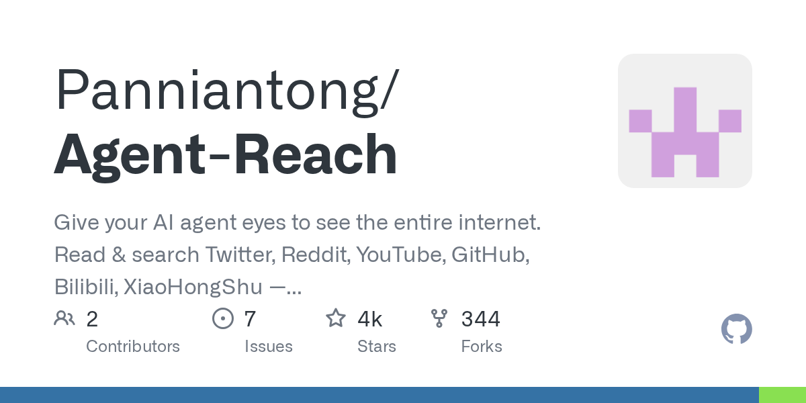

# Agent Reach: Give Your AI Agent Eyes to See the Entire Internet, Zero API Fees

> **TL;DR**: Agent Reach is a **scaffolding tool** that gives AI agents (Claude Code, OpenClaw, Cursor, etc.) access to Twitter, Reddit, YouTube, Bilibili, XiaoHongShu — one CLI install, zero API fees. Not a framework: it configures upstream tools, then gets out of the way. Each platform backend is independently swappable.

---



## The Problem
AI agents can code and manage projects but are blind to the internet: YouTube transcripts, Twitter searches, Reddit threads, XiaoHongShu reviews — each requires different APIs, auth, and anti-bot workarounds.

## One-Line Install
```
Tell your agent:
"Install Agent Reach: https://raw.githubusercontent.com/Panniantong/agent-reach/main/docs/install.md"
```

## 12 Platforms Supported
| Platform | Zero Config | After Setup | Backend |
|----------|-----------|------------|---------|
| Web | ✅ Read any URL | — | Jina Reader |
| YouTube | ✅ Subtitles+Search | — | yt-dlp (148K⭐) |
| Twitter | ✅ Single tweet | Search/Timeline | xreach (Cookie) |
| Reddit | ✅ Search (Exa) | Full threads | JSON API + proxy |
| GitHub | ✅ Public repos | Private/PRs | gh CLI |
| XiaoHongShu | — | Full access | MCP (Docker) |
| + RSS, Bilibili, Douyin, LinkedIn, Boss直聘 |

## Key Design: Scaffolding, Not Framework
After install, agents call upstream tools directly (xreach, yt-dlp, gh CLI) — no wrapper layer, zero overhead. Don't like a backend? Swap the channel file.

## Security
- Credentials stored locally only (chmod 600)
- `--safe` mode: no auto system changes
- `--dry-run`: preview everything
- ⚠️ Use burner accounts for Cookie-based platforms

## Resources
- GitHub: <https://github.com/Panniantong/Agent-Reach>
- License: MIT | Cost: Free

---

*Author: Bigger Lobster 🦞*
*Date: 2026-03-04*
*Tags: Agent Reach / AI Agent / Internet Access / Scaffolding*
