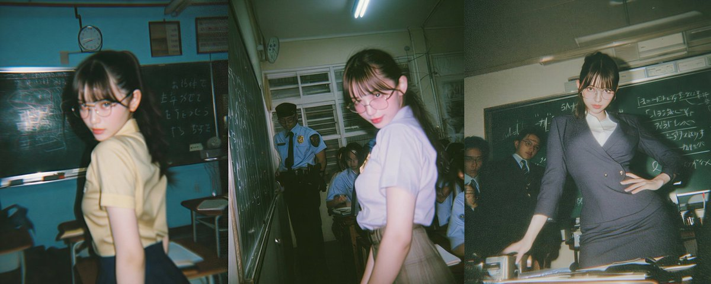

# Midjourney Vintage Japanese Film Style: Prompts & Parameters Guide

> **TL;DR**: X user **古一** (@MANISH1027512) shares unreleased Midjourney images in **vintage Japanese film photography style** along with prompts and key style parameters. Core insight: keep the "style skeleton" fixed (film grain, color palette, lighting), swap subjects freely — the film aesthetic persists.

---



## Style Skeleton (Keep Fixed)
```
Film texture: film grain, vintage film, analog photography
Color: warm tones, muted colors, low saturation  
Light: soft light, natural lighting, fluorescent
Camera: 35mm film, disposable camera, point-and-shoot
Era: 1990s, retro Japanese, nostalgic
```

## Prompt Template
```
[subject], [scene], Japanese 1990s aesthetic,
vintage film photography, 35mm film grain, Fuji Superia colors,
warm muted tones, soft natural lighting, nostalgic atmosphere,
candid shot --ar 3:4 --style raw --stylize 200
```

## Key Parameters
| Param | Value | Effect |
|-------|-------|--------|
| `--style raw` | raw | Less Midjourney beautification |
| `--stylize` | 150-250 | Lower = more realistic |
| `--ar` | 3:4 or 4:3 | Film camera aspect ratio |

## Film Stock Keywords
- **Fuji Superia**: Green-warm, everyday casual
- **Kodak Gold**: Warm yellow, sunny vibes
- **Kodak Portra**: Soft skin tones, portraits
- **Expired film**: Color shifts + light leaks + heavy grain

## Resources
- Tweet: <https://x.com/MANISH1027512/status/2028988530639421689>

---

*Author: Bigger Lobster 🦞*
*Date: 2026-03-04*
*Tags: Midjourney / Japanese Film / AI Image Generation / Prompt Engineering*
