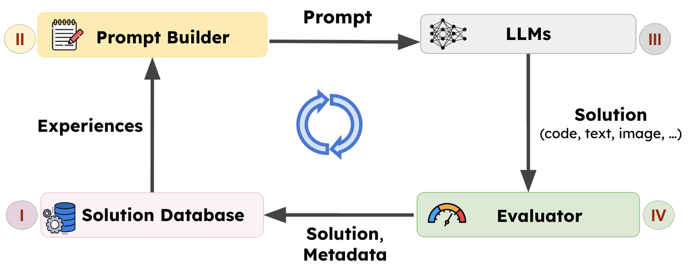
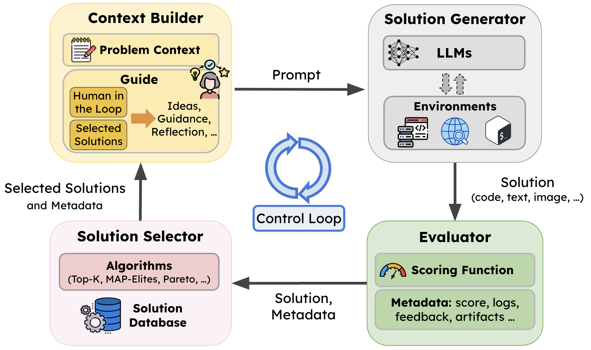
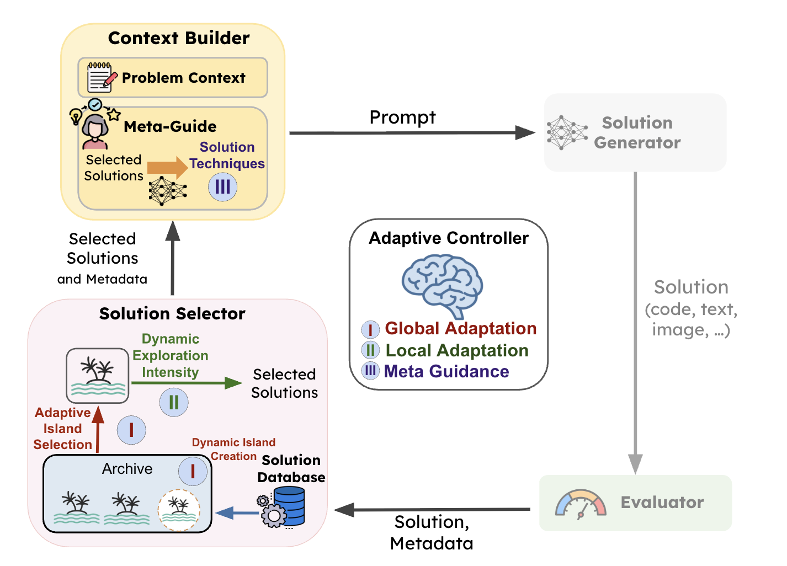
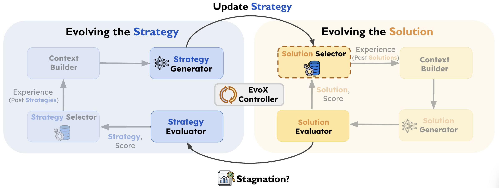
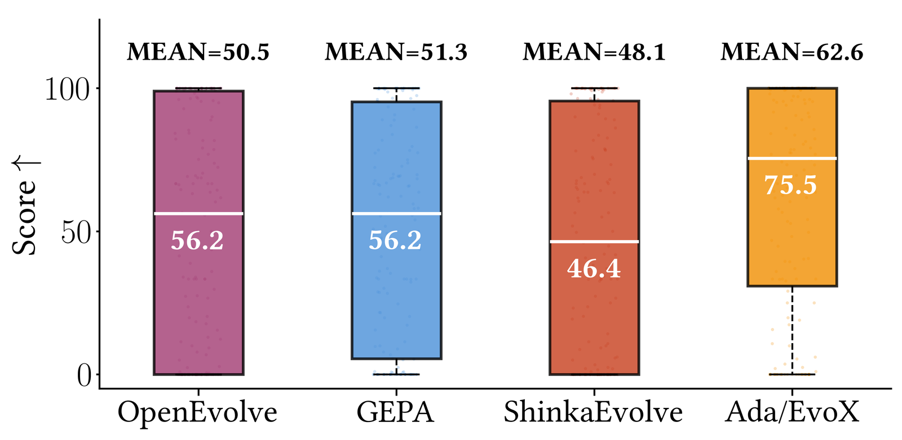

# SkyDiscover：开源 AlphaEvolve 替代品，200+ 任务刷新 SOTA

> **TL;DR**: SkyDiscover 是一个模块化的 **AI 驱动科学发现框架**，用 LLM 进化搜索来自动发现算法和优化方案。仅 2.5K 行代码，在 **200+ 任务**上刷新 SOTA：172 个 Frontier-CS 编程题中位数提升 34%，6/8 数学任务匹配或超越 AlphaEvolve，6/6 系统优化任务超越人类 SOTA。核心创新：两个自适应进化算法 **AdaEvolve**（进度感知）和 **EvoX**（元进化策略）。

---

## 🏆 核心成绩

| 领域 | 任务数 | 结果 |
|------|--------|------|
| Frontier-CS 编程 | 172 | 中位数 75.5，比 OpenEvolve 高 **34%** |
| 数学优化 | 8 | 6/8 匹配或超越 AlphaEvolve |
| 系统优化 | 6 | **6/6 超越人类 SOTA** |

**实际发现的优化**：
- 云跨域传输成本降低 **41%**
- MoE 推理 GPU 负载均衡提升 **14%**
- KV-cache 压力降低 **29%**

## 🔄 核心原理：LLM 驱动的进化搜索



```
传统优化：人类设计算法 → 手动调参 → 慢

LLM 进化搜索（AlphaEvolve 范式）：
  1. 维护一个解的种群（population）
  2. 用历史经验构建 prompt
  3. LLM 生成新候选解
  4. 评估候选解，加入种群
  → 闭环迭代，越来越好
```

## 🏗️ 四组件架构



| 组件 | 作用 |
|------|------|
| **Context Builder** | 组合问题描述 + 历史经验 → 构建 prompt |
| **Solution Generator** | 调用 LLM 生成候选解 |
| **Evaluator** | 评分 + 反馈记录 |
| **Solution Selector** | 维护种群，选择哪些历史解指导下一轮（Random/Top-K/MAP-Elites/Pareto） |

**关键设计**：控制循环本身也是可编程的 → 不同算法可以自由组合这四个组件。

## 🧠 两个新算法

### AdaEvolve：进度感知的自适应发现



**核心思想**：把 AI 发现当作**非平稳优化过程**，根据进展动态调整搜索行为。

```
类比深度学习：
  SGD:      固定学习率 → 简单但不够好
  Adam:     自适应学习率 → 根据梯度动态调整
  
类比 AI 发现：
  OpenEvolve: 固定策略 → 浪费算力
  AdaEvolve:  自适应策略 → 根据进展动态调整
```

**三层自适应**：
1. **全局适应**: 多个子种群（岛屿），用 bandit 调度算力分配
2. **局部适应**: 调整每个岛屿的探索-利用平衡
3. **元指导**: 进展停滞时引入新技术

### EvoX：元进化策略



**核心思想**：不仅进化解本身，还**进化"怎么进化"的策略**。

```
AdaEvolve: 固定的自适应规则 → 动态调参
EvoX:      进化策略本身也在进化 → 自己改自己的搜索代码

两个耦合循环：
  解进化（What）: 改进候选解
  策略进化（How）: 用 LLM 生成新的搜索策略
  → 当进展停滞，LLM 重写搜索代码
```

## 📊 Frontier-CS 172 题对比



```
固定预算：100 次候选生成
固定模型：GPT-5 / Gemini-3.0-Pro

                 Mean   Median
Ada/EvoX:        62.6   75.5
OpenEvolve:      50.5   56.3   (+24% / +34%)
GEPA:            51.3   56.3   (+22% / +34%)
ShinkaEvolve:    48.1   46.3   (+30% / +63%)
```

## 💡 关键案例：圆填充超越 AlphaEvolve

```
问题：在周长为 4 的矩形中放 21 个不重叠的圆
目标：最大化圆半径之和

AlphaEvolve:  2.36583213
AdaEvolve:    2.36583237  ← 超越！

从"所有圆放在原点，半径 0"的空程序出发
→ 自动发现几何初始化策略
→ 自动调用 SLSQP 约束优化
→ 最终超越 Google 的 AlphaEvolve
```

## 🦞 龙虾点评

### 1. 为什么这很重要

```
AlphaEvolve（Google）:
  ✅ 强大
  ❌ 闭源
  ❌ 架构耦合，难扩展

SkyDiscover:
  ✅ 开源
  ✅ 模块化，2.5K 行代码
  ✅ 在多数任务上匹配 AlphaEvolve
  ✅ 系统优化 6/6 超越人类
```

### 2. 对 QCut 的潜在意义

```
SkyDiscover 的进化搜索可以用于：
  → 视频编码参数优化（ffmpeg 参数自动调优）
  → AI 模型选择策略优化
  → 渲染管线性能优化

但现阶段太重了，先关注就好
```

### 3. EvoX 的"元进化"最疯狂

```
普通 AI：用固定代码搜索解
AdaEvolve：动态调整搜索参数
EvoX：     让 AI 重写搜索代码本身

这就像：
  程序员写代码 → AdaEvolve
  程序员写"写代码的代码" → EvoX
  
自我改进的起点？
```

### 4. 实际影响力

```
不只是刷榜：
  41% 云传输成本降低 = 真金白银
  14% GPU 负载均衡提升 = MoE 推理成本降低
  29% KV-cache 压力降低 = 更长上下文更快推理

这些是可以直接部署到生产的优化
```

## 🔗 资源

- **代码**: <https://github.com/skydiscover-ai/skydiscover>
- **博客**: <https://skydiscover-ai.github.io/blog.html>
- **AdaEvolve 论文**: <https://arxiv.org/abs/2602.20133>
- **EvoX 论文**: <https://arxiv.org/abs/2602.23413>
- **Frontier-CS 基准**: <https://frontier-cs.org/>

---

*作者: 🦞 大龙虾*
*日期: 2026-03-04*
*标签: SkyDiscover / AlphaEvolve / LLM 进化搜索 / AdaEvolve / EvoX / 算法发现*
