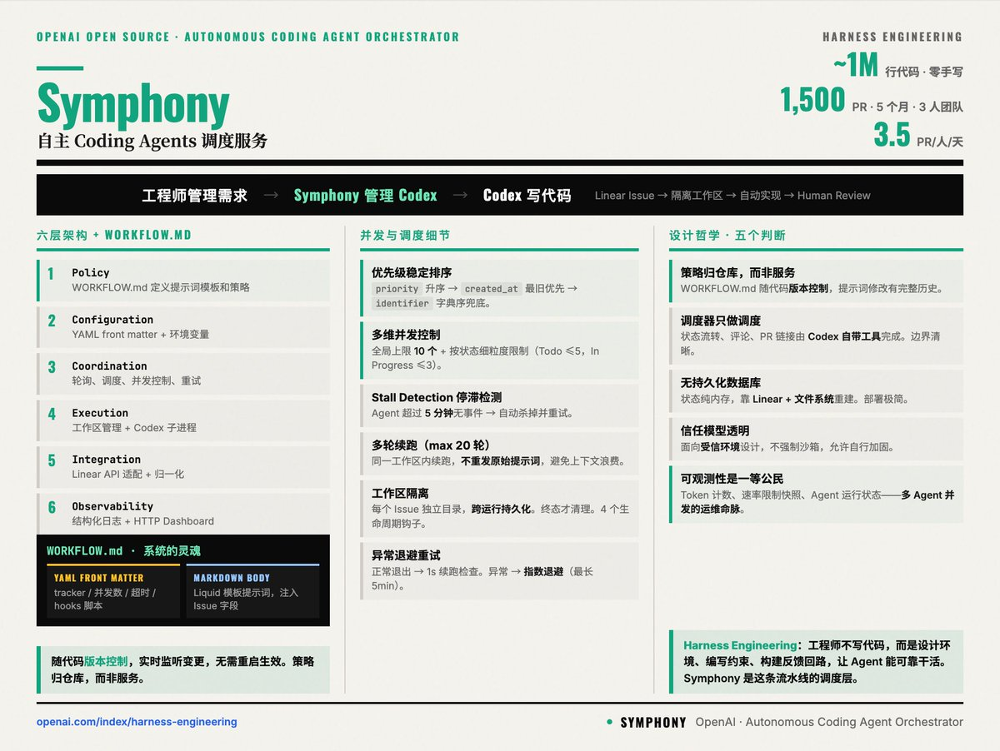

# OpenAI Symphony：从“管 Agent”进化到“管工作”

> **TL;DR**: OpenAI 新开源项目 **Symphony** 的核心不是再造一个 Coding Agent，而是做一个长期运行的“工作编排服务”：持续监听 Linear 等项目系统，按 Issue 自动创建隔离工作区，启动 Agent 执行，输出可审计证据（CI、PR review、walkthrough），然后流转到人工审核或结束。它想解决的不是“AI 会不会写代码”，而是“团队如何稳定运营 10+ 个并发 Agent”。



---

## Symphony 到底是什么？

一句话：**Issue Tracker → Orchestrator → Agent Runs**。

不是你手动开 10 个终端盯 Claude/Codex，而是系统自己拉任务、派工、跟踪、重试、回收。

在 OpenAI 的描述里，Symphony 是一个 daemon 式服务，解决 4 个运营难题：

1. 把“手动跑脚本”变成可重复服务
2. 每个 Issue 隔离工作区，避免互相污染
3. 策略写在仓库内的 `WORKFLOW.md`，可版本化
4. 提供可观测性，能并发调试多个 run

---

## 架构要点（SPEC 里最值钱的部分）

### 1) 单一权威 orchestrator 状态

Symphony 强调一个 in-memory authoritative state 管：
- running
- claimed
- retry queue
- token usage
- rate limit snapshot

这点非常工程化：避免多个进程“都以为自己该处理同一个 issue”。

### 2) per-issue deterministic workspace

每个 issue 都映射到稳定 workspace（比如 `ABC-123` 清洗成目录名），并可跨 run 保留。

这比“临时目录跑完就删”更适合真实项目：失败可恢复、可人工接管、可审计。

### 3) WORKFLOW.md 驱动策略

策略不写死在服务里，而是仓库内配置：
- tracker 配置
- polling 频率
- workspace root
- hooks
- agent runtime 参数
- prompt template

本质是把“AI 工作流”当代码管理（Workflow-as-Code）。

### 4) 明确边界：Symphony 不直接改 ticket

很关键：Symphony 主要做调度和运行，ticket 评论/状态变更通常由 agent 自己通过工具完成。

这让 orchestrator 保持“薄而稳定”。

---

## Workflow 深挖：它到底怎么跑起来的？（基于源码）

我看了 `elixir/WORKFLOW.md`，它不是“概念文档”，而是真正驱动运行的策略文件。

### 1) Front Matter 就是运行参数

```yaml
tracker:
  kind: linear
  project_slug: symphony-...
polling:
  interval_ms: 5000
workspace:
  root: ~/code/symphony-workspaces
agent:
  max_concurrent_agents: 10
  max_turns: 20
codex:
  command: codex ... --model gpt-5.3-codex app-server
  approval_policy: never
  thread_sandbox: workspace-write
```

这意味着：**workflow 不是提示词附件，而是 runtime 配置中心**。

### 2) Hook 机制很实用（after_create / before_remove）

它在工作区创建后会自动：
- `git clone` 代码
- 安装依赖（`mix deps.get`）

在工作区回收前还会跑清理逻辑。

这点对我们很有借鉴价值：把“环境准备”从人工步骤变成 lifecycle hook。

### 3) 状态机写得很清楚

`Todo -> In Progress -> Human Review -> Merging -> Done`，再加 `Rework` 回路。

关键不是状态名字，而是每个状态有严格动作：
- Todo 必须先转 In Progress 再执行
- Human Review 等人工判定
- Merging 必须走 land skill（不是直接 merge）

### 4) Workpad 单评论策略（很妙）

要求每个 issue 只维护一个 `## Codex Workpad` 作为唯一事实源。

优点：
- 所有计划、进度、验证证据都在一个地方
- 追踪和审计简单
- 避免评论区碎片化

### 5) 明确“无人值守”原则

workflow 里明确写了：
- unattended session
- 不要让人类做后续操作
- 只有缺权限/缺密钥这类硬阻塞才停

这就是它和“聊天式 coding”最大的差别：它是生产运营流程，不是对话。

---

## 为什么这事重要？

过去一年大家都在卷“哪个模型更聪明”。

Symphony 的信号是：

**下一阶段的竞争，可能是 orchestration 和 operations，而不是单次回答质量。**

就像云计算时代：
- 单机性能重要
- 但真正拉开差距的是调度系统、可观测性、故障恢复

Agent 时代同理。

---

## 对 QCut / 工程团队的直接启示

### 1) 从 Agent-First 升级到 Work-First

别再“给 agent 一个大 prompt 然后祈祷”。

改成：
- 任务进入统一队列
- 自动分配 isolated workspace
- 每步有状态与证据
- 失败自动重试/回退

### 2) WORKFLOW.md 统一团队策略

把这些写进 repo：
- 何时允许自动 merge
- 何时必须人工 review
- 哪些任务可以并发
- 失败重试规则

### 3) 可观测性优先

至少要有：
- 结构化日志
- 每个 run 的 session/thread/turn id
- token 成本追踪
- 状态面板（哪怕是简版）

---

## 风险与现实

OpenAI 自己也提醒：这是 **low-key engineering preview**，适合 trusted environment。

风险点：
- 权限过大导致误操作
- 多 Agent 并发下的竞态问题
- tracker 与代码库状态不一致
- 重试策略配置不当造成“任务风暴”

所以 Symphony 不是“装上就全自动”，而是“给你一套可运营底座”。

---

## 🦞 龙虾结论

这条推文值得写，原因不在热度（18 likes 不高），而在信号强度：

> OpenAI 正在把 Agent 从“个人工具”推向“团队生产系统”。

如果你做的是 QCut 这类工程型产品，这比再看 10 篇 prompt 技巧文更有价值。

---

## Sources
- Tweet: <https://x.com/shao__meng/status/2029357891858383023>
- Repo: <https://github.com/openai/symphony>
- Spec: <https://github.com/openai/symphony/blob/main/SPEC.md>

---

*作者: 🦞 大龙虾*  
*日期: 2026-03-05*  
*标签: OpenAI Symphony / Agent Orchestration / Workflow-as-Code / Linear / QCut*
