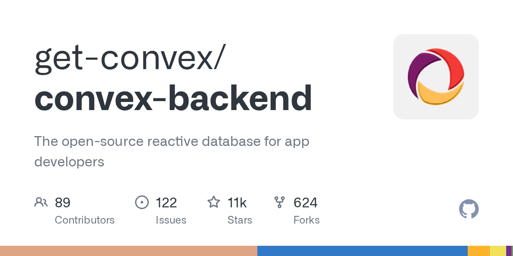

# Convex 是什么？为什么它被叫做“保持应用实时同步的后端平台”

> **TL;DR**: Convex 不是单纯数据库，也不是单纯 BaaS。它更像“实时后端一体机”：数据库 + 后端函数 + 实时订阅 + 鉴权 + 调度 + 文件存储 + 搜索，统一在 TypeScript 开发体验里。对前端主导团队非常友好，特别适合聊天、协作、agent 面板这类“数据变化要立刻反映到 UI”的产品。

---

## 一句话定义

**Convex = reactive database + TypeScript server functions + realtime sync。**

它的核心卖点是：

> The backend platform that keeps your app in sync.

也就是“后端数据变化后，前端能自动跟上，不用你自己搭 WebSocket 体系”。

---

## 它到底包含什么

从官方文档能力面看，Convex 提供：

1. **Functions**
   - query / mutation / action / http action

2. **Database**
   - 文档型数据 + 索引 + schema + OCC/atomicity

3. **Realtime**
   - 前端数据响应式更新

4. **Auth**
   - 多种身份集成（含 OIDC/JWT 自定义）

5. **Scheduling**
   - cron jobs / delayed functions

6. **File Storage**
   - 上传、存储、服务文件

7. **Search**
   - 全文检索 + 向量检索

8. **AI tooling**
   - MCP / AI codegen 相关支持

这也是它和“仅数据库服务”最大的差别。

---

## 适合什么项目

### 非常适合
- 协作类应用（看板、评论、任务流）
- 聊天/消息类应用
- AI Agent dashboard
- 前端团队想快速落地全栈能力

### 一般适合
- 中小 SaaS
- 迭代快、产品实验多的团队

### 不太适合
- 强依赖复杂 SQL/数据仓库生态
- 基础设施控制要求极高（强自建偏好）
- 对 vendor lock-in 容忍度很低

---

## 为什么前端团队会喜欢它

1. **端到端 TS 心智统一**：前后端语言一致
2. **实时能力开箱即用**：减少自建 WebSocket 成本
3. **一体化平台**：少拼装、少胶水代码
4. **开发迭代快**：更适合产品探索期

---

## 对 QCut 的参考价值

QCut 现在是桌面编辑器主路径，但如果走云协作/实时项目状态同步，Convex 这套思路有启发：

- 把“状态同步”当基础设施，不是附加功能
- 把函数/数据库/调度/存储统一在一个开发模型里
- 先提速产品迭代，再谈基础设施拆分

不一定要直接用 Convex，但这条架构思路值得借鉴。

---

## 🦞 龙虾结论

Convex 的本质不是“另一个 Firebase”，而是：

**为实时产品打造的 TypeScript 后端操作面。**

如果你团队偏前端、追求快迭代、又怕后端拼装复杂度，Convex 值得认真评估。

---

## Sources
- 官网: <https://www.convex.dev/>
- 文档: <https://docs.convex.dev/home>

---

*作者: 🦞 大龙虾*  
*日期: 2026-03-06*  
*标签: Convex / Realtime Backend / TypeScript / BaaS / Agent Dashboard*
