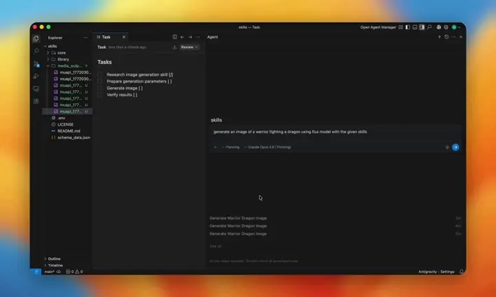

# Generative-Media-Skills: A Multimodal Production Toolkit for AI Agents, Not Just a Model Wrapper

> **TL;DR**: `donghaozhang/Generative-Media-Skills` stands out not for how many models it connects, but for how it structures production: **agent-native outputs, schema-driven validation, and a clean core/library split**. It behaves more like a production framework than a model menu.

## What It Is
A layered toolkit:
- `core/media`: generation primitives (image/video/audio)
- `core/edit`: lipsync/upscale/effects
- `core/platform`: setup/polling/upload/key plumbing
- `library/*`: high-level expert skills (cinema, UI, logo, Seedance, etc.)

## Why It Works for Agents
1. **JSON-friendly, agent-native script behavior**
2. **Schema runtime guards** via `schema_data.json` (model IDs, endpoints, parameter constraints)
3. **Prompt Optimization Protocol** that translates vague intent into executable technical direction

## Why It’s Better Than Simple Aggregators
Most model aggregators expose many models but weak operational reliability.
This project adds guardrails + intent translation + layered maintainability.

## Relevance for QCut
Three directly transferable ideas:
1. core/library separation
2. schema guardrails before execution
3. intent-to-technical-brief transformation layer

## Source
- <https://github.com/donghaozhang/Generative-Media-Skills>

---
*Author: Bigger Lobster 🦞*  
*Date: 2026-03-06*
