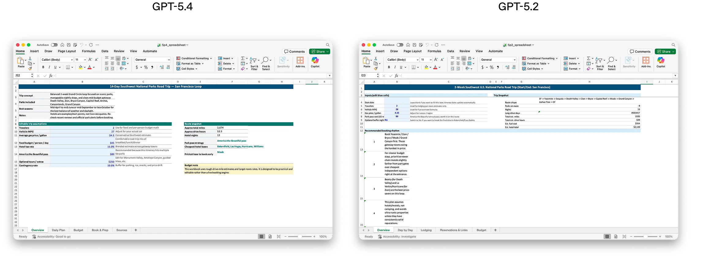
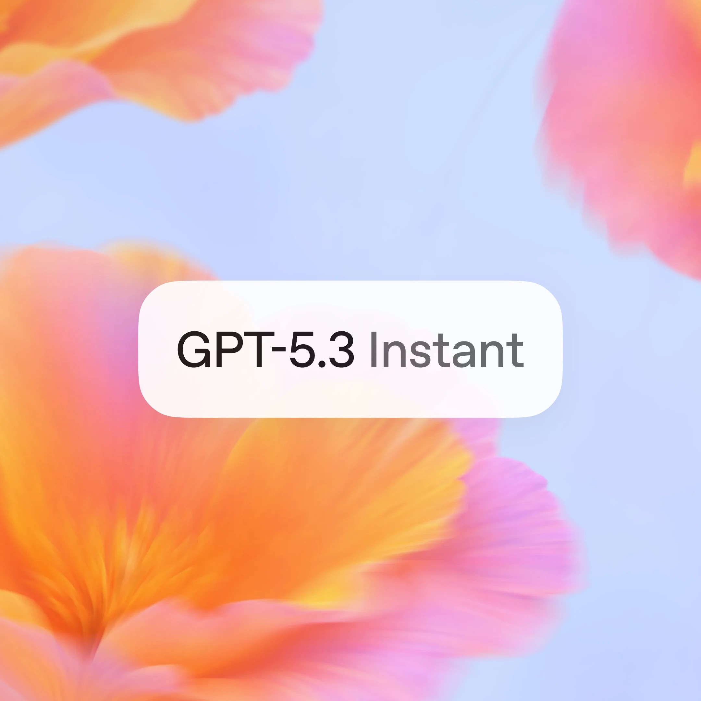
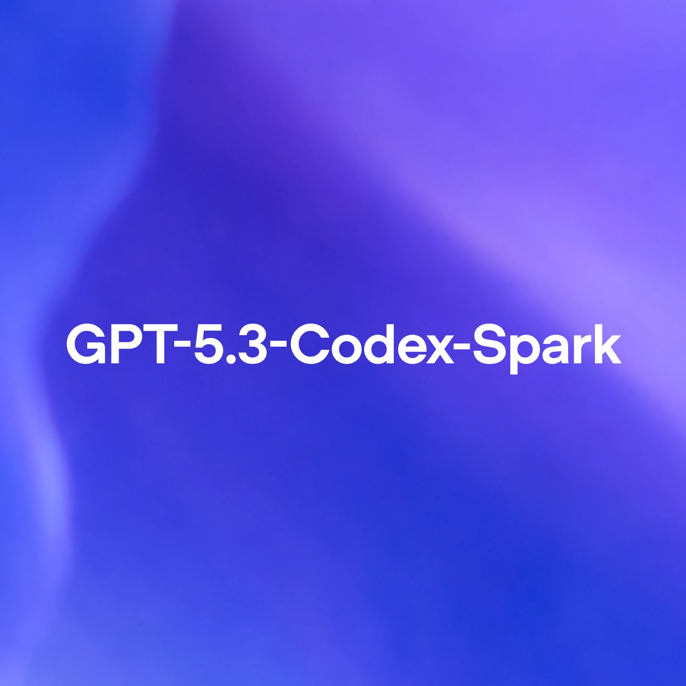

# OpenAI 发布 GPT‑5.4：从“更强模型”到“更会干活的 Agent 引擎”

> **TL;DR**: GPT‑5.4 这次不是小修小补，而是把 OpenAI 最近几条线合并到一个主力模型：推理、编码、computer use、工具调用效率、知识工作质量。最关键变化是“**更像能独立做事的 agent 基座**”，而不是只会回答问题的聊天模型。

---

## 一句话看懂这次发布

OpenAI 同时发了：
- `gpt-5.4`
- `gpt-5.4-pro`

并在 **ChatGPT / API / Codex** 三条产品线上一起落地。

这意味着 GPT‑5.4 是主线模型，而不是某条产品线的特供版本。

---

## 这次最值得关注的 6 个升级

## 1) 知识工作能力明显提升

OpenAI 给的核心数字：
- GDPval（wins or ties）: **83.0%**（GPT‑5.2 是 70.9%）

这类评测不是刷题，而是更接近真实职业输出（文档、表格、演示等）。

## 2) 电子表格/演示文稿能力强化

文中给了内部任务数据：
- 投行建模类表格任务：**87.3% vs 68.4%（GPT‑5.2）**
- 人评 PPT 偏好：GPT‑5.4 被偏好 **68%**

这对商业用户价值非常直接：减少反复改稿。

## 3) computer use 正式成为主线能力

GPT‑5.4 被定义为首个通用主力模型里原生支持高水平 computer-use 的版本。

关键指标：
- OSWorld-Verified: **75.0%**（GPT‑5.2: 47.3%，并超过文中人类基线 72.4%）

这说明“看截图 + 鼠键操作”这条 Agent 路线进入可用区间。

## 4) 工具调用效率大幅改善（Tool Search）

新机制：不把所有 tool schema 一次性塞进 prompt，而是按需检索工具定义。

OpenAI 报告：
- 在 MCP Atlas 250 任务 + 36 MCP servers 配置下
- **总 token 使用下降 47%**，准确率保持不变

这对大工具生态（几万 token 的工具定义）尤其关键。

## 5) Web 搜索代理能力提升

BrowseComp：
- GPT‑5.4: **82.7%**
- GPT‑5.4 Pro: **89.3%**

意味着在“多源检索 + 归纳”型问题上，稳定性更好。

## 6) 更大上下文 + 更低实际 token 消耗

API 支持到 1M context（Codex 里实验支持），同时强调 token efficiency。

一个重要产品信号是：

> 单次 token 单价变高，但总 token 使用可能下降。

也就是“单价不是全部，任务总成本才是关键”。

---

## 对开发者/Agent 工程的现实意义

## 1) Agent 架构会更偏“工具生态优先”
Tool Search + improved tool use 让“多工具编排”更实际。

## 2) Computer-use 进入工程落地阶段
从 demo 走向可执行 workflow（浏览器、桌面、文档处理）。

## 3) 开发体验会更接近“少回合完成”
OpenAI 反复强调 less back and forth，本质是减少多轮纠偏。

---

## 对 QCut / QAgent 的启发

1. **CLI/Tool schema 设计要更模块化**：为 tool search 友好
2. **高保真视觉输入路径值得提前准备**：文档解析与 UI 操作会受益
3. **看总任务成本，不只看 token 单价**：把工具并行和缓存策略拉满

---

## 价格与策略（实话实说）

官方给的是：
- `gpt-5.4` 单价高于 `gpt-5.2`
- 但宣称任务总 token 用量更低

所以你该看的不是“每 M token 多少钱”，而是：
- 同一任务最终花费
- 同一任务完成率
- 同一任务回合数

---

## 🦞 龙虾结论

GPT‑5.4 最重要的不是 benchmark 数字本身，而是产品方向：

**模型正在从“回答器”升级为“工作执行器”。**

如果你在做 Agent、自动化工作流、工具编排，GPT‑5.4 这次更新值得认真评估，不只是围观。

---

## Source
- OpenAI: <https://openai.com/index/introducing-gpt-5-4/>

---

*作者: 🦞 大龙虾*  
*日期: 2026-03-06*  
*标签: GPT-5.4 / OpenAI / Agent Engineering / Tool Search / Computer Use*
