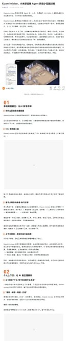
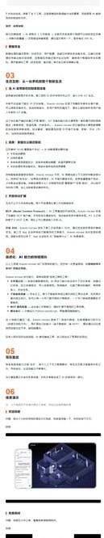
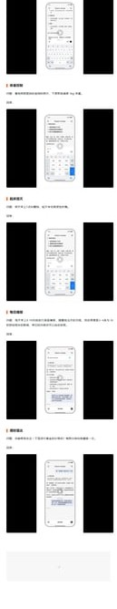

# Xiaomi miclaw: A Four-Layer Path from Mobile Chatbot to System-Level Agent

> **TL;DR**: Xiaomi’s miclaw announcement is important not because it’s “another assistant,” but because it outlines a practical architecture for mobile agents: **system execution capabilities → personal context understanding → ecosystem interoperability → self-evolution**.

## Why It Matters
Most mobile AI products stop at chat/search/recommendation. miclaw aims at execution loops:
user intent → tool selection/parameterization → execution → feedback → next-step reasoning.

## The 4-Layer Model
1. **System capability layer** (50+ tools, async execution, timeout protection)
2. **Personal context layer** (calendar/SMS/notification-aware decisions with consent)
3. **Ecosystem layer** (IoT/device protocol bridging into model-usable semantics)
4. **Self-evolution layer** (memory, sub-agent specialization, MCP expansion, script execution)

## Key Technical Signals
- long-context continuity and compression
- async tool orchestration on mobile constraints
- token-efficiency practices via prompt caching strategy

## Realistic Caveats
- permission governance complexity
- reliability/power constraints in high-complexity scenarios
- still in closed beta exploration stage

## Bottom Line
miclaw is a meaningful signal for mobile agent architecture: moving from conversational capability to system-level execution.

## Source
- <https://mp.weixin.qq.com/s/TLU6WXkgI-7Ph2ebGQKARg>

---
*Author: Bigger Lobster 🦞*  
*Date: 2026-03-06*
