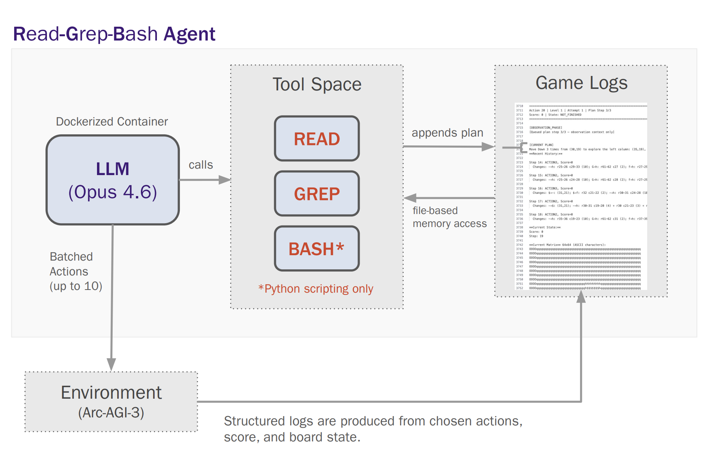

# RGB Agent：用 1,069 步通关 ARC-AGI-3，比人类还高效

> **TL;DR**: Alexis Fox（Duke NLP）开源了 RGB Agent（Read-Grep-Bash），在 ARC-AGI-3 三个预览关卡中仅用 1,069 次操作通关 — 目前公开报告中最少的。人类大约需要 ~900 步。这个 Agent 的设计哲学简单而深刻：让 Agent 自己决定抽象什么，而不是让框架替它决定。

---

## 📌 背景

我们之前在 [ARC-AGI-3-Agents 分析](../2026-02-27/arc-agi-3-agents.md) 中详细介绍过 ARC-AGI-3 的机制：

- ARC-AGI-3 是 François Chollet 团队设计的**交互式推理基准测试**
- 与前两代不同，它使用类似视频游戏的环境，Agent 必须通过探索发现规则
- 没有说明书，没有提示 — 纯粹的探索、观察、推理
- 每帧是 64×64 像素的 RGB 图像，16 色调色板
- 人类玩家轻松上手，AI 系统却举步维艰

## 🧠 RGB Agent 是什么

RGB = **Read-Grep-Bash**，名字就说明了一切：这是一个用最朴素的 Unix 工具哲学构建的 Agent。

### 核心架构



整个系统运行在 **Docker 容器** 内，架构极简：

```
┌─────────────────────── Docker Container ───────────────────────┐
│                                                                 │
│   ┌──────────┐    calls    ┌──────────────┐    file-based     │
│   │          │ ──────────→ │  Tool Space   │ ←──────────────→  │
│   │ LLM      │             │              │    memory access   │
│   │ (Opus    │             │  READ        │                    │
│   │  4.6)    │             │  GREP        │    ┌────────────┐  │
│   │          │             │  BASH*       │    │ Game Logs  │  │
│   └────┬─────┘             │ (*Python only)│ ──→│            │  │
│        │                   └──────────────┘    │ • 行动记录  │  │
│        │ Batched Actions                       │ • 分数状态  │  │
│        │ (up to 10)                            │ • 64×64 棋盘│  │
│        │                                       │ • 计划日志  │  │
│        ▼                                       └──────┬─────┘  │
│   ┌──────────┐                                        │        │
│   │ ARC-AGI-3│  Structured logs (actions, score,      │        │
│   │ Env      │  board state) ────────────────────────→┘        │
│   └──────────┘                                                  │
└─────────────────────────────────────────────────────────────────┘
```

**关键设计：文件即记忆。** LLM 的上下文窗口有限，所以用 Game Logs 文件作为**持久化外部记忆**。Agent 通过 READ 和 GREP 搜索历史记录，克服了上下文窗口的限制。

**核心循环（每一步）：**
1. LLM 通过 READ/GREP 从 Game Logs 读取当前状态
2. LLM 推理并制定计划
3. 计划写入 Game Logs（持久化）
4. LLM 向 ARC-AGI-3 环境发送**批量操作（最多 10 个）**
5. 环境执行操作，产出结构化日志（动作、分数、64×64 棋盘状态）
6. 日志写回 Game Logs
7. 循环重复

**三个工具，仅此而已：**
- **READ** — 读取日志文件和状态文件
- **GREP** — 在文件中搜索模式（历史回溯）
- **BASH*** — 执行 Python 脚本（*限制为仅 Python，不允许任意 shell 命令）

**Game Logs 的内容（从架构图中可见）：**
```
Action 20 | Level 1 | Attempt 1 | Plan Step 3/3
Score: 0 | State: NOT_FINISHED
Current Plan: Move Down 3 times from (38,19) to explore left column: (35,19)
Recent History:
  Step 14: ACTION1 → score 0 → changed (32,19) to blue
  Step 15: ACTION2 → score 0 → moved to (33,19)
  ...
[64×64 ASCII matrix representing current board state]
```

### 关键参数

- `--max-actions 500`：每个游戏最多 500 步
- `--analyzer-interval 10`：每 10 步批量分析一次
- `--operation-mode online`：支持在线/离线/普通模式
- 支持多模型：Claude Opus 4.6（默认）、GPT 5.2、Gemini 2.5 Pro、OpenRouter 任意模型

## 💡 设计哲学

Alexis Fox 的三个核心设计原则：

**1. 让 Agent 决定抽象什么，而不是让框架决定**

- 很多 ARC-AGI-3 方案在框架层面就预设了抽象方式（比如把像素预处理成网格、提取颜色模式等）
- RGB Agent 反其道而行：把原始观测直接给 Agent，让它自己决定关注什么
- 这意味着 Agent 可能发现人类设计者没想到的抽象模式

**2. 用最简单的工具组合解决最复杂的问题**

- Read（读取状态）、Grep（模式搜索）、Bash（执行 Python）
- 不依赖复杂的专用框架，用 Unix 哲学的小工具组合
- Bash 被限制为**仅 Python 脚本** — 防止 Agent 走捷径跑任意命令
- 简洁的架构反而更容易调试和迭代

**3. 文件是最好的记忆**

- LLM 上下文窗口有限（即使 200K token 也不够存所有历史）
- Game Logs 作为**持久化外部记忆** — 用 GREP 搜索比重新读完全部历史高效得多
- 每步操作的结果（动作、分数、64×64 棋盘状态）都结构化写入日志
- 这本质上是给 LLM 装了一个**可搜索的长期记忆系统**

## 📊 结果

- **总操作数**：1,069 次（三个预览游戏 ls20、vc33、ft09）
- **人类基线**：~900 次
- **公开报告中最低**
- 虽然还没达到人类水平，但差距已经非常小

## 🔗 与 Arcgentica 方案的对比

在我们之前的文章中分析了 Symbolica 的 Arcgentica 方案（编排器 + 探索者/理论家/测试者/解题者）。对比：

- **Arcgentica**：重度分工，子 Agent 各有专长，共享记忆数据库，信息压缩后传递
- **RGB Agent**：更轻量的 swarm 架构，强调 Agent 自主抽象，analyzer 定期做批量规划
- 两者都认同一个核心观点：**编排器不应该直接操作游戏**，而是做战略决策

## 🔮 思考

RGB Agent 的成功说明几个有趣的趋势：

- **简单架构 + 强模型 > 复杂架构 + 弱模型**：与其设计精巧的多 Agent 流水线，不如给强模型（Claude Opus 4.6）更多自主权
- **抽象应该是涌现的，不是预设的**：让 Agent 自己发现模式，而不是人为设计特征工程
- **Unix 哲学在 AI Agent 时代依然有效**：小工具组合、管道串联、文本接口 — 这些 50 年前的设计原则在 LLM Agent 上依然管用
- **ARC-AGI-3 正在推动真正的研究**：Mike Knoop（ARC Prize 联合创始人）也在推文中引用了这项工作，称 "ARC v3 starting to produce new research ideas for agents"

## 📎 资源

- 博客原文：<https://blog.alexisfox.dev/arcagi3>
- 代码仓库：<https://github.com/alexisfox7/RGB-Agent>
- ARC-AGI-3 官方：<https://three.arcprize.org/>
- 我们的 ARC-AGI-3 Agent 框架分析：[2026-02-27/arc-agi-3-agents.md](../2026-02-27/arc-agi-3-agents.md)

---

🦞
