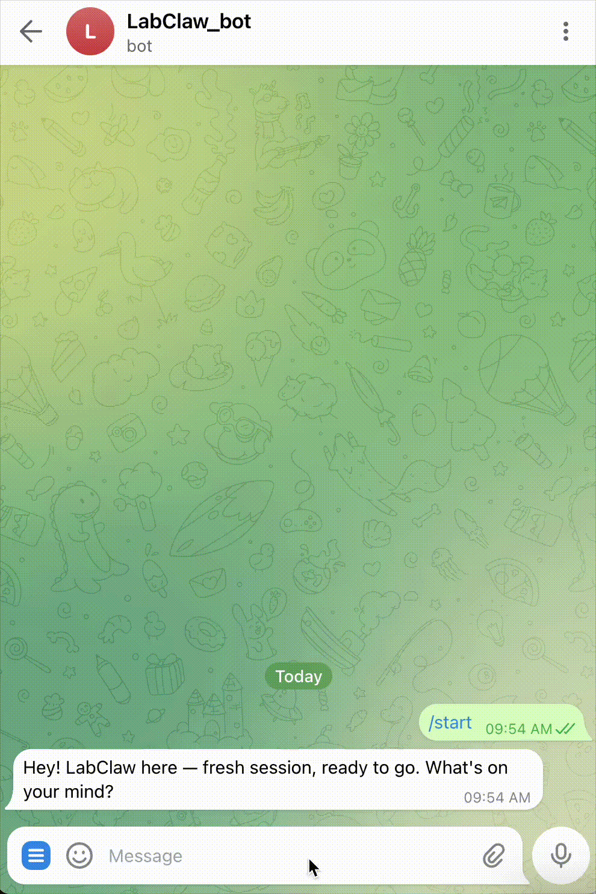

# LabClaw Deep Dive: A Skill Operating Layer for Biomedical AI Agents


*LabClaw logo from the repository homepage.*

LabClaw is not a classic software framework with a runtime, APIs, and service binaries. Instead, it is a **large, curated skill library** for OpenClaw-compatible agents, focused on biomedical and lab-adjacent work.

At a practical level, LabClaw gives an AI agent high-quality `SKILL.md` files that define:
- when to trigger a capability,
- which tools/APIs/packages to use,
- and what kind of output/workflow to produce.

This makes LabClaw best understood as an **agent behavior layer** (instructional operating layer), rather than a new execution engine.

---

## What LabClaw is (and is not)

### It is
- A repository of domain-specific agent skills (biomedical-heavy), under `skills/`.
- A reusable prompt/protocol layer meant to be installed into an OpenClaw-style environment (`install https://github.com/wu-yc/LabClaw`).
- A bridge between dry-lab reasoning and lab automation contexts (including references to LabOS/XR workflows).

### It is not
- A standalone orchestrator like Airflow/Prefect.
- A model-serving platform.
- A complete turnkey lab automation stack by itself.

The repo’s main value is **curation and structure** of agent instructions across many adjacent scientific domains.

---

## Repository architecture

LabClaw’s architecture is intentionally simple:

```text
LabClaw/
├── README.md
├── README.zh-CN.md
├── install_demo.gif
├── inlab.gif
├── Weixin Image_*.png
└── skills/
    ├── bio/
    ├── pharma/
    ├── med/
    ├── general/
    ├── literature/
    └── vision/
```

Each skill folder contains a `SKILL.md` file with practical guidance. Typical sections include:
- Overview
- When to Use
- Core capabilities / key APIs
- Usage examples
- Sometimes extra references, scripts, or assets (described in text)

### Important implementation observation
From the repository contents, LabClaw is currently **documentation-first**: mostly Markdown skill specs plus media assets. It does not ship a unified runtime in this repo.

---

## Workflow model: how LabClaw is intended to work

A builder using OpenClaw (or compatible agent tooling) can treat LabClaw as follows:

1. **Install or copy relevant skills**
   - Full install for broad coverage, or cherry-pick subfolders.
2. **User asks a scientific task**
   - Example: “Analyze this scRNA-seq dataset and annotate cell types.”
3. **Agent selects matching skills**
   - e.g., `scanpy`, `anndata`, enrichment, literature search skills.
4. **Agent executes tools/packages**
   - Python code, API calls, database queries, etc.
5. **Agent returns structured analysis**
   - tables, plots, summary, interpretation, next actions.
6. **(Optional) handoff to wet-lab/automation context**
   - via skills around Opentrons, LIMS/ELN, protocol systems.

This design is modular: skill quality and coverage directly determine agent reliability in domain tasks.

---

## Domain coverage and target users

The README presents LabClaw as a broad biomedical catalog (biology, pharmacy/drug discovery, medicine, literature search, vision, general data science).

### Who benefits most
- **Biomedical AI builders** who need fast domain grounding for agent behavior.
- **Computational biologists/bioinformaticians** needing structured prompts around established pipelines.
- **Translational research teams** combining omics, literature, and drug discovery tasks.
- **Lab automation explorers** connecting planning to robotics/LIMS/protocol workflows.

### Less ideal for
- teams expecting a batteries-included runtime from this same repo,
- users with no scientific context who need opinionated end-to-end product UX.

---

## Practical use cases where LabClaw is strong

1. **Single-cell and omics analysis playbooks**
   - Skills like `scanpy` and `tooluniverse-single-cell` encode stepwise QC → normalization → clustering → DE logic.

2. **Drug discovery and cheminformatics**
   - Skills such as `rdkit`, docking-oriented and target-oriented entries provide reusable procedural patterns.

3. **Clinical/medical research support**
   - Clinical/statistical guideline-style skills can improve consistency in study framing and reporting.

4. **Literature and evidence retrieval**
   - Skills for PubMed/academic search can standardize retrieval + synthesis behavior.

5. **Lab-adjacent automation context**
   - Skills referencing Opentrons, Benchling, protocols.io, etc., help agents reason about operational workflows.

---

## Strengths

- **Excellent breadth across biomedical subdomains** in one place.
- **Actionable skill style**: many files include concrete commands/code snippets.
- **Modular adoption path**: teams can cherry-pick skills rather than adopt all.
- **Good ecosystem awareness**: explicit links to OpenClaw, ToolUniverse, Biomni.
- **Builder-friendly framing**: strong for people who already operate AI-agent pipelines.

---

## Current limitations and caveats

1. **Metadata inconsistency risk at scale**
   - README badges/catalog counts can drift from on-disk counts over time.

2. **Documentation vs executable parity**
   - Some skills mention scripts/references/assets that may depend on external packaging context.

3. **Quality variance across 200+ skills**
   - Large collections naturally vary in depth, maintenance freshness, and specificity.

4. **No central runtime governance in-repo**
   - Execution safety, observability, and policy control depend on the host agent platform.

5. **Integration burden remains on adopters**
   - Teams still need environment setup, credentials, package management, and validation workflows.

---

## Comparison with adjacent ecosystems

## 1) LabClaw vs OpenClaw (runtime)
- **OpenClaw**: runtime/platform for agent operation.
- **LabClaw**: domain skill content layer.
- Relationship: complementary, not competing.

## 2) LabClaw vs ToolUniverse
- **ToolUniverse**: broad AI-scientist tooling ecosystem.
- **LabClaw**: operationalized skill wrappers/instructions tailored for agent use; includes many `tooluniverse-*` entries.
- Relationship: LabClaw can act as a practical consumption layer for ToolUniverse-style capabilities.

## 3) LabClaw vs Biomni
- **Biomni**: autonomous biomedical agent project with end-to-end ambitions.
- **LabClaw**: skill library that can be plugged into an agent stack; less monolithic.
- Tradeoff: LabClaw offers modularity; Biomni may offer tighter integrated agent behavior in specific setups.

## 4) LabClaw vs generic prompt packs
- Generic packs: broad but shallow.
- LabClaw: domain-concentrated, workflow-rich instructions for biomedical contexts.

---

## Visuals from the repository


*Quick install workflow shown in the README (`install <repo-url>` style onboarding).* 


*Illustrative in-lab/XR usage scenario from the README media.*

---

## Actionable takeaways for builders

1. **Start narrow, not wide**
   - Pick 5–15 high-value skills for your first domain workflow and validate outputs before scaling.

2. **Add a skill QA gate**
   - Create internal checks: dependency availability, runnable examples, expected output schema.

3. **Treat SKILL.md as policy + procedure**
   - Keep domain skills versioned with your runtime prompts and tool contracts.

4. **Instrument outcomes**
   - Track success/failure by skill and task type; prune or rewrite low-performing skills.

5. **Plan for “prompt ops” maintenance**
   - Large skill libraries need release discipline (linting, count sync, stale dependency cleanup).

---

## Final assessment

LabClaw is a strong contribution for teams building biomedical AI agents because it focuses on what many projects miss: **operationally useful skill definitions at scale**.

Its biggest value is not novelty in algorithms, but **practical orchestration knowledge encoded in reusable, domain-aware skill files**. If you already have an agent runtime and tool execution substrate, LabClaw can significantly accelerate capability coverage.

The main challenge is governance: with a large skill surface area, quality control and maintenance become as important as raw skill count.

🦞
