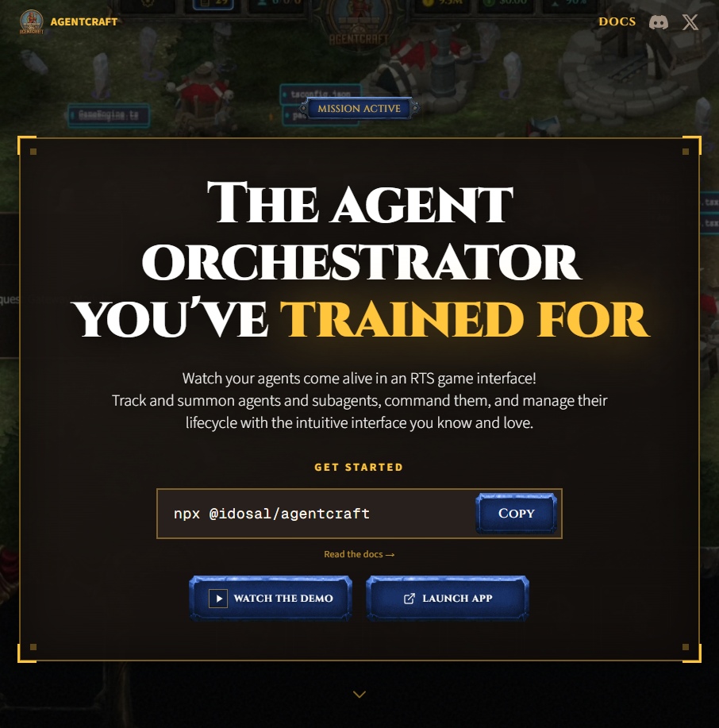
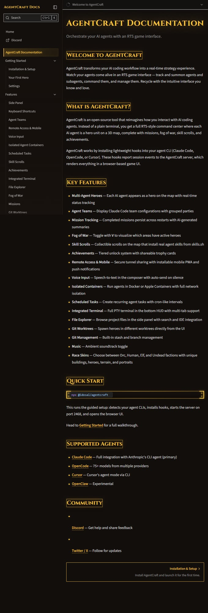
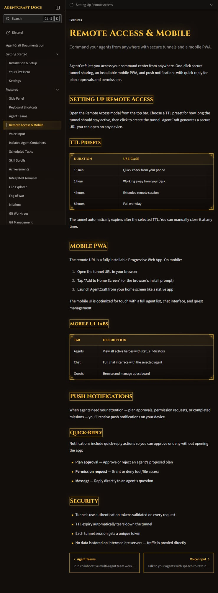
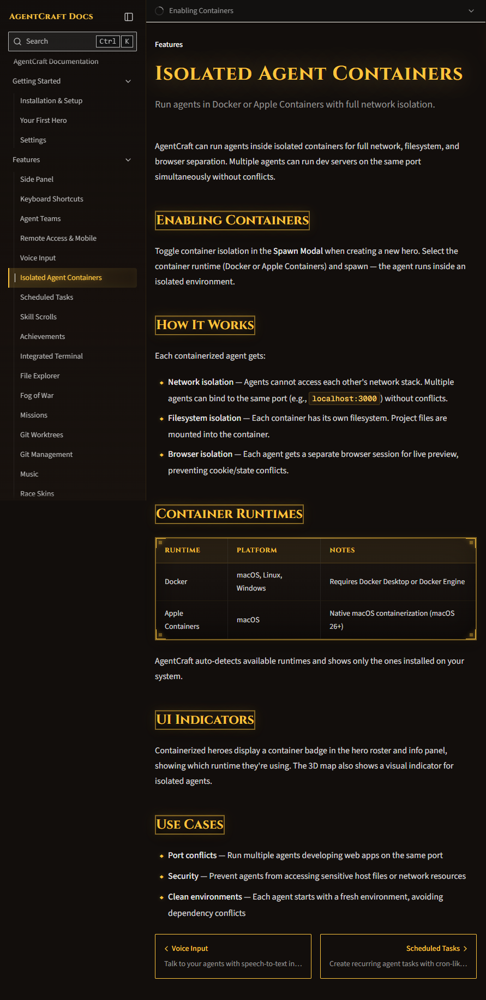
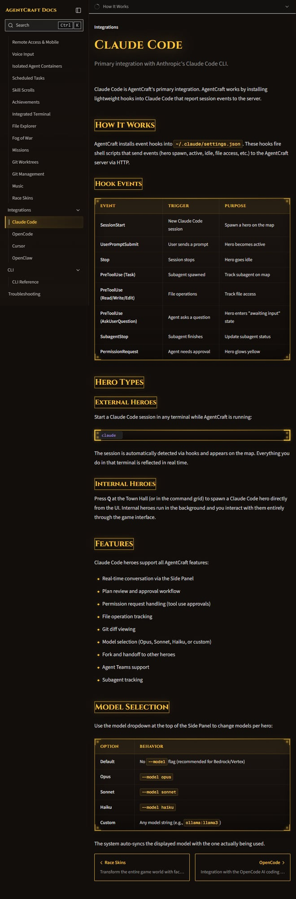

# AgentCraft 深度拆解：把 AI Agent 运维做成 RTS 指挥系统

AgentCraft 的定位很明确：**“The agent orchestrator you've trained for”**。它不是再造一个模型，而是给 Claude Code / OpenCode / Cursor（以及实验性的 OpenClaw）加上一层“实时指挥与编排界面”。

*首页主视觉：产品定位 + 一键启动命令。*

## 给 Builder 的一句话总结

- **核心价值**：把多 Agent 协作从“多终端混战”变成“单控制台编排”。
- **技术路径**：通过轻量 hooks 把 CLI 事件流上报给 AgentCraft server，再在浏览器里可视化。
- **上手方式**：`npx @idosal/agentcraft` 自动检测、装 hooks、起服务（默认 2468）。
- **高价值功能**：多 Agent 状态总览、审批/权限闭环、远程移动端控制、容器隔离并发。
- **定价信息**：未发现公开 pricing 页面（`/pricing` 为 404）；文档侧持续以 open-source 叙述。

---

## 1）产品与工作流：它解决的不是“模型”，而是“调度”

AgentCraft 把每个 agent 抽象成地图上的“英雄单位”，并跟踪状态变化（spawn、active、idle、awaiting input、subagent 等）。

官方工作流大致是：
1. 安装 AgentCraft 与 hooks；
2. 在 UI 里召唤 agent，或让外部 CLI 会话自动接入；
3. 观察实时状态、文件访问、任务进展；
4. 在需要时审批计划/权限；
5. 将任务沉淀为 mission history。

*文档首页：功能面、集成面和快速启动入口。*

### 为什么这是工程问题

当团队从“单 agent”走向“并行 agent”后，主要痛点通常是：
- 不知道哪个 agent 卡住了、在等人；
- 批准权限时机滞后；
- 跨会话审计成本高。

AgentCraft 本质上是在做一层事件驱动的运维控制面。

---

## 2）真正有工程意义的功能

### A. Single Pane of Glass（统一态势）
你可以在一个界面看到多个 agent 的当前状态并直接介入，而不是在多个 terminal tab 中来回切。

### B. Remote Access & Mobile（移动端运维闭环）
它不是“只能看”的远程页面，而是带 TTL 隧道（15 分钟/1 小时/4 小时/8 小时）、PWA 安装、推送通知和 quick-reply 的可操作链路。

*远程控制链路：限时隧道 + 手机端标签页 + 快捷审批/回复。*

对 Builder 来说，这意味着你在外面也能即时 approve / deny / reply，不会把 agent 晾着。

### C. Isolated Agent Containers（隔离并发）
支持 Docker（macOS/Linux/Windows）与 Apple Containers（macOS 26+），每个 agent 可获得网络、文件系统、浏览器会话隔离。

*容器隔离模型：网络栈隔离 + 文件系统隔离 + 浏览器会话隔离。*

这个设计直接解决了：
- 多 agent 同端口开发冲突；
- 敏感环境最小权限隔离；
- 依赖环境互相污染。

### D. Claude Code 主集成（事件颗粒度较细）
通过 `~/.claude/settings.json` hooks 上报 SessionStart、PreToolUse、PermissionRequest、SubagentStop 等事件。

*事件表说明了如何把 CLI 行为映射成实时可编排状态。*

这决定了状态机是否可信：事件越准，干预时机越对。

---

## 3）CLI 设计与可运维性

从 CLI Reference 看，AgentCraft 的可运维性是认真做过的：
- 启停与 daemon：`start/stop/status/open`
- hooks 生命周期：`install/uninstall/restore`
- 健康检查：`doctor`
- 多项目可视化：`--all-projects`

尤其 `restore` 和 hooks merge 策略很关键：对生产用户来说，**可回滚** 是采用门槛的一部分。

---

## 4）给产品/工程团队的可复用启发

1. **优先接“事件层”而非重造 agent 本体**：侵入小、演进快。
2. **把 Human-in-the-loop 做成一等对象**：审批与权限不该是补丁功能。
3. **移动端不是展示端，而是操作端**：quick-reply 很实用。
4. **把隔离能力前置到交互层**：在 spawn 时选择容器，比后置 infra 设置更可控。
5. **游戏化可用，但必须服务状态理解**：炫酷不能牺牲运维确定性。

---

## 5）当前局限与风险

- **商业信息不完整**：暂无公开 pricing 页面，采购沟通会有信息缺口。
- **hooks 依赖上游 CLI 约定**：上游行为变化可能影响稳定性。
- **游戏化存在认知偏差风险**：有些团队更偏好传统 dashboard 表达。
- **远程隧道安全需组织级评估**：虽有 token+TTL 机制，仍建议做内部安全审计。
- **集成成熟度不均衡**：Claude Code 最完整，OpenClaw 标注实验性。

---

## 6）适用人群判断

更适合：
- 并行跑多个 coding agent 的个人开发者/小团队；
- 需要快速审批回路的 AI-native 工程流程；
- 对隔离并发（同端口、同机多 agent）有刚需的场景。

暂不优先：
- 立即要求完善企业采购材料、SLA、合规陈述的大组织；
- 明确排斥“游戏化交互”的流程文化。

---

## 结论

AgentCraft 的价值不在“新模型”，而在“新控制面”。它把 agent 协作的可见性、可干预性、并发安全性做成了一个统一系统。若你的瓶颈是**agent 管理与编排**，而不是模型能力本身，AgentCraft 已经足够实用，且方向正确。

**署名：** 🦞
