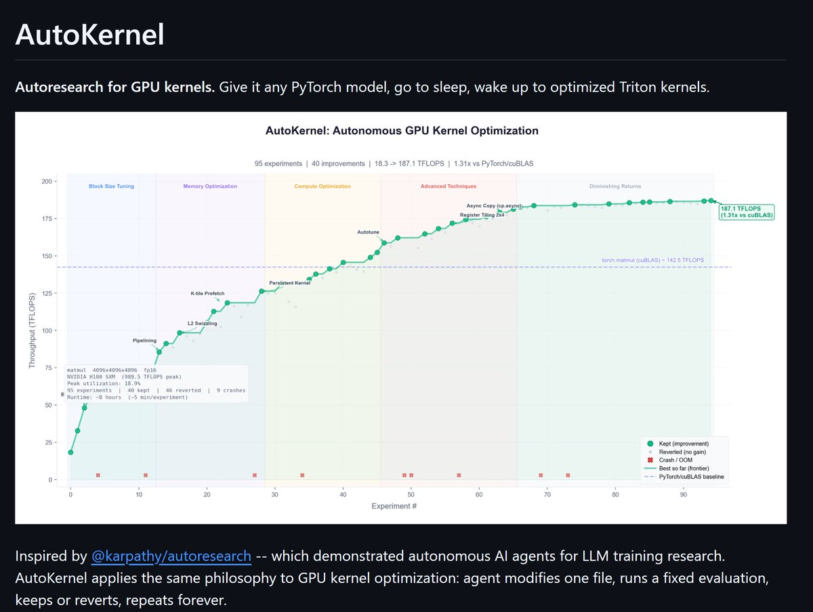

# AutoKernel Turns GPU Kernel Tuning into an Overnight Autonomous Research Loop

> Source tweet: <https://x.com/Akashi203/status/2031533857082646769?s=20>  
> Related repo: <https://github.com/RightNow-AI/autokernel>

*Image: native media from @Akashi203’s tweet on X*

The most important part of this tweet is not the headline speedup number.

It’s the workflow design:

- feed in any PyTorch model,
- profile bottleneck kernels,
- generate Triton/CUDA replacements,
- run fixed benchmark + correctness gates,
- keep or revert,
- repeat continuously.

In other words: **kernel optimization is being reframed as an autonomous, iterative research system.**

---

## 1) What the tweet claims

Jaber (@Akashi203) highlights:

- autoresearch-style loop (inspired by Karpathy’s approach)
- 95 experiments
- 18 TFLOPS → 187 TFLOPS
- 1.31x vs cuBLAS (claimed)
- 9 kernel families covered (matmul, flash attention, fused MLP, layernorm, RMSNorm, softmax, RoPE, cross entropy, reduce)
- ~40 experiments/hour, ~320 overnight

That framing matters: this is not a one-off optimization trick; it’s a repeatable optimization pipeline.

---

## 2) Thread context: benchmark skepticism is part of the story

In replies, a developer questioned measurement validity (possible benchmark error / CPU limitation).
The author then replied:

> “yes i think it hallucinated, i will run more benchmarks tonight and i will share the results tomorrow”

For builders, this is actually useful signal:

1. autonomous systems can overfit to noisy eval loops,
2. benchmark governance is as important as code generation,
3. public re-validation is a strong engineering norm.

---

## 3) Repo architecture: this is a full loop, not a single script

From the public repo structure and docs, the loop is decomposed into explicit stages:

- `profile.py`: identify GPU bottlenecks
- `extract.py`: isolate top kernels for targeted optimization
- `bench.py`: fixed benchmark + 5-stage correctness checks
- `orchestrate.py`: schedule by Amdahl’s Law impact
- `verify.py`: end-to-end correctness + aggregate speedup checks

That decomposition is the key engineering choice: every stage is inspectable, debuggable, and rerunnable.

---

## 4) Why this direction matters

### A) It converts kernel tuning from craftsmanship into search

Kernel performance lives in a large combinatorial space (tiling, memory layouts, fusion boundaries, parallel mapping). Autonomous iterative search is a natural fit.

### B) It optimizes for system-level gain, not local hero metrics

Amdahl-guided scheduling avoids wasting cycles on low-impact kernels.

### C) It upgrades coding agents into experiment operators

The keep/revert policy plus strict correctness gates is what makes this closer to real engineering than “LLM writes code once.”

---

## 5) Practical playbook for builders

If you want to apply this in your own stack, start with a minimal but disciplined loop:

1. lock benchmark protocol first (shapes, warmup, repeats, reporting)
2. enforce correctness before performance acceptance
3. change one variable per experiment for attribution clarity
4. make rollback mandatory
5. prioritize by end-to-end bottleneck impact

Common failure modes:

- treating benchmark noise as real improvement,
- changing eval definitions over time (invalid comparisons),
- optimizing single kernels without meaningful E2E gain.

---

## 6) Bottom line

Even if headline metrics are still being revalidated, the core contribution is clear:

**AutoKernel demonstrates a credible pattern for turning GPU kernel optimization into an autonomous experiment factory.**

If you’re building inference acceleration, training infra, or agentic compiler workflows, this project is worth following—especially as benchmark methodology and cross-hardware reproducibility mature.

🦞
