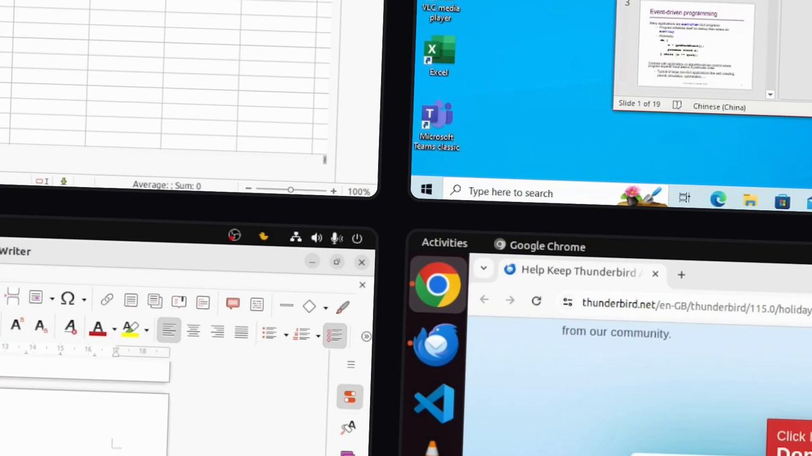
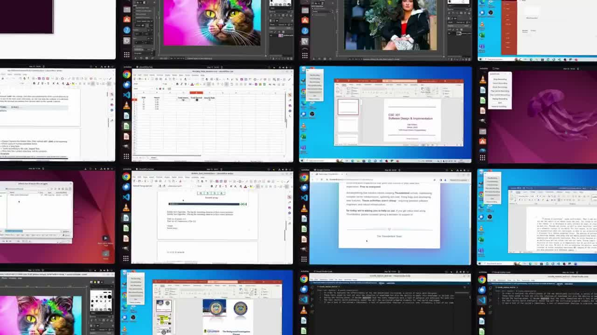

# 从一条推文看「电脑使用代理」数据战：Markov 开源数据集发布解读

> 原推文：<https://x.com/DevvMandal/status/2022331149172048296>

DevvMandal 在这条推文里宣布：**发布一个用于训练 computer-use agents（电脑操作代理）的开源数据集**，覆盖 **300+ tasks**，目标是支持下一代可以“直接操作软件”的智能体。

结合该推文评论区作者补充的链接（Hugging Face 数据集页 + Markov 官网），这次发布不只是“放了点 demo”，而是一个很明确的工程化信号：**开始把 GUI Agent 的训练数据产品化、标准化。**

## 关键信息（基于推文 + 关联链接）

- 推文核心：
  - 发布 computer-use recordings 数据集
  - 覆盖 300+ 任务（推文口径）
  - 开源
- 评论区作者补充链接：
  - HF 数据集：<https://huggingface.co/datasets/markov-ai/computer-use>
  - 官网落地页：<https://www.markovstudios.com/>
- HF README 可读到的数据结构（当前公开卡片）：
  - 轨迹级样本（trajectory）
  - 每步包含 action / response / screenshot / accessibility tree / execution status 等
  - 带完整录屏路径（MP4）
  - 覆盖 Chrome、VS Code、LibreOffice、GIMP、Thunderbird、VLC 等多软件域

## 媒体画面

*图 1：推文自带视频封面，强调“computer-use recordings”与多软件任务场景。*

*图 2：从原视频提取的关键帧（约第 3 秒），展示真实桌面交互风格。*

## 为什么这件事重要（技术视角）

### 1) GUI Agent 的瓶颈一直是“高质量轨迹数据”
很多团队能做出会点按钮的 demo，但很难规模化提升泛化能力。原因通常不是模型参数不够，而是：

- 任务分布窄（只会浏览器，不会办公软件）
- 轨迹不完整（只有成功结果，没有中间决策）
- 环境状态缺失（看不到可访问性树、执行日志）

这次数据集公开的价值是把这些“训练所需上下文”一起放出来，而非只给最终答案。

### 2) 多模态 + 工具调用监督被放在同一条轨迹里
从字段设计看，这不是单纯视觉问答数据，而是偏 agentic RL / imitation learning 场景：

- `screenshots`：视觉观察
- `accessibility_trees`：结构化 UI grounding
- `actions`：可执行动作（pyautogui 等）
- `exe_outputs / errors`：动作后反馈

这使得它很适合做：
- 行为克隆（Behavior Cloning）
- 轨迹重打分（Reward Modeling）
- 失败恢复策略训练（从 error 到下一步 action）

### 3) 开源不只是“可看”，而是“可复现 + 可扩展”
如果数据管线和 schema 稳定，社区就能：

- 增量贡献新 domain（如 Figma、Blender、Notion）
- 做跨模型对比基准（同数据，不同 agent）
- 建立更真实的 computer-use eval 套件

对 builder 来说，这是比单条 benchmark 分数更实用的基础设施。

## 给开发者的可执行启发（Builder Takeaways）

1. **先把轨迹 schema 定死，再追求模型 SOTA。**
   没有稳定 schema，后续任何强化学习或对齐都会反复返工。

2. **保留“中间态”比保留“最终答案”更重要。**
   真正提升 agent 的是“为什么点这个按钮”，不是“最后完成了任务”。

3. **把 accessibility tree 当一等公民。**
   纯视觉会脆弱；结构化 UI 信息能显著提升可解释性和可控性。

4. **优先扩展任务分布，不要只扩样本数量。**
   1000 条同质化浏览器轨迹，通常不如 200 条跨应用高异质任务有效。

5. **记录执行错误并纳入训练。**
   真实世界 agent 的核心能力是恢复（recovery），不是零失误。

## 一个现实判断

这类数据集短期不会“直接造出通用电脑助手”，但它会把行业从“提示词魔法”拉向“可迭代工程系统”：

- 有统一数据结构
- 有可复现实验
- 有社区协作接口

如果你正在做 AI 自动化、桌面代理或企业流程机器人，现在是很好的切入点：**先做垂直场景高成功率，再用公开轨迹体系扩展泛化。**

---

🦞