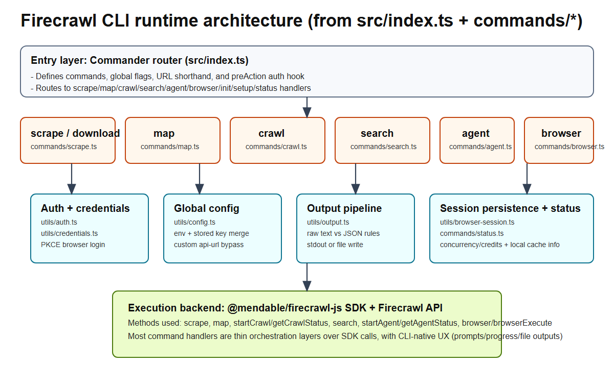
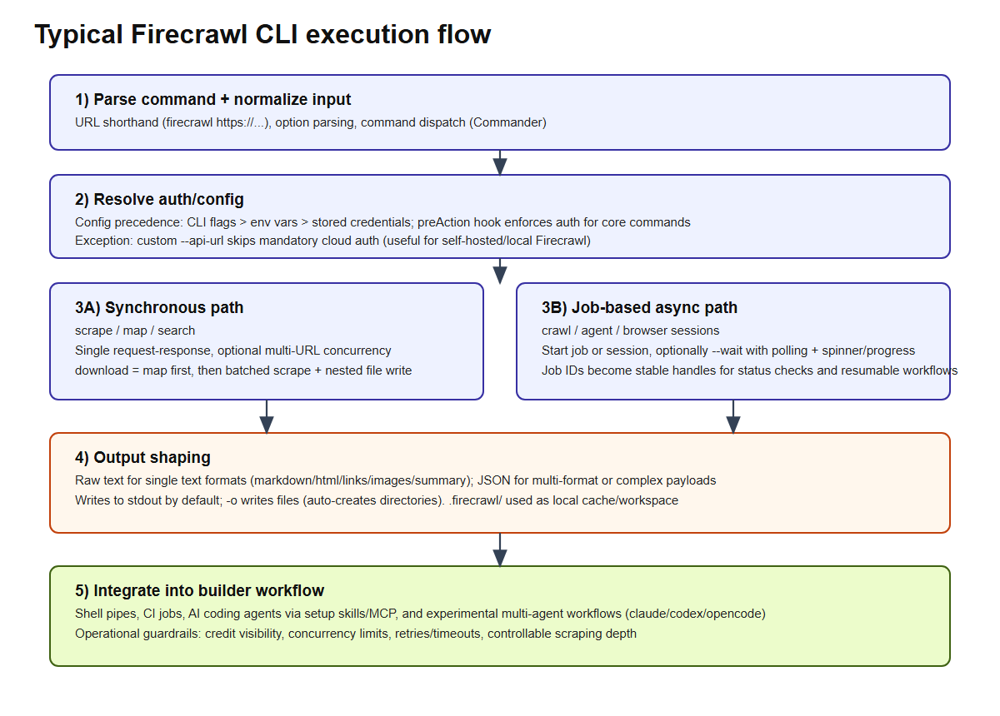

# Firecrawl CLI Deep Dive: Architecture, Workflow, and Where It Fits

Repository: <https://github.com/firecrawl/cli>

> Audience: builders who want production-friendly web extraction/search workflows from terminal and coding agents.

## What Firecrawl CLI is

**Firecrawl CLI** is a TypeScript command-line wrapper around Firecrawl's API/SDK (`@mendable/firecrawl-js`) for turning websites into LLM-ready data.

At a practical level, it gives you one interface for:

- `scrape`: extract one or more pages (markdown/html/links/images/screenshot/etc.)
- `map`: discover URLs of a site quickly
- `crawl`: run site-wide asynchronous crawls with job IDs
- `search`: web/news/images search, optionally with scraping in the same step
- `download`: map + scrape into nested local files (`.firecrawl/`)
- `agent`: long-running AI extraction with structured schema support
- `browser`: cloud browser session launch + remote execution (agent-browser / Playwright code)
- onboarding/integration commands (`init`, `setup skills`, `setup mcp`, `env`, `status`)

The design target is clear: **make Firecrawl capabilities scriptable in shell, CI, and AI coding-agent workflows**.

---

## Visuals

The repo currently doesn't ship official architecture diagrams/screenshots in-tree, so the following visuals are derived from source (`src/index.ts`, `src/commands/*`, `src/utils/*`).

*Figure 1. Runtime architecture from command router to SDK/API execution layer.*

*Figure 2. Typical request lifecycle from parse/auth to output/integration.*

---

## Core architecture (from code)

### 1) Command router as the control plane

`src/index.ts` uses Commander as a central router:

- Declares all major commands and flags.
- Implements a `preAction` hook to enforce authentication for core commands.
- Supports URL shorthand: `firecrawl https://example.com` is automatically rewritten to `scrape`.
- Global options `--api-key`, `--api-url`, `--status` are plumbed across commands.

This is important because CLI UX consistency (input parsing, global flags, auth behavior) is centralized instead of duplicated in each command.

### 2) Thin command handlers over SDK calls

Each command module (`scrape.ts`, `map.ts`, `crawl.ts`, `search.ts`, `agent.ts`, `browser.ts`) is mostly orchestration:

- parse options
- normalize into API params
- call SDK method
- shape output for human/scripting contexts

Examples:

- `scrape` -> `app.scrape(...)`
- `map` -> `app.map(...)`
- `crawl` -> `app.startCrawl` / `app.getCrawlStatus` / `app.crawl(wait)`
- `search` -> `app.search(...)`
- `agent` -> `app.startAgent` / `app.getAgentStatus`
- `browser` -> `app.browser`, `app.browserExecute`, `app.listBrowsers`, `app.deleteBrowser`

### 3) Shared utility layer

- **Auth (`utils/auth.ts`)**: browser PKCE flow + manual key + env key fallback.
- **Config (`utils/config.ts`)**: precedence model (CLI flags > env > stored credentials).
- **Credential store (`utils/credentials.ts`)**: OS-specific paths (`AppData`, `~/.config`, etc.).
- **Output (`utils/output.ts`)**: deterministic rules for raw text vs JSON and file output.
- **Browser session persistence (`utils/browser-session.ts`)**: saves session ID/CDP URL for follow-up commands.

### 4) Integration-first extras

- `init` does install + auth + skills/MCP + template scaffold.
- `setup skills` builds `npx skills add firecrawl/cli --full-depth --global --all` style install command.
- `status` shows auth state + queue concurrency + credit usage + local cache hygiene.

This is not "just another scraper binary"; it is also an **ops/onboarding surface** for teams.

---

## Workflow model in practice

### Fast path: scrape/search/map

For small-to-medium retrieval jobs:

1. `search` when you don't yet know URLs.
2. `map` when you know site but need path discovery.
3. `scrape` on final URLs for extraction.

### Async path: crawl/agent/browser

For expensive or interactive jobs:

- submit job/session -> get ID
- optionally `--wait` with polling and progress
- resume/check status later with same ID

This pattern is robust for CI and agentic workflows where long jobs are normal.

### Local artifact strategy

`download` and multi-URL handling write to `.firecrawl/` with nested path mapping. That's useful for:

- reproducible datasets
- offline post-processing
- retrieval indexing pipelines

---

## Target users

Best fit:

- AI app builders who need web-to-LLM extraction quickly.
- Developer teams that want command composability in shell/CI.
- People using Claude Code/Codex/OpenCode/Cursor-style setups and needing "one command" integration.

Less ideal for:

- fully custom crawling logic requiring low-level crawl frontier control
- organizations that need very deep per-request anti-bot/network tuning inside CLI itself

---

## Practical use cases

1. **Docs ingestion for RAG**
   - `map` docs domain -> `download --only-main-content` -> index markdown.

2. **Market monitoring / competitor snapshots**
   - `search --sources news --tbs qdr:w --scrape` with periodic runs.

3. **Structured extraction pipelines**
   - `agent --schema-file schema.json --wait` to produce typed outputs.

4. **QA and browser-required scraping**
   - `browser launch-session` + `browser execute` for click/interaction workflows that normal scraping can't reach.

5. **CI content checks**
   - crawl specific paths and validate deltas or broken assumptions in content structure.

---

## Strengths

1. **Excellent ergonomics for builders**
   - URL shorthand, sane defaults, status visibility, standardized outputs.

2. **Good separation of concerns**
   - routing/auth/config/output separated from command-specific logic.

3. **Supports both simple and heavy workloads**
   - instant scrape plus async job model for crawl/agent.

4. **Strong integration story**
   - skills + MCP setup indicates the product is built for coding-agent ecosystems.

5. **Self-host flexibility**
   - custom `--api-url` path can bypass default cloud-auth assumptions.

---

## Limitations and trade-offs

1. **Service dependency**
   - core value relies on Firecrawl backend/API availability and credit model.

2. **Not a full crawler framework replacement**
   - if you need very custom scheduler/frontier/plugin internals, tools like Crawlee/Scrapy provide deeper framework-level extensibility.

3. **Browser command abstraction boundary**
   - convenient for many workflows, but some advanced browser automation users may still prefer direct Playwright projects for full control/debug tooling.

4. **Feature velocity vs stability balance**
   - experimental workflow surface is promising, but "coming soon" backends indicate some areas are still maturing.

---

## Comparison with adjacent tooling

## 1) Firecrawl CLI vs direct Playwright/Puppeteer

- **Firecrawl CLI wins** when you want extraction/search/crawl primitives without building infra glue.
- **Playwright/Puppeteer wins** when you need bespoke automation logic and app-specific instrumentation.

## 2) Firecrawl CLI vs Crawlee / Scrapy

- **Firecrawl CLI** is faster to adopt for data extraction workflows; less boilerplate.
- **Crawlee/Scrapy** offer deeper framework-level customization and full crawler internals control.

## 3) Firecrawl CLI vs Apify Actors ecosystem

- Both are automation/data platforms. Firecrawl CLI feels more focused on LLM-ready extraction ergonomics and coding-agent integration UX.
- Apify often shines where you need marketplace actors and platform orchestration variety.

## 4) Firecrawl CLI vs "search + ad-hoc scraping scripts"

- CLI gives consistent output semantics, auth/config handling, status, credits, and structured job lifecycle; much less glue code.

---

## Actionable recommendations for builders

1. **Adopt an escalation pattern**
   - `search -> map -> scrape -> crawl/agent -> browser`.

2. **Standardize outputs early**
   - For pipelines, prefer `--json` + explicit `-o` paths; keep artifacts in versioned data dirs.

3. **Use `status` operationally**
   - Check concurrency/credits before high-volume jobs.

4. **Treat `download` as your baseline dataset bootstrap**
   - Especially for documentation-heavy domains.

5. **Gate expensive runs**
   - For `agent`, set `--max-credits`; for long waits, use timeout and poll intervals intentionally.

---

## Bottom line

Firecrawl CLI is a **pragmatic orchestration layer** that makes web extraction/search/crawling feel like a cohesive developer primitive, not a pile of scripts. Its strongest differentiator is not one endpoint, but the **workflow continuity** from quick single-page scrape to async jobs and browser sessions, plus coding-agent ecosystem integration.

If your team wants to ship web-to-LLM data pipelines quickly, it is a high-leverage tool. If you need deep crawler internals customization, pair it with (or choose) lower-level frameworks.

🦞

