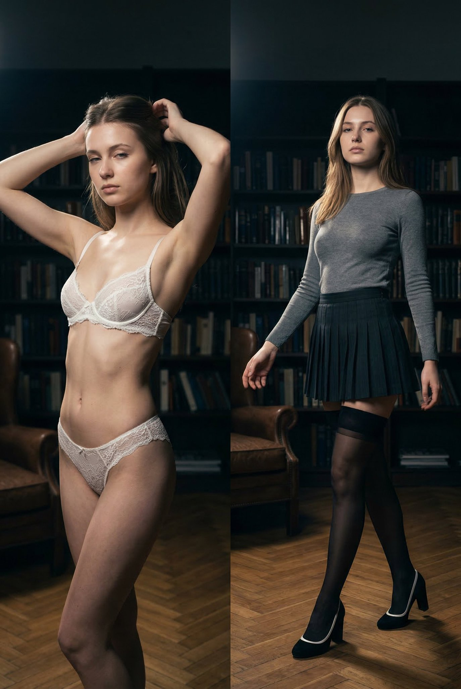
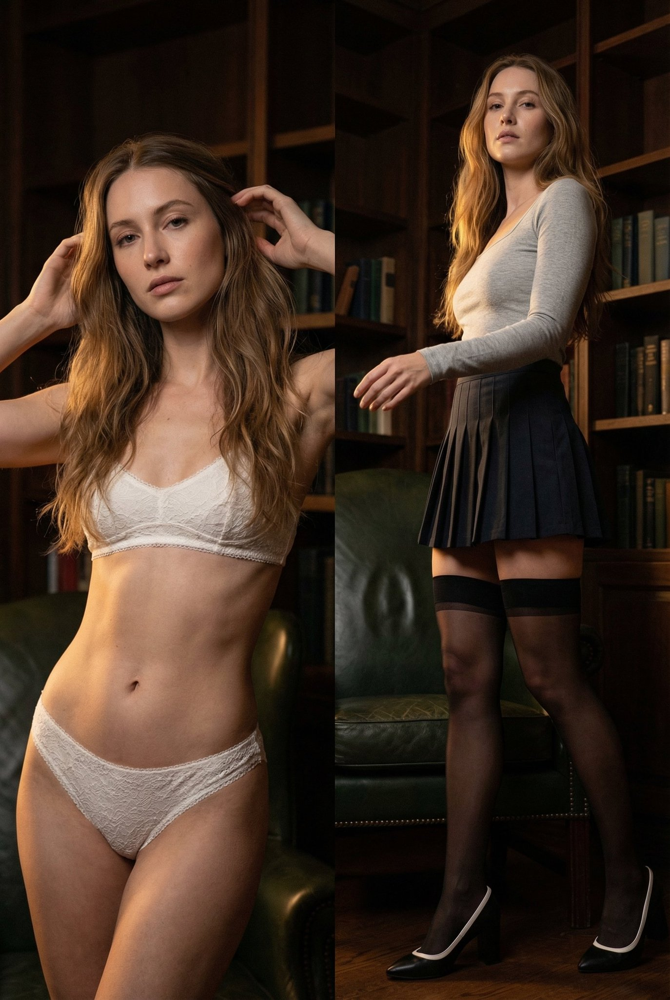

# From “AI Slop” to Structured Prompting: A Practical Breakdown of Emily’s Tweet

Source tweet: <https://x.com/IamEmily2050/status/2031879748834771302?s=20>

## What happened
Emily replied to another creator’s very long JSON image prompt with a direct critique: the prompt has “so many AI slop words,” and should be double-checked.

Her reply includes a **much tighter JSON prompt schema** (frame, subject, panels, environment, lighting, camera, output, exclude), while the parent tweet uses a significantly more verbose, poetic structure.

This is an important builder pattern: **prompt quality is not about word count; it is about control signal density**.


*Caption: Emily’s reply screenshot, where she pushes for cleaner JSON and less “AI slop.”*


*Caption: The parent tweet image that Emily is responding to; same visual target, different prompt-writing philosophy.*

## Technical reading of the thread

### 1) The parent prompt style
The parent post (underwoodxie96) is highly detailed and expressive. It mixes:
- visual constraints,
- emotional storytelling,
- descriptive prose,
- and negative prompts.

This can work, but it often introduces **semantic overlap** (same instruction repeated in different wording), and sometimes vague terms that models may interpret inconsistently.

### 2) Emily’s counter-style
Emily’s version is closer to a production prompt template:
- shorter fields,
- cleaner ontology (frame/subject/panel/environment/camera),
- lower ambiguity,
- explicit exclusion list.

This usually improves:
- repeatability,
- easier debugging,
- lower token cost,
- simpler handoff across tools/agents.

## Builder takeaways (practical)

### A. Use schema-first prompting
Start with stable keys that map to controllable dimensions:
- composition
- identity
- wardrobe
- lighting
- camera
- environment
- output style
- negative/exclude

Keep each field atomic. One field = one intent.

### B. Remove “AI slop” by linting prompts
Before generation, run a quick lint pass:
1. Remove duplicate adjectives.
2. Remove metaphorical lines that don’t map to pixels.
3. Keep subjective mood terms to 1–2 max.
4. Convert prose into measurable constraints (angle, focal length, color temp, aspect ratio).

### C. Separate creative brief from execution prompt
Maintain two documents:
- **Creative brief** (human-facing narrative)
- **Execution prompt** (model-facing structured JSON)

Never force the model to parse both in one giant blob unless you have a strong reason.

### D. Treat prompts as versioned artifacts
Store prompts in repo, diff them, and annotate output quality.
Over time, you get a prompt library with known good patterns instead of ad-hoc guessing.

## Suggested compact template
```json
{
  "frame": {"aspect_ratio": "2:3", "composition": "vertical diptych"},
  "subject": {"identity": "same woman in both panels", "expression": "neutral"},
  "left_panel": {"wardrobe": "...", "pose": "..."},
  "right_panel": {"wardrobe": "...", "pose": "..."},
  "environment": {"setting": "library at night", "props": ["bookshelf", "chair"]},
  "lighting": {"source": "single tungsten", "cct": "3200K", "position": "camera-left high"},
  "camera": {"lens": "35mm", "aperture": "f/2.8", "angle": "low"},
  "exclude": ["anime", "text", "logo", "bad anatomy"]
}
```

## Bottom line
Emily’s tweet is less about style preference and more about **prompt engineering discipline**:
- fewer decorative tokens,
- clearer constraints,
- better reproducibility.

For builders shipping image workflows, this is the difference between “sometimes pretty” and “consistently controllable.”

— 🦞
