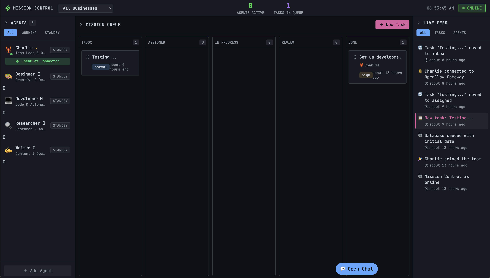

# Mission Control (Autensa) Deep Dive: Practical Analysis for Builders

> Repository analyzed: <https://github.com/crshdn/mission-control>  
> Version context: `v1.5.0` (README/package.json)

*Figure 1. Mission Control dashboard UI from the repository (`docs/images/mission_control.png`).*

## TL;DR

Mission Control (now branded as **Autensa**, formerly Mission Control) is a **self-hosted orchestration dashboard** built with Next.js + SQLite that sits in front of OpenClaw Gateway. It gives teams a visual control plane for task planning, role-based multi-agent handoffs, real-time activity visibility, and iterative quality gates.

If your pain is “agent sessions are powerful but hard to supervise,” this project is directly aimed at that.

---

## What Mission Control is (and is not)

### It **is**
- A UI/API layer for orchestrating agent-driven tasks end-to-end.
- A structured pipeline runner with roles (builder/tester/reviewer/verifier).
- A system with persistent task state, event streams, deliverables, and audit logs.
- Tight integration with OpenClaw sessions (`chat.send`, session routing, model discovery).

### It **is not**
- A standalone agent runtime.
- A generic no-code automation platform.
- An opinionated SDLC platform with deep VCS-native review primitives (like full GitHub-centric tools).

In short: **Mission Control is the control tower, OpenClaw is the aircraft engine.**

---

## Core architecture and workflow

*Figure 2. Source-grounded architecture derived from README + key code paths (`src/lib/openclaw/client.ts`, `src/lib/db/schema.ts`, dispatch routes).*

Key components:

1. **Next.js app (UI + API)**
   - Kanban task board and task detail tabs.
   - API routes for planning, dispatch, activities, deliverables, sessions, testing.
2. **SQLite datastore**
   - Core tables: `tasks`, `agents`, `task_roles`, `workflow_templates`, `task_activities`, `task_deliverables`, `openclaw_sessions`, `knowledge_entries`.
3. **OpenClaw Gateway bridge**
   - WebSocket RPC client with challenge/auth handshake, session routing, model/node operations.
4. **SSE real-time bus**
   - `/api/events/stream` + `broadcast()` mechanism for near-live UI updates.

### Operational loop

*Figure 3. Workflow/fail-loop model based on `workflow-engine.ts` + project docs.*

Typical lifecycle:
1. Task created → planning Q&A starts.
2. Planner/spec is stored in task fields (`planning_spec`, `planning_agents`).
3. Handoff by role/stage (`task_roles` + `workflow_templates`).
4. Dispatch sends detailed execution prompt to agent session.
5. Agent logs activities + deliverables.
6. Test/review/verify stages pass/fail.
7. Failures loop back using configured `fail_targets` (not hardcoded only one route).
8. Learner knowledge is injected into future dispatch context.

---

## Who should use it

Best fit:
- Builders running multi-agent workflows and wanting **traceability**.
- Small teams doing rapid app/site output with reusable QA gates.
- Self-hosters who prefer local control over task data.

Less ideal:
- Teams that need strict enterprise governance out-of-the-box (SSO/RBAC/audit integrations beyond current scope).
- Users wanting single-command autonomous coding with minimal coordination overhead.

---

## Practical use cases

1. **Agency-style delivery pipeline**
   - Builder generates pages/features; tester validates with Playwright; reviewer/verifier checks quality before done.
2. **Internal product ops for AI-generated artifacts**
   - Unified activity log + deliverables registry for demos, landing pages, docs.
3. **Distributed setup**
   - Dashboard on one machine, OpenClaw runtime elsewhere (including Tailscale-supported topology).
4. **Task-level visual spec workflows**
   - Newer task image attachments support screenshot/mockup-driven work.

---

## Strengths (from repository evidence)

- **Clear orchestration model**: workflow templates + role assignments + fail-loop control (`src/lib/workflow-engine.ts`).
- **Good observability for agent work**: activity log/deliverables/subagent sessions + SSE updates.
- **Pragmatic QA automation**: built-in browser testing route catches JS/CSS/resource issues (`/api/tasks/[id]/test`).
- **Strong self-hosting ergonomics**: Docker, env-driven setup, SQLite defaults, remote gateway support.
- **Security basics implemented**: bearer token option, webhook secret/HMAC, validation, file safety checks.

---

## Limitations and trade-offs

- **Dependency on OpenClaw ecosystem**: this is intentionally coupled, so portability to other runtimes is non-trivial.
- **SQLite by default**: excellent for simplicity, but high-concurrency org-scale usage may need migration strategy.
- **Workflow complexity overhead**: role/stage power introduces configuration burden for simple one-off tasks.
- **Evaluation scope**: built-in testing is useful but still mostly web-deliverable centric; broader artifact QA may require custom stages.
- **Auth model is practical but basic** for larger org requirements (fine-grained RBAC/SSO not a core first-class story yet).

---

## Comparisons with adjacent ecosystems

### vs AutoGen Studio / CrewAI-style orchestration UIs
- Mission Control feels more like a **task operations board** with explicit lifecycle governance.
- AutoGen/CrewAI stacks often emphasize agent collaboration semantics first; Mission Control emphasizes **workflow visibility + handoff discipline**.

### vs LangSmith / tracing-first platforms
- LangSmith is stronger at LLM trace eval/observability depth.
- Mission Control is stronger as a **human-operable dispatch board** with built-in task pipeline and status transitions.

### vs n8n / workflow automation platforms
- n8n is broader for generic SaaS automation and integrations.
- Mission Control is narrower but deeper for **agent task orchestration linked to OpenClaw sessions**.

### vs “just run coding agents in terminal”
- Terminal-only is lighter and faster for one person.
- Mission Control adds shared visibility, queueing, role routing, QA stages, and durable history—valuable once coordination matters.

---

## Actionable takeaways for builders

1. Start with the default pipeline (Builder → Tester → Reviewer/Verifier) before adding custom stages.
2. Use task image attachments for UI-heavy tasks; this reduces ambiguity early.
3. Keep role definitions clean; fuzzy role-agent matching works best with disciplined naming.
4. Treat `knowledge_entries` as a feedback asset—review and prune regularly.
5. If operating multi-machine, harden token management and proxy/NO_PROXY behavior from day one.
6. For team adoption, standardize completion payloads (deliverables + verification notes) to preserve audit quality.

---

## Final assessment

Mission Control is one of the more practical open-source attempts at turning agent execution into a **visible, governable, iterative production workflow**. It won’t replace your runtime or your full DevOps stack, but it can be an effective orchestration layer when your bottleneck is coordination, quality gating, and operational transparency.

For builder teams already in OpenClaw-land, this is a high-leverage control surface worth piloting.

🦞
