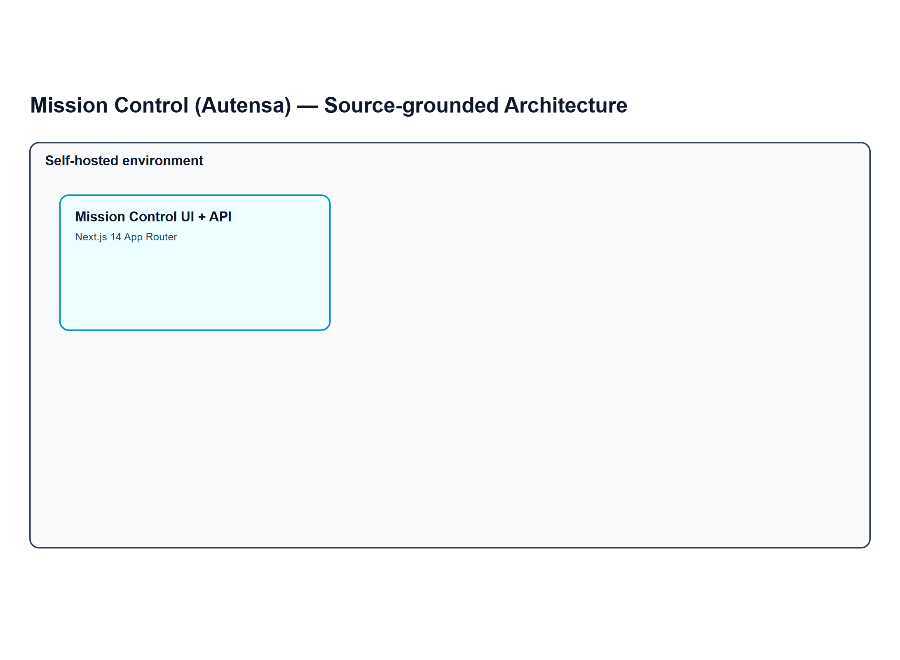
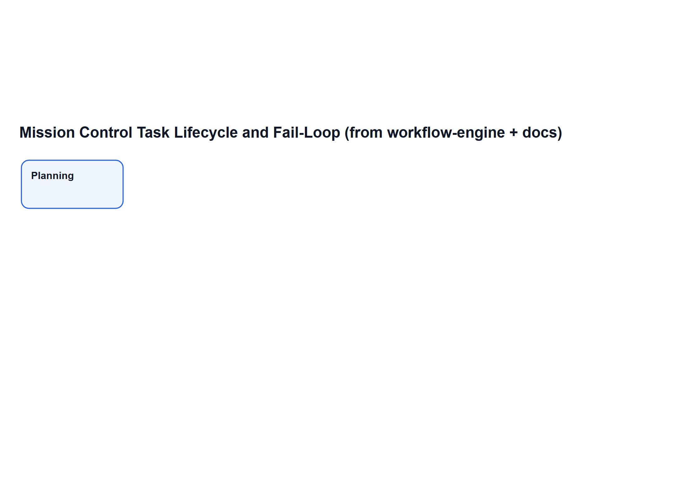

# Mission Control（Autensa）技术解析：面向 Builder 的实战评估

> 分析仓库：<https://github.com/crshdn/mission-control>  
> 版本上下文：`v1.5.0`（README / package.json）

*图 1：仓库内置界面截图（`docs/images/mission_control.png`）。*

## 一句话结论

Mission Control（现品牌名 **Autensa**，原名 Mission Control）是一个 **自托管的 AI Agent 编排控制台**：用 Next.js + SQLite 提供可视化任务流、角色分工、实时活动追踪、交付物登记和失败回环机制；执行层则通过 OpenClaw Gateway 完成。

如果你的核心问题是“Agent 会干活，但很难管、很难审、很难协作”，这个项目是正中靶心的。

---

## Mission Control 是什么，不是什么

### 它是
- 面向 Agent 任务编排的 UI + API 控制层。
- 带阶段/角色工作流的任务流水线（Builder/Tester/Reviewer/Verifier）。
- 有状态、可审计、可追踪的任务系统（活动日志、交付物、会话）。
- 与 OpenClaw 深度集成的调度前台。

### 它不是
- 独立的 Agent Runtime。
- 通用自动化平台（像 n8n 那种全品类连接器中心）。
- 以 Git PR 审查为中心的完整工程平台。

可以理解为：**Mission Control 是“塔台”，OpenClaw 是“飞机发动机”。**

---

## 核心架构与工作机制

*图 2：基于 README 与关键源码（`src/lib/openclaw/client.ts`、`src/lib/db/schema.ts`、dispatch 路由）整理的架构图。*

核心模块：

1. **Next.js 前后端一体层**
   - 看板、任务详情、规划问答、派发与状态管理。
2. **SQLite 状态存储**
   - `tasks`、`agents`、`task_roles`、`workflow_templates`、`task_activities`、`task_deliverables`、`openclaw_sessions`、`knowledge_entries`。
3. **OpenClaw Gateway 连接层**
   - WebSocket RPC + challenge/auth 握手；负责会话路由与消息投递。
4. **SSE 实时事件流**
   - `/api/events/stream` + `broadcast()`，前端无需刷新即可同步状态。

### 工作流主线

*图 3：基于 `workflow-engine.ts` 与文档抽取的任务生命周期 / 失败回环逻辑。*

典型流程：
1. 创建任务，进入规划问答。
2. 规划结果写入 `planning_spec` 与 `planning_agents`。
3. 依据 `workflow_templates + task_roles` 进行阶段交接。
4. dispatch 将任务上下文、输出目录、API回填要求发给 Agent。
5. Agent 回写活动与交付物。
6. 测试/评审/验证阶段判定 pass/fail。
7. 失败通过 `fail_targets` 回环到指定阶段修复。
8. Learner 抽取经验写入知识库，后续任务自动注入上下文。

---

## 目标用户画像

更适合：
- 需要多 Agent 协作且关注可追踪性的开发者/小团队。
- 需要“任务可视化 + 质量门禁 + 回环修复”的交付场景。
- 偏好自托管、希望数据主要留在自己环境内的团队。

不太适合：
- 一开始就需要企业级 SSO/RBAC/合规审计全家桶的组织。
- 只想“单机终端里跑一下 Agent”且不需要流程治理的个人用户。

---

## 典型实战场景

1. **小型交付流水线**
   - Builder 产出页面/功能，Tester 自动验收，Reviewer/Verifier 做质量把关。
2. **AI 产物运营中台**
   - 将任务活动与产物统一登记，形成可回溯履历。
3. **跨机器部署**
   - 控制台和 Runtime 可分离部署，支持远程网段/Tailscale。
4. **视觉驱动任务**
   - 新版本支持任务图片附件，适合 UI mockup、截图驱动需求。

---

## 亮点（有源码依据）

- **编排逻辑清晰**：模板化工作流 + 角色映射 + 失败回环（`workflow-engine.ts`）。
- **可观测性到位**：活动日志、交付物、子会话都可实时显示。
- **内置自动化质量关卡**：`/api/tasks/[id]/test` 用 Playwright + CSS/资源检查做基础验收。
- **自托管友好**：Docker、环境变量配置、SQLite 开箱即用。
- **安全基础设施具备**：Bearer Token、Webhook Secret、输入校验、路径安全处理。

---

## 局限与取舍

- **生态绑定 OpenClaw**：优势是集成深，代价是跨 runtime 迁移成本高。
- **SQLite 默认方案**：轻量好用，但高并发团队场景可能需考虑升级策略。
- **流程治理有学习成本**：阶段/角色配置能力强，但对简单任务会显“重”。
- **测试能力偏 Web 产物**：对非网页类交付的评测仍需扩展。
- **组织级权限能力还偏基础**：大规模团队治理能力仍有扩展空间。

---

## 与邻近工具生态的实用对比

### 对比 AutoGen Studio / CrewAI 类工具
- Mission Control 更像“任务运营面板”，强调状态流与交接治理。
- AutoGen/CrewAI 体系通常更强调 Agent 协作语义本身。

### 对比 LangSmith（观测优先）
- LangSmith 在 LLM trace/eval 深度上更强。
- Mission Control 在“可视化调度 + 流水线推进 + 交付追踪”上更实操。

### 对比 n8n（通用自动化）
- n8n 连接器更广、自动化版图更大。
- Mission Control 更聚焦于“Agent 任务编排”，领域更窄但更深。

### 对比“直接终端跑 Agent”
- 终端方式轻量、单兵效率高。
- Mission Control 适合多人协作和需要过程透明的交付体系。

---

## 给 Builder 的可执行建议

1. 先用默认流水线跑通（Builder → Tester → Reviewer/Verifier），再逐步自定义。
2. UI 类任务尽量上传参考图，能显著减少返工。
3. 角色命名规范化，提升 role-agent 自动匹配效果。
4. 定期整理 `knowledge_entries`，让“失败经验”变成后续任务收益。
5. 多机部署时提前处理 token 与代理/NO_PROXY 细节，减少回调故障。
6. 制定交付回填规范（deliverables + verification note），确保审计质量稳定。

---

## 总评

Mission Control 的价值不在“替代 Agent Runtime”，而在于把 Agent 产能变成 **可管理、可追踪、可迭代优化** 的生产流程。对于已经在 OpenClaw 生态里的团队，它是一个非常值得试点的 orchestration control surface。

🦞

