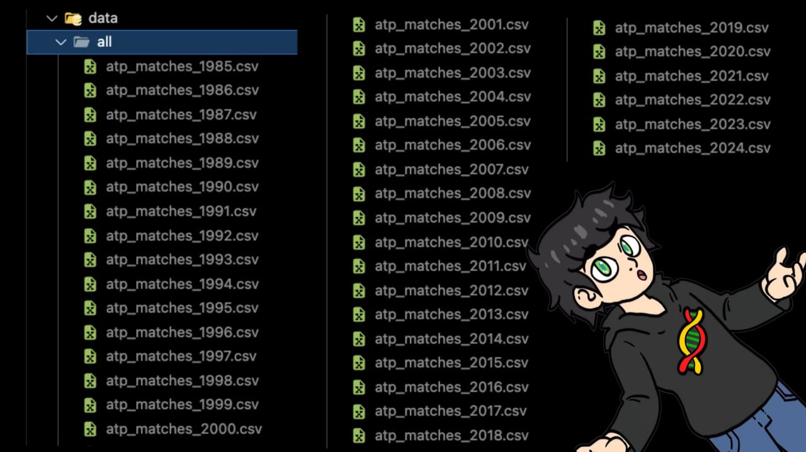
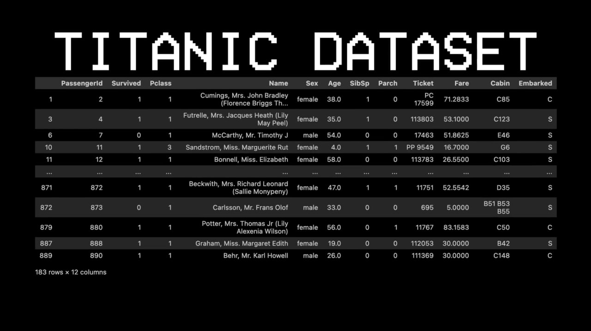
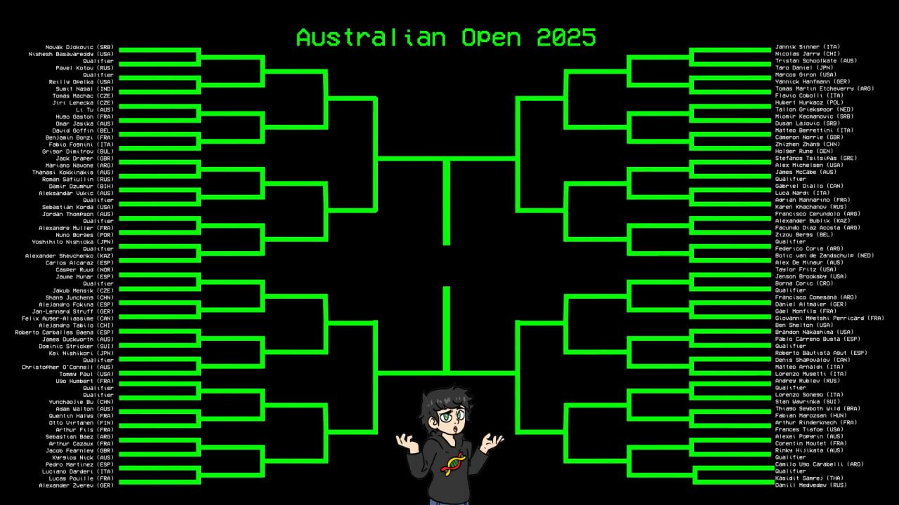

# From 74% to 85%: What This Solo Tennis-AI Project Gets Right

Source tweet: https://x.com/phosphenq/status/2031400355167117498  
Author referenced: [@theGreenCoding](https://x.com/theGreenCoding)

Phosphen’s post highlights a rare kind of ML project: **high signal, full pipeline, and reproducible engineering**.

A solo builder took 43 years of ATP match history (95,491 matches), engineered tennis-specific features, and benchmarked multiple models. The result: **85% accuracy with XGBoost**, including **99 correct predictions out of 116 matches** in the 2025 Australian Open test set.

That’s not magic. It’s good feature design + disciplined evaluation.

---

## What was actually built

At a technical level, the pipeline looks like this:

1. **Data foundation**
   - ATP matches from ~1985–2024
   - Raw + derived features → final table around **95k rows, 81 columns**

2. **Feature engineering that matters**
   - Head-to-head history
   - Rolling form windows (last 10/25/50/100 matches)
   - Service and break-point differentials
   - Global ELO + surface ELO (clay/grass/hard)

3. **Model iteration path**
   - Decision Tree: ~74%
   - Random Forest: ~76–77% ceiling
   - Neural Net: ~83%
   - **XGBoost: ~85%**

4. **Out-of-sample test**
   - Train cutoff before AO 2025
   - Predict full AO bracket with unseen tournament data

This is the key point: performance was validated on **future, real tournament outcomes**, not just random split metrics.

---

## Why this worked

### 1) Domain priors were encoded, not ignored
The strongest predictors were ELO-related variables, especially **ELO difference** and **surface-specific ELO difference**. That aligns with tennis reality.

### 2) The builder did algorithmic due diligence
He didn’t stop at one model. He tested tree ensembles, boosting, and even a neural baseline.

### 3) Surface context was treated as first-class
A “single skill rating” is often too coarse in tennis. Splitting by surface captured meaningful player asymmetries.

### 4) Evaluation was practical
The AO test mimics deployment: “Can this model predict what happens next?”

---

## Builder takeaways (practical)

If you’re building applied ML products, copy this playbook:

- **Don’t chase architecture hype first.** Start with feature quality.
- **Engineer one or two truly informative features** before tuning 100 knobs.
- **Use time-aware validation** for forecasting tasks (avoid leakage).
- **Benchmark simple baselines** so gains are real, not cosmetic.
- **Plot your features** (pairplots/importance curves) before overfitting your intuition.

A good mental model: this project won because it optimized for **signal extraction**, not model novelty.

---

## Visual notes

### Cover: project claim and context

### Data scale and feature matrix

### ELO as a dominant predictor

### Model comparison and uplift to XGBoost

### Out-of-sample Australian Open test outcome

---

## Final thought

This project is a good reminder for builders: **“solo” is no longer a handicap when data is open, tools are mature, and evaluation is honest.**

The edge is in picking the right problem, building robust features, and validating in the real world.

🦞
