# PPBench Figures Deep Dive: Why “Reasoning” Alone Is Not Enough

> Based on https://ppbench.com/figures.html plus context from the main PPBench site (Leaderboard / Puzzles) and public repo docs.

Pencil Puzzle Bench (PPBench) is a highly practical reasoning benchmark: instead of only checking final answers, it evaluates models in executable pencil puzzles with step-level constraint verification. That makes it much closer to real agent systems: **multi-step, verifiable, debuggable, and cost-aware**.

## 1) Benchmark scope (to avoid reading figures incorrectly)

- Full corpus shown on the site: **62,231 puzzles**
- Main evaluated set behind figures/leaderboard: **300 puzzles, 20 types, 15 per type**
- Evaluated models shown in figures: **51**
- Evaluation volume shown on homepage: about **17k runs**

Why this matters for builders:
- 300 tasks are enough for comparative signal, but still a controlled benchmark, not your production KPI.
- 20 puzzle families provide structure diversity, but not universal generalization.
- 17k runs is materially stronger than anecdotal “few example” claims.

## 2) Metric definitions (the minimum shared vocabulary)

Core metrics used across figures:

- **Solve Rate**: fraction of puzzles fully solved under a strategy/budget.
- **Direct Ask**: prompt-only (or minimal-loop) strategy without richer tool interaction.
- **Agentic**: interactive strategy where the model iteratively acts, checks, and corrects.
- **Cost/Attempt**: total cost per solve attempt (token/tool execution cost accounting).
- **Reasoning Effort**: model reasoning budget tier (e.g., low/medium/high/xhigh).
- **Difficulty Proxy**: puzzle hardness estimated by structural features.
- **Solution Move Compression Ratio**: a structure-based proxy of solution complexity; highlighted as the strongest single difficulty predictor in the figures.

## 3) Figure-by-figure insights (with practical engineering implications)

### Figure 1: Model Leaderboard

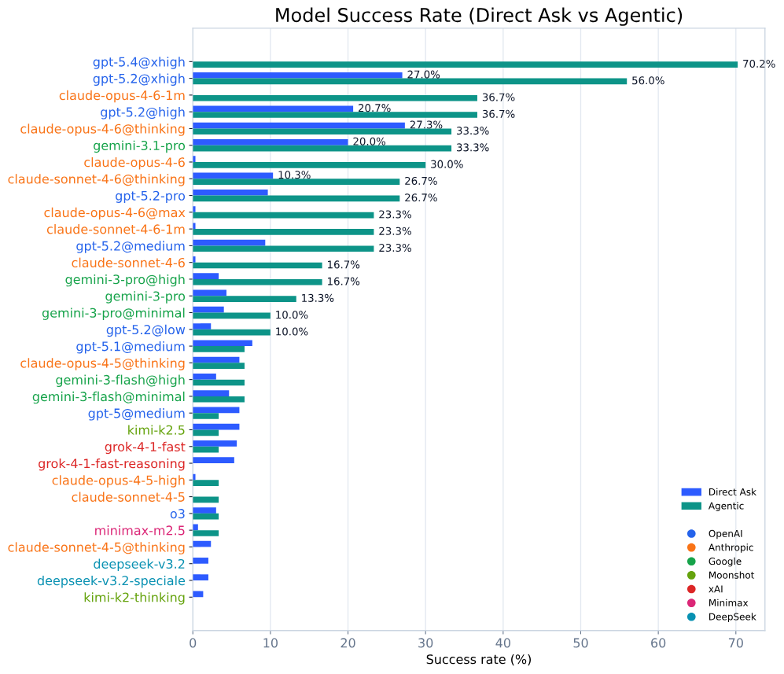
*Caption: Overall solve rates for 51 models, grouped by provider, split by Direct Ask vs Agentic.*

High-value observations:
- Top-end performance reaches **70.2% (agentic)**, but most models remain far lower.
- There is a steep gap between top-tier and median-tier models.
- For some models, agentic execution helps a lot; for others, it can underperform direct ask.

**Builder takeaway**:
- Always benchmark **strategy × model** pairs; don’t assume agentic is universally better.
- Reasoning tier selection inside a model family can matter more than switching model family.

---

### Figure 2: Frontier Progress (Recent)

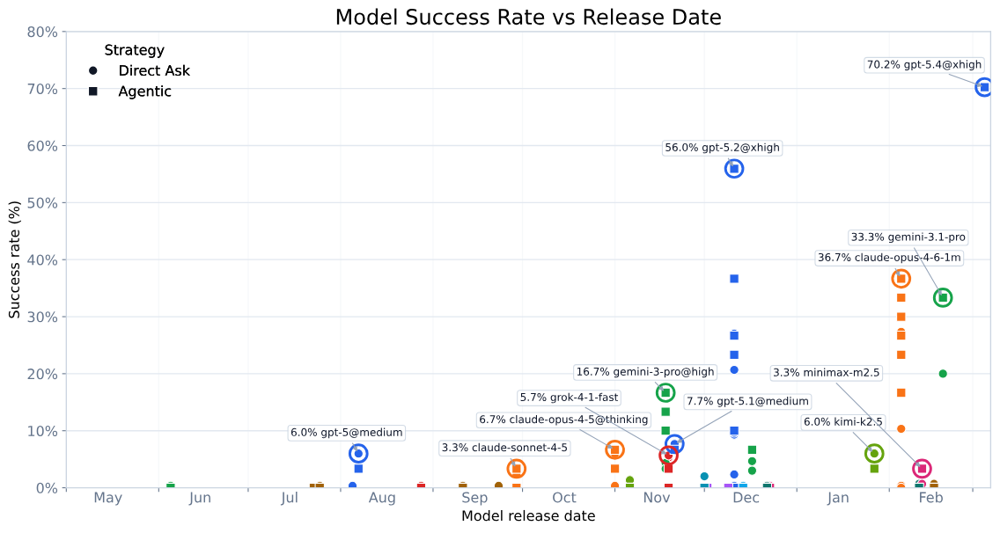
*Caption: Recent frontier-model solve rates across reasoning effort tiers.*

This figure emphasizes:
- Strong recent gains at higher reasoning-effort tiers.
- Large spread between effort tiers within the same model generation.

**Builder takeaway**:
- Treat reasoning budget as a first-class runtime knob.
- Adaptive budgeting (cheap on easy, escalate on hard) is often better than always-high settings.

---

### Figure 3: Frontier Progress (Full History)

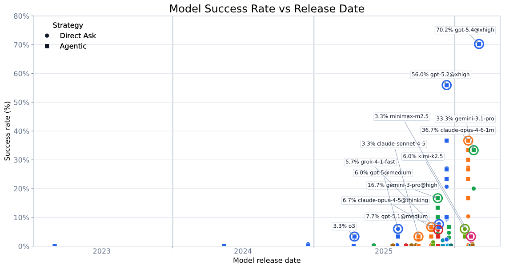
*Caption: Longer historical trend of puzzle-solving performance across model generations.*

The long view suggests:
- Progress exists, but not smooth/linear.
- Capability jumps are often stepwise and can coincide with cost-profile shifts.

**Builder takeaway**:
- Avoid naive linear extrapolation.
- Every model upgrade should include regression checks on hard subsets + cost audits.

---

### Figure 4: Cost vs Success (Pareto Frontier)

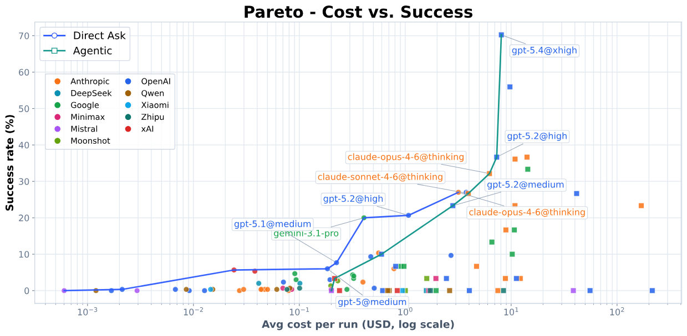
*Caption: Pareto tradeoff between per-puzzle cost and solve rate.*

This is one of the most deployment-relevant charts:
- Lower-cost models can dominate in low/mid success regions.
- Pushing into top success bands usually enters expensive diminishing-return territory.

**Builder takeaway**:
- Route by business value:
  - low-value tasks → cheap Pareto points,
  - high-value tasks → expensive high-success tier.
- Optimize for utility, not raw success only (`value * success - cost`).

---

### Figure 5: Reasoning Effort Scaling

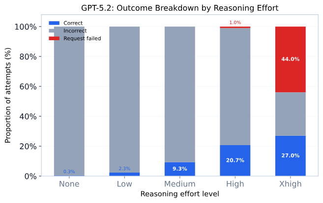
*Caption: How solve rate changes as reasoning budget increases.*

Typical pattern shown:
- Big gains from low → medium/high in some models.
- Higher tiers can show diminishing or unstable marginal returns.

**Builder takeaway**:
- Run explicit effort sweeps (low/med/high/xhigh).
- Set escalation stop rules when marginal gain drops below threshold.

---

### Figure 6: Difficulty Predictors

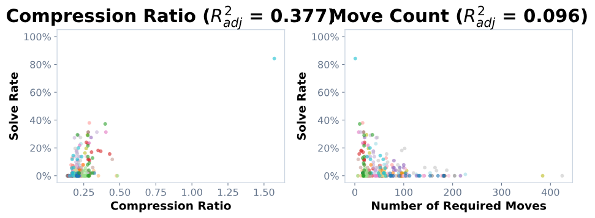
*Caption: Feature comparison for predicting model-facing puzzle difficulty; move-compression ratio leads as a single predictor.*

This has direct architecture impact:
- Puzzle-family labels alone are weak difficulty controls.
- Structural solution features track actual model pain points better.

**Builder takeaway**:
- Build difficulty scoring from structural features, not just taxonomy labels.
- Feed difficulty score into dynamic routing and budget policies.

---

### Figure 7: Difficulty Distribution

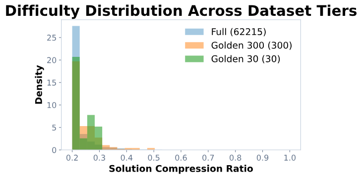
*Caption: Distribution of puzzle difficulty in the benchmark set.*

Distribution shape matters:
- Averages can hide brittle behavior if hard-tail performance collapses.

**Builder takeaway**:
- Report at least easy/medium/hard buckets.
- Monitor bucket drift in production, not only global average.

---

### Figure 8: Puzzle Type Gallery + Solve-State Sequence

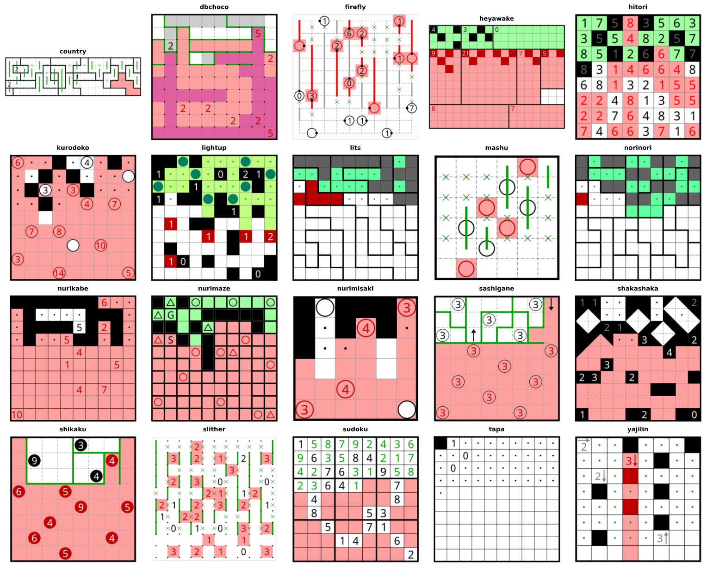
*Caption: Examples of the 20 puzzle types in the benchmark.*

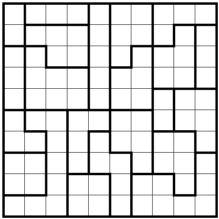
*Caption: Initial unsolved state.*

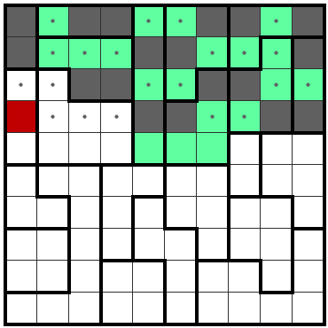
*Caption: Intermediate partial progress.*

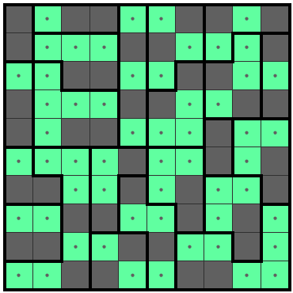
*Caption: Fully solved state.*

These visuals reinforce PPBench’s key advantage: **observable intermediate states**.

**Builder takeaway**:
- Process supervision (step checks) often improves reliability more than final-answer-only scoring.
- Fine-grained violation localization enables targeted repair loops.

---

### Figure 9: Leaderboard Puzzle Grid

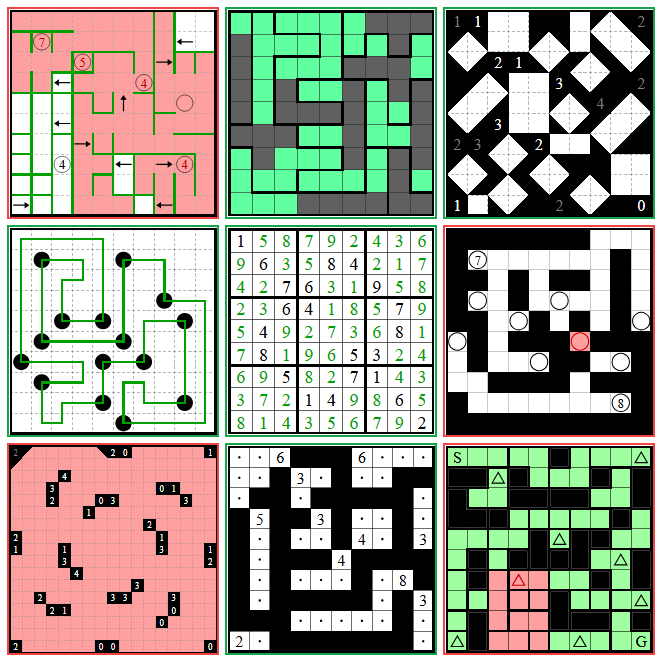
*Caption: Per-puzzle result landscape at granular level.*

Granular grid analysis helps reveal:
- Shared failure clusters (common reasoning bottlenecks).
- Complementary strengths across models.

**Builder takeaway**:
- Track failure clusters, not only headline solve rate.
- Use feature-aware routing for multi-model ensembles rather than naive voting.

## 4) Practical implementation checklist

1. Baseline **model × strategy × effort × cost** in one matrix.  
2. Use adaptive escalation (start cheap, escalate on failure class).  
3. Instrument step-level verifier signals, not only final answer pass/fail.  
4. Build structural difficulty scoring (including move-compression proxies).  
5. Monitor by difficulty bucket + cost bucket + task type simultaneously.  
6. Re-run hard-set regressions before every model/version rollout.

## 5) Bottom line

PPBench is valuable not just because it ranks models, but because it operationalizes a production-like evaluation pattern: **interactive, verifiable, cost-aware, and debug-friendly multi-step reasoning**.

—— 🦞

