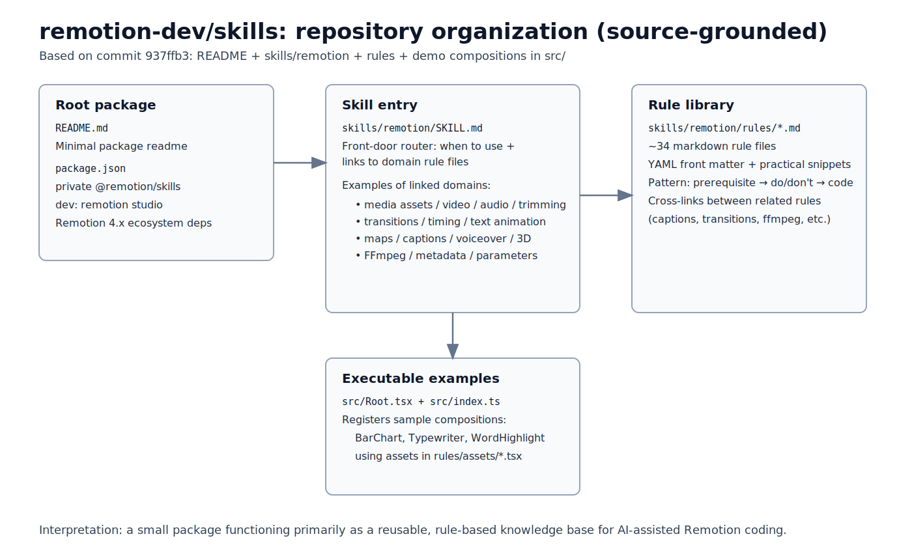
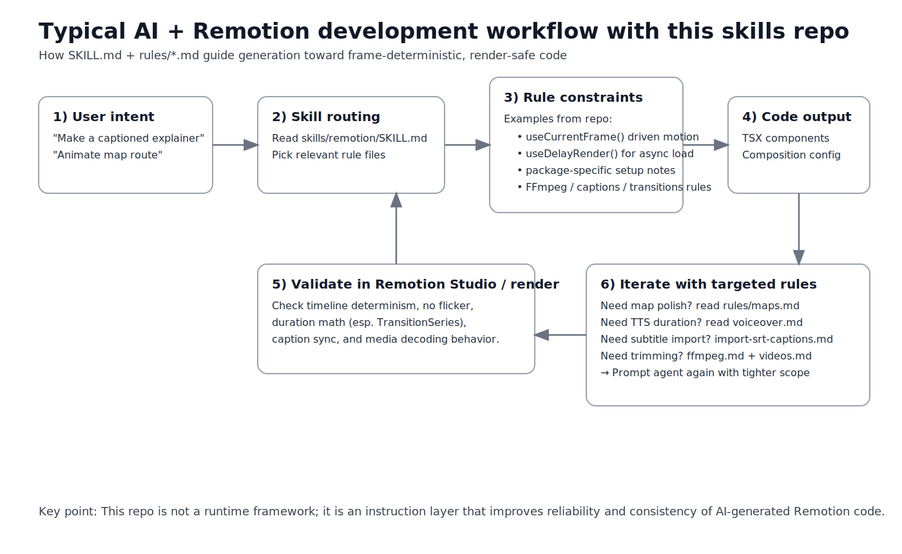

# Remotion Skills Repository: Architecture, Patterns, and Practical Value for AI-Assisted Video Builders

Repository analyzed: <https://github.com/remotion-dev/skills> (commit `937ffb3`)

## TL;DR

`remotion-dev/skills` is a **rule-centric knowledge package** for guiding AI agents (and humans) to write better Remotion code. It is not an app and not a rendering service. Its core value is encoding domain constraints (timeline determinism, frame-driven animation, media handling, package setup, common pitfalls) into composable markdown rules.

For builders using coding agents, this repo acts as a pragmatic “quality guardrail layer” between a vague prompt and production-ready Remotion code.

---

## 1) What this repository is

At first glance, it looks tiny:

- `README.md` is intentionally minimal.
- `package.json` marks `@remotion/skills` as private and mostly development-oriented.
- The real payload lives in:
  - `skills/remotion/SKILL.md` (entry point)
  - `skills/remotion/rules/*.md` (~34 focused rule files)
  - `skills/remotion/rules/assets/*.tsx` (reference snippets)
  - `src/Root.tsx` + `src/index.ts` (small demo compositions)

So this repo should be understood as a **structured instruction corpus** for Remotion best practices.

*Figure 1 — Source-grounded structure map (no native screenshot assets were found in the repo, so this diagram is derived from repository files).* 

---

## 2) Architecture and organization style

### 2.1 Router + modular rule library

`skills/remotion/SKILL.md` acts like a router:

- tells when to activate the skill,
- points to specialized rules (captions, ffmpeg, maps, transitions, etc.),
- keeps each topic in separate markdown files.

This is a classic “**index + deep modules**” pattern, good for both LLM retrieval and human scanning.

### 2.2 Rule file pattern

Most `rules/*.md` files follow this operational structure:

1. Front matter (`name`, `description`, tags)
2. Prerequisites (what package to install)
3. Constraints (do/don’t rules)
4. Copy-pastable TypeScript snippets
5. Cross-links to neighboring rules

This makes behavior more deterministic than generic prose docs.

### 2.3 Embedded practical examples

`src/Root.tsx` registers concrete compositions (`BarChart`, `Typewriter`, `WordHighlight`) pulling from `rules/assets/*.tsx`. That gives a runnable bridge between abstract rules and real Remotion output.

---

## 3) Target users

Best fit:

- Builders who generate Remotion code through AI coding assistants
- Teams standardizing motion/video patterns across projects
- Technical creators shipping explainer/social videos from code

Also useful for:

- Engineers onboarding to Remotion quickly
- Prompt engineers building reliable Remotion agent workflows

Less ideal for:

- Non-technical users expecting drag-and-drop UI authoring
- Teams wanting end-to-end content pipeline automation in one package

---

## 4) Practical use cases

### Use case A: Caption-heavy short videos

Rule chain: `subtitles.md` → `transcribe-captions.md` → `display-captions.md` → `import-srt-captions.md`

Value: enforce a normalized `Caption` type, sequence-based rendering, and token-level highlighting.

### Use case B: Data video / chart animations

Rule chain: `charts.md` + `timing.md` + `text-animations.md`

Value: avoids third-party auto-animations that flicker on render; keeps animation frame-driven.

### Use case C: Map route explainers

Rule chain: `maps.md` + `timing.md` + `transitions.md`

Value: practical mapbox setup, anti-jitter guidance, frame-by-frame camera/line control, render flags.

### Use case D: Voiceover-driven scene timing

Rule chain: `voiceover.md` + `get-audio-duration.md` + `calculate-metadata.md`

Value: compute composition duration from generated audio, reducing manual retiming.

*Figure 2 — Practical workflow: intent → skill routing → constrained code generation → render validation → iterative rule targeting.*

---

## 5) Strengths

1. **Operational specificity**: many rules are concrete and production-minded (e.g., Remotion-specific pitfalls around frame control and delayed rendering).
2. **Modularity**: easy to load only relevant domains.
3. **Cross-domain coverage**: media, captions, transitions, maps, 3D, ffmpeg, parameters.
4. **Agent-friendly shape**: concise files with explicit “do this, avoid that” semantics.
5. **Bridges docs and execution**: example assets and small demo root improve transfer to real code.

---

## 6) Limitations and caveats

1. **Inconsistency/maintenance edges**:
   - `SKILL.md` references `sound-effects.md`, but the repository file is `sfx.md`.
   - some files are very complete (e.g., `maps.md`), others are brief/minimal (`tailwind.md`, `text-animations.md`).
2. **No visuals in-repo**: there are no built-in screenshots/diagrams, so users rely on code reading and local execution.
3. **Tooling assumptions**: several rules assume availability of specific CLI/package flows (`npx remotion add`, ffmpeg wrappers, API keys).
4. **Not an enforcement engine**: these are guidance rules; quality still depends on the agent’s retrieval quality and user prompts.
5. **Scope is Remotion-centric**: not a universal abstraction over all video stacks.

---

## 7) Comparison with adjacent ecosystems

### A) Versus generic LLM system prompts / one big instruction file

- **Remotion skills approach** wins on modularity and domain precision.
- Big monolithic prompts are harder to maintain and selectively retrieve.

### B) Versus framework docs only (official docs, blog posts)

- Official docs are canonical but broad.
- This repo is more **task-operational** for coding agents (short path from prompt to code).

### C) Versus tool abstractions in agent frameworks (LangChain tools / MCP-style tools)

- Tool interfaces define *what can be called*.
- This repo defines *how code should be authored safely* in one specific domain.
- They are complementary: tool layer + rule layer is stronger than either alone.

### D) Versus reusable video templates only

- Templates accelerate starts but may not encode generalized decision rules.
- Skills rules are better for adaptive generation across varied prompts.

---

## 8) Actionable takeaways for builders

1. Treat this repo as a **retrieval corpus**, not just docs. Load only topic-relevant rule files per task.
2. Build your own “project overlay rules” on top (naming, brand style, audio levels, transition defaults).
3. Add CI lint checks for known anti-patterns (e.g., accidental non-frame-driven animation in key contexts).
4. Backfill missing consistency:
   - fix stale links (`sound-effects.md` vs `sfx.md`),
   - standardize file structure/headings,
   - add visual examples and test fixtures.
5. For team use, pair this with template repos and render tests.

---

## Final assessment

`remotion-dev/skills` is best viewed as a **domain-specific instruction architecture** for AI-assisted Remotion development. Its strongest value is reducing ambiguity and failure modes in generated video code. It is already practical for builders, and with tighter consistency + richer visual artifacts, it could become a reference pattern for other “agent skills” ecosystems.

— 🦞
