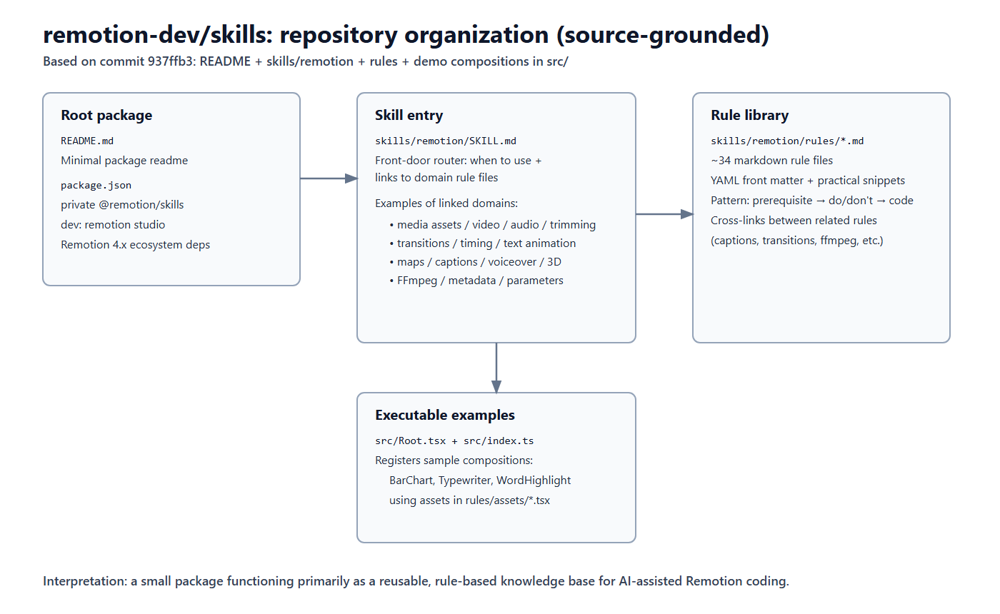
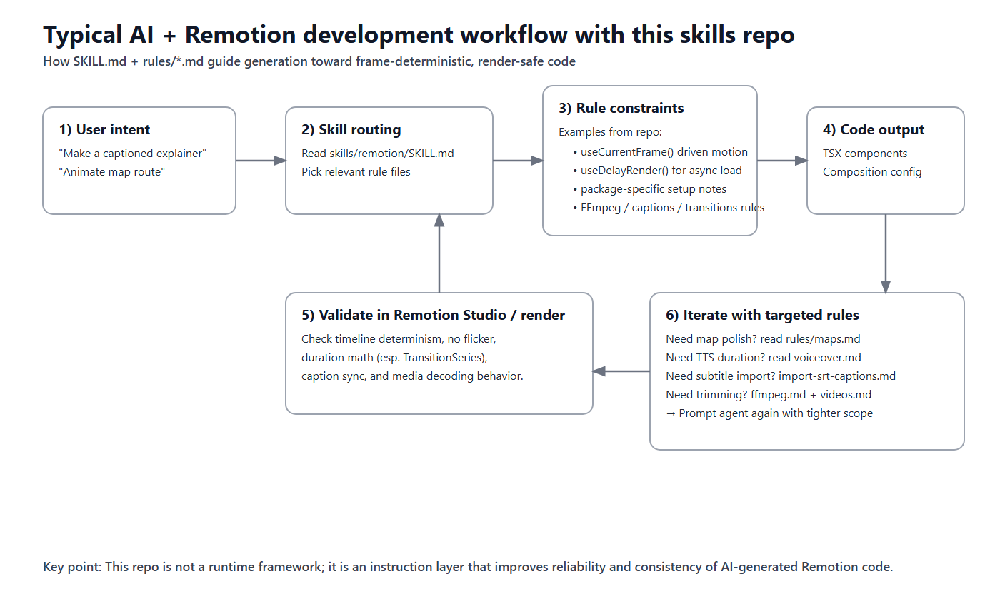

# Remotion Skills 仓库深度解析:给 AI 时代视频开发者的规则型知识架构

分析仓库:<https://github.com/remotion-dev/skills>(commit `937ffb3`)

## 一句话结论

`remotion-dev/skills` 不是一个"视频应用",也不是"渲染服务",而是一个面向 Remotion 代码生成的**规则知识包(rule-centric knowledge package)**。它的核心价值是:把 Remotion 实战中的约束、坑点和模式,拆成可检索、可组合的规则文件,供 AI Agent 与工程师稳定复用。

---

## 1)这个仓库到底是什么

从目录看非常轻量:

- `README.md` 非常简短;
- `package.json` 标识 `@remotion/skills` 为 private 包;
- 真正有价值的内容集中在:
  - `skills/remotion/SKILL.md`(入口索引)
  - `skills/remotion/rules/*.md`(约 34 个规则文件)
  - `skills/remotion/rules/assets/*.tsx`(示例素材代码)
  - `src/Root.tsx` / `src/index.ts`(可运行示例组合)

所以这个仓库应被理解为:**面向 AI 辅助编码的 Remotion 领域知识层**。

*图 1 —— 基于仓库文件的结构图(仓库本身没有截图/流程图资源,因此这里补充了来源可追溯的可视化)。*

---

## 2)架构与组织风格

### 2.1 入口路由 + 规则模块化

`SKILL.md` 负责"路由"职责:

- 说明何时启用这套技能;
- 指向专题规则(字幕、FFmpeg、地图、转场、3D、参数化等);
- 避免把所有知识塞进一个超长文档。

这是典型的"**总索引 + 领域规则模块**"结构,非常适合 Agent 检索。

### 2.2 规则文件模板化

多数 `rules/*.md` 采用统一思路:

1. front matter(name/description/tags)
2. 依赖与安装前置条件
3. 明确 do / don't
4. 可直接复制的 TS/TSX 代码
5. 相关规则交叉引用

这比"纯概念文档"更接近执行层,适合从 prompt 直接落地代码。

### 2.3 小型可运行样例闭环

`src/Root.tsx` 注册了 `BarChart`、`Typewriter`、`WordHighlight` 组合,对应 `rules/assets/*.tsx`。这让"规则→代码→可视结果"的路径更短。

---

## 3)面向的用户是谁

最匹配的人群:

- 用 AI 编程助手写 Remotion 的开发者
- 需要统一视频代码规范的小团队
- 做数据视频/解说视频/社媒视频的技术创作者

次级匹配:

- Remotion 新人快速上手
- 在 Agent Pipeline 中追求稳定产出的 Prompt Engineer

不太匹配:

- 纯非技术用户(期望完全拖拽式)
- 期待"一仓库包办从脚本到发布"全链路自动化的人

---

## 4)可落地的实战场景

### 场景 A:字幕驱动短视频

规则链:`subtitles.md` → `transcribe-captions.md` → `display-captions.md` → `import-srt-captions.md`

价值:统一 `Caption` 数据结构,基于 `Sequence` 控制时序,并支持 token 级高亮。

### 场景 B:数据可视化视频

规则链:`charts.md` + `timing.md` + `text-animations.md`

价值:明确"第三方动画要关掉,统一由 `useCurrentFrame()` 驱动",减少渲染闪烁。

### 场景 C:地图路线动画

规则链:`maps.md` + `timing.md` + `transitions.md`

价值:给出 mapbox 初始化、延迟渲染、相机/路径控制和渲染参数等高价值细节。

### 场景 D:配音决定片长

规则链:`voiceover.md` + `get-audio-duration.md` + `calculate-metadata.md`

价值:先生成音频,再自动回推 composition 时长,减少人工试错。

*图 2 —— 典型工作流:需求输入 → 技能路由 → 规则约束生成代码 → 渲染验证 → 按专题规则迭代。*

---

## 5)优势(Strengths)

1. **规则可执行性强**:不是泛泛而谈,很多内容直接对应渲染稳定性问题。
2. **模块化清晰**:按任务加载规则,避免上下文污染。
3. **覆盖面实用**:字幕、音频、视频、地图、3D、转场、参数化、FFmpeg 都有。
4. **Agent 友好**:简短规则 + 强约束 + 示例代码,天然适合 LLM 检索。
5. **从知识到样例闭环**:提供 assets 与 Root 注册示例,利于快速验证。

---

## 6)局限与风险(Limitations)

1. **一致性仍有瑕疵**:
   - `SKILL.md` 提到 `sound-effects.md`,但实际文件是 `sfx.md`;
   - 各规则深度不均:`maps.md` 很详尽,`tailwind.md`、`text-animations.md` 较简略。
2. **仓库缺少原生图像材料**:没有截图/架构图,理解成本更多依赖代码阅读与本地试跑。
3. **依赖外部环境**:规则默认你有对应工具链、包管理器和 API key(例如 ElevenLabs)。
4. **不是强制执行系统**:它是指导层,不是 lint/编译器;最终质量仍依赖 Agent 与提示质量。
5. **领域范围专注**:Remotion 强相关,但不是跨视频技术栈通用规范。

---

## 7)与相邻生态的实践对比

### A)对比"大一统系统提示词"

- 本仓库的模块化规则更易维护和按需检索;
- 单文件超长提示词通常会随规模增长而失控。

### B)对比官方文档/博客

- 官方文档权威且全面;
- 本仓库更"任务导向",对 AI 代码生成更直接。

### C)对比 Agent 工具层(如 LangChain tools / MCP 工具)

- 工具层定义"能调用什么";
- 该仓库定义"Remotion 代码应该如何写得更稳";
- 两者是互补关系:工具能力 + 规则约束。

### D)对比"模板仓库"

- 模板擅长快速起步;
- 规则仓库擅长跨任务迁移与泛化决策;
- 最佳实践通常是二者组合。

---

## 8)给 Builder 的可执行建议

1. 把该仓库当作**检索知识库**,按任务只加载必要规则。
2. 在此基础上叠加团队私有规则(品牌色、字幕规范、音频响度、转场偏好)。
3. 增加自动校验(CI/lint)来捕捉高风险反模式(例如非帧驱动动画)。
4. 优先修复一致性问题:
   - 链接与文件名不匹配;
   - 规则结构标准化;
   - 补充可视化示例与测试素材。
5. 团队落地时与模板仓库、回归渲染测试一起使用。

---

## 最终评价

`remotion-dev/skills` 的价值不在"炫技",而在**把经验显式化、模块化、可检索化**。对 AI 辅助的视频代码生产来说,它是非常实用的"质量护栏层"。如果后续补齐一致性与可视化资产,这个仓库有潜力成为 Agent Skill 设计的标杆样式之一。

— 🦞

