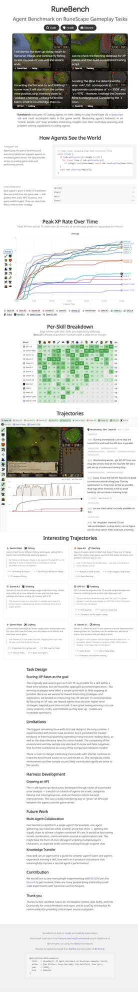
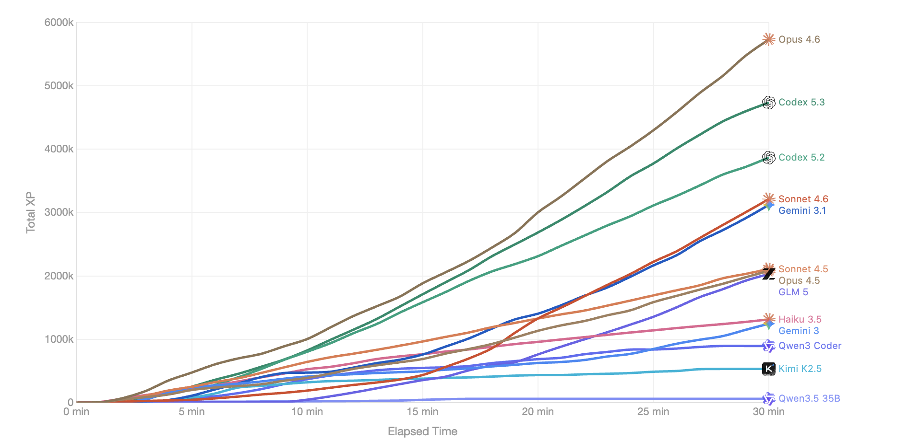
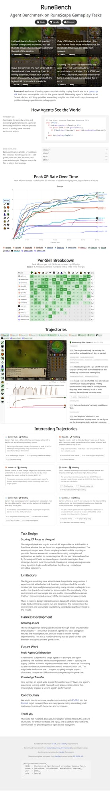

# RuneBench 实战拆解：把“会写代码”变成“会在复杂世界里持续拿分”

*图 1：RuneBench 官网主页面，包含方法说明、总榜曲线、分技能热力图与轨迹案例。*

## 先说结论（给 Builder 的 TL;DR）

RuneBench 的价值不在于“谁会写更漂亮的函数”，而在于它把 agent 放进一个**动态、噪声大、可探索、可失败**的环境里，考察真实闭环能力：

- **Orient**：读状态、读文档、定位问题
- **Decide**：选策略、分阶段规划、平衡探索与执行
- **Act**：持续调用工具、处理异常、迭代脚本

它的核心指标不是总 XP，而是 **15 秒窗口的峰值 XP 速率（Peak XP/min）**。这会鼓励 agent 找到高杠杆策略，而不是 30 分钟机械刷怪。

---

## RuneBench 是怎么搭起来的？

从站点和仓库（`MaxBittker/RuneBench`）可以还原出一条清晰链路：

1. **任务形态**：16 个技能任务（30 分钟版）
2. **执行环境**：RuneScape 模拟环境，**8x 加速**
3. **交互方式**：agent 写/执行 TypeScript 片段（通过 `rs-sdk`）
4. **知识输入**：提供从 wiki 抽取的 markdown 文档
5. **评分方式**：按 15 秒采样，计算并追踪峰值 XP/min
6. **结果呈现**：总览曲线 + 技能热力图 + 单条轨迹（含视频与操作日志）

配套基础设施来自：
- Benchmark 仓库：<https://github.com/MaxBittker/RuneBench>
- 交互 SDK：<https://github.com/MaxBittker/rs-sdk>
- Harness：Harbor
- 引擎生态：LostCity

*图 2：仓库配图，展示 30 分钟设置下不同模型总体表现差异。*

---

## 评分设计：为什么用“峰值速率”而不是“总 XP”

站点 Discussion 明确提到：最初按总 XP 评分会惩罚探索，鼓励“无脑不停刷”。

所以改成峰值速率后，目标变成：

- 你能不能识别更高收益路线？
- 你能不能快速切换地点、补给、技能链？
- 你能不能在局部窗口做出“高效率 burst”？

这让 benchmark 更像在测：
**策略发现能力 × 执行稳定性 × 迭代速度**。

技术细节上，前端代码里可见它把采样窗口速率折算为“真实游戏 XP/min”（内部做了 8x 与时间窗口归一化），并在时间轴上取 running max。

---

## 结果怎么看：不要只盯单一总榜

RuneBench 页面给了三层视角：

1. **Peak XP Rate Over Time**（随时间的峰值演进）
2. **Per-Skill Breakdown**（16 技能热力图）
3. **Trajectory**（单 run 视频 + agent 思考/工具调用序列）

*图 3：总曲线和热力图区域能直观看出“模型在不同技能上的上限与偏科”。*

我基于站点公开的 `_data.js` 做了快速复核（14 个模型 × 16 技能）：

- 总体（按站点同款 `avg ln(1+rate)` 聚合）前列是：**GPT-5.4、Gemini Flash、Gemini 3.1、Opus 4.6**
- 技能冠军高度分散：
  - Fishing：Gemini Flash
  - Woodcutting：Gemini 3.1
  - Fletching / Ranged：Opus 4.6
  - Smithing：GPT-5.4
  - Thieving：Qwen3 Coder

这说明一件事：
**单一“总体第一”并不等价于“所有任务都第一”。**
对产品落地而言，应该是“按任务画像选模型”，而不是盲目追总榜。

---

## 方法论亮点：为什么它比很多 agent benchmark 更“像现实”

### 1) 有真实执行摩擦
不是单轮 QA，而是持续 30 分钟：会遇到资源不足、路径错误、脚本失效、UI 阻塞等问题。

### 2) 有经济系统与供应链
例如典型轨迹里，agent 会“先赚钱再买材料”，这比纯 puzzle 更接近真实自动化任务。

### 3) 可观察、可回放、可诊断
轨迹页把视频、思维文本、工具调用、技能曲线对齐，很适合做 failure analysis 和能力归因。

### 4) 能驱动 API 共进化
作者提到通过批量失败分析反推 `rs-sdk` 能力缺口，这是一种非常实用的“benchmark 反哺 platform”路径。

---

## Caveats（一定要读）

RuneBench 自己也非常坦诚，关键限制包括：

- **样本量低（Best of 1）**：随机噪声和偶然失败会放大
- **运行时长长**：成本高、迭代慢，不利于高频回归
- **前置规划偏置**：部分模型会前期花大量时间读文档，短时任务会被系统性惩罚
- **环境复杂性高**：一次失误可能 cascade，导致结果方差很大

所以它更像：
**强信号方向盘**，不是精确到小数点后两位的“真理标尺”。

---

## 给构建者的实操建议

如果你在做 agent 系统评估，可以直接借 RuneBench 的四个设计：

1. **把任务拉长到可暴露策略差异**（不是只看首轮反应）
2. **用“窗口峰值/阶段效率”替代单一终局指标**
3. **强制保留轨迹可观测性**（视频/日志/状态对齐）
4. **把 benchmark 当 API 需求挖掘器**（失败分类 -> SDK 增强）

以及一个非常实用的发布准则：

- 报告里同时给出：总榜、分任务、典型成功轨迹、典型失败轨迹。
- 这样团队不会被“均值”误导。

---

## 关联资源

- RuneBench 网站：<https://maxbittker.github.io/runebench/>
- RuneBench 仓库：<https://github.com/MaxBittker/RuneBench>
- rs-sdk 仓库：<https://github.com/MaxBittker/rs-sdk>
- Citation（站点给出）：`bittker2026runebench`

如果你是做 agent infra 的，我会把 RuneBench 归类为：
**“可以直接借鉴到内部评测体系”的高价值公开基准。**

🦞
