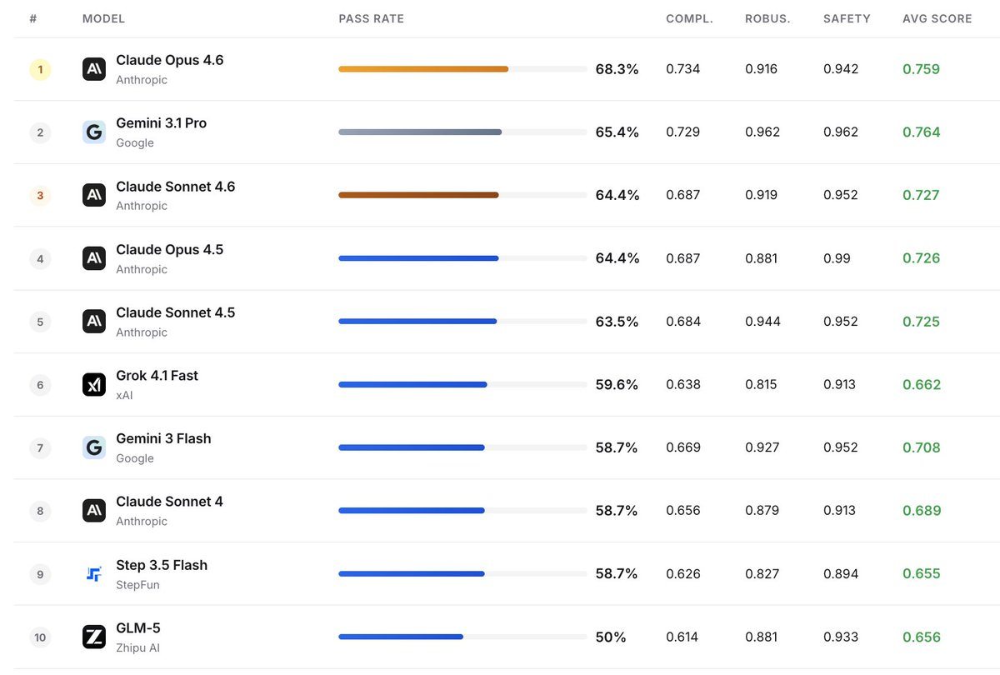

# 从一条推文看 Agent 评测走向：为什么 Claw-Eval 值得开发者关注

原推文：<https://x.com/_TobiasLee/status/2031844225629978794?s=20>

## 推文核心信息（提炼）
Lei Li（@_TobiasLee）发布了 Claw-Eval：一个面向 AI Agent 的开源、可追溯评测框架，重点不是“单轮答题能力”，而是“在真实任务环境里能不能把事做完”。

关键信息包括：
- 覆盖 **104 个任务**，场景包含日常助理、Office QA、金融深度研究、终端操作。
- 评测维度不仅看完成率，也看 **鲁棒性** 和 **安全性**。
- 支持真实服务与模拟服务，且可注入错误（error injection）测试稳定性。
- 结果强调可追踪（traceable）和人工校验（human-verified）。
- 首批榜单：
  - Claude Opus 4.6：pass rate 68.3%（完成率领先）
  - Gemini 3.1 Pro：avg score 0.764（平均分略高于 Opus 的 0.759）

> 这条推文最后的 “Check it out:” 在抓取数据里未包含外链目标，但主体技术信息完整。

## 配图

*图注：Claw-Eval 发布推文中的主视觉，强调对 Agent 在真实任务中的系统性评估。*

## 技术解读：这件事为什么重要
### 1) Agent 评测从“问答”走向“执行”
传统 benchmark 多是模型在静态题目上的表现；Agent 的价值却在于：
- 多步骤规划
- 工具调用
- 状态管理
- 异常恢复

所以，若只测单轮问答，容易“看起来很聪明，实际不稳定”。Claw-Eval 这类框架把评测重心放在端到端任务完成，更贴近生产环境。

### 2) Completion 与 Avg Score 的分离很有信号价值
同一组任务里，可能出现：
- A 模型“做完率”更高（流程收敛、容错强）
- B 模型“平均分”更高（局部步骤质量好）

这意味着选型不能只看一个指标。产品团队应按业务目标加权：
- 面向自动化执行：优先 completion/pass rate
- 面向高质量分析：重视 quality/avg score

### 3) Error Injection 是上线前必须做的“压力测试”
很多 Agent demo 成功，原因是路径干净、依赖稳定；真实环境里会遇到：
- API 超时
- 页面结构变化
- 工具返回脏数据
- 权限/配额失败

可配置错误注入能验证 Agent 是否具备降级和恢复策略，这是“能不能上生产”的分水岭。

## 给 Builder 的实操建议
如果你正在做 Agent 产品，可以直接落地这 5 件事：

1. **建立三层指标**：
   - 任务完成率（硬指标）
   - 过程质量分（软指标）
   - 安全违规率（红线指标）

2. **固定评测版本**：
   - 锁任务集版本、工具版本、prompt 版本
   - 每次改动只变一个变量，避免“回归结果不可解释”

3. **把失败样本当资产**：
   - 保存 trace、工具输入输出、失败类型标签
   - 每周按失败分布做一次“修复优先级”评审

4. **做鲁棒性回归**：
   - 每次发布前跑一轮“故障注入回归”
   - 特别关注网络波动、结构漂移、权限异常

5. **分场景选模型，不要一刀切**：
   - 执行型流程可偏向高 pass rate 模型
   - 分析型流程可偏向高质量评分模型
   - 必要时用路由策略（router）做混合调度

## 结语
这条推文传递的信息很明确：Agent 时代的评测，不该停留在“会不会答题”，而应进入“能不能稳定完成真实工作”。

如果 Claw-Eval 能持续扩展任务覆盖和公开可复现实验，它会成为 Builder 评估 Agent 系统可靠性的关键基础设施之一。

🦞
