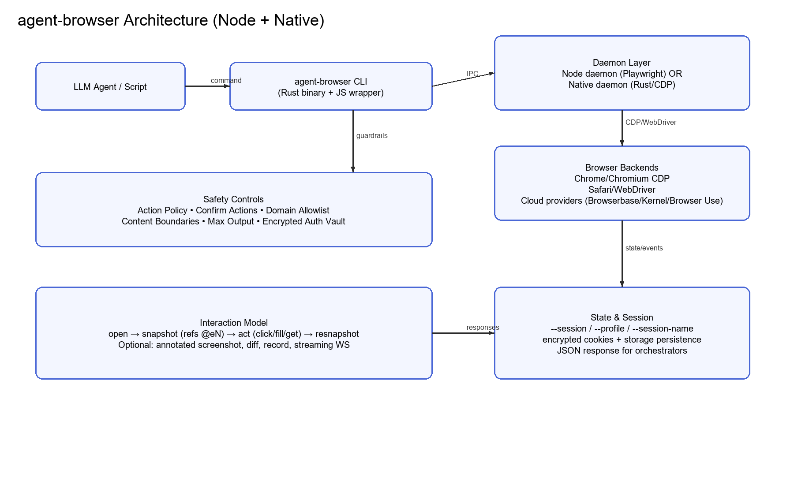
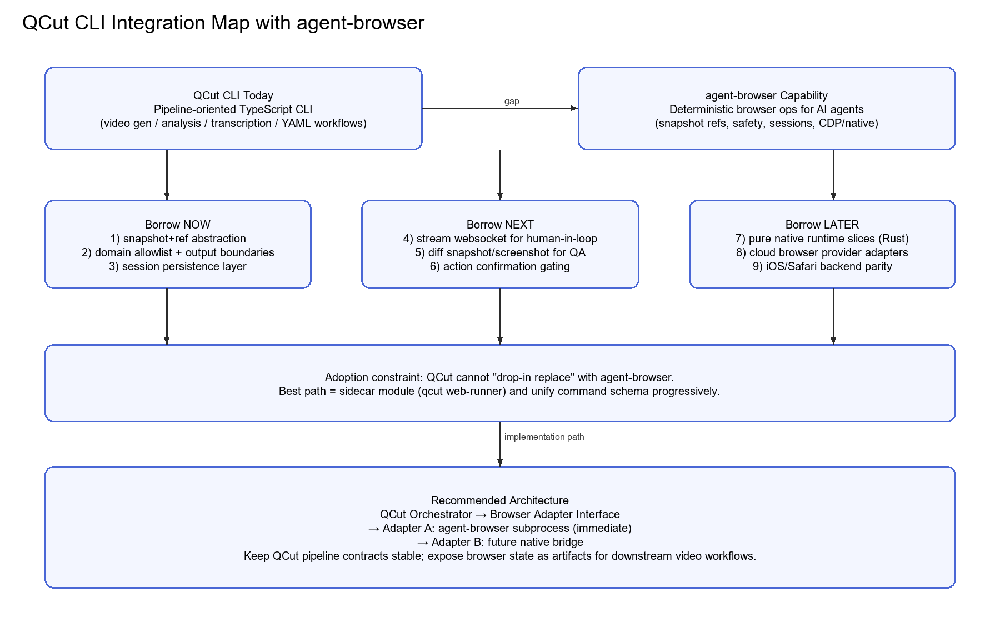

# Vercel agent-browser Deep Dive: What QCut CLI Can Borrow, When, and Whether It Can Adopt It Directly

> Repository: <https://github.com/vercel-labs/agent-browser>
> TL;DR: **agent-browser is excellent as a browser-execution sidecar for QCut, but not a direct replacement for QCut CLI’s core architecture.**



## 0) Scope and method

This analysis is based on a full pass over:

- README + docs (quick-start / commands / snapshots / sessions / cdp-mode / native-mode / security / streaming)
- Key Node implementation files: `src/browser.ts`, `src/actions.ts`, `src/snapshot.ts`, `src/stream-server.ts`, `src/domain-filter.ts`, `src/action-policy.ts`, `src/auth-vault.ts`, `src/daemon.ts`
- Key Rust-native files: `cli/src/main.rs`, `cli/src/commands.rs`, `cli/src/native/actions.rs`, `cli/src/native/browser.rs`, `cli/src/native/daemon.rs`, `cli/src/native/snapshot.rs`, `cli/src/native/network.rs`, `cli/src/native/policy.rs`, `cli/src/native/providers.rs`
- CHANGELOG (native rollout, security hardening, command parity evolution)

---

## 1) What is agent-browser, really?

agent-browser is a **browser automation CLI designed for LLM agents**, not just for test engineers.

Its core value is not “can click buttons,” but “can expose deterministic, low-ambiguity action surfaces to AI.”

Key architecture layers:

1. **Stable CLI command protocol** (human + JSON outputs)
2. **Persistent daemon model** (avoid relaunching browser each command)
3. **Dual runtime backends**
   - Node + Playwright (default stable path)
   - Native Rust runtime (direct CDP / WebDriver for Safari)

The most important design is the `snapshot -> refs (@eN) -> actions -> resnapshot` loop.

---

## 2) How it works (architecture and workflow)

### 2.1 Canonical workflow

- `open`
- `snapshot -i` to discover actionable refs
- `click/fill/get` by ref
- resnapshot after DOM/page changes

This transforms an unbounded web page into a bounded action graph.

### 2.2 Node path

- CLI forwards commands to daemon
- `actions.ts` dispatches many action handlers
- `browser.ts` owns browser/context/page/tab/state/screencast lifecycle
- `snapshot.ts` generates refs with dedupe + nth disambiguation

### 2.3 Native Rust path

- Rust CLI + Rust daemon
- `native/actions.rs` large action dispatcher
- `native/browser.rs` handles local launch, CDP attach, auto-connect, lightpanda engine constraints
- `native/network.rs` handles domain filtering and request controls
- Safari/iOS via WebDriver backend with explicit unsupported-action guardrails

### 2.4 Connection modes

- Local launch
- CDP attach (port or websocket)
- Auto-connect to running Chrome
- Cloud providers (Browserbase / Browser Use / Kernel)

---

## 3) Target users

agent-browser targets:

1. Agent-orchestration developers
2. Backend teams building AI automation products
3. Security-aware deployments needing browser guardrails

It is especially strong when your product needs reliable, scriptable web-task execution under LLM control.

---

## 4) Strengths and limitations

## Strengths

1. **Excellent agent-native interaction model** (`snapshot + ref`)
2. **Practical safety system** (allowlist, policy, confirm, boundaries, output cap, encrypted auth vault)
3. **Good session/state ergonomics** (`--session`, `--profile`, `--session-name`, encrypted persistence)
4. **Strong observability** (annotated screenshots, diff, trace, profiler, stream, record)
5. **Dual-stack strategy** (Node stability + Rust performance path)

## Limitations

1. Native mode is still labeled experimental
2. It is an execution runtime, not a business workflow orchestrator
3. Recovery/planning semantics still need upper-layer orchestration
4. Security controls are mostly opt-in; integrators must enforce secure defaults

---

## 5) Direct comparison with QCut CLI architecture



These systems are adjacent, not equivalent:

- **agent-browser** = browser task execution runtime
- **QCut CLI** = media/content pipeline orchestrator

### 5.1 Responsibility split

- agent-browser: great at browser-state interaction determinism
- QCut: great at multi-stage content/video/transcription workflows

### 5.2 Interface philosophy

- agent-browser: short imperative commands + stable JSON responses
- QCut: pipeline/stage-centric commands and workflow semantics

### 5.3 Runtime philosophy

- agent-browser: persistent interactive state (daemon/session)
- QCut: pipeline stage execution and artifact flow

Implication: QCut should import agent-browser capabilities where web interaction is needed, without collapsing architectural boundaries.

---

## 6) What QCut can borrow now vs later

### Borrow now (immediate)

1. **Snapshot/ref abstraction** for web-driven stages
2. **Security minimum set**: allowed domains + output boundaries + max output + action policy
3. **Session persistence** (`--session-name`) for login-heavy workflows
4. **Annotated screenshots + diff** for QA/regression checkpoints

### Borrow next (mid-term)

1. WebSocket streaming for human-in-the-loop takeover
2. Confirmation gates for risky actions (eval/upload/download)
3. Cloud provider adapters for scalable remote execution

### Borrow later (long-term)

1. Native runtime slices for performance/distribution benefits
2. Multi-backend parity hardening (Chrome/Safari/iOS)
3. Deeper protocol unification across internal QCut adapters

---

## 7) Can QCut directly adopt agent-browser?

## Answer: Yes for direct use, no for direct replacement.

Best pattern: **sidecar integration**.

- Add a QCut `web-runner` module
- Invoke agent-browser as subprocess
- Use JSON I/O contracts
- Convert outputs into QCut artifacts (snapshot, screenshot, diff, trace)

Why not replace QCut core with agent-browser?

- Different core responsibilities
- Replacement would introduce responsibility inversion and coupling
- Breaks existing QCut mental model and command semantics

### Constraints for successful adoption

1. Define a stable internal `BrowserAdapter` interface
2. Map agent-browser errors to QCut task-state semantics
3. Enforce secure defaults in QCut layer (not user-optional)
4. Standardize observability artifacts in QCut pipeline
5. Pin agent-browser versions with regression checks

---

## 8) Practical implementation plan for QCut

### Phase 1 (1-2 weeks)

- Build `BrowserAdapter`
- Implement `AgentBrowserAdapter` with minimal commands: open/snapshot/click/fill/get/screenshot
- Wire artifact return path

### Phase 2 (2-4 weeks)

- Add security controls (allowlist/policy/max-output)
- Add session persistence and login reuse
- Add diff-based acceptance checks

### Phase 3 (4-8 weeks)

- Add streaming + operator handoff
- Add cloud-browser providers
- Build templated flows for recurring web tasks

---

## 9) Final verdict

agent-browser is a highly practical, strongly engineered browser execution layer for AI agents.

For QCut, the winning move is not “replace,” but **compose**:

- plug in agent-browser as an execution engine
- borrow its mature snapshot/ref + safety/session model
- keep QCut in control of end-to-end media pipeline orchestration

That gives fast, low-risk gains in web-task reliability without destabilizing QCut’s core architecture.

---

## Update: agent-browser v0.19 Released

Two days after this article was published, agent-browser shipped v0.19—**the final release before going 100% Rust**.

### What's new in v0.19

- **@browserless provider**: Browserless joins the cloud provider lineup alongside Browserbase, Browser Use, and Kernel—more deployment options, less lock-in
- **Clipboard commands**: `clipboard read` / `clipboard write` / `clipboard copy` / `clipboard paste`—agents can now interact with pages via the clipboard, useful for rich text editors and complex input flows
- **Screenshot control flags**: `--screenshot-quality`, `--screenshot-format`, `--screenshot-dir` for precise output control
- **Bug fixes**: Multiple stability improvements

Install:

```bash
npm i -g agent-browser
```

### What "100% Rust" means

The author [@ctatedev](https://x.com/ctatedev/status/2032383712029982883) explicitly called v0.19 "the final release before going 100% Rust."

This signals:
- The Node + Playwright path will be fully replaced by the Rust native runtime
- Expect significant improvements in startup time, memory footprint, and binary distribution
- For teams doing sidecar integrations (QCut included), **now is the best window to lock in the v0.19 interface**—adapt now, upgrade when the Rust version stabilizes

### What this means for builders

1. **Integrate now without regret**: v0.19's command interface is stable, and the Rust version promises backward compatibility
2. **Clipboard commands fill a real gap**: Previously, clipboard interaction required workarounds
3. **Multi-provider options reduce lock-in**: Browserless joining means you're not tied to a single cloud backend
4. **Watch the Rust migration timeline**: If you depend on Node-side internals, start building isolation layers now

— 🦞