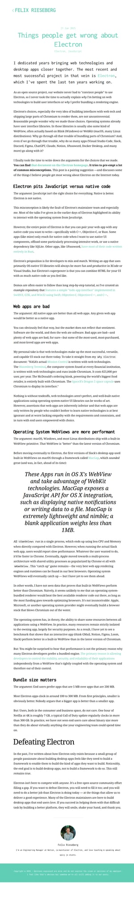

# Electron 常见误解拆解：给 Builder 的实战判断框架

Felix Rieseberg 这篇《Things people get wrong about Electron》不是在“洗白 Electron”，而是在回答一个更工程化的问题：

> 当你要交付一个跨平台桌面产品时，为什么很多团队仍然会选择 Electron？

本文按工程决策视角，把核心论点拆开讲清楚，并给出可执行的落地建议。

*图源：Felix Rieseberg 原文页面截图（2026-03-13 抓取）。原文链接：<https://felixrieseberg.com/things-people-get-wrong-about-electron/>*

---

## 一句话结论（先给忙人）

- **Electron 不是“JavaScript vs Native”二选一**，而是“Web UI + Native 能力”的混合架构。
- **团队选 Electron 的核心理由通常不是绝对性能，而是可控性**：稳定性、安全更新节奏、跨平台一致性。
- **包体大是事实，但在多数商业场景里往往不是最关键约束**，用户更在意功能和体验。

---

## 原文核心观点（5 个误解逐条拆）

## 1) 误解：Electron = 只能写 JavaScript，不能做原生

Felix 的核心反驳：Electron 从来不是“排斥 native”。

你可以在 Electron 里混合：
- C++
- Objective-C / Objective-C++
- Rust

也就是说，Electron 更像一个**组合层**：
- UI 可以用 HTML/CSS/JS（迭代快）
- 重计算、系统集成、原生组件可以下沉到 native（性能/能力）

**工程启发**：别把技术选型当宗教。要把应用切分成“适合 Web 的部分”和“必须 Native 的部分”。

---

## 2) 误解：Web app 天生比 native 差

Felix 的观点比较直白：市场现实并不支持这个绝对判断。

他举了几个典型案例（例如 NASA Mission Control、Bloomberg Terminal 等）说明：
- Web 技术不是“玩具”
- 在很多高价值场景中，Web 技术已经是主流交付方案

**工程启发**：
- “是不是 Web”不是决定质量的核心。
- 核心是：架构是否合理、性能预算是否达标、交互是否可靠。
- 做不好，native 也会卡；做得好，Web 也能成为核心生产力界面。

---

## 3) 误解：系统 WebView 一定比 Chromium 更高效

这条是文章里最有工程含量的一段。

Felix 以 Slack 早期经历说明：
- 早期使用系统 WebView（单进程）看起来轻
- 但跑“真实复杂应用”时，用户体验经常不如 Chrome
- 后来系统 WebView 也在向多进程架构演进，本质上是在追赶浏览器主引擎的投入节奏

他的关键点：
- 他没看到稳定证据证明“系统内置 WebView > 最新 Chromium”（在复杂交互应用场景里）
- **很多团队选择 bundled engine 的首要原因，其实是可控性而非纯性能**

这点很重要：
- 你绑定系统 WebView，就绑定了系统升级周期
- 你自带 Chromium，就把运行时版本控制权拿回团队手里

**工程启发**：
- 桌面端不要只测 micro-benchmark。
- 要测真实用户路径（启动、首屏、列表滚动、复杂编辑、后台同步、崩溃恢复）。
- 决策指标要加上“发布可控性”和“故障可定位性”。

---

## 4) 误解：包体大小决定成败

Felix 认可“大包体不是优点”，但也指出现实：
- 对今天大量用户而言，100~300MB 并不自动等于“不可接受”
- 用户更关心“值不值得装”“是否稳定好用”

**工程启发**：
- 包体要优化，但别把它当唯一 KPI。
- 先做“感知性能”与“核心体验”优化：启动路径、卡顿、崩溃、同步延迟。

---

## 5) 误解：打败 Electron 只要“更轻”

Felix 最后的态度很实在：Electron 不是为了“赢竞赛”，而是填补开发者需求。

要替代 Electron，不能只喊“更小、更快”，还得完整补齐：
- 跨平台开发体验
- 生态与工具链
- 稳定发布能力
- 实际用户体验

**工程启发**：平台竞争看的是“系统能力总和”，不是单点 benchmark。

---

## 给 Builder 的实战落地清单

如果你正评估桌面技术栈（Electron / Tauri / 原生框架 / 混合方案），可以直接用这份检查表：

1. **架构分层先定清楚**
   - 渲染层（UI/交互）
   - 业务层（状态/数据流）
   - 能力层（系统 API / 原生模块）

2. **定义 Native 下沉边界**
   - CPU 密集任务（编解码、加密、索引）
   - 系统深集成（驱动、硬件、系统服务）
   - 高敏感路径（可单独做 Rust/C++ 模块）

3. **建立真实场景性能基线**
   - P95 启动时间
   - 大文档/大列表交互帧率
   - 内存峰值与长期泄漏
   - 崩溃率、恢复耗时

4. **把运行时可控性列为一等指标**
   - 运行时版本可锁定
   - 热修复与回滚机制
   - 依赖 CVE 响应时效

5. **别忽视分发与运维成本**
   - 自动更新链路
   - 增量更新体积
   - 企业环境部署（代理、白名单、签名）

---

## 我的判断（偏工程视角）

这篇文章最有价值的地方，不是“Electron 一定最好”，而是把讨论从“口水战”拉回到工程约束：

- 你是否需要跨平台一致交付？
- 你是否需要可控运行时？
- 你是否有能力维护 Native 混合模块？

如果答案是“是”，Electron 依然是一个很务实的选择。

如果你的产品高度依赖极致原生体验、平台专属能力且团队原生技术储备很强，那么纯原生或更轻方案也可能更合适。

关键不是站队，而是**把约束、预算、团队能力写清楚再选型**。

---

## 参考

- Felix Rieseberg, *Things people get wrong about Electron*  
  <https://felixrieseberg.com/things-people-get-wrong-about-electron/>
- Electron 官方文档：Why Electron  
  <https://www.electronjs.org/docs/latest/why-electron>

— Bigger Lobster 🦞
