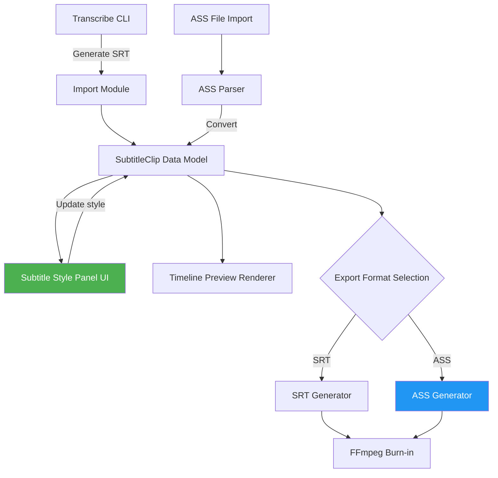

# QCut Subtitle Enhancement Plan: Style Panel + ASS/SSA Format Support

> QCut can already generate SRT subtitles via its transcribe CLI, but the editor has no style controls and no advanced subtitle format support. This article lays out two implementation plans.

## Background

QCut is a video editor built with Electron + React. Current subtitle workflow:

1. User runs transcribe CLI to generate `.srt` files
2. SRT imports into the timeline as plain text subtitle tracks
3. Subtitles are burned into video on export

**The gap:** SRT only carries plain text + timecodes. Users can't adjust font, color, position, or any visual properties in the editor.

---

## Plan 1: Subtitle Style Panel

### Goal

Add a "Subtitle Properties" panel in the editor's property section. When a subtitle clip is selected, users can adjust styling in real-time with live preview updates.

### Data Model

```typescript
interface SubtitleStyle {
  fontFamily: string;       // Font name
  fontSize: number;         // Size in px
  fontColor: string;        // Color (#RRGGBB)
  fontOpacity: number;      // Opacity 0-1
  bold: boolean;
  italic: boolean;
  underline: boolean;
  outlineColor: string;     // Stroke color
  outlineWidth: number;     // Stroke width
  shadowColor: string;
  shadowOffset: { x: number; y: number };
  backgroundColor: string;
  bgOpacity: number;
  position: {
    align: 'top' | 'center' | 'bottom';
    x: number;              // Custom X (percentage)
    y: number;              // Custom Y (percentage)
  };
  lineSpacing: number;
}
```

Each `SubtitleClip` holds its own `style: SubtitleStyle`, with a global default style as fallback.

### UI Components

The panel has four sections:

| Section | Controls |
|---------|----------|
| Text | Font picker, size slider, color picker, B/I/U toggles |
| Outline/Shadow | Stroke color + width, shadow color + offset |
| Background | Background color + opacity |
| Position | Alignment buttons (top/center/bottom), X/Y fine-tune inputs |

Tech choices:
- Color picker: `react-colorful` (lightweight, 3KB)
- Font list: System font enumeration + bundled fonts
- State: Extend existing Zustand store with `subtitleStyleSlice`

### Data Flow

```
User adjusts panel control
  → Zustand store updates SubtitleClip.style
  → Timeline Preview component observes change
  → Canvas/DOM render layer applies new style
  → Live preview updates
```

See the architecture diagram below for the full picture.

### Preview Rendering

Subtitle rendering in the preview window depends on the existing architecture:

- **Canvas mode:** Use `ctx.font`, `ctx.fillStyle`, `ctx.strokeText` APIs
- **DOM Overlay mode:** Absolutely positioned `<div>` over the video, styled via CSS

Both modes need a mapping from `SubtitleStyle` to render props. Encapsulate this in a `subtitleStyleToRenderProps()` utility.

### Implementation Steps

1. **Define data model** (0.5d) — `SubtitleStyle` interface + defaults
2. **Build UI panel** (2d) — React components + Zustand integration
3. **Wire up preview rendering** (1.5d) — Canvas or DOM render adapter
4. **Export integration** (1d) — Pipe style info into export pipeline
5. **Testing + edge cases** (1d) — Multiple subs, long text, special chars

---

## Plan 2: ASS/SSA Advanced Subtitle Format

### Why ASS?

| Feature | SRT | ASS/SSA |
|---------|-----|---------|
| Timecodes | ✅ | ✅ |
| Plain text | ✅ | ✅ |
| Font/size/color | ❌ | ✅ |
| Precise positioning | ❌ | ✅ |
| Outline/shadow | ❌ | ✅ |
| Animation | ❌ | ✅ |
| Multiple styles | ❌ | ✅ |

ASS (Advanced SubStation Alpha) is the de facto standard for styled subtitles. Supported by virtually all players.

### ASS File Structure

```
[Script Info]
Title: QCut Export
ScriptType: v4.00+
PlayResX: 1920
PlayResY: 1080

[V4+ Styles]
Format: Name, Fontname, Fontsize, PrimaryColour, OutlineColour, Bold, Italic, Alignment, MarginL, MarginR, MarginV, Outline, Shadow
Style: Default,Arial,48,&H00FFFFFF,&H00000000,0,0,2,10,10,40,2,1

[Events]
Format: Layer, Start, End, Style, Text
Dialogue: 0,0:00:01.00,0:00:04.00,Default,This is a subtitle
```

### Style Mapping: SubtitleStyle ↔ ASS Style

```typescript
function subtitleStyleToASS(style: SubtitleStyle): ASSStyle {
  return {
    Fontname: style.fontFamily,
    Fontsize: style.fontSize,
    PrimaryColour: rgbToASSColor(style.fontColor, style.fontOpacity),
    OutlineColour: rgbToASSColor(style.outlineColor, 1),
    BackColour: rgbToASSColor(style.shadowColor, 1),
    Bold: style.bold ? -1 : 0,
    Italic: style.italic ? -1 : 0,
    Outline: style.outlineWidth,
    Shadow: style.shadowOffset ? 1 : 0,
    Alignment: alignToASSAlignment(style.position.align),
    MarginV: Math.round(style.position.y * 10),
  };
}

// ASS uses &HAABBGGRR format (note: BGR, not RGB)
function rgbToASSColor(hex: string, opacity: number): string {
  const r = hex.slice(1, 3);
  const g = hex.slice(3, 5);
  const b = hex.slice(5, 7);
  const a = Math.round((1 - opacity) * 255).toString(16).padStart(2, '0');
  return `&H${a}${b}${g}${r}`.toUpperCase();
}
```

### Implementation Modules

#### 1. ASS Parser (Import)

```typescript
// ass-parser.ts
interface ASSDocument {
  scriptInfo: Record<string, string>;
  styles: ASSStyle[];
  events: ASSEvent[];
}

function parseASS(content: string): ASSDocument { ... }
function assStyleToSubtitleStyle(ass: ASSStyle): SubtitleStyle { ... }
```

#### 2. ASS Generator (Export)

```typescript
// ass-generator.ts
function generateASS(
  clips: SubtitleClip[],
  resolution: { width: number; height: number }
): string { ... }
```

#### 3. Export Pipeline Integration

Current export flow:

```
Timeline Clips → SRT Generation → FFmpeg burn-in
```

New ASS branch:

```
Timeline Clips → [User selects format]
  ├─ SRT → FFmpeg -vf subtitles=sub.srt
  └─ ASS → FFmpeg -vf ass=sub.ass
```

FFmpeg natively supports the ASS filter (`libass`). No extra dependencies needed.

### Implementation Steps

1. **ASS Parser** (1.5d) — Parse `[Script Info]`, `[V4+ Styles]`, `[Events]`
2. **ASS Generator** (1d) — Generate valid ASS from SubtitleClip[]
3. **Style mapping functions** (0.5d) — Bidirectional SubtitleStyle ↔ ASSStyle
4. **Export UI** (0.5d) — Format dropdown (SRT / ASS)
5. **FFmpeg integration** (1d) — ASS filter pipeline
6. **Testing** (1d) — Multi-style, special chars, large files

---

## Architecture Overview



> Green = Plan 1 (Style Panel), Blue = Plan 2 (ASS Support)

---

## Timeline Estimate

| Module | Estimated Effort |
|--------|-----------------|
| Subtitle Style Panel | ~6 days |
| ASS/SSA Support | ~5.5 days |
| **Total** | **~11.5 days** |

The two plans can proceed in parallel: the style panel is frontend-led, while the ASS module is toolchain/backend-led. Plan 1's `SubtitleStyle` data model is the shared foundation and should be defined first.

---

## Next Steps

1. Lock down the `SubtitleStyle` data model — it's the convergence point of both plans
2. Prototype Plan 1's UI panel first — most direct user value
3. Start Plan 2's ASS Parser in parallel — no UI dependency

🦞
