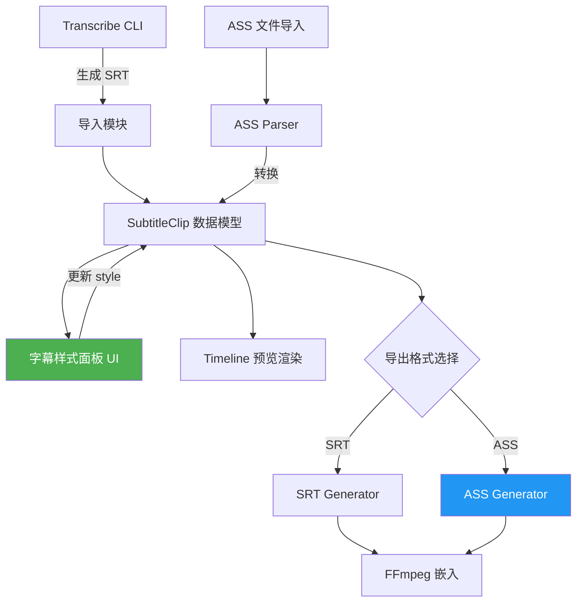

# QCut 字幕增强实施计划：样式面板 + ASS/SSA 格式支持

> QCut 已经能通过 CLI 转录生成 SRT 字幕，但编辑器里既不能调样式，也不支持高级字幕格式。这篇文章是两个实施计划的技术方案。

## 背景

QCut 是基于 Electron + React 的视频编辑器。现有的字幕流程：

1. 用户通过 transcribe CLI 生成 `.srt` 文件
2. SRT 导入时间线，显示为纯文本字幕轨道
3. 导出时嵌入视频

**问题：** SRT 只支持纯文本 + 时间码，没有任何样式信息。用户无法在编辑器里调整字体、颜色、位置等。

---

## 计划一：字幕样式面板

### 目标

在编辑器的属性面板区域新增「字幕属性」面板，选中字幕片段时可以实时调整样式，预览窗口同步更新。

### 数据模型

```typescript
interface SubtitleStyle {
  fontFamily: string;       // 字体名称
  fontSize: number;         // 字号 (px)
  fontColor: string;        // 颜色 (#RRGGBB)
  fontOpacity: number;      // 透明度 0-1
  bold: boolean;
  italic: boolean;
  underline: boolean;
  outlineColor: string;     // 描边颜色
  outlineWidth: number;     // 描边宽度
  shadowColor: string;      // 阴影颜色
  shadowOffset: { x: number; y: number };
  backgroundColor: string;  // 背景色
  bgOpacity: number;
  position: {
    align: 'top' | 'center' | 'bottom';
    x: number;              // 自定义 X 坐标 (百分比)
    y: number;              // 自定义 Y 坐标 (百分比)
  };
  lineSpacing: number;
}
```

每个字幕片段（SubtitleClip）持有自己的 `style: SubtitleStyle`，同时有一个全局默认样式。

### UI 组件

面板分为四个区块：

| 区块 | 控件 |
|------|------|
| 文字 | 字体选择器、字号滑块、颜色选择器、B/I/U 按钮 |
| 描边/阴影 | 描边颜色+宽度、阴影颜色+偏移 |
| 背景 | 背景颜色+透明度 |
| 位置 | 对齐按钮组（上/中/下）、X/Y 微调输入 |

技术选型：
- 颜色选择器：`react-colorful`（轻量，3KB）
- 字体列表：从系统字体枚举 + 内置字体包
- 状态管理：复用现有的 Zustand store，新增 `subtitleStyleSlice`

### 数据流

```
用户调整面板控件
  → Zustand store 更新 SubtitleClip.style
  → Timeline Preview 组件监听变化
  → Canvas/DOM 渲染层应用新样式
  → 实时预览更新
```

详细架构见下方流程图。

### 预览渲染

字幕在预览窗口中的渲染方式取决于现有架构：

- **Canvas 模式：** 用 `ctx.font`、`ctx.fillStyle`、`ctx.strokeText` 等 API 绘制
- **DOM Overlay 模式：** 用绝对定位的 `<div>` 覆盖在视频上方，通过 CSS 控制样式

两种模式都需要把 `SubtitleStyle` 映射为渲染参数。建议封装一个 `subtitleStyleToRenderProps()` 工具函数。

### 实施步骤

1. **定义数据模型**（0.5天）— `SubtitleStyle` 接口 + 默认值
2. **构建 UI 面板**（2天）— React 组件 + Zustand 集成
3. **接入预览渲染**（1.5天）— Canvas 或 DOM 渲染适配
4. **导出集成**（1天）— 样式信息写入导出流程
5. **测试 + 边界处理**（1天）— 多字幕、长文本、特殊字符

---

## 计划二：ASS/SSA 高级字幕格式支持

### 为什么要 ASS？

| 特性 | SRT | ASS/SSA |
|------|-----|---------|
| 时间码 | ✅ | ✅ |
| 纯文本 | ✅ | ✅ |
| 字体/大小/颜色 | ❌ | ✅ |
| 精确坐标定位 | ❌ | ✅ |
| 描边/阴影 | ❌ | ✅ |
| 动画效果 | ❌ | ✅ |
| 多样式混合 | ❌ | ✅ |

ASS（Advanced SubStation Alpha）是字幕领域的事实标准高级格式，几乎所有播放器都支持。

### ASS 文件结构

```
[Script Info]
Title: QCut Export
ScriptType: v4.00+
PlayResX: 1920
PlayResY: 1080

[V4+ Styles]
Format: Name, Fontname, Fontsize, PrimaryColour, OutlineColour, Bold, Italic, Alignment, MarginL, MarginR, MarginV, Outline, Shadow
Style: Default,Arial,48,&H00FFFFFF,&H00000000,0,0,2,10,10,40,2,1

[Events]
Format: Layer, Start, End, Style, Text
Dialogue: 0,0:00:01.00,0:00:04.00,Default,这是一段字幕
```

### 样式映射：SubtitleStyle ↔ ASS Style

```typescript
function subtitleStyleToASS(style: SubtitleStyle): ASSStyle {
  return {
    Fontname: style.fontFamily,
    Fontsize: style.fontSize,
    PrimaryColour: rgbToASSColor(style.fontColor, style.fontOpacity),
    OutlineColour: rgbToASSColor(style.outlineColor, 1),
    BackColour: rgbToASSColor(style.shadowColor, 1),
    Bold: style.bold ? -1 : 0,
    Italic: style.italic ? -1 : 0,
    Outline: style.outlineWidth,
    Shadow: style.shadowOffset ? 1 : 0,
    Alignment: alignToASSAlignment(style.position.align),
    MarginV: Math.round(style.position.y * 10),
  };
}

// ASS 用 &HAABBGGRR 格式（注意是 BGR 不是 RGB）
function rgbToASSColor(hex: string, opacity: number): string {
  const r = hex.slice(1, 3);
  const g = hex.slice(3, 5);
  const b = hex.slice(5, 7);
  const a = Math.round((1 - opacity) * 255).toString(16).padStart(2, '0');
  return `&H${a}${b}${g}${r}`.toUpperCase();
}
```

### 实现模块

#### 1. ASS Parser（导入）

```typescript
// ass-parser.ts
interface ASSDocument {
  scriptInfo: Record<string, string>;
  styles: ASSStyle[];
  events: ASSEvent[];
}

function parseASS(content: string): ASSDocument { ... }
function assStyleToSubtitleStyle(ass: ASSStyle): SubtitleStyle { ... }
```

#### 2. ASS Generator（导出）

```typescript
// ass-generator.ts
function generateASS(
  clips: SubtitleClip[],
  resolution: { width: number; height: number }
): string { ... }
```

#### 3. 导出管线集成

现有导出流程大致是：

```
Timeline Clips → SRT 生成 → FFmpeg 嵌入
```

新增 ASS 分支：

```
Timeline Clips → [用户选择格式]
  ├─ SRT → FFmpeg -vf subtitles=sub.srt
  └─ ASS → FFmpeg -vf ass=sub.ass
```

FFmpeg 原生支持 ASS 滤镜（`libass`），不需要额外依赖。

### 实施步骤

1. **ASS Parser**（1.5天）— 解析 `[Script Info]`、`[V4+ Styles]`、`[Events]`
2. **ASS Generator**（1天）— 从 SubtitleClip[] 生成合法 ASS 文件
3. **样式映射函数**（0.5天）— SubtitleStyle ↔ ASSStyle 双向转换
4. **导出 UI**（0.5天）— 格式选择下拉（SRT / ASS）
5. **FFmpeg 集成**（1天）— ASS 滤镜管线
6. **测试**（1天）— 多样式、特殊字符、大文件

---

## 架构总览



> 绿色 = 计划一（样式面板），蓝色 = 计划二（ASS 支持）

---

## 总工期估算

| 模块 | 预计工时 |
|------|----------|
| 字幕样式面板 | ~6 天 |
| ASS/SSA 支持 | ~5.5 天 |
| **合计** | **~11.5 天** |

两个计划可以并行推进：样式面板由前端开发主导，ASS 模块由工具链/后端开发主导。计划一的 `SubtitleStyle` 数据模型是两者的共享基础，应优先定义。

---

## 下一步

1. 确认 `SubtitleStyle` 数据模型 — 这是两个计划的交汇点
2. 先做计划一的 UI 面板原型 — 用户价值最直接
3. 计划二的 ASS Parser 可以同步启动 — 不依赖 UI

🦞
