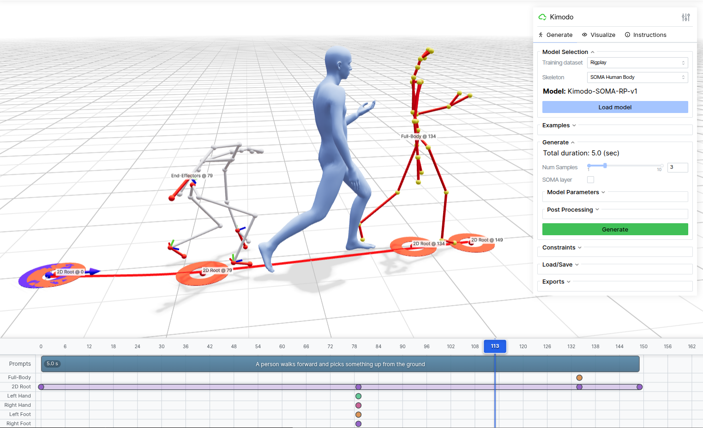
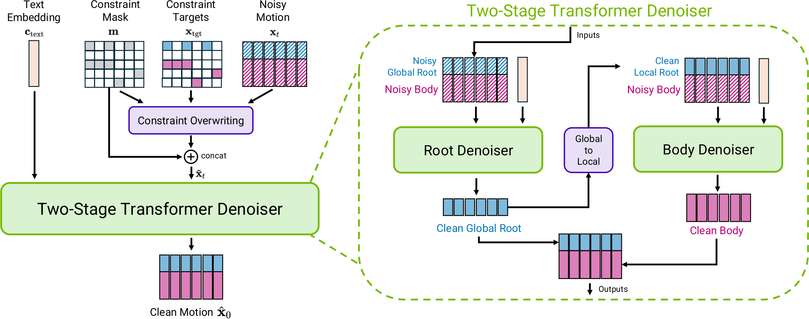

# NVIDIA Kimodo 深度拆解：700 小时 mocap 如何把动作生成变成可编程运动数据引擎

> **TL;DR:** NVIDIA Spatial Intelligence Lab 的 Kimodo 是一个离线运动学动作扩散模型：它用 700 小时高质量光学动作捕捉训练，让用户同时以文本、全身关键帧、手脚位置与旋转、2D 路径、waypoint 和脚部接触控制动作。真正值得注意的不是“输入一句话就会动”，而是它把生成结果做成了可编辑、可导出、可 retarget、可进入物理仿真的骨骼数据。模型通过约束覆写和 root-first 两阶段 Transformer，把创作意图编译成结构化 motion asset；但它仍然没有场景理解与物理保证，单个 prompt 最长 10 秒，脚滑、约束冲突和 G1 后处理都是现实边界。

- **Project:** [Kimodo - NVIDIA Spatial Intelligence Lab](https://research.nvidia.com/labs/sil/projects/kimodo/)
- **Paper:** [Kimodo: Scaling Controllable Human Motion Generation](https://arxiv.org/abs/2603.15546)
- **Code:** [nv-tlabs/kimodo](https://github.com/nv-tlabs/kimodo)
- **Models:** [NVIDIA Kimodo collection on Hugging Face](https://huggingface.co/collections/nvidia/kimodo-v1)
- **Demo:** [Kimodo on Hugging Face Spaces](https://huggingface.co/spaces/nvidia/Kimodo)
- **Initial release:** 2026-03-16
- **Accessed:** 2026-07-16
- **Tags:** NVIDIA / Kimodo / human motion generation / motion capture / 3D animation / humanoid robotics / diffusion / Physical AI

## 一句话判断

**Kimodo 不是把 text-to-motion 做得更像视频生成，而是把 mocap 变成了一个可查询、可约束、可批量合成的运动数据层。**

这一区别很重要。

视频模型输出的是像素。Kimodo 输出的是带 root position、关节位置、关节旋转、速度和脚部接触状态的骨骼序列。它可以继续进入 DCC 工具、游戏引擎、retarget 管线、MuJoCo 或物理策略训练，而不必从视频中重新估计姿态。

文本负责表达“做什么”，路径与关键帧负责规定“在哪里、什么时候、以什么姿势做”，模型负责补全两者之间大量没有被明确描述的身体运动。

从这个角度看，Kimodo 更像一个 **motion compiler**：输入高层意图和局部规格，输出可被下游系统消费的结构化运动资产。

## 700 小时数据解决的不是动作词汇量，而是可控性

Kimodo 训练于 Bones Rigplay 的 700 小时光学动作捕捉数据，覆盖 170 名表演者，男女数量大致相当。数据包括行走、手势、日常活动、物体交互、游戏战斗、舞蹈和体育动作，也包含疲惫、愤怒、快乐、害怕、醉酒、受伤、潜行、年老和儿童化等风格。

每段动作不只有一个总描述，还被切成带细粒度文本标注的原子动作片段。团队再用 Qwen3-32B 把描述改写成统一 prompt 风格，并随机拼接动作片段、用模型生成过渡，从而增加多动作组合数据。

这里的“规模”不能只理解成模型认识更多动词。

论文的缩放实验刻意让 10%、50% 和 100% 数据子集都保留相同的动作类别，只减少同一动作由不同演员、不同 take 表演的次数。结果显示，数据增加后 R-precision 和 FID 变化不大，但脚滑和各类约束误差持续下降。

这意味着额外 mocap 的价值主要体现在 **同一种意图可以怎样被不同身体自然实现**。当用户只给几个稀疏关键帧时，模型需要从训练分布里补出重心转移、步幅、手臂摆动和过渡节奏。重复动作的多样表演，正是这种“补全能力”的来源。

论文也提醒了一个数据边界：常见 HumanML3D 约 30 小时，Kimodo 的 700 小时数据质量更高；但 Rigplay 并不是完整公开训练集。官方同时提供用 288 小时公开 BONES-SEED 训练的 checkpoint，便于复现和比较，不过 README 明确称其能力弱于 Rigplay 版本。

## 文本只是第一层控制

Kimodo 支持的输入远比一句 prompt 更接近动画制作界面：

- 文本描述动作、风格和连续行为；
- full-body keyframe 固定某一帧的全身姿态；
- end-effector constraint 控制手或脚的位置与旋转；
- 2D waypoint 让角色在指定时间经过地面坐标；
- dense root path 规定一段连续移动路径；
- foot-contact constraint 指定脚在某些帧是否接触地面；
- 多种约束可以混合，并与文本同时使用。



这套接口让模型能承担几种不同工作：给两段 mocap 生成中间过渡；让现有动作沿导航网格移动；把手放到物体附近以生成 pick-and-place 草稿；随机采样路径和关键帧，批量扩充机器人示范数据。

但约束不是物理引擎里的硬约束。Kimodo 尽量接近目标，官方 demo 再用 IK、脚锁定和短优化把结果拉到指定位置。论文在 SOMA 最佳模型上报告，full-body keyframe 平均关节误差为 3.21cm，end-effector 位置误差为 3.63cm、旋转误差为 6.88 度，root path/waypoint 误差为 3.63cm。这些数字来自作者自己的测试协议，且经过后处理可以进一步收紧，不能与其他骨架、帧率和 evaluator 下的结果直接混用。

## 为什么约束可以直接进入扩散模型

Kimodo 最干净的设计，是让“目标动作”和“待生成动作”使用同一种表示。

每帧动作包含：

- 平滑后的全局 root position；
- 全局 root heading；
- 相对平滑 root 的关节位置；
- 全局关节速度；
- 6D 全局关节旋转；
- 左右脚跟与脚尖的四个接触标记。

用户指定某个位置或旋转后，系统生成一张二值 mask，标记哪些特征、哪些帧已经被约束。每一步扩散去噪前，目标值会直接覆写 noisy motion 中对应位置，mask 也会与动作特征拼接后送入 Transformer。

```text
noisy motion + target motion + constraint mask
                    ↓
       overwrite constrained features
                    ↓
      denoiser fills the unknown motion
```

这种 imputation 方案的好处是接口统一。稀疏关键帧、连续路径、单只手的旋转，本质上都只是同一动作张量中不同位置的已知值，不需要为每种控制单独训练 ControlNet，也不需要在推理时运行昂贵而不稳定的梯度优化。

## 两阶段 Transformer：先把人送到那里，再决定身体怎么动

Kimodo 的另一个核心是 root 与 body 分开预测。



每个去噪步骤中：

1. `Root Denoiser` 读取完整 noisy motion、文本与约束，先预测干净的全局 root 轨迹；
2. 系统把全局 root 转成更稳定的局部速度表示；
3. `Body Denoiser` 以这条 root motion 为条件，预测身体姿态与接触；
4. root 和 body 合并，再进入下一次去噪。

两个 Transformer 都是 16 层、8 个 attention head、1024 hidden size，总计 2.82 亿可学习参数。它们不是先把整条 root 完全生成完，再另跑一次 body，而是在每个扩散步骤里交错修正，root 与 body 可以一起收敛。

这个拆分解决了两个目标的冲突。世界坐标中的 root 表示适合精确命中路径；身体生成则更容易从局部 root 速度学习步态和接触。消融实验中，一阶段模型的 full-body keyframe 误差从 2.67cm 升到 8.37cm，end-effector 位置误差从 3.09cm 升到 10.19cm，脚滑也明显增加。

平滑 root 也不是视觉修饰。真实骨盆走路时会左右摆动，而动画师画出的导航线通常很平滑。Kimodo 把平滑路径作为角色整体行进参考，同时允许骨盆围绕它自然晃动，避免模型为了死贴直线而生成潜行或僵硬步态。

## 训练方法在教模型两件不同的事

Kimodo 不是从第一步就把所有控制混在一起训练。

- 前 50 万步只做 text-to-motion，让模型先学动作分布和语义；
- 后 50 万步加入随机运动学约束，专门学习如何服从关键帧、手脚目标、root path 和脚部接触；
- 第二阶段的稀疏约束从 1 个逐步增加到最多 20 个，25% 的样本会混合两种约束；
- 两个阶段都以 10% 概率丢弃文本，以支持 classifier-free guidance。

最佳模型在 16 张 A100 SXM4 80GB 上以 batch size 2048 训练，生成帧率为 30 fps。推理默认使用 100 个 DDIM 去噪步骤，文本与约束各自有独立 guidance weight。

这个训练安排也解释了产品体验：Kimodo 不是把文本模型外接一组规则，而是先学会“自然动作应该长什么样”，再学习“在局部规格已经确定时，怎样尽量保留自然性”。

## 它如何变成动画和机器人数据管线

开源仓库提供的不只是 checkpoint。`kimodo_demo` 是带 3D 预览和时间轴的本地编辑器，`kimodo_gen` 支持命令行批量生成，`kimodo_convert` 负责格式转换。

输出可以进入多条下游链路：

```text
文本 + 时间轴约束
        ↓
Kimodo kinematic motion
        ↓
脚锁定 / IK / constraint optimization
        ↓
NPZ / BVH / AMASS NPZ / MuJoCo qpos CSV
        ↓
DCC / 游戏引擎 / retarget / ProtoMotions / GMR
        ↓
角色动画或 physics-based humanoid policy
```

SOMA 输出适合人形角色工作流；SMPL-X 可以导出 AMASS 格式；G1 checkpoint 能直接生成 MuJoCo qpos CSV。ProtoMotions 可以读取 Kimodo 的 NPZ/CSV 训练物理跟踪策略，GMR 可以把 SMPL-X 动作 retarget 到其他机器人。

这就是 Kimodo 与普通 text-to-motion demo 的产品差异：它不是以“看起来会动”为终点，而是把骨骼、格式、约束和仿真接口一起纳入交付面。

机器人演示仍然不能理解成 Kimodo 直接控制真机。Kimodo 只提供 kinematic reference motion；GEAR-SONIC 或 ProtoMotions 训练出的 physics-based policy 还要负责平衡、接触、力矩、关节限制和真实执行。生成动作是示范数据，不是经过安全验证的控制指令。

## Kimodo 和 ARDY 的区别

NVIDIA 后续发布的 [ARDY](../2026-07-14/2026-07-14-nvidia-ardy-realtime-interactive-motion-control.md) 延续了 Kimodo 的文本与运动学约束思路，但两者解决的是不同时间尺度的问题。

| | Kimodo | ARDY |
|---|---|---|
| 主要角色 | 离线动作创作与数据合成 | 实时、流式动作控制 |
| 生成方式 | 对完整序列做扩散去噪 | 自回归生成未来窗口 |
| 默认推理 | 100 个 DDIM steps | 4 或 10 个 diffusion steps |
| 输入变化 | 修改后重新生成片段 | 播放中可更新并重规划 |
| 适合场景 | motion asset、in-betweening、批量示范数据 | 游戏运行时、交互角色、在线机器人规划 |

论文报告，Kimodo 在 RTX 3090 上生成一个最长 10 秒的片段约需 2 到 5 秒，具体取决于时长。它的“离线”是设计选择：用完整序列和更多去噪步骤换取较高质量与更细控制。ARDY 则把类似能力压进实时循环。

可以把两者理解为同一运动栈的两层：**Kimodo 是 motion asset/data compiler，ARDY 是 runtime motion controller。**

## 开放程度与本地运行成本

当前仓库提供 SOMA、Unitree G1 和 SMPL-X 等多种 checkpoint：

- Rigplay 版本使用完整 700 小时数据，官方推荐优先使用；
- BONES-SEED 版本使用 288 小时公开数据，能力较弱，但便于公平比较与复现；
- 代码采用 Apache-2.0；
- 大多数 checkpoint 使用 NVIDIA Open Model License；
- SMPL-X Rigplay checkpoint 使用限制不同的 NVIDIA R&D Model License；
- 训练数据和第三方组件还有各自许可，不能把整个项目简单视作“一份 Apache-2.0”。

本地把模型与文本编码器都放在 GPU 上约需 17GB VRAM，显存主要被 LLM2Vec 文本编码器占用。设置 `TEXT_ENCODER_DEVICE=cpu` 后，官方称显存可降到 3GB 以下，代价是小幅速度下降。项目主要在 RTX 3090、4090 和 A100 上测试，Linux 支持最成熟。

## Benchmark 应该怎样读

论文在 Rigplay 上留出 10% 动作，并按行为类别切分，使测试集动作类别不出现在训练中；约 5000 段动作被用于评估文本跟随、动作质量、脚滑与多种约束误差。

大模型版本有 2.82 亿参数，中型为 1.48 亿，小型为 5600 万。参数、数据和 batch size 增长总体都改善结果，但含义不同：模型大小最明显地帮助文本对齐和 FID，更多数据更明显地帮助约束精度与脚部稳定性，更大 batch 则带来整体提升。

官方后来还发布了基于公开 BONES-SEED 的 benchmark、测试数据和完整评估管线。这比只公布一张结果表更有价值，因为其他模型可以在同一骨架、数据和指标实现下比较。

不过要注意版本历史。仓库在 2026 年 5 月 3 日修复过 sparse constraint 指标的平均方式：旧实现曾把只适用于部分测试用例的指标除以全部 motion 数量，导致展示值被静默缩放。文本、脚滑和 TMR 指标不受影响。阅读早期帖子或截图时，应以当前文档和修复后的结果为准。

## 现实边界

Kimodo 已经比单纯的文本动作生成更接近生产工具，但官方文档列出的限制很具体：

- 单个 prompt 最长生成 10 秒；长动作需要多 prompt 顺序生成；
- 除 dense root path 外，每类约束最好少于 20 个关键帧；
- 太长、太复杂或超出训练行为分布的 prompt 容易失败；
- 文本与约束互相矛盾时，模型可能产生 artifact 或忽略条件；
- 多 prompt 之间的过渡会占用后一段动作的时长；
- 原始输出可能脚滑，也不会精确命中所有约束；
- 后处理能改善结果，但当前对 G1 骨架效果不好。

还有一个更根本的限制：Kimodo 是运动学模型。它不知道手边物体的真实几何、环境碰撞、重心是否稳定，也不保证机器人能够执行。用户可以把手部目标放在物体位置附近，但“抓住物体”仍需要场景、接触和物理层共同完成。

因此评估 Kimodo 时，不应只看官方视频是否自然。更有价值的问题是：

- 导出到目标骨架后，retarget 误差有多大；
- 约束经过后处理才命中的比例是多少；
- 脚滑、地面穿透和关节极限需要多少人工修复；
- 批量生成的多样性是否真的覆盖下游策略需要的状态；
- 生成动作进入物理跟踪后，有多少能稳定执行；
- 模型、数据与目标产品的许可证是否兼容。

## 结论

Kimodo 最值得关注的不是又多了一个“输入文字生成动作”的模型，而是它把动作生成组织成了一条完整的数据生产链。

700 小时光学 mocap 提供高质量动作先验；统一的全局运动表示让文本、路径、关键帧和关节旋转进入同一个控制接口；root-first 两阶段 Transformer 在世界路径与身体自然度之间分工；导出、retarget、benchmark 和仿真接口又把结果送进动画与机器人系统。

它还没有解决场景理解、物理执行和长时连续控制。那些问题需要 IK、碰撞、物理策略与 ARDY 之类的实时模型继续补齐。

但 Kimodo 已经给出一个清晰方向：**AI 动作生成真正有价值的形态，不是替创作者生成一段只能观看的动作，而是把高质量 mocap 变成可以被文本查询、被关键帧编程、被工具链复用的运动数据基础设施。**
