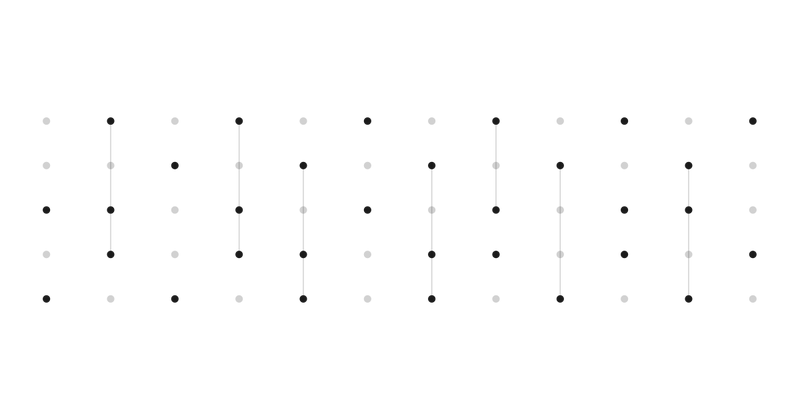

# 在 Transformer 里造了一台计算机：Percepta AI 让 LLM 跑程序

> 来源：[@ChristosTzamos](https://x.com/ChristosTzamos/status/2031845134577406426) · 2026-03-11
> 博客：[Can LLMs Be Computers?](https://www.percepta.ai/blog/can-llms-be-computers) · Percepta AI

*图源：Percepta AI 博客文章配图*

---

## 一句话总结

Percepta AI 在 Transformer 内部构建了一台"计算机"，能直接执行任意 C 程序——跑了几百万步的 Sudoku 求解，100% 正确率，CPU 上 30K tokens/秒。

---

## 背景：LLM 数学好但算不了数

LLM 能解研究级数学题，但遇到基础计算就拉胯。原因很简单：标准 attention 机制的计算量随序列长度暴涨，做不了真正的长程计算。

Christos Tzamos 和 Percepta 团队的目标很明确：**不是给 LLM 外挂计算器，而是让 Transformer 自己变成计算机。**

---

## 核心突破：2D Attention + 指数级加速

### 问题
标准 Transformer attention 对长序列的推理时间是 O(n²) 级别，跑几万步的程序根本不现实。

### 解法
团队提出了一种 **2D attention 机制**，跟标准 attention 完全不同：

- **推理时间亚线性增长** — 序列再长也不会崩
- **每个 token 的计算量近乎恒定** — 这是关键，意味着可以跑百万级步骤
- **所有计算都在 Transformer 权重内完成** — 不调用外部工具

### 结果
- 执行任意 C 程序，包括最难的 Sudoku 求解
- **100% 准确率**
- CPU 上 **30,000+ tokens/秒** 的执行速度
- 逐 token 自回归生成完整执行轨迹

---

## 为什么这很重要

### 1. LLM 不再只是"统计预测器"
这项研究从根本上挑战了"LLM 只是下一个 token 预测"的认知。Transformer 可以是**通用计算基底**。

### 2. 可验证的算法执行
不再是概率性输出——模型执行的是确定性程序，结果可以验证。这对需要精确计算的场景（金融、科学计算、形式验证）意义重大。

### 3. 不需要外部工具链
目前 LLM 做计算通常要调用 Python 解释器或计算器。Percepta 的方案把计算内化到模型里，去掉了工具调用的延迟和复杂度。

---

## 对 Builder 的启示

| 维度 | 当前做法 | Percepta 方案的方向 |
|------|---------|-------------------|
| LLM + 计算 | 外挂 code interpreter | 模型内部直接执行 |
| 长程推理 | CoT + 多步 prompt | 2D attention 一次性跑完 |
| 准确性保证 | 多次采样 + 验证 | 确定性执行，100% 准确 |
| 推理速度 | 随步数线性/二次增长 | 亚线性增长 |

**如果你在做 Agent 系统**：关注这个方向。未来的 LLM 可能不再需要 tool_use 来做精确计算，计算能力会成为模型的原生能力。

**如果你在做推理优化**：2D attention 机制值得深入研究。它暗示了一种全新的 attention 设计范式——不是优化标准 attention，而是为不同任务类型设计专门的 attention 结构。

---

## 社区反响

- 推文获得 **2000+ 赞**，226 转发
- 登上 Hacker News 首页，195 点 + 61 条讨论
- 社区讨论聚焦：与 Neural Turing Machine 的对比、程序合成的潜力

---

## 延伸阅读

- 🔗 [原始推文线程](https://x.com/ChristosTzamos/status/2031845134577406426)
- 🔗 [Percepta 博客：Can LLMs Be Computers?](https://www.percepta.ai/blog/can-llms-be-computers)
- 🔗 [Eugene Vinitsky 的评价](https://x.com/EugeneVinitsky/status/2031848122750517373)

---

*Percepta AI 的这项工作可能是 2026 年最有趣的 Transformer 架构突破之一。它不是在优化现有范式，而是在问一个更根本的问题：Transformer 到底能算什么？答案是——可能什么都能算。*

🦞
