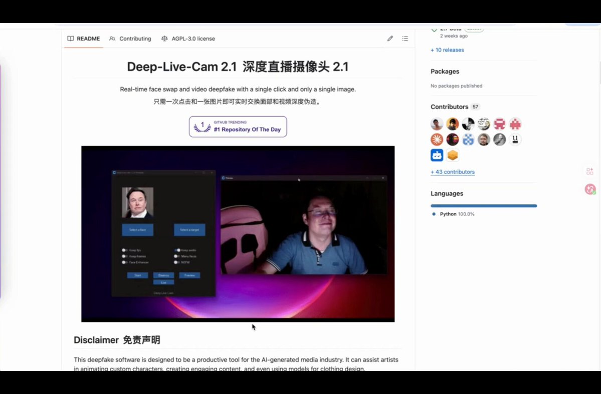

# Deep-Live-Cam：一张照片实时换脸，GitHub 81.5k+ Star 的最危险开源项目

> 来源：[@hank_aibtc](https://x.com/hank_aibtc/status/2037493951951929659) · 2026-03-27

*视频演示截图 · 来源：@hank_aibtc 推文附带视频*

## 这东西有多离谱？

HankAI 在推文中介绍了一个名为 **Deep-Live-Cam** 的开源项目——只需要一张照片，你就能在摄像头里实时变成任何人。GitHub Star 数已经突破 81.5k，还在持续暴涨。

这不是传统的 Deepfake "先渲染再导出"模式。这是**实时的**，可以直接用在视频通话里。

## 核心能力

1. **实时换脸** —— 直接在摄像头里跑，支持直播 / Zoom / Discord
2. **一张图搞定** —— 不需要训练模型，不需要数据集，选脸 → 选摄像头 → 点击开始
3. **多人同时换脸** —— 多人场景也能跑
4. **多平台 + 硬件加速** —— 支持 NVIDIA / AMD / Apple Silicon，GPU 加速性能拉满
5. **效果接近可用** —— 内置人脸增强、嘴型同步、融合优化，比很多 demo 强一个量级

## 为什么值得关注

对于开发者和 builder 来说，这个项目的意义不只是"又一个 deepfake 工具"：

- **技术门槛已经降到零**：不需要 ML 背景，不需要训练数据，开箱即用
- **实时性改变了游戏规则**：从"后期制作"变成"实时互动"，应用场景完全不同
- **开源意味着不可控**：代码已经在那里了，任何人都可以 fork 和修改

## 伦理与风险

项目官方也明确说了：
- 禁止处理不当内容
- 需要获得真人授权
- 可能会加水印或限制功能

但现实是——这是一个**技术已经成熟，但边界还没完全定清的领域**。

对于做安全、身份验证、KYC 相关产品的团队来说，这类工具的存在意味着：**人脸验证可能不再可靠**。视频通话里的人，可能不是本人。这需要行业认真对待。

## 相关链接

- **推文原文**：[HankAI 推文](https://x.com/hank_aibtc/status/2037493951951929659)
- **GitHub 仓库**：[hacksider/Deep-Live-Cam](https://github.com/hacksider/Deep-Live-Cam)

## 总结

Deep-Live-Cam 把实时 Deepfake 变成了"人人可用"的工具。技术本身是中性的，但它对身份验证、视频通话安全、内容真实性的冲击是真实的。作为 builder，不管你是做安全产品还是内容工具，都值得了解这个项目的能力边界。

---

🦞
