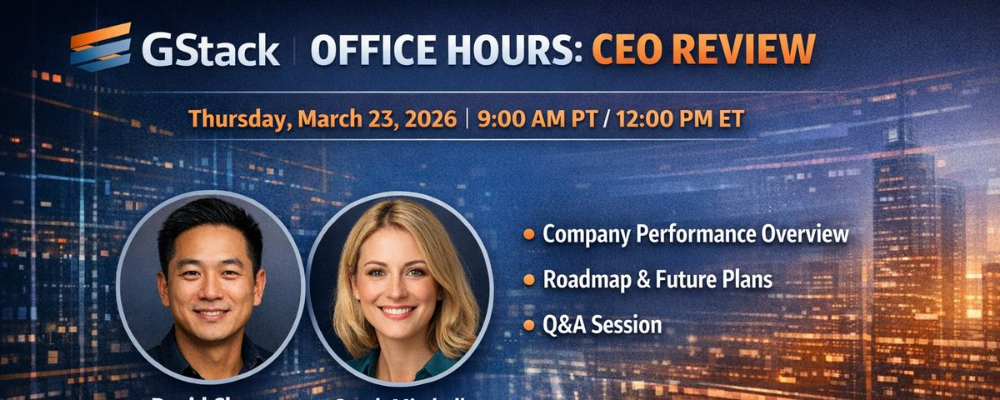

# gstack 深度拆解：Office Hours + CEO Review — YC CEO 搭建的 AI 产品思考工具链

> 原推文：[peter6759/status/2035718798834369012](https://x.com/peter6759/status/2035718798834369012)
> 日期：2026-03-22


*图片来源：[@peter6759](https://x.com/peter6759) 推文附图*

---

## TL;DR

Garry Tan（YC CEO）开源了 gstack — 一套把 Claude Code 变成虚拟工程团队的 Markdown skill 文件系统。本文重点拆解其中两个「思考型」skill：**/office-hours** 和 **/plan-ceo-review**，它们不写一行代码，却可能是整个 gstack 里最值得偷学的部分。

---

## 背景：gstack 是什么

gstack 是 Garry Tan 的个人 Claude Code 工作流，以 MIT 协议开源在 [GitHub](https://github.com/garrytan/gstack)。

核心理念很简单：**用 Markdown 定义角色，让 AI 扮演不同工程团队成员**。

目前包含 20+ 个 slash command，覆盖：

| 角色 | 代表 Skill |
|------|-----------|
| CEO / 产品 | `/office-hours`、`/plan-ceo-review` |
| 工程经理 | `/plan-eng-review` |
| 设计师 | `/plan-design-review`、`/design-consultation` |
| 代码审查 | `/review`（偏执级 reviewer） |
| QA 测试 | `/qa`（真的开浏览器点） |
| 安全官 | `/cso`（OWASP + STRIDE 审计） |
| 发布工程 | `/ship`、`/land-and-deploy`、`/canary` |

Garry Tan 自称用这套工具在 60 天内产出 60 万+ 行生产代码（35% 是测试），每天 1-2 万行，同时还在全职管 YC。

---

## 深度拆解：/office-hours

### 它干什么

`/office-hours` 模拟 YC office hours 的体验 — 你带着一个模糊的想法来，AI 用结构化提问帮你把它拆清楚。

### 两种模式

1. **Startup 模式** — 六个逼问（forcing questions）：
   - 需求现实（demand reality）：有多少人*真的*要这个？
   - 现状替代品（status quo）：他们现在怎么解决？
   - 绝望程度（desperate specificity）：谁*最*需要？
   - 最窄切入点（narrowest wedge）：第一版只做什么？
   - 观察能力（observation）：你观察到了什么别人没看到的？
   - 未来适配（future-fit）：这在 3 年后还有意义吗？

2. **Builder 模式** — 设计思维头脑风暴，适合 side project / hackathon / 学习项目。

### 为什么有用

关键在于：**它不是给你答案，而是逼你想清楚问题**。

大多数人用 AI 编程工具的方式是「帮我写个 XXX」。gstack 的 `/office-hours` 反过来 — 在你写任何代码之前，先确认你要造的东西值得造。

实际例子（来自 README）：

```
你：我想做一个日历简报 app。
Claude：[问具体痛点、举例子]
你：多个 Google 日历，信息过时，地点错误...
Claude：我要挑战一下你的框架。你说的不是「日历简报 app」，
       你描述的其实是一个「个人 AI 参谋长」。
       [提炼出你没意识到的 5 个能力]
       [挑战 4 个前提假设]
       [给出 3 种实现路径 + 工作量估算]
       建议：明天先发最窄版本，从真实使用中学习。
```

---

## 深度拆解：/plan-ceo-review

### 它干什么

`/plan-ceo-review` 把 Claude 切换成 CEO/创始人模式，对你的 feature 或产品计划做一次**完整的 11 维评审**。

### 评审维度

| # | 维度 | 说明 |
|---|------|------|
| 1 | 架构 | 系统设计是否合理 |
| 2 | 错误处理 | 每条错误路径是否 mapped |
| 3 | 安全 | 高危问题标记 |
| 4 | 数据/UX | 边界 case 是否处理 |
| 5 | 质量 | 代码质量问题 |
| 6 | 测试 | 覆盖率图 + gap 分析 |
| 7 | 性能 | 瓶颈识别 |
| 8 | 可观测性 | 日志/监控是否到位 |
| 9 | 部署 | 发布风险 |
| 10 | 未来 | 可逆性评分 + 技术债清单 |
| 11 | 设计 | UI 相关问题（可跳过） |

输出是一张大表（MEGA PLAN REVIEW COMPLETION SUMMARY），列出每个维度的发现数量、gap 数量、严重程度。

### 四种评审模式

- **EXPANSION** — 扩张模式，同意范围扩大
- **SELECTIVE** — 有选择地接受建议
- **HOLD** — 维持现状
- **REDUCTION** — 减法模式

### 灵感来源

Garry 称这是受 Brian Chesky（Airbnb CEO）的「10 星产品体验」思维启发。不同于普通顾问给观点，`/plan-ceo-review` 跑的是一个**结构化评估框架**，而且 AI 可以实时搜索市场信息来支撑分析。

---

## 为什么这两个 Skill 最值得学

1. **零代码，纯思维工具**：不需要安装 gstack 也能偷学。把这些提问框架塞进你自己的 system prompt 就行。

2. **解决了 AI 编程最大的问题**：大家都在追求「写得快」，但真正的瓶颈是「想得不清楚」。这两个 skill 就是在解决「想」的问题。

3. **可复制的方法论**：六个 forcing questions 和 11 维评审框架，适用于任何产品 / feature，不限于 Claude Code。

---

## Builder 视角：怎么用到自己项目

### 不装 gstack 也能用

把核心提问框架写进你的 CLAUDE.md 或 system prompt：

```markdown
## 新 Feature 之前必须回答：
1. 谁是最绝望需要这个的人？（具体到一个人）
2. 他们现在怎么解决？为什么现有方案不够好？
3. 第一版最窄能窄到什么程度？
4. 做完之后怎么衡量成功？
```

### 装了 gstack

```bash
# 安装（30 秒）
git clone --depth 1 https://github.com/garrytan/gstack.git ~/.claude/skills/gstack
cd ~/.claude/skills/gstack && ./setup

# 使用
/office-hours   # 带着想法来聊
/plan-ceo-review  # 对已有计划做评审
```

支持 Claude Code、Codex、以及任何支持 SKILL.md 标准的 agent。

---

## 个人看法

gstack 获得 26k+ star，很多人关注的是「YC CEO 的编程工具」这个噱头。但真正有价值的不是那些代码审查和 QA skill（虽然也不错），而是 **office-hours 和 ceo-review 背后的产品思维框架**。

这些框架把 20 年 YC 看项目的经验编码成了可复用的 Markdown。你不需要用 Claude Code，不需要装 gstack，只需要把这些提问方式偷过来用在自己的工作流里。

用 Garry 自己的话说：**same person, different era, the difference is the tooling。**

---

🦞
