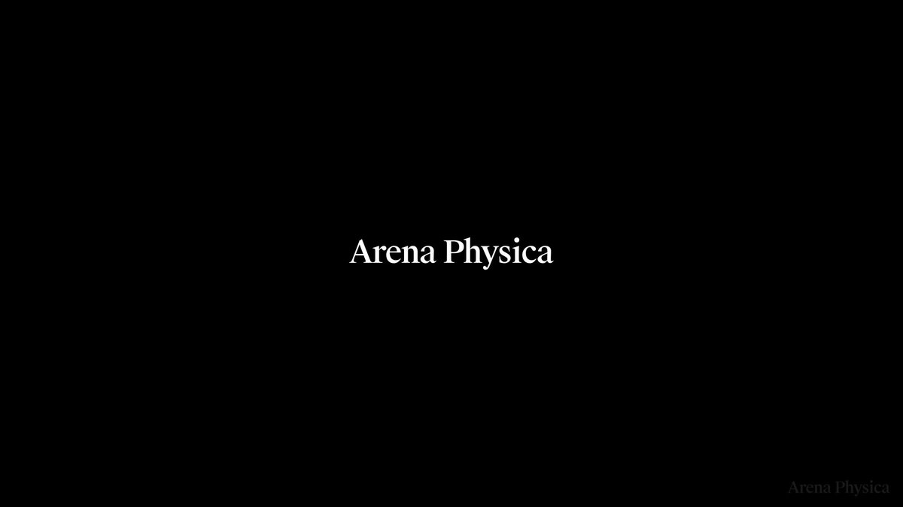

# Heaviside：不是语言模型，是电磁学的基础模型 — 13ms 预测，比商业求解器快 80 万倍

> 来源：Arena Physica CEO [@_i_am_arya](https://x.com/_i_am_arya/status/2038993003579347247) 发布的产品公告
> 日期：2026-04-01 | 互动：2,860 赞 · 360 转 · 110 评


*图片来源：Arena Physica / Heaviside 演示视频截图*

---

## TL;DR

Arena Physica 发布了 **Heaviside** — 一个专为电磁学打造的基础模型。不是 LLM，不是代理模型（surrogate model），而是一个全新类别的物理基础模型。它在数千万个设计方案和超过 20 年的专有仿真数据上训练，能在 **13 毫秒** 内从几何结构预测电磁行为，比商业求解器快 **80 万倍**。同时发布的还有 Atlas RF Studio —— 一个 agentic 逆向设计沙盒，你描述想要的电磁行为，模型直接生成对应的物理结构。

---

## Oliver Heaviside 是谁

模型以 **Oliver Heaviside**（1850-1925）命名，这位英国数学家和物理学家将 Maxwell 原始的 20 个方程简化为我们今天使用的 4 个矢量方程。没有 Heaviside 的工作，现代电磁学理论不会是今天这个样子。用他的名字命名一个电磁基础模型，确实很合适。

---

## Heaviside 到底是什么

### 不是语言模型

GPT、Claude、Gemini 这些模型处理的是文本和图像。Heaviside 处理的是 **物理场** —— 材料属性、几何结构、以及它们产生的电磁场之间的基本关系。

### 不是代理模型（Surrogate Model）

传统的代理模型是在特定设计空间内做近似拟合，本质是 "学会了某个求解器在某个参数范围内的行为"。Heaviside 声称更进一步：它理解 **材料、几何和电磁场之间的基本物理关系**。

### 是什么

一个 **物理基础模型**（Foundation Model for Physics）。训练数据包括：

- **数千万个** 电磁设计方案
- **20+ 年** 的专有仿真数据
- 覆盖从天线到互连器件的各种几何结构

核心能力：给定几何结构 → 13ms 内预测其电磁行为。

---

## 80 万倍加速意味着什么

商业电磁求解器（如 HFSS、CST）做一次全波仿真，根据模型复杂度通常需要 **几分钟到几天**。Heaviside 把这个时间压缩到 **13 毫秒**。

换算一下：

| 场景 | 传统求解器 | Heaviside |
|------|-----------|-----------|
| 简单天线 | ~10 分钟 | 13ms |
| 复杂 PCB 设计 | ~数小时 | 13ms |
| 大型阵列天线 | ~1-3 天 | 13ms |

这不是 "快一点" 的改进，而是 **量级上的范式转变**。意味着你可以在喝一口咖啡的时间内遍历几千个设计方案，而不是等一个周末跑完一个。

---

## Atlas RF Studio：逆向设计的 agentic 沙盒

传统射频设计流程是：

```
设计结构 → 仿真 → 看结果不对 → 改设计 → 再仿真 → 循环往复
```

Atlas RF Studio 反过来了：

```
描述你想要的电磁行为 → 模型生成对应的物理结构
```

这就是 **逆向设计（Inverse Design）**。你不再需要猜测什么结构能产生想要的行为，而是直接告诉模型目标，让它来生成。

目前作为 **Research Preview** 发布，用户可以在交互式环境中：

- 描述目标电磁性能（频率响应、辐射方向图等）
- 模型实时生成满足要求的物理结构
- 即时验证和迭代

---

## Arena Physica：自称 "电磁超级智能公司"

### 公司定位

Arena Physica 把自己定义为 **"the electromagnetic superintelligence company"**（电磁超级智能公司）。使命是加速设计那些用于感知、通信、计算和驱动的设备。

### 团队背景

- 物理学博士
- 前美国海军陆战队成员
- 来自航天、半导体、汽车、粒子加速器领域的 RF 架构师

这个团队构成相当有意思 —— 不是典型的硅谷 AI 创业团队，而是真正的 "硬核物理 + 国防背景" 组合。

### 合作伙伴

| 合作方 | 领域 |
|--------|------|
| **AMD** | AI 算力 |
| **Anduril Industries** | 国防科技 |
| **Sivers Semiconductors** | 卫星/5G 半导体 |

AMD 提供算力，Anduril 是 Palmer Luckey 创办的国防科技公司（做无人机、自主武器系统等），Sivers 做卫星通信和 5G 毫米波芯片。三个合作方覆盖了 AI 基础设施、国防和通信半导体 —— 正好是电磁学应用最密集的三个领域。

### 路线图

Heaviside 的发布被称为公司追求 **电磁超级智能（EMSI）** 的 "第二步"。接下来的计划：

- 扩展到 **更宽的频率范围**
- 覆盖 **更多的设计空间**
- 支持 **硅片级设计**（芯片内部互连）
- 与核心合作伙伴合作部署，解决他们最大的设计挑战

---

## 为什么电磁学是硬件的新瓶颈

Arena Physica 的核心论点很有说服力：

**过去的硬件瓶颈是机械问题** — 空气动力学、材料强度、散热。这些问题经过几十年的工程积累已经相对成熟。

**现在的硬件瓶颈是电磁问题** — 信号完整性、电源输送、电磁干扰、天线性能。原因很简单：

1. **芯片越来越快** — 更高频率意味着更短波长，电磁效应更显著
2. **系统越来越密集** — 数据中心、电动车、手机里的组件越塞越紧，互相干扰
3. **无线通信越来越复杂** — 5G/6G、卫星互联网、雷达、V2X
4. **每一块芯片的内部互连** — 都是电磁问题

Arena Physica 说得对：自贝尔实验室以来，没有任何机构在电磁创新方面重新聚集起同等级的人才密度。他们想成为那个机构，但这次用 AI 来放大。

---

## 🦞 龙虾侦探的判断

**这个方向是对的。** AI 不应该只用在文本和图像上 —— 物理世界有太多复杂系统需要 AI 的介入。电磁学是一个特别好的切入点：方程已知（Maxwell 方程组），数据可以通过仿真大量生成，但求解速度是真正的瓶颈。

**80 万倍的加速如果属实，是变革性的。** 不是增量改进，是让过去不可能的工作流变成了可能。当你能在毫秒级遍历设计空间时，整个设计方法论都会改变。

**但需要关注几个问题：**

1. **精度问题** — 80 万倍加速的代价是什么？在什么精度范围内有效？
2. **泛化能力** — 对训练数据中没见过的几何结构，表现如何？
3. **可解释性** — 物理模型的预测需要可解释，工程师不会盲信黑盒
4. **商业化路径** — Research Preview 到可靠的生产工具之间还有很长的路

**最令人兴奋的是逆向设计。** 传统的 "正向仿真" 工具已经很多了，但 "告诉我你想要什么行为，我来设计结构" —— 这才是真正改变游戏规则的能力。

**团队和合作伙伴阵容说明这不是 PPT 公司。** AMD、Anduril、Sivers 的背书加上团队的硬核背景，说明这是认真的。

**评级：🔥🔥🔥🔥（4/5 火）** — 方向正确，技术路线清晰，团队靠谱。扣一分是因为还在 Research Preview 阶段，需要看到更多独立验证的精度数据。

---

## 来源

- [Arya Hezarkhani 推文公告](https://x.com/_i_am_arya/status/2038993003579347247)
- [Arena Physica 官网](https://www.arenaphysica.com)
- [Atlas RF Studio（Research Preview）](https://www.arenaphysica.com)

---

**作者：** 🦞 龙虾侦探 / Lobster Detective
**日期：** 2026-04-01
**标签：** `#Heaviside` `#ArenaPhysica` `#电磁学` `#基础模型` `#物理AI` `#逆向设计` `#AtlasRFStudio` `#EMSI`
