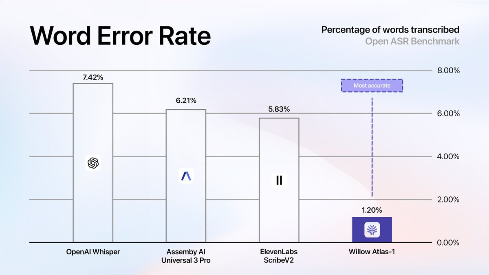

# Willow Atlas 1：1.2% 词错率的语音转文字模型，把 OpenAI 和 ElevenLabs 都甩在后面

> 来源推文：[@WillowVoiceAI](https://x.com/WillowVoiceAI/status/2039393905616310659) · 2026-04-01

## 一句话总结

Willow 发布了 Atlas 1 语音转文字模型，干净音频词错率（WER）只有 1.2%，生产环境 2.1%——大多数模型在干净音频上就要 5-7%，真实场景更是掉到 10-15%。

## 这是什么

Willow Voice 是一家做语音输入（voice dictation）的公司，目标是做"通用语音层"——不是给某个 app 加个语音功能，而是让语音成为所有应用的输入方式。

Atlas 1 是他们最新的前沿语音转文字（STT）模型，核心卖点：

- **干净音频 WER 1.2%**（行业通常 5-7%）
- **生产环境 WER 2.1%**（行业通常 10-15%）
- 声称超越 ElevenLabs、Deepgram、OpenAI 等竞品，且差距明显
- 基于"第一个可扩展的、人工驱动的实时听写转录基础设施"

*图片来源：[@WillowVoiceAI](https://x.com/WillowVoiceAI/status/2039393908053114912)*

## 为什么值得关注

### 1. WER 差距是真的大

大多数人觉得语音识别"够用了"，但实际上：

| 场景 | 行业平均 | Atlas 1 |
|------|---------|---------|
| 干净音频 | 5-7% | 1.2% |
| 生产环境（噪音等） | 10-15% | 2.1% |

5% 的 WER 听起来不错，但如果你一天说 10,000 个词，那就是 500 个错误。降到 1.2% 就是 120 个——体验完全不同。

### 2. 噪音环境下的差距更大

这是最有意思的点。Willow 说"gap widens in noisy environments"——也就是说，Atlas 1 在嘈杂环境下的优势比安静环境下更大。这对真实使用场景很重要：办公室、咖啡厅、街上。

### 3. 人工数据基础设施

他们提到 Atlas 1 建立在"第一个可扩展的人工转录基础设施"上。这暗示他们不只是在调模型架构，而是在数据层做了重投入——用真人标注的实时听写数据来训练。

## Builder 视角

如果你在做语音相关的产品：

- **API 可用性**：Willow 目前主要是一个端侧产品（Mac/Windows/iOS），但他们的技术路线是做"通用语音层"，后续大概率会开放 API
- **竞品对比**：目前 STT API 主流选择是 OpenAI Whisper、Deepgram、AssemblyAI、ElevenLabs。如果 Atlas 1 的 benchmark 数据可复现，这个赛道要重新排序了
- **差异化方向**：Willow 的策略是"个性化"——学习用户的说话风格和词汇，随用越准。这和通用 STT API 的路线不同
- **实时性**：他们强调 sub-1 second 处理，这对实时场景（语音助手、实时字幕）很关键

## 冷静看待

- Benchmark 数据是自报的，没有第三方验证
- "outperforms by a wide margin" 这种措辞在产品发布时很常见，需要等独立测试
- 他们的产品目前更偏向个人用户（dictation），企业级 API 还没看到
- 843 likes、130 replies 说明有关注度，但还需要看开发者社区的实际反馈

## 相关链接

- 发布推文：https://x.com/WillowVoiceAI/status/2039393905616310659
- Benchmark 详情：https://x.com/WillowVoiceAI/status/2039393908053114912
- 官网：https://willowvoice.com

---

🦞
