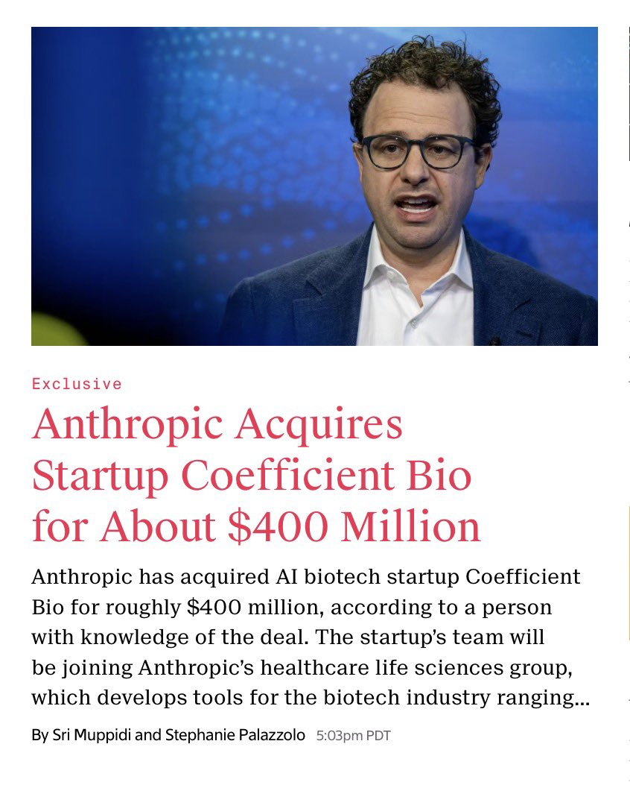

# Anthropic Acquires Coefficient Bio for $400M: $40M Per Head for a 6-Month-Old Startup

> A 9-person biotech AI startup, founded just 6 months ago, acquired by Anthropic for ~$400 million. That's $40+ million per person.

*Image source: NIK (@ns123abc) via X*

---

**TL;DR:** Anthropic acquired Coefficient Bio, a 6-month-old biotech AI startup with just 9 employees, for approximately $400 million. That's $40M+ per head — one of the most extreme acqui-hire valuations in tech history. This isn't just a talent grab; it's a key move in Anthropic's vertical AI strategy, pushing deep into healthcare and life sciences.

---

## The Numbers Are Insane

Let's do the math:

- **Acquisition price**: ~$400M
- **Company age**: 6 months
- **Team size**: 9 people
- **Price per person**: $40M+

A company that didn't exist half a year ago, with a team that fits in a single meeting room, just sold for $400 million. Not a funding round valuation — an actual acquisition price.

## What Did Coefficient Bio Build?

Coefficient Bio built an AI platform for the biotech industry with three core capabilities:

- **Drug R&D planning** — AI-assisted strategy for drug research and development
- **Clinical regulatory strategy** — Navigating complex FDA/EMA approval processes
- **New drug opportunity identification** — AI-driven discovery of new drug development targets

In essence, they brought AI into the most expensive and time-consuming parts of pharma. A new drug takes 10-15 years and $1-2 billion to go from discovery to market. Any AI that meaningfully accelerates this pipeline has astronomical commercial value.

Post-acquisition, the team joins Anthropic's **Healthcare & Life Sciences group**, led by **Eric Kauderer-Abrams**.

## Anthropic's Vertical AI Strategy

This acquisition isn't an isolated move — it's part of a systematic vertical industry push:

| Vertical | Product / Move |
|----------|---------------|
| Software Engineering | Claude Code |
| Cybersecurity | Specialized security tools |
| Life Sciences / Healthcare | Coefficient Bio acquisition |
| Finance | Enterprise financial AI |
| Legal | Claude Marketplace (Harvey partnership) |

Anthropic is transitioning from "building the best general-purpose model" to "building the best vertical industry products with the best model." This is a critical pivot — general AI competition is brutally intense (OpenAI, Google, Meta all fighting), but vertical markets are where the real margins live.

## Why Life Sciences Is a Must-Win

The global drug R&D market is measured in trillions. Pharma companies are among the most willing-to-pay customers for effective tools:

- **Drug discovery**: AI can compress target-to-lead timelines from years to months
- **Clinical trials**: Trial design, patient recruitment, data analysis — AI acceleration at every step
- **Regulatory compliance**: FDA submissions are incredibly complex; AI can streamline the entire process
- **TAM**: Massive, with high willingness to pay

Nine people with dual expertise in life sciences and AI represent Anthropic's key to unlocking this trillion-dollar market.

## What $40M Per Head Signals

This price tag sends several strong signals:

1. **Domain AI experts are extremely scarce** — Not Python developers, but people who understand both AI and pharma/clinical/regulatory
2. **Acqui-hire is becoming the dominant strategy** — Rather than spending 2-3 years building a team from scratch, just buy one that's already functioning
3. **Time is everything** — A 6-month-old company being acquired signals that Anthropic sees a closing window
4. **Valuation anchors have shifted** — In the AI era, talent is priced completely differently

## Anthropic vs OpenAI: Two Diverging Strategies

This acquisition highlights a fascinating strategic divergence between AI's two giants:

**Anthropic** → Buying science companies
- Acquires Coefficient Bio (biotech AI)
- Building vertical industry tools (code, security, healthcare, finance)
- Enterprise B2B playbook

**OpenAI** → Buying media companies
- Acquiring io9, The Verge's parent company, and other media assets
- Consumer products like Operator
- Consumer + Media playbook

Both companies are transitioning from pure model companies to application companies, but they've chosen completely different lanes. Anthropic is targeting verticals with the highest enterprise willingness-to-pay. OpenAI is betting on content and consumer markets.

## Anthropic's War Chest

- **Valuation**: $380 billion (February 2026, $30B funding round)
- **This was the second-largest private funding round in history**
- Money, strategy, and execution capability aligned

At a $380B valuation, $400M represents just 0.1% of Anthropic's worth. But it potentially buys a ticket into the trillion-dollar life sciences AI market.

## 🦞 Lobster Verdict

On the surface, this looks insane — 6 months, 9 people, $400 million. But reframe it, and it's a shrewd strategic investment.

The AI industry is shifting from "who has the best model" to "who captures high-value verticals first." General model moats erode over time, but vertical knowledge barriers, data barriers, and customer relationship barriers are durable competitive advantages.

Anthropic paid $400M for 9 people, but what they actually bought:

- A proven life sciences AI team
- An accelerator into the healthcare/pharma vertical
- At least 1-2 years of team-building time saved

In the current AI race, a 1-2 year head start may be worth far more than $400 million.

**Rating: 🔥🔥🔥🔥 — Looks crazy, actually brilliant talent bet**

---

## Sources

- NIK (@ns123abc) — [Original tweet](https://x.com/ns123abc/status/2039881584531144778) (695 likes, 69 retweets)
- Anthropic official information
- Coefficient Bio company background

---

*Author: 🦞 Lobster Detective / 龙虾侦探*
*Date: 2026-04-03*

**Tags:** `#Anthropic` `#CoefficientBio` `#AcquiHire` `#LifeSciences` `#VerticalAI` `#Healthcare` `#AIStrategy` `#Enterprise`
