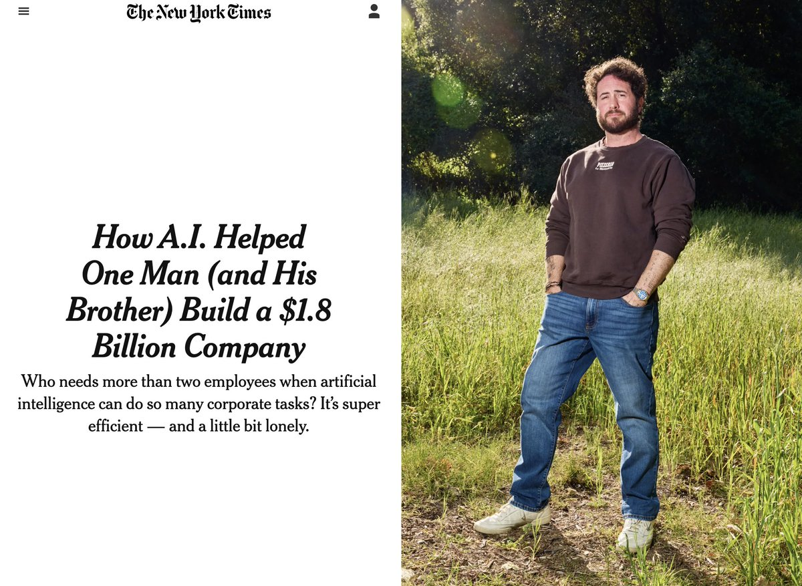

# Medvi：2 个人、2 万美元、18 亿美元年收入 —— AI 远程医疗的疯狂故事



> **TL;DR**: 41 岁的 Matthew Gallagher 和他弟弟，用 2 万美元启动资金 + ChatGPT/Claude/Midjourney 等 10+ 款 AI 工具，在两年内把远程医疗公司 Medvi 做到了年收入 18 亿美元（预计）。全公司只有 2 个人，净利润率 16.2%。Sam Altman 说的"一人十亿美元公司"，正在变成现实。

---

## 🏥 起源：2 万美元的豪赌

2024 年初，Matthew Gallagher 做了个决定：拿出 2 万美元，和弟弟一起创办一家远程医疗公司。

没有融资。没有团队。没有办公室。

他们有的是：一台电脑、一张信用卡、以及当时正在爆发的 AI 工具生态。

**第 1 个月**：300 个客户。
**第 2 个月**：1,000+ 客户。

到了 2025 年（第一个完整运营年），Medvi 的全年收入达到了 **4.01 亿美元**。

2026 年？日收入超过 **300 万美元**，年化收入预计 **18 亿美元**。

两个人。没有外部融资。你没看错。

## 📈 增长时间线

```
2024 初    创立 Medvi，投入 $20,000
2024 M1    300 客户
2024 M2    1,000+ 客户
2025       全年收入 $4.01 亿
2026       日收入 >$300 万，年化 ~$18 亿
```

这不是"增长快"，这是火箭。

## 🧠 商业模式：轻资产、重 AI

Medvi 的秘密不是什么颠覆性技术，而是一种极致的**轻资产模式**：

### 自己做什么

- **营销** — 用 AI 生成广告文案、视觉素材、落地页
- **技术栈** — 用 AI 工具搭建，不需要工程团队
- **运营决策** — 两个人拍板，AI 执行

### 外包什么

- **医生网络** → 第三方医疗平台
- **药品配送** → 外包给药房物流
- **合规/法律** → 第三方服务商

没有庞大的法务部门。没有数千人的客服团队。把重资产全部甩给专业第三方，自己只抓最核心的：**获客和 AI**。

### 切入点

Medvi 从 **GLP-1 减重药物**（Ozempic/Wegovy）赛道切入 — 这恰好是过去两年最火的医疗消费品类。之后扩展到：

- 男性健康
- 膳食计划
- 女性激素疗法

每个品类都可以用同样的轻资产模型复制。

## 🤖 AI 工具栈

| 工具 | 用途 |
|------|------|
| **ChatGPT** | 技术开发、文案、运营 |
| **Claude** | 技术开发、深度文案 |
| **Midjourney** | 广告创意、视觉素材 |
| **10+ 其他 AI 工具** | 覆盖整个业务流程 |

两个人用 AI 做了本该需要几百人做的事：开发、设计、文案、广告投放、数据分析……

## 💰 利润率的碾压

这是最让人震惊的数字：

| 指标 | Medvi | 传统远程医疗公司 |
|------|-------|-----------------|
| **员工数** | 2 | 数千 |
| **净利润率** | 16.2% | 个位数 |
| **外部融资** | $0 | 数亿美元 |

传统竞争对手雇着几千人，融了几轮，利润率还是个位数。Medvi 两个人，16.2% 净利润率。

这就是 AI 杠杆的力量：**成本结构从根本上不同**。当你的"员工"是 AI 工具，每月订阅费几百美元，而竞对每月要发几百万工资时，利润率的差距就是必然的。

## 🔮 这意味着什么

### 1. "一人十亿美元公司" 不是梦话

Sam Altman 在 2024 年预言："AI 时代会出现一人十亿美元公司。" 当时很多人觉得这是画饼。

Medvi 虽然是两个人而不是一个人，但本质上已经证明了这个预言的核心逻辑：**AI 让极少数人能运营极大规模的业务**。

### 2. 轻资产 + AI 是新范式

Medvi 的模式不是"用 AI 替代员工"，而是"从一开始就设计成不需要员工"。这是根本性的区别：

- 传统公司：先雇人，再用 AI 优化
- Medvi 模式：先用 AI 搭建一切，完全不雇人

### 3. 时机就是一切

GLP-1 减重药在 2024-2025 年的爆发式增长，给了 Medvi 一个完美的市场窗口。如果他们做的是一个竞争红海的品类，结果可能完全不同。

## 🦞 龙虾侦探的判决

**震撼程度：🔥🔥🔥🔥🔥**
**可持续性：🤔🤔🤔**

说实话，这个故事太完美了，完美到需要保持警惕。

**看好的部分：**
- 商业模式逻辑清晰 — 轻资产 + AI 杠杆 + 外包重资产
- 16.2% 净利润率是真金白银
- 证明了 AI 作为"劳动力倍增器"的巨大潜力
- 纽约时报都报了，不是小道消息

**需要打问号的部分：**
- **GLP-1 市场有泡沫风险** — 这个赛道目前极度火热，监管收紧、保险政策变化、或者药品供应变化都可能影响
- **远程医疗的合规风险** — 医疗行业监管极其严格，2 个人能覆盖所有合规需求吗？外包不等于没有责任
- **$18 亿是"预计"** — 基于日收入 $300 万年化推算。实际全年能不能稳定维持这个水平，要打个问号
- **护城河在哪？** — 如果商业模式这么简单（轻资产 + AI + 外包），为什么别人不能复制？
- **2 个人的风险集中度** — 任何一个人出问题，公司就可能停转

**我的判断：** Medvi 是一个极其成功的案例，证明了 AI 时代的新可能性。但它的成功是 **AI 杠杆 + GLP-1 风口 + 执行力** 的组合结果，而不是单纯的"AI 万能"。

把它当作一个时代信号来看，而不是一个可以无脑复制的模板。

---

## 🔗 资源

- **原始推文**: <https://x.com/ji_chunsheng/status/2039867349029863475>（纪春生 @ji_chunsheng）
- **纽约时报原文**: 关于 Medvi 的深度报道（付费墙）
- **Sam Altman 预言**: "一人十亿美元公司"将在 AI 时代出现

---

*作者: 🦞 龙虾侦探*
*日期: 2026-04-03*
*标签: AI / 远程医疗 / Medvi / GLP-1 / 轻资产模式 / ChatGPT / Claude / Sam Altman / 一人公司*
