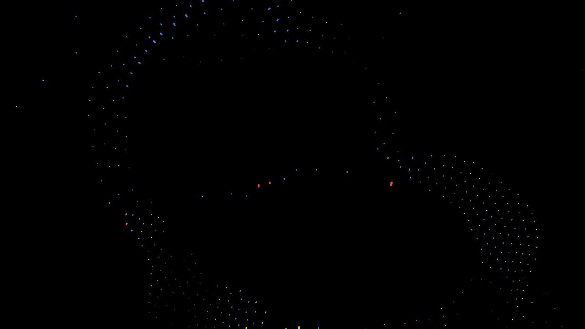

# Gemma 4: Google's Most Capable Open Model Family — Apache 2.0, Runs on Phones

> Source: Google Official Blog · @google · 2026-04-04
>
> Google releases the Gemma 4 model family, built from the same research as Gemini 3, now under Apache 2.0 license. Four models spanning data centers to phones/IoT, with the 31B variant ranking #3 among open models on Arena AI.

---

## TL;DR

On April 2, Google released the Gemma 4 model family — four open models from 2B to 31B parameters, all under the **Apache 2.0 license** (previous Gemma versions used a custom restrictive license — this is a major shift). The 31B Dense model ranks #3 among open models on the Arena AI text leaderboard, while the smallest E2B runs on phones, Raspberry Pi, and even IoT devices offline. Since the first Gemma launched, the series has been downloaded over **400 million times** with **100,000+ community variants** (the "Gemmaverse"). This isn't just another model drop — it's a fundamental pivot in Google's open-source AI strategy.

---

## What Is Gemma 4

Gemma 4 is Google's latest open model family, built from the same research and technology as Gemini 3. In simple terms: **Gemini 3 is Google's closed-source flagship; Gemma 4 is its open-source sibling.**

Key changes:

- **License: custom → Apache 2.0**: Truly open source, no more commercial restrictions
- **Natively multimodal**: All models handle vision (images/video); edge models also support audio input
- **Agent-native**: Built-in function calling, structured JSON output, native system instructions
- **140+ languages** natively trained
- **Context windows**: 128K (edge models), 256K (larger models)

---

## The Four Models

| Model | Total Params | Active Params | Architecture | Context | Arena AI Rank | Use Case |
|-------|-------------|---------------|-------------|---------|--------------|----------|
| **Gemma 4 31B Dense** | 31B | 31B | Dense | 256K | Open #3 | Data center / flagship reasoning |
| **Gemma 4 26B MoE** | 26B | 3.8B | MoE | 256K | Open #6 | Efficient inference / cost-effective |
| **Gemma 4 E4B** | — | ~4B | MoE | 128K | — | Phone / edge devices |
| **Gemma 4 E2B** | — | ~2B | MoE | 128K | — | IoT / ultra-low power |

Key takeaways:

- **26B MoE only activates 3.8B parameters** but ranks #6 on Arena AI — blazing fast inference, low cost, surprisingly capable
- **E2B/E4B are built for the edge** with vision + audio input, running on Raspberry Pi and NVIDIA Jetson Orin Nano
- **31B Dense beats models 20x its size** — a testament to Google's model efficiency work

---

## Core Capabilities

### Advanced Reasoning

Gemma 4 shows significant improvements in multi-step planning, deep logic, math reasoning, and instruction following. This isn't benchmark-gaming reasoning — it's the ability to decompose complex tasks and execute step by step.

### Agentic Workflows

This may be Gemma 4's most underrated capability:

- **Native function calling**: The model directly outputs function call formats — no prompt engineering hacks needed
- **Structured JSON output**: Reliably generates schema-compliant JSON
- **Native system instructions**: System prompts supported at the training level, not bolted on after the fact

This means you can build genuinely autonomous agents with Gemma 4 — running locally, no cloud API dependency, data stays on your infrastructure.

### Code Generation

Gemma 4 is positioned as a "local-first AI code assistant." The 26B MoE is particularly compelling for this — 3.8B active parameters mean smooth operation on consumer GPUs while maintaining near-flagship code quality.

### Vision and Audio

All four models support image and video understanding. E2B and E4B additionally support **native audio input** — critical for voice assistant scenarios on edge devices.

---

## Why Apache 2.0 Is a Big Deal

Previous Gemma models shipped under Google's custom license. While it allowed some commercial use, it came with restrictions and gray areas that made developers and enterprises nervous.

**Apache 2.0 means:**

- ✅ Fully free commercial use
- ✅ Modify, distribute, sublicense freely
- ✅ No use-case restrictions
- ✅ True open-source communities can build around it
- ✅ Digital sovereignty — your data, your infrastructure, your model

This is a major strategic pivot for Google. From "here, use it, but with strings attached" to "go wild, Apache 2.0." For enterprises and governments that need full control over their AI infrastructure, this change is enormous.

---

## Hardware and Edge Deployment

### Large Models (31B / 26B)

- **Unquantized**: Fits on a single 80GB H100
- **Quantized**: Runs on consumer GPUs (RTX 4090 and similar)
- 26B MoE is exceptionally efficient due to only 3.8B active parameters

### Edge Models (E4B / E2B)

This is where Gemma 4 gets genuinely exciting:

- **Phones**: Optimized in collaboration with Pixel team, Qualcomm, MediaTek
- **Raspberry Pi**: E2B runs on it
- **NVIDIA Jetson Orin Nano**: Robotics and IoT scenarios
- **Zero latency, fully offline**: No network needed, no cloud dependency

Consider this: a 2B-parameter multimodal model with vision, audio, 140+ languages, running offline on your phone, under Apache 2.0. A year ago, this was unthinkable.

---

## Ecosystem Support

Gemma 4 launched with comprehensive day-one ecosystem coverage:

**Inference frameworks**: Hugging Face, vLLM, llama.cpp, MLX, Ollama, NVIDIA NIM, LM Studio, SGLang, Docker

**Training/fine-tuning**: Unsloth, Keras

**Dev tools**: Google AI Studio, AI Edge Gallery, Android Studio Agent Mode

This breadth of support shows Google did extensive partner coordination pre-launch. Developers can use Gemma 4 in their preferred framework from day one.

---

## Competitive Landscape

The open AI model space is now a four-way race:

| Model | Source | Strengths | Weaknesses |
|-------|--------|-----------|------------|
| **Gemma 4 31B** | Google | Small footprint, strong performance, Apache 2.0, multimodal | Ecosystem still catching up to Llama |
| **Llama 4** | Meta | Most mature ecosystem, largest community | Bigger models, higher hardware demands |
| **Qwen 3.x** | Alibaba | Strong coding, MoE architecture | License less clear than Apache 2.0 |
| **Mistral** | Mistral AI | European data sovereignty choice | Relatively smaller model scale |

Gemma 4 31B reaching #3 globally among open models at just 31B parameters is impressive — Google clearly knows how to do more with less. The 26B MoE ranking #6 with only 3.8B active parameters further validates MoE architecture's efficiency advantages.

---

## 🦞 Lobster Verdict

Three things about Gemma 4 worth calling out.

**First, Apache 2.0 matters more than the model itself.** Google's previous Gemma license was a persistent community complaint — "open but not really open." Apache 2.0 eliminates that entirely. For enterprise users, license clarity often matters more than benchmark scores.

**Second, the edge models are the real killer feature.** Everyone's focused on the 31B and the leaderboard rankings, but E2B and E4B are the game-changers. A 2B model with vision, audio, 140+ languages, running offline on a phone — that means AI can truly be everywhere, untethered from cloud APIs and network connectivity.

**Third, 400 million downloads and 100,000+ community variants mean the "Gemmaverse" is now an ecosystem too large to ignore.** Google isn't just shipping models; it's cultivating a community. Apache 2.0 will accelerate that growth further.

Gemma 4 isn't the biggest open model family out there, but it might be the **most practical**. Full coverage from phones to data centers, Apache 2.0 licensing, native multimodal and agent capabilities — this is a complete product line, not just a model release.

---

*Sources: [Google Official Blog](https://blog.google/innovation-and-ai/technology/developers-tools/gemma-4/) · [Model Card](https://ai.google.dev/gemma/docs/core/model_card_4) · [Twitter @google](https://x.com/google/status/2039736220834480233)*

*Author: 🦞 Lobster Detective*
*Date: 2026-04-04*
*Tags: #Gemma4 #Google #OpenSourceAI #Apache2 #MoE #EdgeAI #Multimodal #Agent #Gemini3 #OpenModels*

🦞
