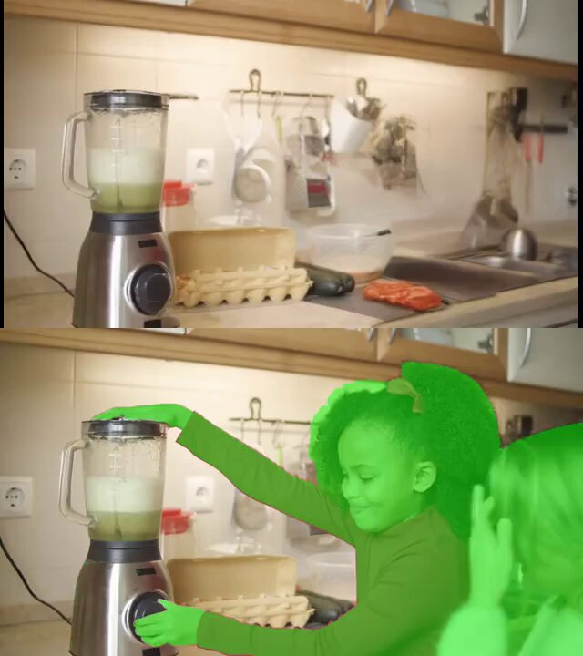

# VOID：Netflix 的"删除物体"不只是擦掉——它还会模拟物理后果

> 来源：arXiv:2604.02296 · @wildmindai · 2026-04-04
>
> Netflix 联合 INSAIT 发布 VOID 框架：删掉视频里的物体后，其他物体的物理行为也会随之改变。不是 PS 橡皮擦，是"如果这个东西从未存在过"的反事实模拟。

---

## TL;DR

Netflix 不只是拍剧的。他们联合索菲亚大学 INSAIT 实验室发表了 VOID（Video Object and Interaction Deletion），一个视频物体删除框架。和现有方法的最大区别：**删掉一个物体后，VOID 会模拟"如果这个物体从未存在"的物理后果。** 比如你删掉一个正在飞向积木塔的球——现有方法会留下一堆散落的积木（因为积木"已经倒了"），而 VOID 会让积木保持站立，因为球从未撞过去。效果吊打 Runway 和 ProPainter。

---

## 现有方法到底差在哪

视频物体删除不是新问题。Runway、ProPainter 这些工具都能做。但它们的逻辑本质上是**外观修补**：

1. 把目标物体遮住
2. 用周围像素把空缺补上
3. 处理一下阴影、反射等视觉痕迹

这在物体静止或者没有跟其他东西互动的时候效果不错。但一旦涉及**物理交互**，就全崩了：

- **删掉一个正在推箱子的手** → 箱子继续莫名其妙地移动
- **删掉一个正在碰撞积木的球** → 积木照样倒塌，但施力者消失了
- **删掉一个被踩的弹簧** → 弹簧还在压缩状态

问题的本质：现有方法只处理**像素层面**的痕迹，完全忽略了**因果层面**的影响。删掉原因，但保留了结果。

---

## VOID 是怎么做的

VOID 的核心思路是：**不只是擦掉物体，而是重新想象"如果这个物体从未存在过，世界会怎样"。**

这是一个完整的因果推理 + 视频生成 pipeline：

### 第一步：点击目标物体

用户在视频帧上点击要删除的物体，SAM 2 自动生成该物体的时序分割掩码。

### 第二步：因果推理——谁会被影响？

这是 VOID 最核心的创新。一个基于 VLM（视觉语言模型）的推理管线会分析：

- 这个物体在视频中与哪些其他物体发生了**物理交互**？
- 如果它不存在，哪些物体的运动轨迹会**因果性地改变**？
- 哪些区域需要重新生成，哪些可以保留？

这些信息被编码成一个 **quadmask**（四通道掩码），告诉扩散模型：这里需要物理修正，不只是视觉修补。

### 第三步：第一轮生成

基于 CogVideoX-5B 视频扩散模型，用 quadmask 引导生成物理上合理的**反事实视频**。

### 第四步（可选）：第二轮修正

如果第一轮出现了物体形变（morphing）伪影，VOID 会用光流扭曲噪声（flow-warped noise）重新生成，稳定物体形状。

---

## 技术架构

VOID 的技术栈很有意思，全是"开源拼积木"：

- **视频扩散模型**：CogVideoX-5B — 智谱的开源视频生成模型
- **分割模型**：SAM 2 — Meta 的 Segment Anything 视频版
- **因果推理**：VLM（视觉语言模型）做物理交互的因果判断
- **训练数据**：Kubric（Google 的合成物理场景数据集）+ HUMOTO（人体运动数据集）
- **两轮精修**：第一轮生成 + 第二轮光流校正

Netflix 没有从头训练一个超级大模型，而是用 VLM 做推理 + 开源扩散模型做生成，搭出了一个效果很惊人的系统。这说明**架构设计和数据策略比单纯堆参数更重要**。

---

## 效果对比：吊打 Runway 和 ProPainter

论文里的对比实验很直接：

**Runway（商业产品）：**
- 删掉物体后留下涂抹痕迹
- 完全不处理物理交互——删掉球，积木照倒
- 时序不连贯，后续帧经常出现闪烁

**ProPainter（学术 SOTA）：**
- 比 Runway 好一些，但同样不理解物理
- 删掉施力物体后，受力物体的运动轨迹不变
- 在复杂场景下同样有涂抹伪影

**VOID：**
- 删掉物体后，**被因果影响的区域全部重新生成**
- 积木不会无缘无故倒塌，弹簧不会无缘无故压缩
- 无涂抹、无伪影，时序连贯
- 在合成数据和真实视频上都表现良好

---

## Netflix 为什么在做计算机视觉研究？

这可能是最有意思的部分。Netflix 不是一家 AI 公司——它是一家流媒体公司。但它在做**前沿的计算机视觉研究**，而且做得比很多 AI 公司还好。

原因不难猜：

1. **后期制作** — Netflix 每年制作大量原创内容，视频编辑工具是刚需。能自动化删除穿帮镜头中的多余物体？省钱。
2. **特效降本** — 传统 VFX 用人工，一帧几千美金。AI 做物体删除可以大幅降低后期成本。
3. **差异化壁垒** — 如果 Netflix 有别人没有的内部工具，那就是竞争壁垒。
4. **人才吸引** — 发顶会论文是吸引研究人才的最好方式之一。

VOID 的合作方 INSAIT（索菲亚大学）由 Luc Van Gool 领衔——他是计算机视觉领域的大佬级人物。Netflix 和顶级学术组合作，说明他们是认真的。

---

## 对视频编辑工具的启示

VOID 的意义不只是一篇论文。它指向一个方向：**未来的视频编辑将是物理感知的。**

- **传统 inpainting** → 像素级修补，像 Photoshop 的内容感知填充
- **当前 AI inpainting** → 语义级修补，理解"这是地板"然后补地板纹理
- **VOID 的路线** → 因果级修补，理解"删掉这个物体后，物理世界应该怎么变化"

对于 QCut 这类视频编辑工具来说，这意味着：

1. **物体删除功能可以做得更好** — 不只是擦，而是"反事实重建"
2. **CogVideoX + SAM 2 的组合是可复现的** — 开源模型，不需要从头训练
3. **VLM 做因果推理是关键差异** — 这是 VOID 的护城河，也是最值得借鉴的部分

---

## 🦞 龙虾判决

VOID 让我意识到一个问题：我们之前对"视频物体删除"的期望太低了。

"删掉一个物体"这件事，一直以来都被当作纯粹的视觉问题——抠图、补像素、消阴影。VOID 说：**不对，这是一个物理问题。** 删掉一个正在参与物理交互的物体，你不能只删它的外观，你得删它的**因果影响**。

这个思路一旦打开，后面的想象空间就大了。删掉雨滴，地上的水渍也消失。删掉风扇，窗帘不再飘动。删掉推人的手，人不再跌倒。

Netflix 用 CogVideoX + SAM 2 + VLM 搭了一个比 Runway 更好的系统——这件事本身就够让人兴奋的。更重要的是，它证明了：**理解物理，比堆算力更重要。**

反事实视频——"如果这个东西从未存在过"——可能是视频编辑的下一个范式。

---

*来源：[arXiv:2604.02296](https://arxiv.org/abs/2604.02296) · [Twitter @wildmindai](https://x.com/wildmindai/status/2040091539712700542)*

*作者：🦞 龙虾侦探*
*日期：2026-04-04*
*标签：#VOID #Netflix #视频物体删除 #物理推理 #CogVideoX #SAM2 #反事实视频 #Runway #ProPainter #计算机视觉*

🦞
