# AIHOT 的真正价值：不是 AI 热点网站，而是一套内容创作者的信息操作系统

> 来源：数字生命卡兹克在 X 上公开介绍 AIHOT。原文链接：https://x.com/Khazix0918/status/2052234427233939808?s=20  
> 产品地址：https://aihot.virxact.com/

## 原文配图

下面这些是卡兹克原文里的 AIHOT 产品截图与流程截图，能更直观看到它的时间线、精选、评分、聚类和日报形态。

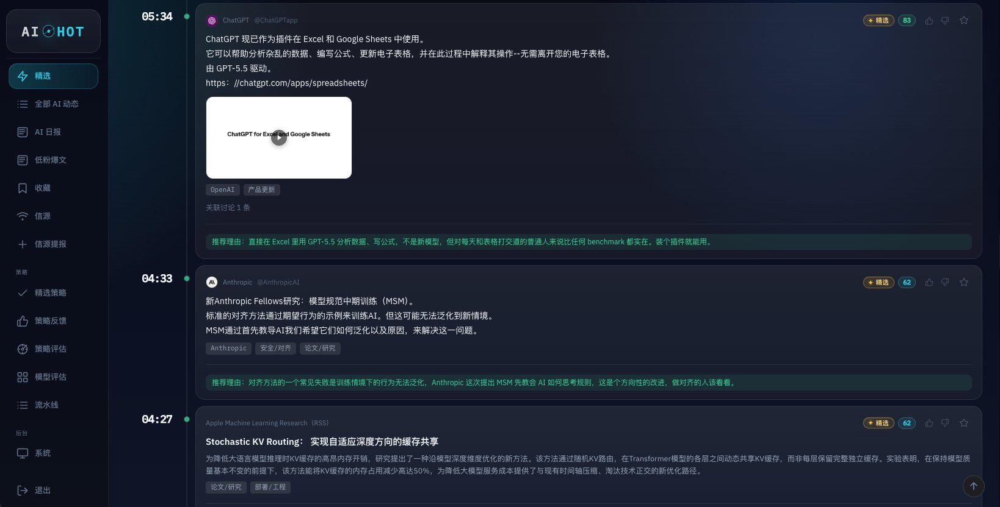

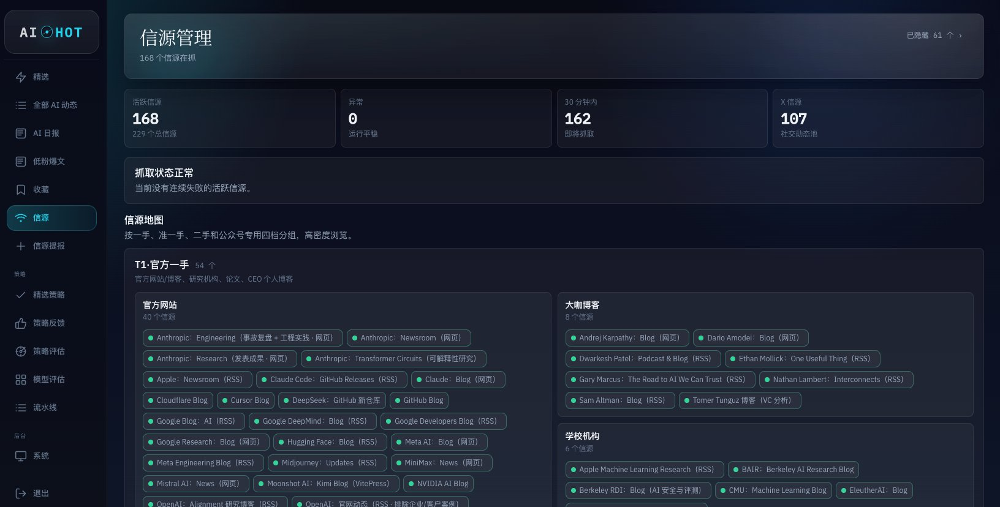

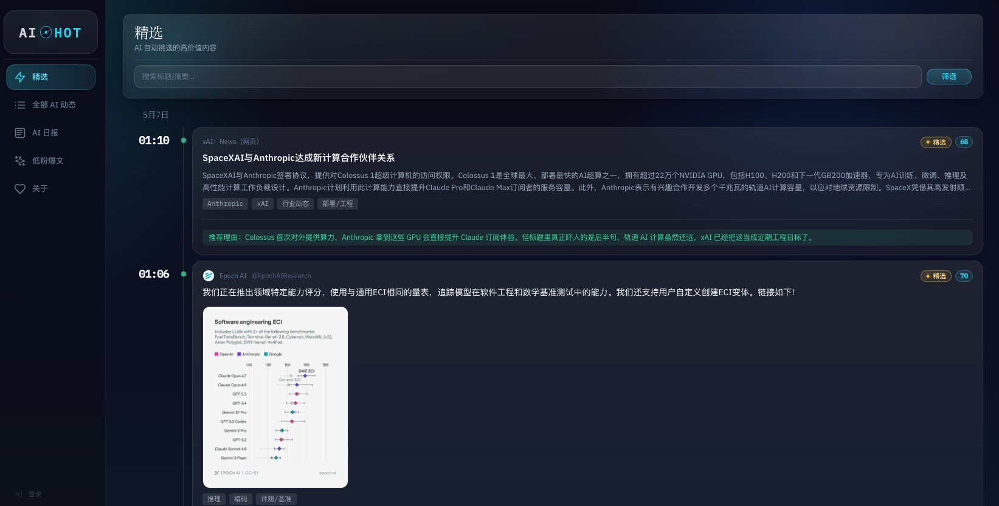

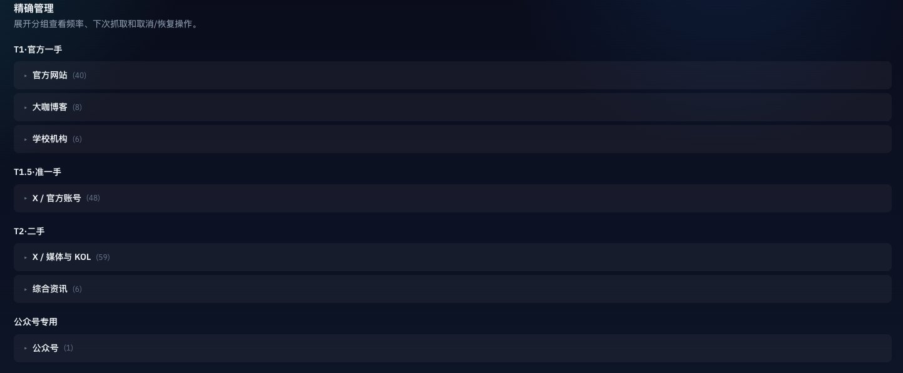

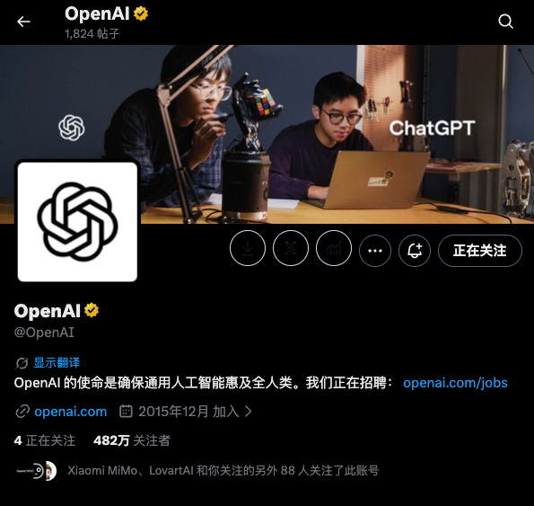

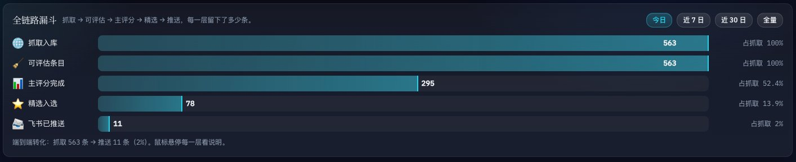

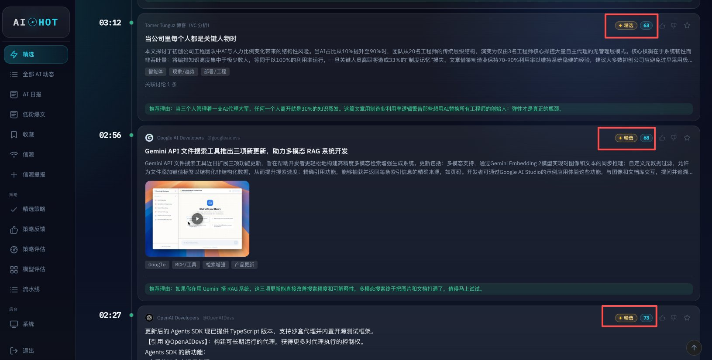

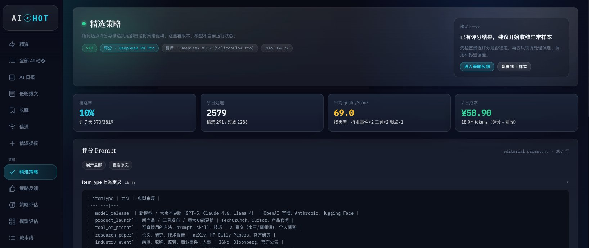

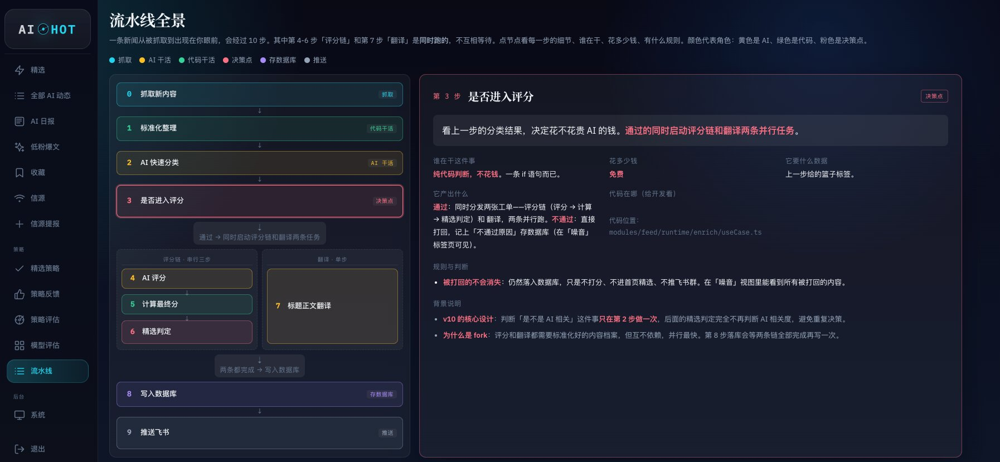

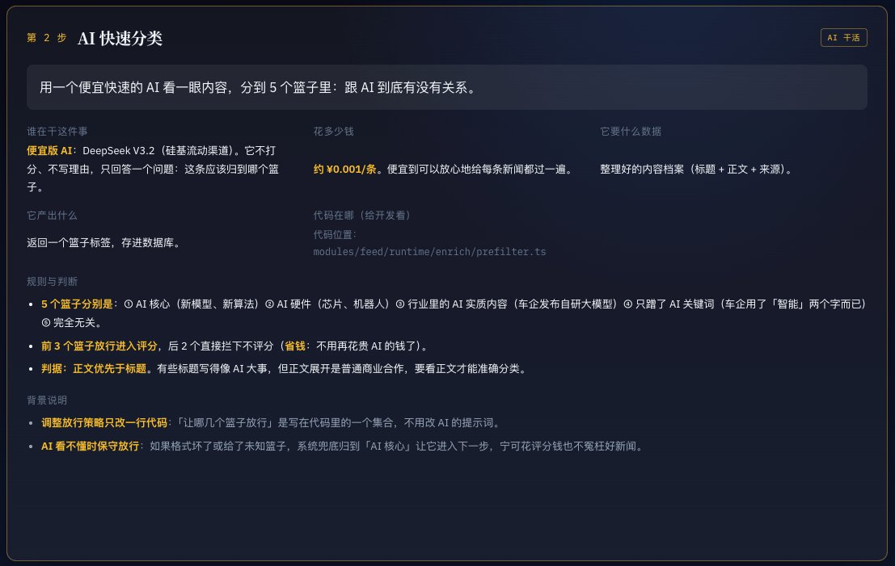

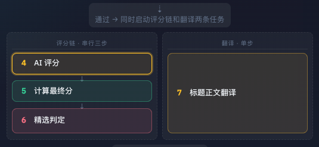

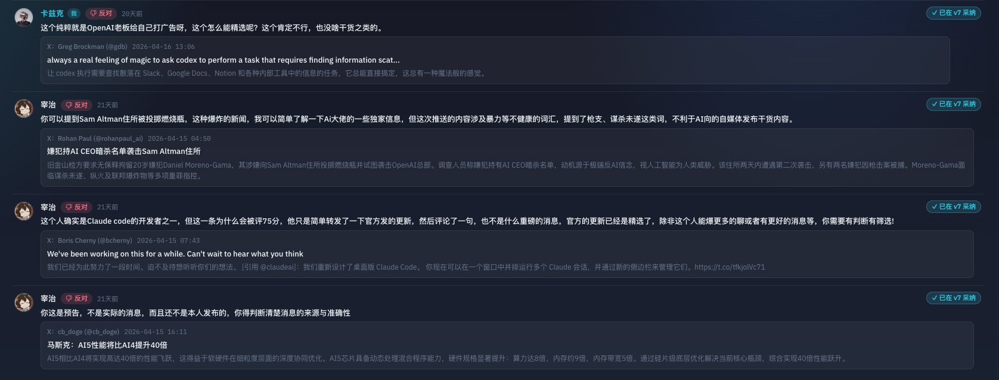

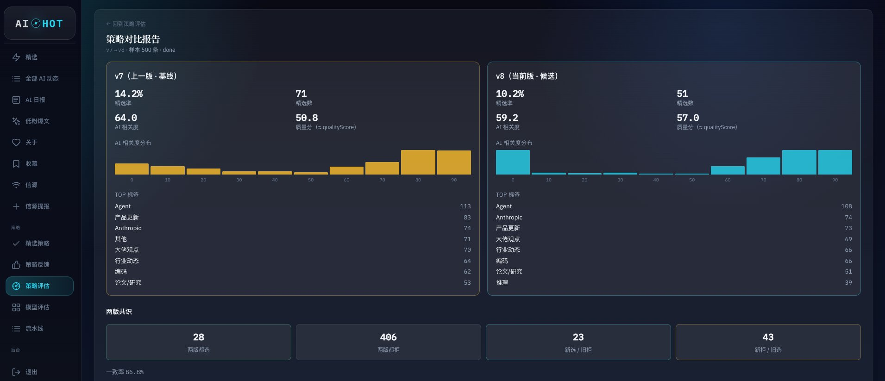

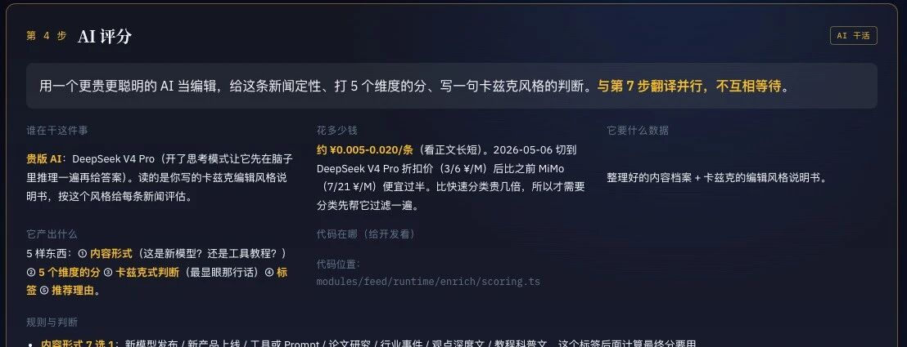

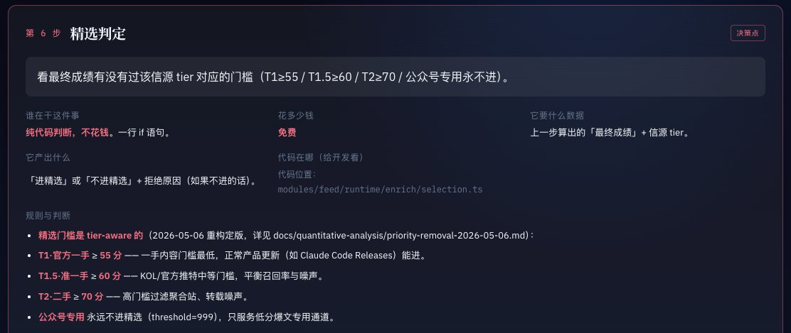

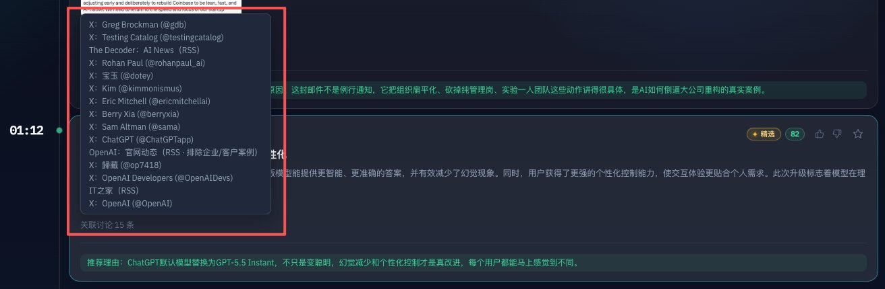

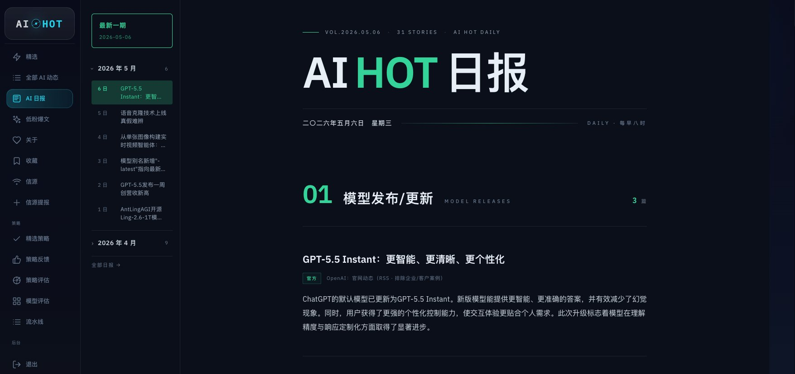

今天卡兹克把自己内部使用的 AI 热点监控网站 **AIHOT** 免费开放出来了。

如果只把它理解成一个「AI 新闻聚合站」，其实会低估这件事。真正值得看的不是网页上多了一个精选 Tab，也不是每天早上能看到一份 AI 日报，而是它背后那套信息处理方法论：在 AI 信息过载的时代，内容创作者需要的不是更多信息，而是一套可控、可回测、可迭代的信息操作系统。

这篇文章想拆解的，不只是 AIHOT 这个产品本身，而是它给所有 AI Builder、内容创作者、投资人和产品经理的一个启发：**未来的竞争，越来越不是谁执行得更快，而是谁能更早、更稳、更低噪声地捕捉到有效信号。**

## 一、AIHOT 解决的不是「看新闻」，而是「保护注意力」

卡兹克对 AIHOT 的一句话描述很准确：

> 帮助你以干净的时间线形式，监控这个世界上跟 AI 相关的信息，然后用内容挑选策略，把值得关注的东西精选出来，对信息海进行降维，从而保护注意力。

这句话里有三个关键词：

1. **时间线**：信息必须按时间流动，否则就失去热点价值；
2. **精选**：信息不能全部推给用户，否则只是把噪音搬了个地方；
3. **注意力保护**：最终目标不是「收集更多」，而是「让人少看但看对」。

这也是今天所有 AI 信息产品最容易踩坑的地方。

很多工具做的是「聚合」：RSS、Twitter、Reddit、Hacker News、论文、官方博客全部拉进来。看起来覆盖面很广，但用户打开以后仍然面对一片信息海。信息源越多，产品反而越难用，因为筛选压力从平台转移到了用户身上。

AIHOT 更像是往前走了一步：它不只做采集，而是把采集之后的判断也产品化。它承认一个现实：在 AI 时代，信息本身已经太便宜了，真正稀缺的是判断。

## 二、信源比信息重要：这是 AI 信息黑暗森林里的第一原则

卡兹克提到，他目前监控了 **168 个信源**，来源包括 RSS、直接爬 HTML、公开 API、付费三方数据接口等。更重要的是，这些信源不是平铺的，而是分成了 T1、T1.5、T2 三层：

| 等级 | 例子 | 特点 |
|---|---|---|
| T1 | OpenAI 官方博客、Anthropic 工程博客、Sam Altman Blog、CMU 博客 | 一手、权威、噪音低，适合作为最高权重来源 |
| T1.5 | OpenAI、Anthropic 等官方 X 账号 | 更快、更碎、更杂，仍然权威但需要降噪 |
| T2 | KOL、媒体、综合资讯站、行业大佬个人号 | 覆盖广、反应快，但二手信息和情绪噪声更多 |

这套分层很关键。

AI 新闻不是普通新闻。很多时候，同一件事会被官方博客、官方 X、员工转发、KOL 解读、媒体转载、中文社区二次加工报道很多遍。如果系统不理解信源权重，最后就会把同一件事重复推送七八次。

所以 AIHOT 的第一层护城河不是模型，而是信源选择。模型可以判断一条信息像不像 AI 新闻，但它很难天然知道这条信息来自哪里、这类来源在过去是否靠谱、它应该在最终排序里被赋予多大权重。

这对 Builder 有一个很直接的启发：

> 如果你要做任何「智能信息流」产品，先不要急着调 Prompt。先把信源分层做好。

数据质量、来源权重、重复关系、发布时间、原始出处，这些结构化事实比一个更长的 Prompt 更重要。

## 三、563 条一天的信息量，说明「更多抓取」不是答案

AIHOT 昨天一天抓了 **563 条** 信息，其中有相当一部分与 AI 无关。比如苹果 Newsroom 里面的大多数公告，并不会因为苹果也做 Apple Intelligence 就自动变成 AI 新闻。

这说明一个现实：哪怕信源已经筛选过，进入系统的信息仍然会有大量噪音。

因此 AIHOT 的处理流程第一步是预筛：用相对便宜的模型（卡兹克文中提到 DeepSeek V3.2）判断信息是否与 AI 相关。如果无关，直接落库，不进入后续高成本评分链路。

这一步看似朴素，但很产品级。

很多 AI 产品喜欢一上来就用最强模型处理所有内容，理由是「效果最好」。但在真实系统里，效果不是唯一指标，成本、吞吐、延迟、稳定性同样重要。

AIHOT 的思路更像工业系统：

1. 低成本模型做粗筛；
2. 通过后再进入高智力模型评分；
3. 翻译、摘要、分类并行处理；
4. 最终是否精选由代码和阈值决定。

这不是「大模型万能」的路线，而是「把模型放在该放的位置」。

## 四、最大的坑：不要让模型同时当裁判、会计和产品经理

AIHOT 最有价值的部分，是卡兹克讲了自己评分系统从失败到重构的过程。

最早的思路很自然：写一个 Prompt，让大模型判断新闻重不重要、属于什么分类、读者爱不爱看，然后给一个总分。超过阈值就精选。

结果一塌糊涂：

- 极硬核论文动不动 90 分，但普通读者根本看不下去；
- Sam Altman 转发一个实习生鸡汤，模型给 87 分；
- 同一件事被官方、X、媒体报道七遍，七遍都进精选；
- 规则越加越多，Prompt 从几百行变得越来越难控；
- 人类反馈、自动评估、持续迭代听起来很先进，但规则堆叠反而让模型泛化能力变差。

这段经历非常真实，也几乎是所有 Agent 产品都会踩的坑。

我们很容易把一个复杂系统的所有判断都交给模型：让它打分、算权重、判断重复、决定是否展示、生成摘要、判断用户是否感兴趣。短期看起来开发最快，长期一定变成黑盒泥潭。

卡兹克最后回到了一条非常朴素但重要的原则：

> 能用代码处理的，一律不用模型处理。

重构后的 AIHOT 让大模型只做一件事：对每条信息打 **5 个维度分**。它不再负责最终分，也不再决定是否精选。

最终分由代码根据以下因素重新计算：

- 信源等级；
- 信息类型；
- 公司或实体权重；
- 模型给出的五维评分；
- 不同类别的精选阈值；
- 历史回测后调出的权重参数。

这就把系统从「Prompt 黑盒」变成了「模型评分 + 代码决策」的混合系统。

模型负责语义判断，代码负责确定性计算。前者处理模糊性，后者保证可控性。

## 五、事件聚类：信息产品的体验分水岭

AIHOT 还有一套事件聚类系统。

比如 GPT-5.5 Instant 发布，官方博客会发，OpenAI 官方 X 会发，员工会转发，媒体会报道，KOL 会解读。如果不做聚类，精选页上可能连续出现十几条同一事件。

AIHOT 的做法是用 embedding 把语义相近的条目聚成事件簇，再从簇里选一条最权威的作为主条，其余折叠进去。主条选择规则也很清楚：官方源优先，官网优先于官方推特，官方推特优先于 KOL。

这个设计看似是体验细节，实际上是信息产品的核心能力。

因为用户真正想看的不是「有多少人在说这件事」，而是：

1. 这件事发生了吗？
2. 最权威的原始来源是什么？
3. 有哪些补充解读？
4. 它是否值得我现在花时间看？

事件聚类把「多条报道」压缩成「一个事件」。这一步完成后，信息流才真正从 news feed 变成 intelligence feed。

## 六、AI 日报为什么可以 1 秒生成？因为复杂度已经前置了

AIHOT 的日报功能每天早上北京时间 8 点生成，把过去 24 小时的精选内容按五个版块整理：

- 模型发布 / 更新；
- 产品发布 / 更新；
- 行业动态；
- 论文研究；
- 技巧与观点。

有意思的是，卡兹克说这个日报不需要任何大模型生成，因为所有精选、分类、翻译、摘要都已经在信息入库时完成了。日报只需要把处理好的条目按类型分桶，再按分数排序。

所以每天早上生成日报只需要 1 秒。

这个设计同样很有启发：很多产品把「最后一步生成」看成 AI 的核心，其实真正的核心往往在前面的数据结构化和判断链路。只要前面的信息处理做得足够干净，最后的日报生成反而可以非常简单。

这也是成熟 AI 产品和 Demo 的区别。

Demo 往往在最后一步显得很聪明；成熟产品则把聪明拆进了整个流水线。

## 七、AIHOT 的产品启发：内容创作者正在变成信息系统工程师

AIHOT 最让我感兴趣的地方，是它本来是一个内容创作者为自己做的内部工具。

这件事本身就代表一个趋势：AI 时代的头部内容创作者，越来越不像传统写作者，而像一个人运营的情报系统。

过去做内容，关键能力是：

- 选题敏感度；
- 表达能力；
- 观点密度；
- 分发能力。

现在这些仍然重要，但前面多了一层新的基础设施：

- 能否稳定监控高质量信源；
- 能否快速去重、聚类、排序；
- 能否把热点拆成事件和主题；
- 能否把自己的判断标准沉淀成半自动系统；
- 能否用回测持续校准这套系统。

也就是说，内容创作者的竞争正在从「谁刷得更勤」升级到「谁的信息系统更好」。

而这件事不只适用于自媒体。

投资人需要类似系统发现项目和趋势；产品经理需要类似系统监控竞品、技术和用户变化；创业者需要类似系统判断市场窗口；研究员需要类似系统跟踪论文、代码和社区动向。

AIHOT 是 AI 新闻产品，但它背后的范式其实更通用：

> 用自动化收集信息，用模型理解语义，用代码做确定性决策，用人类反馈校准标准。

## 八、真正的护城河：不是开放出来的网页，而是背后的隐性判断

卡兹克也很坦诚地说，公开版本和公司内部版本不一样。某些底层策略、内部 Tab 和更完整的功能不会全部开放。

这很合理。

因为 AIHOT 真正的资产不是网页，也不是「抓了 168 个信源」这个数字，而是过去三年内容创作经验沉淀出来的判断标准：

- 哪些信源更值得看；
- 什么样的信息值得第一时间关注；
- 哪些热点只是噪音；
- 官方源、KOL、媒体之间如何排序；
- 不同类别应该设置什么阈值；
- 怎么避免模型高估硬核但不可读的内容；
- 怎么避免被大佬转发、营销稿、重复报道带偏。

这些东西很难直接复制。

一个人可以复刻网页，也可以复刻大致流程，但很难复刻卡兹克脑子里那套「什么值得写」的过滤器。AIHOT 的意义在于，他把这个过滤器尽可能产品化、系统化、可调试化了。

## 九、对 Builder 的三条建议

如果把 AIHOT 当成一个 AI 产品案例，它至少给了 Builder 三条建议。

### 1. 先做数据结构，再做智能

不要一上来就把所有问题塞给模型。先把信源、实体、类别、时间、重复关系、权重这些结构整理清楚。结构越清楚，模型越不需要承担不该承担的工作。

### 2. 让模型只做它最擅长的模糊判断

模型适合判断语义相关性、重要性维度、摘要、翻译、分类解释。但模型不适合负责最终业务决策。最终是否展示、如何排序、阈值是多少，最好由代码控制。

### 3. 所有评分系统都要可回测

如果一个评分系统不能拿历史数据回测，它就很难长期迭代。AIHOT 用过去 500 条新闻评估新旧规则，这一点很重要。没有回测，所有优化都只是感觉。

## 结语：未来每个专业人士都需要自己的 AIHOT

AIHOT 表面上是一个 AI 热点网站，实际上是一套个人知识工作的基础设施。

它解决的问题不是「今天 AI 圈发生了什么」，而是「我如何在每天几百条信息里，只看到最值得看的那十几条」。

在信息过载时代，注意力不是靠意志力保护的，而是靠系统保护的。

而在 AI 时代，真正有效的系统也不会是纯模型系统。它更可能是：

- 人选信源；
- 机器抓数据；
- 小模型做预筛；
- 大模型做语义评分；
- 代码做权重和阈值；
- embedding 做聚类；
- 人类反馈做校准；
- 产品界面负责把复杂性隐藏起来。

这就是 AIHOT 最值得拆解的地方。

它不是又一个 AI 新闻站，而是一个内容创作者把自己的判断力工程化之后，长出来的产品。

谢谢你看这篇文章。也谢谢卡兹克把他的产品开放出来。
