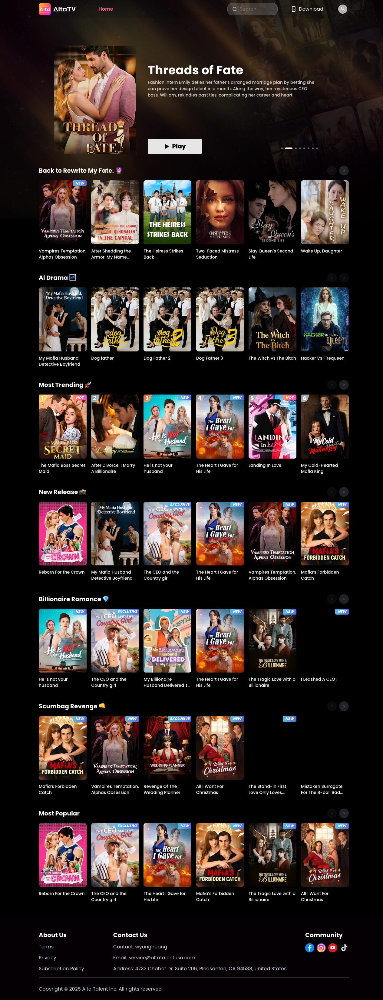

# AltaTV：短剧出海正在从“内容生意”变成“流量 + 支付 + 本地化”的系统工程

> Source: https://altatv.com/  
> 写作时间：2026-05-09  
> 关键词：短剧出海 / Vertical Drama / Micro Drama / AltaTV / Alta Talent Inc. / 付费解锁 / AI Drama

## 一句话结论

AltaTV 看起来不是一个单纯的“短剧网站”，而是一个面向海外市场的短剧消费漏斗：网页负责展示、搜索、登录和下载导流，App Store / Google Play 承接移动端分发，站内订阅和单集解锁承担变现，社交账号则负责把爆点剧情切片推到 Facebook、Instagram、YouTube、TikTok。

它最值得关注的地方不是某一部剧，而是它把中国短剧行业里已经成熟的“爽点叙事 + 高频上新 + 低门槛付费”搬到了英语市场，并且开始用更细分的标签重新包装：billionaire romance、mafia、revenge、reborn、werewolf、AI drama。

## 我实际检查到什么

这次我检查的是 AltaTV 官网及其公开可访问页面，重点信息如下：

| 维度 | 观察 |
|---|---|
| 官网 | `https://altatv.com/`，可正常访问，首页是 Next.js 风格的流媒体卡片页 |
| 公司主体 | 页脚显示 `Alta Talent Inc.`，联系方式为 `service@altatalentusa.com` |
| 地址 | 4733 Chabot Dr, Suite 206, Pleasanton, CA 94588, United States |
| 条款 | Terms of Service 生效日期为 2023-10-22，主体写为 `ALTA TALENT INC` |
| 订阅政策 | Subscription Policy 最近更新为 2025-09-04 |
| iOS App | App Store 条目为 `AltaTV - Drama Shorts`，App ID `6469592412` |
| iOS 公开数据 | 版本 3.1.8，当前版本发布日期 2026-04-14；美国区显示约 4.67 分、769 个评分 |
| Google Play | 搜索结果和页面内容指向包名 `com.melotmobile.kkshort`，Google Play 页面可见约 4.5 分 |
| 技术基础 | 域名 `altatv.com` 创建于 2015-06-18；DNS 指向 AWS，TLS 证书由 Amazon 签发 |
| 社交分发 | 官网链接到 Facebook、Instagram、YouTube、TikTok |

这说明 AltaTV 至少具备一个完整消费产品的基本骨架：官网、移动 App、法律条款、隐私政策、订阅政策、客服邮箱、社交账号和支付/订阅说明。

但这不等于“所有内容和商业承诺都已经被第三方验证”。更准确的判断是：AltaTV 看起来像一个真实运营中的短剧产品，而不是一个薄 landing page；至于内容授权、订阅体验、退款体验和留存数据，还需要进一步从 App 内和真实付费链路验证。

## 首页透露的产品定位

AltaTV 首页的第一印象很明确：它不是做“影视库”，而是做“情绪触发器”。

页面主视觉采用黑色、棕色、粉色和白色的流媒体风格，顶部有搜索框、Download 入口和用户头像；中间是类似 Netflix 的横向卡片流；每个内容卡片都用极短标题和强冲突剧情概括吸引点击。

首页可见的分类包括：

- `Back to Rewrite My Fate. 🔮`
- `AI Drama 🌌`
- `Most Trending 🚀`
- `New Release 📸`
- `Billionaire Romance 💎`
- `Scumbag Revenge 👊`
- `Most Popular`

这些分类本身就说明了它的运营逻辑：不是按传统影视工业的“类型片”分类，而是按短剧用户的即时爽点分类。

传统影视平台会说 romance、thriller、fantasy；AltaTV 的表达更接近信息流广告：重生、复仇、霸总、黑帮、狼人、真假千金、渣男反杀、秘密身份。用户不需要理解复杂世界观，只要在三秒内被一个情绪钩子抓住。

## 内容策略：短剧出海的“爽点语法”

AltaTV 公开首页上的剧名和简介高度集中在几个母题上。

### 1. 身份反转

例如《Dog Father》系列讲的是一个被轻视的保安其实是隐藏的 trillionaire；《After Shedding the Armor, My Name Resonates in the Capital》讲的是古代女将军穿到现代豪门，成为被嘲笑的真千金后重新夺回身份。

身份反转是短剧里最稳定的爽点，因为它天然适合一集一分钟的结构：先羞辱，再揭示，再反打。

### 2. 复仇和重生

《Reborn For the Crown》《Slay Queen’s Second Life》《Wake Up, Daughter》《Revenge Of The Wedding Planner》都属于这一类。主角不是慢慢成长，而是带着未来信息、隐藏身份或复仇计划回到冲突现场。

这类内容的核心不是“人物弧光”，而是“观众知道主角会赢，但想看她怎么赢”。

### 3. 霸总、黑帮和高阶男性幻想

《The Mafia Boss Secret Maid》《My Cold-Hearted Mafia King》《My Billionaire Husband Delivered To My Doorstep》《The CEO and the Country girl》说明 AltaTV 仍然在吃全球短剧市场最成熟的 romance fantasy。

这些题材在中国短剧、英文 web novel、TikTok drama ads 之间高度共振：阶层差、权力差、危险关系、契约婚姻、误会和追妻火葬场。

### 4. 超自然和狼人宇宙

《My Cold Blooded Alpha King》《Vampires Temptation, Alphas Obsession》《Star Moon Romance Rejected And Reborn As Alpha》显示 AltaTV 也在对接英文市场已经验证过的 werewolf / vampire / alpha romance 需求。

这是很重要的本地化信号。中国短剧出海不能只翻译国内霸总剧，而要把情绪结构嵌入海外用户熟悉的题材壳里。

### 5. AI Drama

首页里有一个非常显眼的 `AI Drama 🌌` 分类，包含《My Mafia Husband Detective Boyfriend》《Dog Father》《The Witch vs The Bitch》《Hacker Vs Firequeen》等。

这里的 “AI Drama” 未必意味着全流程 AI 生成，但它是一个值得关注的方向：短剧平台正在尝试把 AI 作为内容标签、生产方式或营销卖点。对 QCut 这样的 AI 视频工具来说，这类平台是很好的行业观察对象：如果短剧的供给从“剧组拍摄”转向“AI 辅助生产 + 快速投放测试”，剪辑、字幕、分发和多版本生成会变成核心基础设施。

## 商业模式：不是 Netflix，而是游戏化消费

AltaTV App Store 描述里有几个关键信号：

- “No Monthly Subscriptions”：不强调传统月费订阅；
- “pay only for what you watch”：按观看内容付费；
- “first few episodes for free”：前几集免费；
- “as little as a dime per episode”：热门剧每集低至约一角钱；
- “Ad-Supported Viewing”：看广告也可以解锁；
- “1-Minute Episodes”：每集约一分钟。

这套机制更像手游和网文，而不是 Netflix。

Netflix 的核心是“订阅后无限看”；AltaTV 这类短剧产品的核心是“免费开头 + 情绪上头 + 小额解锁 + 广告补贴”。它把观看行为拆成很多微交易节点：用户不是每个月做一次购买决策，而是在剧情高潮处反复做小额决策。

这也是短剧在移动端强于长视频的原因：它不需要用户承诺一整晚，只要让用户在电梯、午休、睡前多看一分钟。

## 为什么这对 AI 视频工具重要

如果从 QCut / AI 视频产品的角度看，AltaTV 代表了一个非常具体的需求侧场景。

短剧平台的瓶颈不是“能不能做一个视频”，而是：

1. 能不能快速生产大量广告素材；
2. 能不能把同一部剧拆成不同投放版本；
3. 能不能为 TikTok、Reels、Shorts、Facebook Feed 输出不同比例和字幕样式；
4. 能不能根据地区和语言做标题、配音、字幕和封面本地化；
5. 能不能把爆款桥段迅速二创、A/B 测试，再反哺内容生产。

这类平台天然需要一个“内容工厂操作系统”。不是单点的 text-to-video，而是从素材管理、脚本改写、字幕、配音、封面、切片、投放版本、数据反馈到再生产的一整条流水线。

如果 AI 视频创业公司只盯着“生成一段好看的视频”，很容易错过真正的钱在哪里。短剧出海的钱在分发效率、迭代速度和转化率优化。

## 信任与风险：看起来真实，但仍要谨慎验证

从公开信息看，AltaTV 有不少正向信号：

- 官网可访问，不是空壳页；
- 有 iOS 和 Google Play 公开分发渠道；
- 有服务条款、隐私政策和订阅政策；
- 有客服邮箱和美国地址；
- 域名历史较久，托管和证书使用 AWS / Amazon；
- 社交账号链接完整。

同时也有需要继续验证的点：

- 页脚联系名只写 `wyonghuang`，公司团队信息不充分；
- App Store seller 显示为 `MFLIX`，而官网法律主体写 `ALTA TALENT INC`，两者关系需要进一步确认；
- 内容授权、原创比例、AI 参与程度、退款体验无法仅靠官网判断；
- 订阅价格和实际扣费规则需要进入支付页才能完整确认。

所以我的判断是：AltaTV 更像一个真实运营中的新一代短剧平台，而不是明显骗局；但如果涉及商务合作、内容授权、投放采购或大额预付，仍应要求对方提供法律主体、授权文件、结算条款和案例数据。

## 对短剧出海的启发

AltaTV 的价值不在于它已经是行业终局，而在于它展示了短剧出海的几个确定趋势。

第一，短剧正在从中文市场的“爽文影像化”，变成全球移动娱乐的一种标准格式。

第二，英文市场不是简单翻译中文短剧，而是把同样的情绪结构装进本地熟悉的题材：mafia、werewolf、vampire、billionaire、small town、aviation heir。

第三，平台竞争不只是内容数量，而是转化链路：前三集免费、广告解锁、单集付费、订阅政策、社交投放、App 下载，每一步都影响 LTV。

第四，AI 会先从短剧的边缘环节渗透：广告切片、字幕、多语言、本地化封面、剧情简介、素材重组；然后才可能进入更核心的剧集生产。

第五，对 AI 创作者工具来说，短剧出海是一个比“泛视频生成”更清晰的商业场景。因为它有明确的素材、明确的平台规格、明确的 A/B 测试需求，也有明确的转化指标。

## 结语

AltaTV 让我想到一个判断：未来的短剧公司可能越来越不像影视公司，而像游戏公司、广告公司和 AI 内容工厂的混合体。

它们不只是拍剧，而是不断制造情绪钩子；不只是上传内容，而是运营转化漏斗；不只是做 App，而是围绕 TikTok、Reels、Shorts 和广告网络做全球分发。

如果说长视频平台卖的是“内容库”，短剧平台卖的其实是“下一分钟”。

AltaTV 这样的产品，正是在把这一分钟商品化、数据化、全球化。
