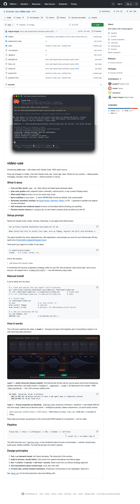

# video-use Deep Dive: Turning Video Editing into an Agent-Executable Engineering Pipeline

> Repo: <https://github.com/browser-use/video-use>  
> Inspected commit: `fbcf29f`  
> Date: 2026-05-09  
> Tags: video-use / Claude Code / Coding Agent / FFmpeg / ElevenLabs Scribe / Agentic Video Editing



## 1. This is not an “AI video generator”; it is an editing harness

The README for `browser-use/video-use` presents a simple promise: drop raw footage into a folder, talk to Claude Code / Codex / Hermes or another shell-capable agent, and get `edit/final.mp4` back. But after inspecting the code and `SKILL.md`, the interesting part is not the slogan “AI edits your videos.” The real design is this: **video-use decomposes video editing into a set of agent-callable, verifiable, cacheable, reviewable engineering steps.**

A traditional video editor exposes timelines, tracks, buttons, and presets. video-use exposes:

- word-level transcripts;
- on-demand timeline composite PNGs;
- EDL JSON;
- an ffmpeg render pipeline;
- session memory in `project.md`;
- production-correctness rules encoded in the skill document.

The philosophy is close to browser-use: do not make the LLM stare blindly at screenshots; give it a structured DOM. video-use applies the same idea to video: do not dump 30,000 frames into the model; let it read text first, then inspect compact visual artifacts only when needed.

## 2. Repository facts: small repo, but not a toy demo

I inspected `browser-use/video-use` at HEAD `fbcf29f`. The latest commit is `docs: add HyperFrames animation option (#13)`. The GitHub page shows roughly **7.1k stars**, **1k forks**, **11 commits**, and the default branch is `main`.

Local scan results:

| Type | Files | Lines |
|---|---:|---:|
| `.md` | 19 | 3,638 |
| `.py` | 6 | 1,908 |
| `.toml` | 1 | 22 |
| `.html` | 1 | 305 |
| `.svg` | 1 | 181 |
| `.png` | 1 | 12,016 |
| `.sh` | 1 | 14 |
| `.example` | 1 | 1 |
| no extension | 1 | 60 |
| **Total** | **32** | **18,145** |

Major directories:

- `helpers/`: 6 Python helper scripts, about 1,908 lines; this is the execution layer.
- `skills/manim-video/`: vendored Manim skill, 17 files and about 3,060 lines, including 14 reference docs.
- `static/`: README banner and timeline-view SVG.
- Root-level `SKILL.md`, `install.md`, and `README.md`: these are not just docs; they are the agent runtime contract.

The dependency surface is intentionally small. `pyproject.toml` requires Python `>=3.10` and lists `requests`, `librosa`, `matplotlib`, `pillow`, and `numpy`, with optional `manim` support for animations. There is no backend service, no GUI app, no database, no complex monorepo package graph. The heavy dependencies live at the system/workflow layer: `ffmpeg` / `ffprobe`, plus an ElevenLabs API key for transcription.

## 3. Core architecture: the LLM does not watch video; it reads video

The most important README line is: **The LLM never watches the video. It reads it.** That sentence explains the entire architecture.

video-use splits video understanding into two layers.

### Layer 1: always-loaded audio transcript

`helpers/transcribe.py` extracts mono 16kHz WAV via ffmpeg, then calls ElevenLabs Scribe:

```python
SCRIBE_URL = "https://api.elevenlabs.io/v1/speech-to-text"

data = {
    "model_id": "scribe_v1",
    "diarize": "true",
    "tag_audio_events": "true",
    "timestamps_granularity": "word",
}
```

Those parameters matter:

- `timestamps_granularity=word`: every word has a start/end timestamp, so cuts can snap to word boundaries.
- `diarize=true`: multi-speaker footage can be grouped by speaker.
- `tag_audio_events=true`: laughter, applause, sighs, and similar events remain editorial signals.
- Output is cached under `<edit_dir>/transcripts/<video_stem>.json`; if the file exists, transcription is skipped.

### Layer 2: on-demand visual composite

`helpers/timeline_view.py` generates a PNG for a `[start, end]` window: filmstrip on top, waveform in the middle, word labels and ruler below, with long silences shaded. Its docstring explicitly warns:

> Do NOT call it in a scan loop over every utterance; it's an on-demand drill-down, not a background index.

That is a key design choice. This is not a full visual indexing pipeline. It is a token-budget-aware visual probe used for ambiguous pauses, retake comparison, and cut-point sanity checks.

## 4. `takes_packed.md`: the real intermediate representation

If you only read the README, you might think the raw transcript JSON is the core data. In practice, the agent primarily reads `takes_packed.md`, generated by `helpers/pack_transcripts.py`.

The script reads `<edit>/transcripts/*.json` and groups word-level Scribe output into phrase-level markdown, breaking on **silence ≥ 0.5s or speaker change**:

```markdown
## C0103  (duration: 43.0s, 8 phrases)
  [002.52-005.36] S0 Ninety percent of what a web agent does is completely wasted.
  [006.08-006.74] S0 We fixed this.
```

This layer matters because raw JSON is too verbose, while SRT loses the sub-second gap data needed for editing. `takes_packed.md` keeps precise enough ranges and speaker labels while compressing long footage into something an agent can actually read. `SKILL.md` calls it **the LLM's primary reading view**.

From a builder’s perspective, this is video-use’s “DOM”: not the final media, not low-level frames, but the structured view that lets an agent reason.

## 5. EDL is the contract between the agent and renderer

`SKILL.md` defines a simple EDL format:

```json
{
  "version": 1,
  "sources": {"C0103": "/abs/path/C0103.MP4"},
  "ranges": [
    {"source": "C0103", "start": 2.42, "end": 6.85,
     "beat": "HOOK", "quote": "...", "reason": "Cleanest delivery"}
  ],
  "grade": "warm_cinematic",
  "overlays": [
    {"file": "edit/animations/slot_1/render.mp4", "start_in_output": 0.0, "duration": 5.0}
  ],
  "subtitles": "edit/master.srt",
  "total_duration_s": 87.4
}
```

This boundary is clean:

1. **The LLM makes decisions; it does not hand-craft ffmpeg commands.** It emits structured EDL, and `render.py` handles execution.
2. **Each segment can carry `beat`, `quote`, and `reason`.** The edit is reviewable, not just a list of timecodes.
3. **Path resolution is centralized.** `render.py` supports absolute paths and paths relative to the edit directory.
4. **Subtitles, grade, and overlays are EDL fields.** Iteration means changing data, not rewriting a large shell script.

For an agentic workflow, EDL is a good seam: language reasoning upstream, deterministic media processing downstream.

## 6. `render.py`: the important part is not features, but order

`helpers/render.py` is the largest execution script in the repo. Its core value is not that it can render video; it is that it fixes the order of operations that often cause silent failures in video editing.

The docstring describes the pipeline:

1. Extract each segment separately, baking in color grade and 30ms audio fades.
2. Use concat demuxer with lossless `-c copy` concat.
3. If there are overlays or subtitles, run one final filter graph.
4. Shift overlays with PTS so frame 0 starts at the overlay window.
5. Apply subtitles last.

These steps map directly to hard rules in `SKILL.md`:

- Subtitles must be last in the filter chain; otherwise overlays hide them.
- Avoid a single monolithic filtergraph for overlay workflows; it causes unnecessary double encoding.
- Add 30ms audio fades at segment boundaries to avoid pops.
- Use `setpts=PTS-STARTPTS+T/TB` for overlays.
- Master SRT must use output-timeline offsets after concat.
- Never cut inside a word.

These are not taste preferences. They are production-correctness constraints. video-use encodes them in both helper code and skill text, giving the agent artistic freedom while preventing it from breaking the media pipeline.

## 7. Grade, HDR, loudness: it handles real footage problems

This repo is not only stitching together demo clips. `render.py` and `grade.py` expose real-world media concerns.

### HDR to SDR

`render.py` uses ffprobe to inspect `color_transfer`. If it detects `smpte2084` or `arib-std-b67`, it prepends a `zscale + tonemap` chain to convert iPhone HLG / PQ-style HDR sources into Rec.709 SDR. The comments are explicit: merely downconverting bit depth without tone mapping can produce oversaturated or blown-out uploads/screen recordings.

### Auto grade is not a LUT

`grade.py` defaults to auto mode. It samples frames with ffmpeg `signalstats`, computes brightness/contrast/saturation statistics, then emits a conservative `eq=` filter. Adjustments are capped around ±8%. The target is not “cinematic look”; it is **make it look clean without looking graded**.

Available presets are intentionally few:

- `subtle`;
- `neutral_punch`;
- `warm_cinematic`;
- `none`.

### Social-ready loudness

`render.py` also includes two-pass loudness normalization targeting -14 LUFS integrated, -1 dBTP, and LRA 11. This is delivery-oriented engineering, not just “make an MP4 that plays.”

## 8. Animation system: choose the engine per slot

The README says overlay animations can be generated with HyperFrames, Remotion, Manim, or PIL. `SKILL.md` makes the design clearer: **choose the right engine per animation slot.**

- HyperFrames: HTML/CSS/GSAP, product UI motion, website/landing page/mockup videos.
- Remotion: React/CSS compositions or existing React brand systems.
- Manim: equations, graphs, formal diagrams, state machines.
- PIL + PNG sequence + ffmpeg: simple cards, counters, typewriter text, bar reveals.

The repo does not install every animation stack globally. Each animation lives under `<edit>/animations/slot_<id>/`, isolated from the video-use repo. Multiple animations are meant to be built by parallel sub-agents, not sequentially. That is classic agent engineering: split creative work into independent slots and reduce wall time to the slowest slot.

## 9. Installation model: this is a skill bundle, not a normal CLI product

`install.md` shows the intended product shape. video-use is not primarily a `video-use edit` CLI. It is a skill discovered by Claude Code, Codex, Hermes, Openclaw, or another shell-capable agent.

Manual install looks like this:

```bash
git clone https://github.com/browser-use/video-use ~/Developer/video-use
ln -sfn ~/Developer/video-use ~/.claude/skills/video-use
uv sync   # or pip install -e .
brew install ffmpeg
cp .env.example .env
```

The cold-start constraints are practical:

- Symlink the whole directory, not only `SKILL.md`; helpers must sit next to the skill file.
- Store the ElevenLabs API key in `.env` at the repo root, not in the user footage folder.
- Do not run transcription as install verification by default; Scribe costs money.
- Node.js/npm are only needed if HyperFrames or Remotion are used.
- `yt-dlp` is optional.

This is the real shape of many useful agent skills: **documentation + helper scripts + local system dependencies + project-directory rules**.

## 10. Workflow: ask → confirm → execute → self-eval → persist

The strongest part of `SKILL.md` is the workflow constraint, not the code.

A session is expected to look like this:

1. Inventory: ffprobe sources, transcribe, pack transcripts, sample timeline views.
2. Pre-scan: find slips, false starts, and phrases to avoid in `takes_packed.md`.
3. Converse: ask questions shaped by the actual footage, not a fixed checklist.
4. Propose strategy: describe structure, take choices, animation, grade, subtitle style, and length estimate in 4–8 sentences; wait for confirmation.
5. Execute: generate EDL, inspect ambiguous areas with timeline views, build animations in parallel, render.
6. Preview.
7. Self-eval: run timeline views on the rendered output around every cut boundary and inspect visual jumps, audio pops, hidden subtitles, and overlay alignment.
8. Iterate + persist: append a session record to `<edit>/project.md`.

This is a product judgment: video-use does not ask the agent to autonomously edit and surprise the user. Strategy confirmation is a hard rule. Video is subjective; confirming direction before execution is more reliable than blind automation.

## 11. Limits and risks: strong for speech-led footage, weaker for full visual understanding

The current repo has clear boundaries.

First, it depends heavily on ElevenLabs Scribe. Without an API key, the core transcription flow does not run. Language, accent, and noisy audio can affect word-boundary reliability.

Second, visual understanding is on-demand, not a full visual index. That is efficient for talking heads, interviews, tutorials, and other transcript-led videos. It is weaker for music videos, pure visual montages, sports footage, or action-heavy scenes unless the user gives more guidance and the agent samples more timeline views.

Third, `timeline_view.py --edl` is explicitly marked `Not yet implemented`, so a full project-level timeline view is not done yet.

Fourth, this is not a GUI and not a non-technical CapCut replacement. It assumes local agents, shell access, ffmpeg, API keys, and folder conventions.

Fifth, much of the “intelligence” lives in `SKILL.md` workflow and prompting constraints, not in a stable Python API. The product is closer to an agent harness / skill bundle than a conventional SDK.

## 12. Builder takeaways: five patterns worth copying

If you are building agentic media tools, the most useful lessons are not the exact scripts, but the design patterns:

1. **Give the LLM an intermediate representation.** `takes_packed.md` is to video what DOM is to web pages.
2. **Separate creative decision from deterministic execution.** LLM outputs EDL; Python/ffmpeg executes it.
3. **Turn silent failures into hard rules.** Subtitle order, audio fades, word boundaries, and PTS shifts must be engineered, not remembered.
4. **Use visual ability on demand.** Generate compact visual artifacts at decision points instead of scanning the entire video.
5. **Persist session memory in the user project.** `project.md` lets the next session resume without polluting the skill repo.

video-use is not important because it will instantly replace professional editors. It is important because it shows a practical direction: **AI video workflows do not have to start from pixel generation; they can start by structuring editing decisions.**

For builders, that may be more useful than another text-to-video demo. Real video production is full of material management, transcription, take selection, cut points, subtitles, color, loudness, revisions, and delivery. video-use turns those messy steps into an agent-executable pipeline—and that is why it is worth studying.
