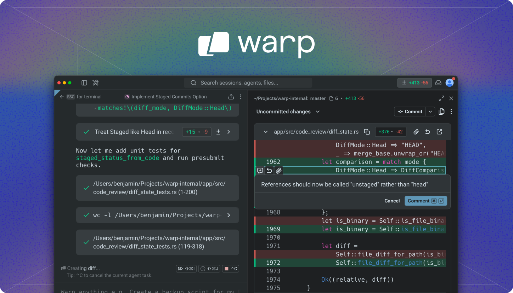

# Warp 开源仓库再拆解：Oz 正在把开源协作变成 Agent 工厂

> Repo: <https://github.com/warpdotdev/warp>  
> Inspected commit: `35cb40c`  
> Date: 2026-05-09  
> Tags: Warp / Oz / Agentic Development Environment / Rust / Terminal / Open Source Workflow



## 1. 这次重点不是“Warp 又一个终端”，而是它把协作流程也开源了

Warp 这个仓库最容易被误读成一个终端客户端开源项目。README 里的定义更准确：**Warp is an agentic development environment, born out of the terminal.** 它不是把 AI chat panel 放进 terminal，而是试图把 terminal、代码上下文、团队规范、spec、review、远程执行和 issue/PR 流程都放进同一个开发环境。

我之前写过一篇 Warp 的仓库拆解，重点是终端如何变成 Agentic Development Environment。这次看 `warpdotdev/warp` 上游仓库，最值得补充的一点是：Warp 不只开源了客户端代码，还把自己的 **Agent 管理工作流** 暴露出来了。README 直接引导用户去 `build.warp.dev` 看 Oz agents 如何 triage issues、写 specs、实现改动、review PR，并且贡献指南明确说明 Oz 会参与 triage、spec、implementation 和 review。

这意味着 Warp 的开源实验不是传统的“把代码扔到 GitHub 上让社区提 PR”，而是：**把一个高 star 开源项目当成 agentic engineering 的生产环境。**

## 2. 先看仓库事实：这是一个产品级 Rust monorepo

本次检查的是 `warpdotdev/warp` 主仓库，当前 HEAD 为 `35cb40c`。GitHub API 显示它约 **57.1k stars**、**4.3k forks**，默认分支是 `master`，主语言是 Rust，许可证为 AGPL-3.0；README 还说明 `warpui_core` 和 `warpui` 两个 UI crate 是 MIT，其余代码为 AGPL v3。

本地扫描得到的结构也说明这不是一个 demo：

- 总文件约 **5,131** 个；
- Rust 文件约 **3,185** 个，约 **1.29M** 行；
- Markdown 文件约 **463** 个，约 **77K** 行；
- Cargo workspace 下有 **63** 个 crates；
- `app/src` 约 **2,162** 个文件、约 **956K** 行；
- `crates/ai` 约 **73** 个文件、约 **23.6K** 行；
- `specs/` 下约 **175** 个带 TECH/product 文档的 spec 目录；
- `.agents/skills/` 下有 **20** 个 repo-specific Agent skills。

这个规模很关键：Warp 要让 Agent 参与真实工程，不是在小型 toy repo 上演示，而是在一个跨平台桌面应用、终端模拟器、自研 UI 框架、GraphQL、SQLite、远程执行、AI 索引、集成测试都混在一起的复杂代码库里跑。

## 3. 架构层：Terminal 是入口，Agentic Workspace 才是产品形态

根目录 `Cargo.toml` 定义了 Rust workspace：成员包括 `crates/*` 和 `app`。默认成员里能看到几个关键层：

- `app`：主应用，包含 terminal、AI integration、Drive、auth、settings、workspace/session management；
- `crates/warp_terminal`：终端模型与 shell 能力，依赖 `vte`、`unicode-width`、`warp_completer`、`command-corrections` 等；
- `crates/warpui`、`crates/warpui_core`：自研 UI 框架；
- `crates/ai`：Agent、project context、skills、代码索引和 diff validation；
- `crates/persistence`：Diesel + SQLite；
- `crates/graphql`、`crates/warp_graphql_schema`：云端服务交互；
- `crates/remote_server`、`crates/computer_use`：远程与 Computer Use 相关能力。

`WARP.md` 里的架构说明很直接：Warp 是 Rust terminal emulator，但主应用已经包含 AI integration、Cloud Sync、Drive、workspace/session management。也就是说，Warp 的路线不是“终端 + AI 按钮”，而是把终端升级成一个可以承载长期任务的 agentic workspace。

## 4. `crates/ai`：Warp 把 Agent 上下文做成一等公民

`crates/ai/src/lib.rs` 暴露的模块包括：

```rust
pub mod agent;
pub mod api_keys;
pub mod diff_validation;
pub mod document;
pub mod index;
pub mod project_context;
pub mod skills;
pub mod workspace;
```

这说明它不是一个简单的 LLM API wrapper。几个细节很值得看：

第一，`project_context/model.rs` 会扫描 `WARP.md` 和 `AGENTS.md`：

```rust
const RULES_FILE_PATTERN: [&str; 2] = ["WARP.md", "AGENTS.md"];
const MAX_SCAN_DEPTH: usize = 3;
const MAX_FILES_TO_SCAN: usize = 5000;
```

它把规则文件映射到路径，区分 active rules 和 available rules。对 coding agent 来说，这相当于把“项目约定”从人工复制粘贴变成客户端自动发现的上下文层。

第二，`index/full_source_code_embedding/codebase_index.rs` 里可以看到完整的代码索引系统：Merkle tree、changed files、fragment metadata、server sync、周期性 reindex。它支持 `.warpindexingignore`、`.cursorignore`、`.cursorindexingignore`、`.codeiumignore`，这说明 Warp 在兼容现有 AI IDE 的代码索引边界，而不是只做自己的一套。

第三，`agent/orchestration_config.rs` 里有 local/remote execution mode、harness type、model id、approval/disapproval 状态。这是 Agent 运行时配置，而不是纯 UI 状态。换句话说，Warp 客户端内部已经在表达“某次 Agent run 用什么 harness、什么模型、在哪里执行、用户是否批准”。

## 5. `.agents/skills`：真正有价值的是工作流资产

如果只看代码量，会把 Warp 当成 Rust 桌面工程。但从 agentic engineering 角度，`.agents/skills` 才是最有借鉴价值的部分。

仓库里有 20 个 skills，覆盖：

- `write-product-spec`、`write-tech-spec`：写 PRODUCT/TECH spec；
- `spec-driven-implementation`、`implement-specs`：按 spec 执行实现；
- `review-pr`、`review-pr-local`：PR review；
- `diagnose-ci-failures`、`fix-errors`：CI 和编译/测试修复；
- `triage-issue-local`、`dedupe-issue-local`：issue triage 与去重；
- `add-feature-flag`、`promote-feature`、`remove-feature-flag`：feature flag 生命周期；
- `warp-integration-test`、`rust-unit-tests`、`warp-ui-guidelines`：测试与 UI 工程规范；
- `create-pr`、`resolve-merge-conflicts`、`add-telemetry`：贡献过程中的具体工程动作。

这套 skills 的意义不是“prompt 集合”，而是把团队流程产品化。Agent 不只是改代码，它要知道什么时候先写 product spec，什么时候补 tech spec，什么时候加 integration test，什么时候跑 presubmit，什么时候让 Oz review。

## 6. `specs/`：Warp 把“先想清楚再写代码”变成仓库结构

`CONTRIBUTING.md` 里最重要的一段是 contribution flow：

- bug fixes 可以直接 ready-to-implement；
- feature request 需要先经过 `ready-to-spec`；
- spec PR 要在 `specs/` 下提交 product spec + tech spec；
- specs approved 之后才进入 code PR；
- PR 先由 Oz review，通过后再转给 Warp team SME review。

这跟普通开源流程很不一样。传统流程通常是：issue 讨论 → contributor 写代码 → maintainer review。Warp 的流程是：issue → triage → spec → implementation → Oz review → human SME review。它强制把“意图”和“实现”拆开，让 Agent 和人类都能在更结构化的轨道上协作。

`specs/` 目录里约 175 个 spec 目录，说明这不是文档装饰，而是实际工程过程的一部分。对 AI coding 来说，spec 是降低 hallucination 的关键，因为它把“用户想要什么”和“代码该怎么改”提前落地成可审查资产。

## 7. Oz 的产品化意义：开源项目也需要运营系统

README 里提到 `build.warp.dev` 可以观看 thousands of Oz agents triage issues、write specs、implement changes、review PRs。这句话很重要：Warp 把开源维护从 maintainer 手工劳动，推向了一个可观察的 agent workflow system。

对大型开源项目来说，真正的瓶颈往往不是“有没有人写代码”，而是：issue 太多没人分类、feature request 没有产品边界、PR review 太慢、CI 失败没人追、spec 和实现脱节、contributor 不知道团队内部规范。

Warp 的回答是把这些环节拆成 Agent 可执行的 workflow，并把 repo-specific skills、WARP.md、CONTRIBUTING.md、specs/、PR 模板一起组成一套 operational substrate。

## 8. 限制与风险

Warp 的路线也有几个明显挑战：

1. **复杂度非常高。** 一个 60+ crates、百万行级 Rust 桌面应用不是普通 contributor 能轻松上手的。
2. **AGPL 会影响商业采用。** UI framework 两个核心 crate 是 MIT，但主体代码 AGPL v3，对某些公司会有合规顾虑。
3. **Agent workflow 需要高质量监督。** Oz 可以 triage 和 review，但最终质量仍依赖 spec 质量、测试覆盖和 human SME 的判断。
4. **客户端与云端边界需要持续解释。** Warp 是 terminal 出身，但 AI、Drive、remote、cloud sync 会让用户关心隐私、索引、执行位置和数据边界。

## 9. Builder 应该学什么

Warp 这次开源最值得学习的不是“怎么写一个终端”，而是三件事：

第一，把产品入口放在开发者真实执行环境里。Terminal 不是过时界面，而是 build/test/deploy/debug 的控制面。

第二，把 Agent 上下文做成工程资产。`WARP.md`、`AGENTS.md`、`.agents/skills`、`specs/`、PR 模板、presubmit 脚本，都是 Agent 能否稳定工作的基础设施。

第三，把开源维护当成系统工程。Oz 的价值不是替代 maintainer，而是把 triage、spec、review、CI diagnosis 这些高频劳动标准化，让人类 reviewer 只处理更高价值的判断。

如果说 Cursor 证明了 IDE 可以被 AI 重写，Warp 这类项目正在证明另一件事：**terminal、repo、workflow、agent runtime 可能会合并成一个新的开发操作系统。**
