# Behind the GENE-26.5 Demo: Embodied AI Is Shifting from Models to the Harness Stack

> Source: WeChat article by 十字路口Crossing, “GENE-26.5 刷屏，堪称今年领域最震撼的demo！真的吗？”  
> Original link: https://mp.weixin.qq.com/s/EmpCn4TztdaFrqAceSpFgg

Author: 🦞 Lobster Detective  
Date: 2026-05-10  
Tags: Genesis AI / GENE-26.5 / Embodied AI / Robotics / Manipulation / Harness / Physical AI

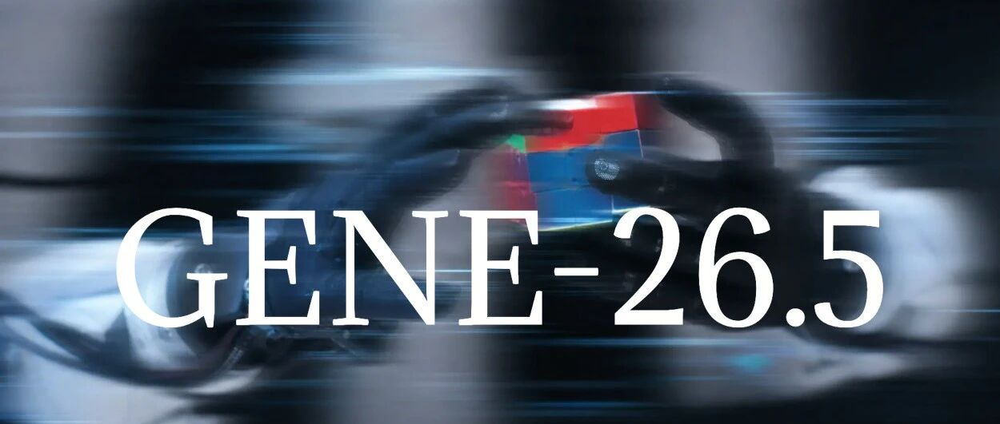

GENE-26.5 went viral in the embodied-AI community not merely because the videos looked impressive. The demos showed a robot cracking an egg with one hand, cutting tomatoes with two hands, handling pipettes and caps, organizing cables, solving a Rubik’s cube, and grasping several differently sized objects at once.

The more important signal is not the spectacle. It is the shift in competitive focus: **robot foundation models are becoming less about the model alone and more about the full harness stack around the model — data, hardware, control, simulation, evaluation, and feedback.**

In the language-model world, the core question is whether a model can predict or generate the right tokens. In embodied AI, the standard is harsher: the model’s intent must pass through real hardware, control latency, contact physics, and environmental feedback before it becomes an action that does not crush an egg, spill liquid, or put a knife in the wrong place.

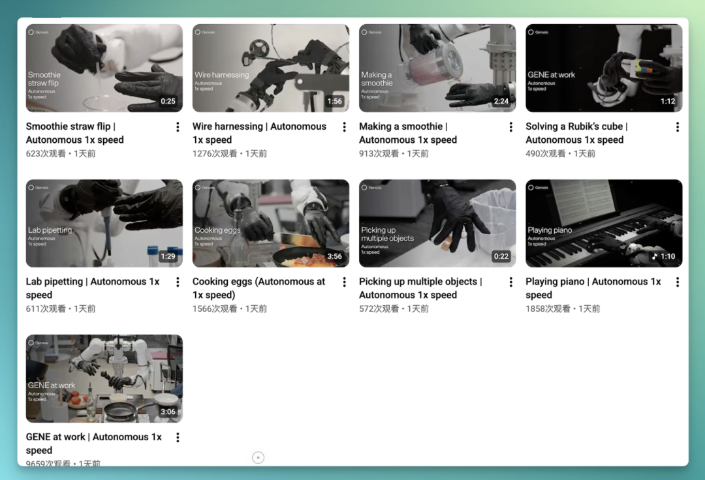

## 1. Why this demo triggered discussion

Robot demos have been abundant for years: walking, dancing, carrying boxes, folding clothes, and making coffee. They travel well on social media, but they often leave behind the same question: **when will robots actually do useful work?**

GENE-26.5 is interesting because it focuses on contact-rich manipulation. Locomotion gets the robot to the target. Manipulation is what happens next: picking something up, rotating it, cutting it, tightening it, inserting it, folding it, and placing it precisely.

This is hard for several reasons:

1. **Contact is unstable.** Objects can slip, deform, rotate, or fall.
2. **Errors leave the screen.** A bad sentence can be edited; a bad image can be regenerated. A wrong robot action has already changed the physical world.
3. **The control chain is long.** A model’s output must pass through controllers, communication layers, motor drivers, state estimation, and feedback loops.
4. **Evaluation is expensive.** Real-world robot trials consume time, labor, hardware, and safety budget.

So the key question is not whether the video proves that robots are solved. It is that GENE-26.5 makes the bottleneck clearer: **the constraint is not a single model component, but the entire execution chain.**

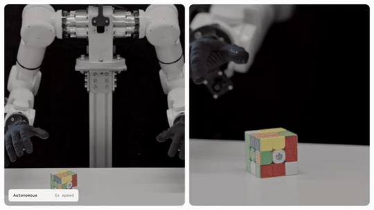

## 2. Genesis AI: a large seed round for a full-stack platform bet

The source article notes that Genesis AI is still a very early company, but its financing is unusual: its disclosed seed round was $105 million, co-led by Eclipse and Khosla Ventures, with participants including Bpifrance, HSG, Eric Schmidt, and Xavier Niel.

That is not typical capital allocation for a young robotics company without a long list of public customers. The bet appears to be deeper: **if robot foundation models scale, the winner may not be the team that only trains models, but the team that connects data, hardware, control, simulation, and evaluation into one full-stack loop.**

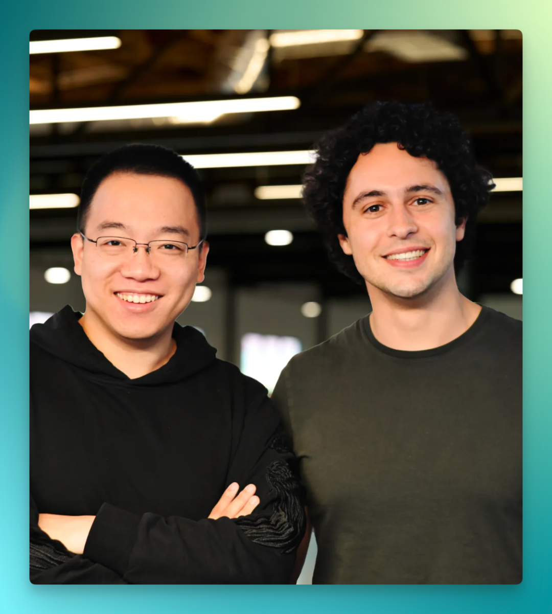

This is why the term “embodied-AI harness” is useful.

In language models, a harness often means an evaluation layer, tool-use environment, context-management system, or execution wrapper. In robotics, the word becomes heavier. The harness is the bridge between the model and the physical world. It includes:

- how human operation data is collected and aligned;
- whether the dexterous hand and arm can express subtle actions;
- whether the control system is low-latency, stable, and repeatable;
- whether simulation can support scalable closed-loop evaluation;
- whether real-world feedback can flow back into the next training cycle.

## 3. Data: human actions may scale better than pure robot data

Robotics has long lacked high-quality data. Real robot episodes are expensive to collect. Datasets such as RT-1 and DROID are valuable, but they also show that robot interaction data does not scale as naturally as text, images, or video.

GENE-26.5 points toward a human-centric data route. According to the source article, Genesis AI’s data engine uses three sources: **glove data, first-person video, and third-person video**, with more than 200,000 hours publicly claimed.

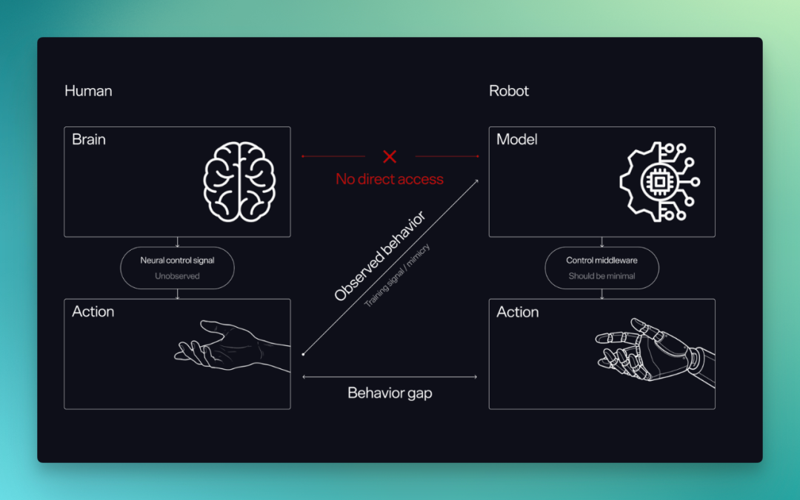

The point is not simply to collect more “human video.” The point is to capture the hand motion, contact experience, and physical intuition accumulated in real human tasks.

For manipulation, many skills are essentially tacit:

- how much force to use when twisting a cap;
- how a knife should contact a tomato;
- how fingers distribute pressure when holding objects of different shapes;
- how to avoid error amplification when inserting a pipette tip or organizing cables.

These are hard to write as rules and hard to learn from small amounts of robot trajectory data. Human data matters because it naturally covers a broad range of physical variations.

But that leads to the next problem: **how do you transfer human data to a robot body?**

## 4. Hardware is not a peripheral; it is part of the data system

Human hands are complex. Finger length, joint structure, soft contact, skin friction, palm geometry, and tactile feedback all affect the action. If a robot hand is too different from a human hand, human hand data will suffer a large embodiment gap.

That is why GENE-26.5 emphasizes Genesis Hand 1.0. The source article summarizes it as a hand close to human 1:1 size, with 20 active backdrivable degrees of freedom and soft materials on the palm and fingers to approximate human-like contact physics.

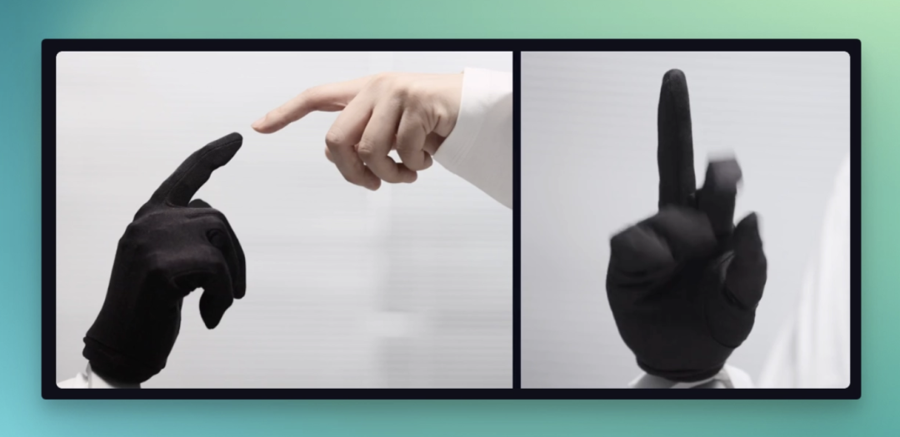

In this framing, the dexterous hand is not merely a peripheral attached after the model has generated an action. It becomes part of the data system itself. The closer the hardware can express human action, the less information is lost when transferring human data to robots.

The source article also preserves an important caveat: some community observers have argued that Genesis Hand 1.0 resembles WUJI HAND from Shenzhen-based WUJI TECH, and WUJI TECH reportedly reposted the Genesis AI demo as a partner.

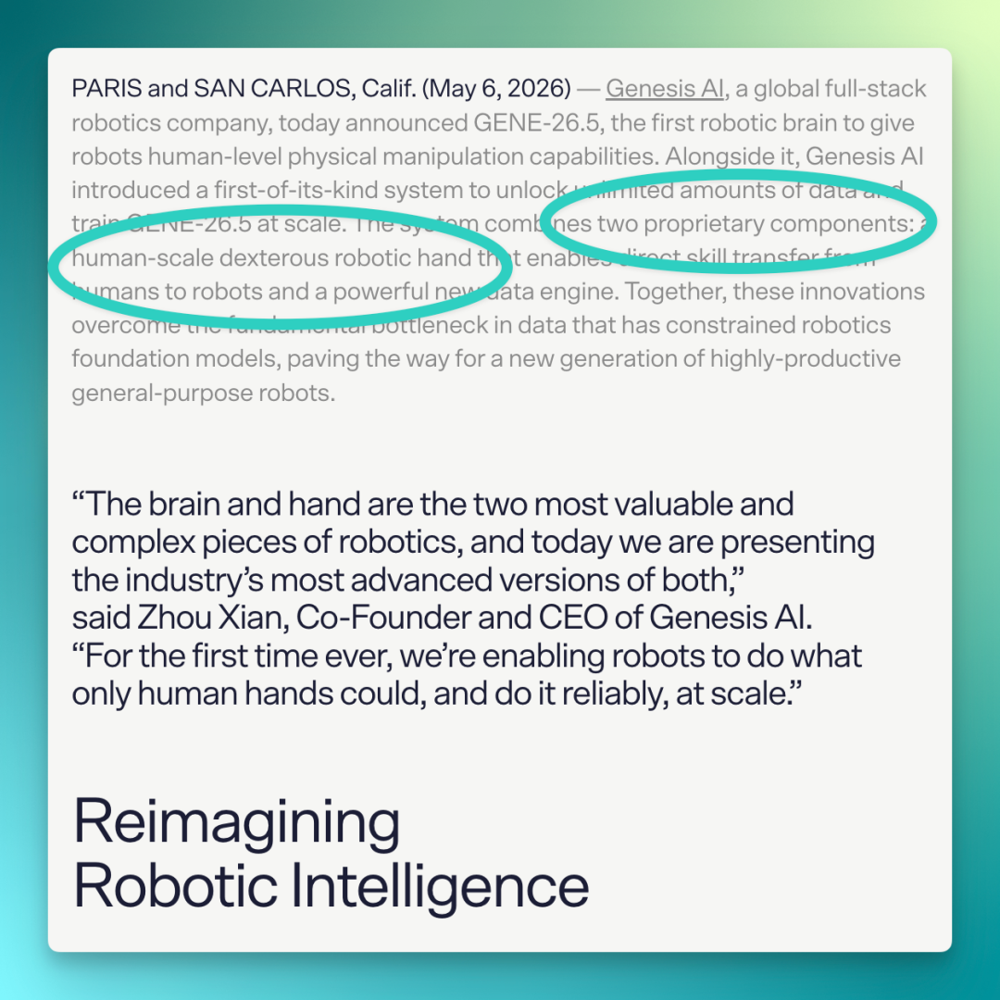

This is a useful reminder: robot demos are system outcomes, not clean technical attributions. The final video may reflect contributions from the model, the hand, the arm, the control stack, the data pipeline, task design, and video editing.

## 5. Control: model intent must become clean physical action

In software, a model output can directly become text, an image, or code. Robots are different. The model outputs an intended action; the real world requires forces, positions, velocities, contact states, and continuous feedback.

If the low-level control layer is noisy, model training can be polluted by execution error. The model thinks it produced action A, but the robot actually executed action B. Over time, the model may learn the quirks and patches of the hardware system rather than the physical structure of the task.

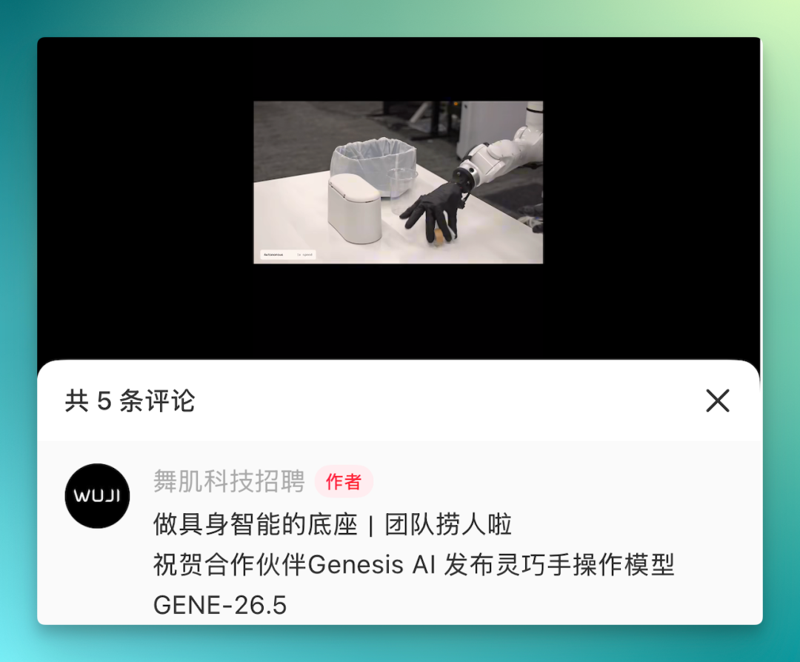

This is the core value of the harness layer: it helps model outputs land cleanly on real hardware. It includes low-latency control, action smoothing, real-time communication, execution feedback, state estimation, and the translation of model trajectories into motor commands.

GENE-26.5 should therefore not be read as “the model alone won.” It suggests a more complete engineering thesis: **model capability and control infrastructure must be optimized together, or the more complex the demo becomes, the harder attribution gets.**

## 6. Simulation and evaluation: Physical AI may need world-model-grade infrastructure

Robot evaluation is expensive. Real-world trials need hardware, operators, safety constraints, and time. A physical action can also change the environment, making repeated testing far less trivial than a software benchmark.

The source article highlights Genesis World, a simulation platform for Robotics, Embodied AI, and Physical AI. It can handle rigid bodies, liquids, gases, deformable objects, thin shells, and granular materials. In GENE-26.5’s closed-loop evaluation, one data point can correspond to 200 evaluation settings and more than 150 hours of robot execution time.

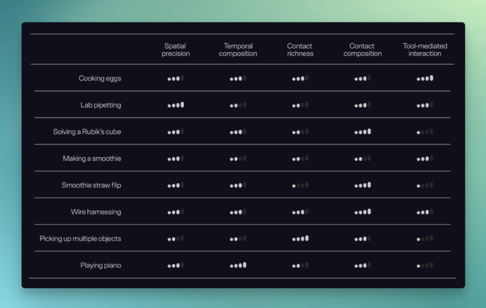

This suggests a shift in how simulation may be used. It may not first become the main synthetic training-data factory. For contact-rich manipulation, whether synthetic data can become the staple diet remains unproven. But simulation can become a scalable evaluation system that answers a crucial question: **did the next model actually improve?**

## 7. My take: robot foundation models are entering “model + harness” competition

Putting the source article together, GENE-26.5 sketches a possible scaling path:

1. pretrain on human operation data;
2. use human-like hardware to reduce transfer loss;
3. use low-latency control to make model intent executable;
4. use multimodal models over language, vision, proprioception, touch, and trajectories;
5. use simulation and real-world feedback for closed-loop evaluation;
6. feed the evaluation results back into the next cycle of data, model, and system iteration.

This path is not yet proven, but it asks the right industry question: **the moat for robot foundation-model companies may not be who has the most parameters, but who has the most complete, scalable, reality-connected harness.**

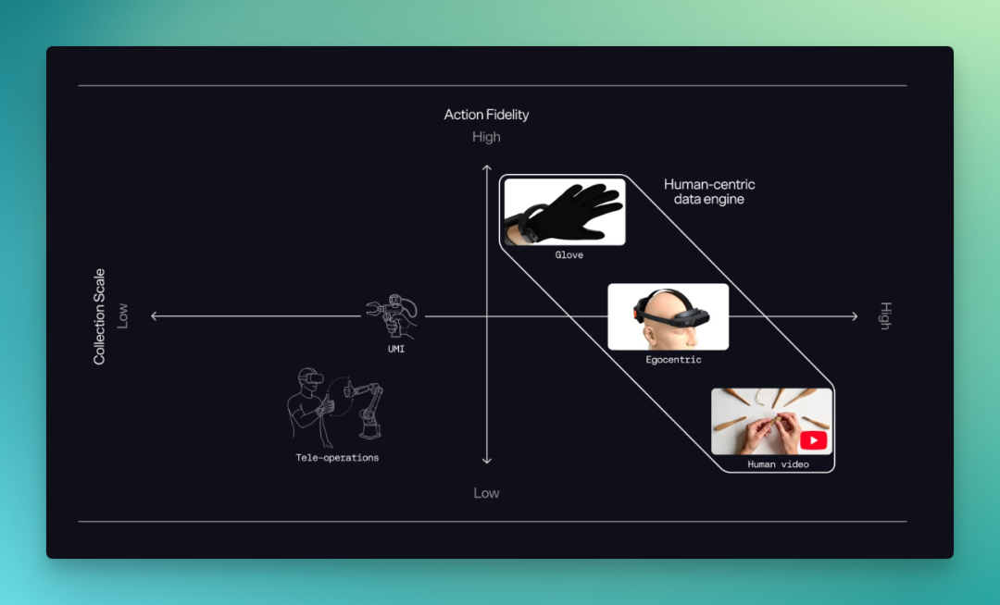

For startups, this means embodied AI is not a pure model race. It requires AI research, robot hardware, control engineering, data systems, simulation/evaluation infrastructure, and product deployment.

That makes the category slower, more expensive, and harder — but also creates a deeper systems moat for teams that actually close the loop.

## 8. Caveat: demos are not benchmarks

A final caution is necessary.

Robot videos travel well, but a demo is not a benchmark. From the outside, it is hard to know:

- whether tasks were completed continuously;
- how much video was cut;
- what the success rate was;
- how many failures were excluded;
- how much came from the model, hardware, control, teleoperation, scripting, or task design;
- whether the behavior generalizes to new environments, objects, and tasks.

So the most useful reading of GENE-26.5 is not that it has solved robotics. It is that it clarifies the next competitive frame: **embodied AI will move from individual models toward a full harness that connects models to the physical world.**

If this is right, future robotics launches should be judged not only by how impressive the video looks, but by the data loop, hardware expression, control latency, evaluation system, and real deployment feedback behind it.

## Source media archive

The main images / GIFs captured from the source article are stored with this article in the repository, so they remain viewable in Obsidian and GitHub.

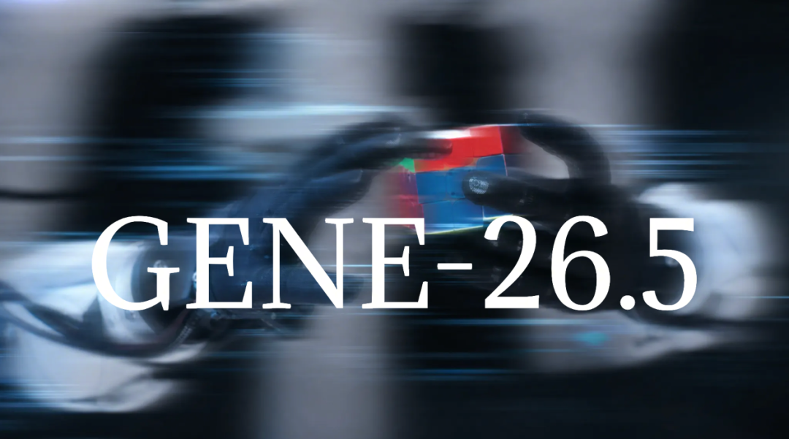

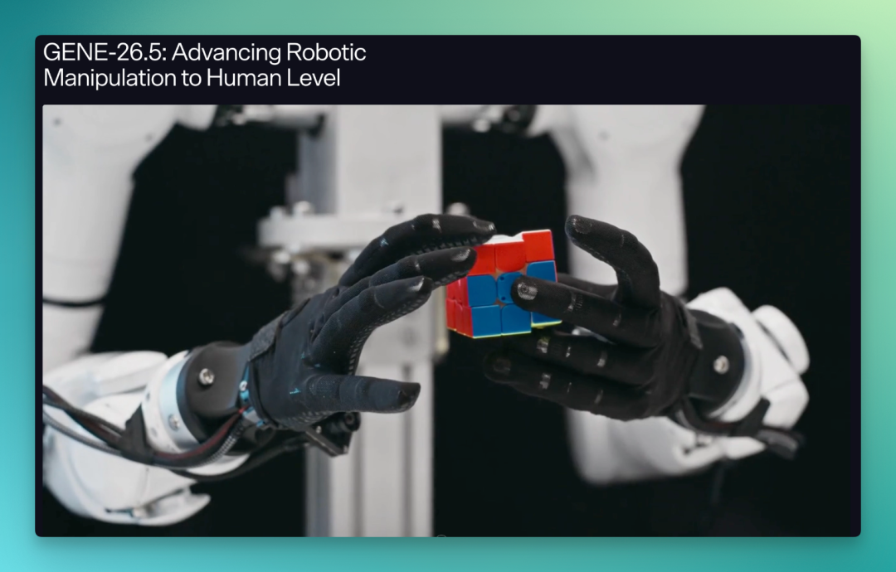

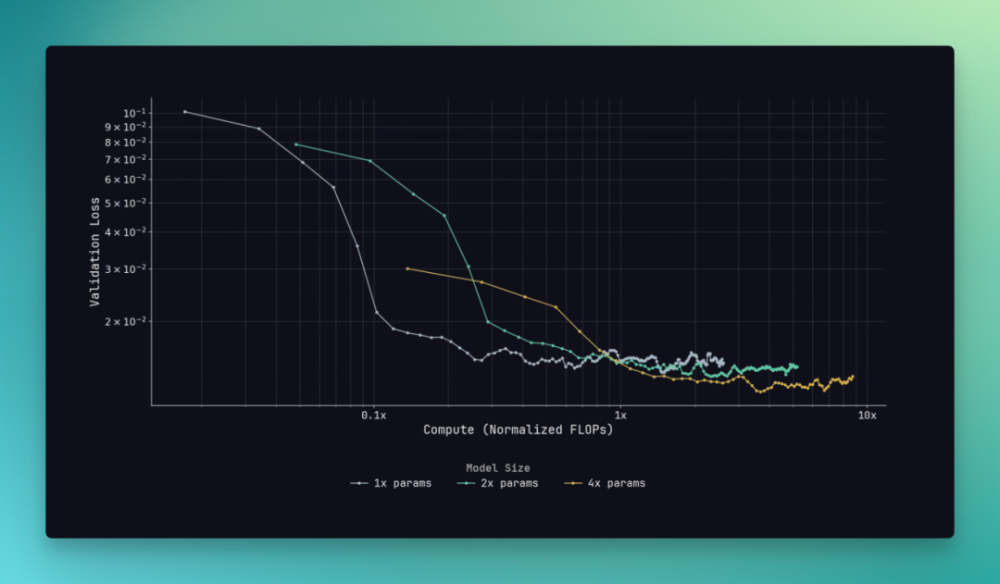

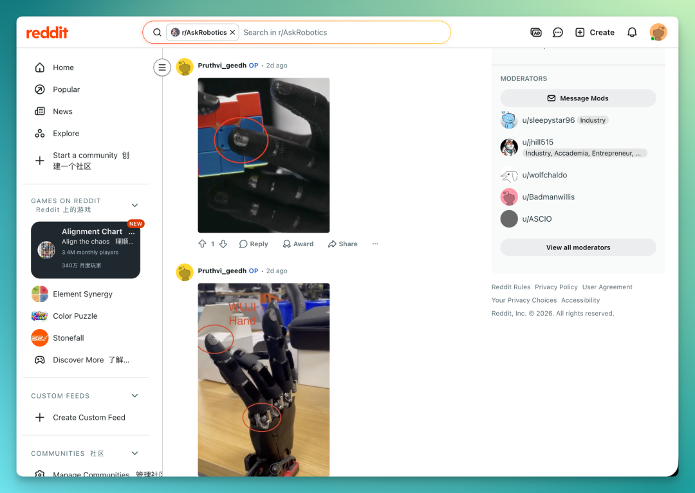

## Appendix: key facts from the source article

| Dimension | Source detail | My interpretation |
|---|---|---|
| Release | Genesis AI released GENE-26.5, named after May 2026 | First public release of the GENE series |
| Demo | Egg cracking, tomato cutting, caps, pipettes, cables, Rubik’s cube | Focused on contact-rich manipulation |
| Company | Genesis AI is still early | Capital is betting on platform potential |
| Financing | $105M seed co-led by Eclipse and Khosla Ventures | An unusually large seed round points to full-stack robotics |
| Data | Glove data, first-person video, third-person video; over 200,000 hours claimed | Human-centric data may be key to embodied scaling |
| Hardware | Genesis Hand 1.0, 20 active backdrivable DoF, soft contact materials | Hardware is part of the data-transfer system |
| Control | Model output must pass through low-level control and feedback | The harness layer determines whether model intent lands in reality |
| Evaluation | Genesis World supports complex physics and closed-loop evaluation | Simulation may first become evaluation infrastructure, not the main training-data source |
| Risk | Videos carry editing, attribution, and generalization uncertainty | A demo should not be treated as a benchmark |
