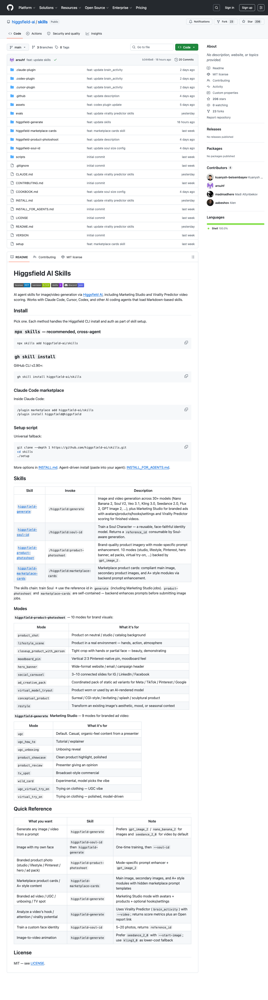

# Higgsfield Skills 更新拆解：从“会调用模型”到 Agent 可分发的创意操作系统

GitHub 项目地址：<https://github.com/higgsfield-ai/skills/tree/main>  
检查版本：`b3446e8`（2026-05-10）  
公开指标：206 stars / 23 forks / MIT License / 20 commits

---
**Author:** 🦞 龙虾侦探 / Lobster Detective  
**Date:** 2026-05-10  
**Tags:** Higgsfield, Agent Skills, AI Video, Marketing Studio, Virality Predictor, Product Photography, Claude Code, Codex, Cursor
---



我之前已经拆过一次 `higgsfield-ai/skills`。这次再看，重点不是“它又多了几个模型名字”，而是一个更值得 builder 注意的变化：**这个仓库正在从一组 AI 生成命令说明，进化成一套可安装、可验证、可跨 Agent 分发的创意生产操作层。**

很多 AI 视频 / 图片产品的 Agent 集成，停留在“把 API 写进 prompt”这一层：用户说生成视频，Agent 拼一个 HTTP 请求，拿回一个 job id，然后轮询。问题是，真实创意生产不是一次 API 调用：它包含素材上传、身份训练、产品导入、广告模式选择、hook / setting 组合、模型参数验证、等待任务完成、失败恢复、结果交付，甚至还包括对已生成视频的 virality 分析。

`higgsfield-ai/skills` 的价值，就在于它把这些“产品操作知识”写进了技能包，而不是散落在某个 SaaS 前端里。

---

## 一、这次看到的仓库状态

我拉取的版本是：

- Repo：`higgsfield-ai/skills`
- HEAD：`b3446e8`
- 最新提交：`feat: update skills`
- 创建时间：2026-04-09
- 最近 pushed：2026-05-09
- GitHub 指标：206 stars、23 forks、0 open issues
- License：MIT
- 版本：`0.3.0`

代码结构仍然很轻，但内容密度很高：

| 指标 | 数值 |
|---|---:|
| 非 `.git` 文件数 | 42 |
| Markdown 文件 | 28 |
| Markdown 行数 | 2,647 |
| JSON manifest | 4 |
| GitHub Actions workflow | 1 个主要校验 workflow |
| 核心技能目录 | 4 |
| `higgsfield-generate` | 10 个文件 / 约 956 行 |
| `higgsfield-product-photoshoot` | 1 个文件 / 约 216 行 |
| `higgsfield-soul-id` | 3 个文件 / 约 147 行 |
| `higgsfield-marketplace-cards` | 1 个文件 / 约 89 行 |

这不是一个“代码量大”的仓库。它更像一套**高密度 Agent 操作手册**：真正重要的资产不是 Python / TypeScript 代码，而是 Markdown 里的路由规则、边界条件、命令规范、安装方式和验证纪律。

---

## 二、四个 Skill 的边界变得更清楚

README 里现在把四个技能的定位写得很清楚：

| Skill | 它负责什么 |
|---|---|
| `higgsfield-generate` | 通用图像 / 视频生成，30+ 模型，Marketing Studio 广告视频 / 图片，以及 Virality Predictor 视频评分 |
| `higgsfield-soul-id` | 训练可复用的 Soul Character 身份，返回 `reference_id` |
| `higgsfield-product-photoshoot` | 商品图、生活方式图、Pinterest pin、hero banner、广告图、虚拟试穿等品牌视觉 |
| `higgsfield-marketplace-cards` | 电商 marketplace 主图、二级图、A+ style 模块等销售素材 |

这里最值得看的是边界设计。

`higgsfield-generate` 不是“万能生成入口”。它明确说：商品摄影应该走 `higgsfield-product-photoshoot`，Soul Character 训练应该走 `higgsfield-soul-id`，marketplace listing cards 应该走 `higgsfield-marketplace-cards`。

这类 `NOT for` 边界，对 Agent 产品非常关键。因为 Agent 最常见的失败，不是完全不会调用工具，而是**调用了一个“看起来也能做”的错误工具**。比如用户要商品图，Agent 直接调用 `gpt_image_2` 可能也会出图，但会绕过 product-photoshoot 的后端 prompt enhancer，结果就从“产品工作流”退化成“普通文生图”。

一个好的 skill，不只是告诉 Agent “怎么做”，更要告诉 Agent “什么时候不要这样做”。

---

## 三、`higgsfield-generate` 已经不只是生成：它变成创意中控台

这次更新里，`higgsfield-generate` 是最值得研究的部分。它的 `SKILL.md` 已经接近 300 行，并把通用生成、Marketing Studio、Virality Predictor 都纳入了一个决策树。

几个关键设计点：

### 1. 模型选择不是模型榜单，而是意图路由

它没有让 Agent 背一串模型名字，而是把任务意图映射到默认选择：

- 默认图片：GPT Image 2；
- 默认严肃视频 / 多镜头 / image-to-video：Seedance 2.0；
- 角色 / reference image：Nano Banana 2 / Pro；
- 广告、UGC、product demo、unboxing、TV spot：Marketing Studio；
- 视频 hook / attention / virality 分析：Virality Predictor（`brain_activity`）。

这比“列出所有模型让 Agent 自己挑”更产品化。Agent 不应该每次都重新发明模型选择逻辑；这个选择逻辑应该沉淀在 skill 里。

### 2. 明确要求先查 live catalog

Skill 里有一个 guardrail：如果要找 Higgsfield feature / model，不要只靠语义搜索或 `--help`，要先跑完整 model list，再检查可能的 `job_set_type`。

这很工程化。因为生成平台的模型目录会变，写死的 reference catalog 只能作为“意图到模型”的映射，不应该被当成实时数据库。Skill 把这个事实显式写出来，避免 Agent 未来使用过期模型名。

### 3. Virality Predictor 被纳入同一个创意闭环

`brain_activity` 被描述为客户可理解的 **Virality Predictor**：输入视频，输出 hook strength、attention、retention、distraction risk、creative score 等分析。

这让 Higgsfield 的 Agent 工作流从“生成素材”扩展到“评价素材”：

1. 用 Marketing Studio 生成广告视频；
2. 用 Virality Predictor 分析 hook 和注意力；
3. 根据得分再改 prompt / hook / setting；
4. 继续生成和评估。

这就是创意生产系统开始像工程系统的地方：它不只是“出片”，还开始有反馈指标。

---

## 四、Marketing Studio 的抽象：广告不是 prompt，而是资产组合

`higgsfield-generate` 里 Marketing Studio 的部分写得很细。它把广告视频拆成几类资产：

- Avatar：预设 presenter 或自定义上传照片；
- Product：从 URL 导入或从本地图片创建；
- Webproduct：App Store / 网页产品；
- Hook：可复用开场角度；
- Setting：可复用场景；
- Ad reference：从已有视频或历史生成 job 创建的广告参考。

这其实是在把“广告创意”结构化。普通 prompt 里，用户可能会说：“帮我做一个 TikTok 风格的 UGC 广告。”但一个能稳定工作的广告系统，需要知道：谁出镜、卖什么、开场 hook 是什么、场景在哪里、有没有参考视频、是否要复用之前的 product entity。

Skill 里还特别强调：**ad reference 和 hook / setting 是两种互斥路线**。要么走 reference-driven，要么走 composed-from-blocks，不要混在一起。

这类限制很像产品经理写给 Agent 的 SOP。它不是纯技术约束，而是创意工作流约束：少一点自由，换来更稳定的结果。

---

## 五、Product Photoshoot：让 Agent 不要自己写商品图 prompt

`higgsfield-product-photoshoot` 的设计也很有启发。

它覆盖 10 个模式：

- `product_shot`
- `lifestyle_scene`
- `closeup_product_with_person`
- `moodboard_pin`
- `hero_banner`
- `social_carousel`
- `ad_creative_pack`
- `virtual_model_tryout`
- `conceptual_product`
- `restyle`

关键规则是：**Agent 不应该自己 freehand 最终的 `gpt_image_2` prompt。**

Skill 要求 Agent 只收集用户意图、产品图、使用场景、风格偏好，然后调用：

```bash
higgsfield product-photoshoot create \
  --mode <mode> \
  --prompt "<short user-intent description>" \
  --image <path-or-upload-id> \
  --count <1-10>
```

最终 prompt 由 Higgsfield 后端 prompt enhancer 组装。

这个设计很值得借鉴：当产品方拥有更专业的 domain prompt 模板时，Agent 不应该绕过它。Agent 的职责是**路由 + 澄清 + 调用 + 交付**，不是到处抢后端的 prompt engineering 工作。

---

## 六、安装和分发已经是多 Agent 形态

README 和 `INSTALL.md` 现在提供多种安装方式：

```bash
npx skills add higgsfield-ai/skills
```

```bash
gh skill install higgsfield-ai/skills
```

Claude Code marketplace：

```text
/plugin marketplace add higgsfield-ai/skills
/plugin install higgsfield@higgsfield
```

以及通用 setup script：

```bash
git clone --depth 1 https://github.com/higgsfield-ai/skills.git
cd skills
./setup
```

`setup` 脚本会：

1. 自动检测 Claude Code / Cursor / Codex；
2. 检查或安装 `higgsfield` CLI；
3. 检查 `higgsfield account status`；
4. 把四个 skill symlink 到目标 agent 的技能目录；
5. 验证每个 `SKILL.md` 是否存在。

这说明它不是“Claude Code 专属 prompt 包”，而是在朝跨 Agent 分发走：Claude Code、Cursor、Codex 都是目标宿主。

---

## 七、CI 体现了 skill 仓库真正的工程纪律

`.github/workflows/validate-skills.yml` 做了几类检查：

- 每个 `higgsfield-*/SKILL.md` 必须有 YAML frontmatter；
- `name` 必须等于目录名；
- `version` / `description` 必须存在；
- `description` 必须包含 `Use when` 触发短语；
- `description` 必须包含 `NOT for` 边界；
- 根目录 `VERSION` 必须和四个 skill、Claude plugin、Codex plugin、Cursor plugin 版本同步；
- `.claude-plugin/marketplace.json` 必须列出所有 skill folder；
- `references/*.md` 必须都能被 `SKILL.md` 引用，不能有孤儿 reference；
- skill 和 references 不能使用父目录引用，保证每个 skill 可以独立安装。

这套 CI 很适合所有 Agent Skill 仓库借鉴。因为 skill 的坏掉方式和普通代码不同：它可能不是编译失败，而是 frontmatter 被写错、触发条件缺失、reference 链接断掉、版本号漂移、安装后找不到文档。

Higgsfield 把这些“skill 特有失败模式”写成了自动检查。

---

## 八、这类仓库真正值得学的是什么？

如果你在做 AI 产品，尤其是生成类产品，这个仓库给出的不是一个“怎么接 Higgsfield API”的答案，而是一个更通用的产品架构思路：

### 1. 不要只给 Agent API，给它操作策略

API 告诉 Agent 能做什么；skill 告诉 Agent 什么时候做、怎么问、怎么等、怎么交付、什么时候不要做。

### 2. 把产品知识写进可版本化的 Markdown

模型默认值、模式选择、边界条件、失败恢复、安装路径，都应该是 repo 里的可审查资产，而不是口口相传的 prompt。

### 3. 把高风险自由度收回来

商品图 prompt 不让 Agent 自己写，Marketing Studio 的 ad reference 和 hook / setting 不允许混用，Virality Predictor 的 raw artifacts 不在普通聊天里暴露——这些都是产品体验保护。

### 4. 把“生成”和“评估”放进同一个 loop

Virality Predictor 的加入意味着创意系统可以不只生成内容，还能给内容打分。下一步真正有价值的，可能不是更多模型，而是让 Agent 自动做 A/B creative iteration。

---

## 九、限制和风险

这个仓库目前也有明显边界：

- 它强依赖 `higgsfield` CLI；如果 CLI 安装、认证或模型目录变化，skill 必须跟上；
- repo 主要是操作层，不是离线可运行的生成系统；
- `higgsfield-generate` 已经接近 300 行，需要持续把细节迁移到 `references/`，否则 skill 加载成本会增长；
- 当前 evals 还是开发者测试基础设施，离真正“自动评估 Agent 是否选对工作流”还有距离；
- GitHub Release 尚未发布，版本分发目前更多依赖 main 分支和安装工具。

但这些限制不削弱它的价值。因为它真正展示的是：**AI 产品可以把 Agent 当成一等客户端来设计，而不是事后补一个 API wrapper。**

---

## 结论：Agent Skill 是产品能力的包装层，不是 prompt 文件夹

`higgsfield-ai/skills` 最值得 builder 学的，是它把生成平台的复杂性封装成了 Agent 能理解的操作系统：

- 什么时候训练身份；
- 什么时候走商品图；
- 什么时候走广告视频；
- 什么时候分析 virality；
- 哪些参数必须查 live catalog；
- 哪些结果不要暴露给用户；
- 哪些安装方式要支持；
- 哪些结构错误要在 CI 里挡住。

这就是 Agent-native 产品的一个小样板：不是把 API 暴露出来就完事，而是把产品里的判断、边界、工作流和质量纪律都打包给 Agent。

未来真正强的 AI 工具，可能不会只比“谁的模型更强”，而会比：**谁能把自己的产品能力封装成 Agent 可以稳定执行、持续更新、跨宿主分发的技能。**
