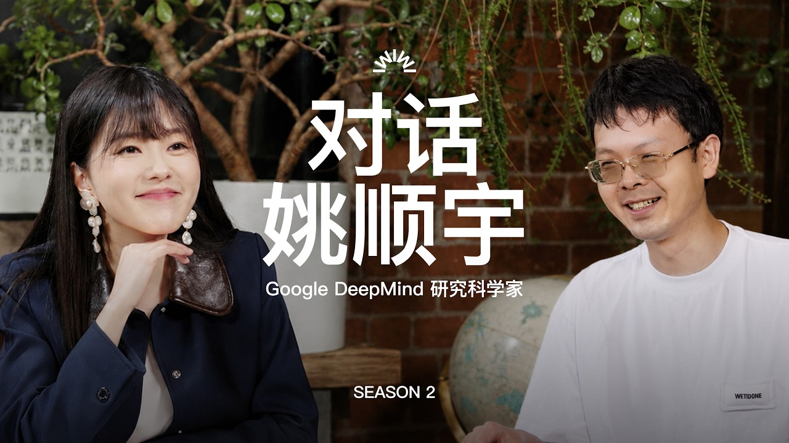

# Yao Shunyu Interview: AI Competition Is Moving from Benchmarks to Post-Training, Long-Horizon Tasks, and Organizational Systems

> Source: YouTube interview subtitle extraction and analysis — “Yao Shunyu: Let Me Go a Little Crazy! Training Models at Anthropic & Gemini”  
> Original video: https://youtu.be/ttkd0t5qTD4  
> Transcript archive: [ttkd0t5qTD4-transcript-en-US.md](sources/yao-shunyu-ai-training-post-training-long-horizon/ttkd0t5qTD4-transcript-en-US.md)  
> Author: 🦞 Lobster Detective  
> Date: 2026-05-10  
> Tags: AI Models / Post-training / Reinforcement Learning / Agentic Coding / Long Horizon / Anthropic / Google DeepMind / Gemini

The most valuable part of this interview is not another “star researcher worked on model X” story. It is a unusually direct window into where frontier AI competition is moving in 2026: **from public leaderboard gaps toward the ability to define the next trainable problem, then turn data, environments, infrastructure, and organization into a stable training system.**

Yao Shunyu is a useful observer for this transition. He studied physics at Tsinghua, worked on theoretical high-energy physics and quantum information at Stanford, briefly joined Berkeley as a postdoc, moved to Anthropic, worked around Claude 3.7 and agentic coding, and later joined Google DeepMind / Gemini. His perspective is neither purely product nor purely academic; it is shaped by the inside of industrial-scale model training.

## The short version

The interview can be compressed into five claims:

1. **Paper benchmark gaps among frontier models are shrinking.** OpenAI, Anthropic, and Gemini still feel different in real usage, but public benchmarks increasingly fail to explain those differences.
2. **Post-training is not a patch layer; it is a second scalable paradigm.** The core is not one magic algorithm, but finding environments with clear feedback, clean data, and stable training dynamics.
3. **Coding is one of the best abstractions for tool use and environment interaction.** It has clear feedback, abundant data, and a direct feedback loop into model-company research productivity.
4. **The next hard problem is long horizon.** Models need to work over longer time spans, more state changes, more context, and more failures.
5. **Organizational capability is now part of model capability.** Reliability, careful execution, and ownership sound boring, but in large-scale training systems they determine whether metrics are real, experiments are reproducible, and training remains stable.

## 1. AI is not merely in a “second half”; it is in a problem-definition phase

Early in the interview, the host asks whether AI has entered a “second half.” Yao does not fully adopt that framing. Instead, he says that today people are less worried about whether AI can do something, and more worried about whether the thing has been well defined.

That is the key shift.

For the last two years, a large part of the competition could be expressed through public scores: SWE-bench, AIME, IMO, reasoning benchmarks, coding benchmarks. Model differences could be made visible on paper: one model was stronger at math, another at coding, another at tool use.

But once public benchmarks saturate — or once the test items themselves become less well defined — leaderboards stop being strategy. They remain hygiene metrics: you cannot ignore them, but they are not enough to win.

The center of gravity therefore moves from “prove the model is smart” to “find the next task worth teaching,” then convert that task into an evaluable, sampleable, learnable, scalable environment.

That is also why Yao repeatedly returns to the idea of making bets. Startups and large labs operate differently, but both must bet on what to teach the model next.

## 2. Claude 3.7 as a turning point: post-training becomes scalable engineering

The most technically interesting part of the interview is the discussion around Claude 3.7, agentic coding, and large-scale reinforcement learning.

Yao describes the pre-3.7 period of post-training as comparatively small-scale and patch-like. The real shift was realizing how post-training could scale: find the right environment, make sure the feedback signal is clear, make the environment itself a strong data source, and training can become stable.

This demystifies post-training. From the outside, people often search for a secret algorithm, an RL trick, or a hidden recipe. Yao’s framing is more industrial: the most important thing is often to do simple things cleaner than everyone else.

In reinforcement learning, complex algorithms do exist. But complexity also brings infrastructure costs, sampling issues, trainer-sampler mismatch, asynchronous training effects, numerical drift, and stability problems. A trick that works inside one lab is often useful because it fits that lab’s data, infrastructure, evaluator, scheduler, and organizational process — not because it can be copied as a standalone recipe.

For AI startups, this is an important warning: **do not overfit to “how Anthropic does RL” or “how Gemini does RL” as a single-point answer. Modern model training is a coupled system, not a menu of isolated tricks.**

## 3. Why coding matters: not a vertical, but an abstraction for agents

Yao’s explanation of coding is one of the strongest parts of the conversation.

Coding matters for two reasons.

First, it improves the research loop inside model companies. A model that can write code, debug, use tools, and interact with development environments can accelerate the research process itself.

Second, coding is an unusually good abstraction for tool use and environment interaction. It combines several rare properties:

- clear feedback: tests pass or fail, code runs or breaks;
- abundant data: open-source repos, issues, patches, commits, test cases;
- natural environment interaction: the model reads files, edits code, runs commands, observes failures, and iterates;
- transferable agent lessons: planning, tool use, recovery from errors, and state management.

This is why Cursor’s rise was more than “a wrapper around Claude.” It allowed software engineers to experience agentic coding not as a demo, but as a real workflow accelerator.

Coding is therefore both a product surface and a training environment. It is also a lever for internal research productivity. That combination makes it strategically important for model labs.

## 4. Pre-training is not over; post-training is not over; the scarce resource is the next curriculum

A common narrative says that pre-training scaling laws are exhausted and post-training has taken over. Yao gives a more nuanced view: he once felt the “pre-training party” might be over, but later concluded that both pre-training and post-training still have room.

Pre-training is not just about making models larger. It is a systematic framework for deciding what is more compute- and data-efficient. As pre-training becomes more deterministic, Google’s strengths become visible: large engineering programs, clear ownership, systematic evaluation, and controllable execution.

Post-training is more exploratory. Its data distribution is narrower, but quality requirements are much higher. Pre-training wants broad coverage; post-training wants extremely high-quality supervision in high-value tasks.

The most interesting metaphor in the interview is that the model is like a very smart child. The problem is not necessarily that it cannot learn. The problem is that the human teachers do not yet know what the next course should be or how to teach it.

The courses already taught include chatbots, coding, and parts of reasoning. The next ones may be ML coding, long-horizon agency, multimodal generation, continual learning, or world models. But many of these terms remain underdefined.

## 5. Long horizon: the real threshold for the next generation of agents

Near the end of the interview, Yao says that if he had to name one important bet from his current view, it would be **long horizon**.

This matches the real bottleneck of today’s agent products. Models can look extremely smart in short contexts. They can complete a single code edit, run a tool once, or answer a search question. But the difficulty rises sharply when the task requires:

- hours or days of execution;
- remembering goals and constraints;
- reacting to external state changes;
- recovering after failures;
- turning temporary context into durable state;
- deciding when to continue, stop, or ask a human for help.

At that point, model capability is no longer just next-token prediction or single-turn reasoning. It becomes a system problem.

Yao also connects continual learning, context management, and some world-model discussions to long-horizon behavior. That is a useful framing: these may look like separate technical directions, but they all try to let models maintain state, update beliefs, and keep acting over longer spans of time.

For application-layer startups, the implication is clear: do not rely only on stronger base models. Product differentiation will come from task decomposition, memory, state management, permission boundaries, rollback, observability, and human-agent collaboration protocols.

## 6. Why organizational capability becomes model capability

One of the least flashy but most important parts of the interview is Yao’s description of what kind of people matter in this industry. He does not say “genius” first. He says reliability: doing things carefully and taking responsibility for one’s work.

In model training, this is not motivational fluff.

Every evaluation framework can be hacked. A metric can improve because of real capability, but it can also improve because of data leakage, evaluator bias, environment artifacts, sampling mismatch, asynchronous training side effects, or poorly defined tasks. Reliable people ask uncomfortable questions: will this effect hold at scale? Did we miss a confounder? Is this beautiful number just a local hack?

This is also why organizational structure matters. Anthropic’s advantage at certain moments was its ability to make top-down bets. Google’s advantage is turning more deterministic paradigms into engineering programs. OpenAI, DeepMind, and Anthropic slice pre-training, post-training, RL, and product in different ways — and those differences affect what each organization can see, define, and execute.

In other words, models are not trained only by GPUs, data, and algorithms. They are trained by organizations.

## 7. Lessons for founders and engineering teams

The interview suggests several practical lessons for AI builders.

**First, do not only watch leaderboards.** Benchmarks reveal baseline capability, but they do not prove that a model can live inside a real workflow.

**Second, choose domains with clear feedback.** Coding matters because it can run, test, fail, and improve. Every agent product needs its own equivalent of tests and environment feedback.

**Third, design data and environments together.** Post-training is not merely collecting preference labels. It is building an environment where the model can try, receive feedback, and learn stably.

**Fourth, system capability beats isolated tricks.** Training, evaluation, sampling, infrastructure, product feedback, human labeling, and organizational process form one coupled system.

**Fifth, prepare for long horizon early.** The valuable agent is not the one that answers one question; it is the one that can preserve goals, manage state, and keep making progress across long tasks.

## Closing: the next competition is what to teach and how to teach it

Before GPT-4, the competition was largely about turning internet-scale data and compute into stronger general models. After Claude 3.5 and 3.7, the competition increasingly became about turning post-training and tool use into scalable capabilities.

The next round may be about who can define the next world worth teaching to models.

That sounds like a research question, but it is also a product question, an organizational question, and an engineering question.

Model labs must answer: what is the next course?

Application companies must answer: can our product turn real work into an environment that provides feedback, supports learning, and sustains long-running execution?

And for individuals, Yao’s message is surprisingly simple: in the AI wave, personal brilliance matters, but what matters more is whether you can make things clean, reliable, and systemic.
